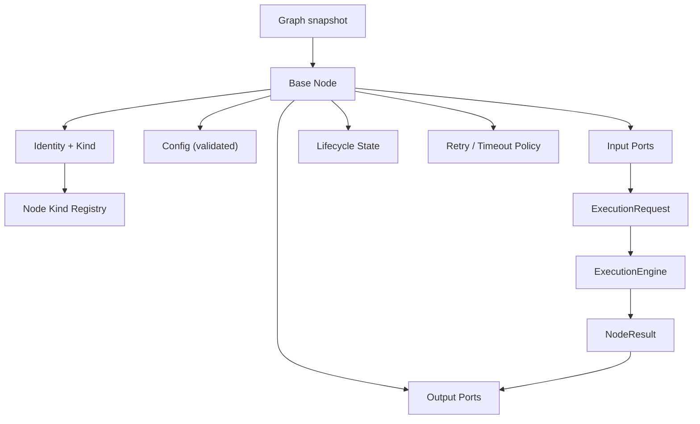
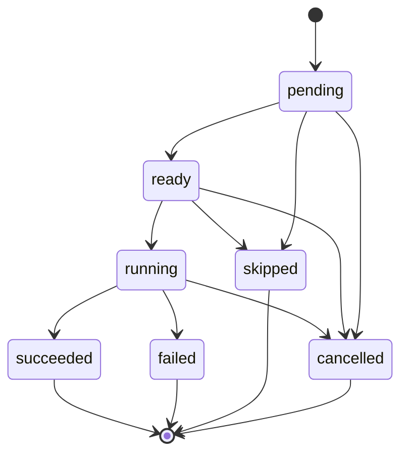

# NodeArchitecture Diagrams

## Base Node and the Dispatch Boundary



## Node Lifecycle State Machine



## ASCII: Isolation at Dispatch

```text
Node (persisted record)
  |  input ports resolved from RunContext
  v
ExecutionRequest  --->  ExecutionEngine  --->  NodeResult
  |                                                 |
  v                                                 v
no graph reference                          output ports -> RunContext
no global state read                       node marked succeeded
```

## Related Documents

- [[06-workflow-engine/README]]
- [[NodeArchitecture-Part01]]
- [[NodeArchitecture-Part03]]
- [[NodeArchitecture-Part06]]
- [[NodeTypes-Part01]]
- [[ExecutionEngine-Part01]]
