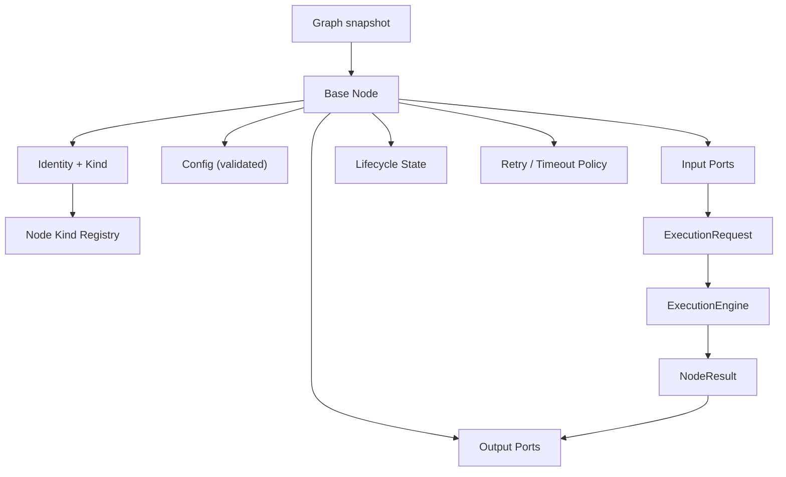

---
title: NodeArchitecture Specification - Part 01
status: draft
version: 1.0
tags:
  - workflow-engine
  - node-architecture
  - architecture
related:
  - "[[06-workflow-engine/README]]"
  - "[[NodeTypes-Part01]]"
  - "[[WorkflowEngine-Part01]]"
  - "[[EdgeTypes-Part01]]"
  - "[[NodeArchitecture-Diagrams]]"
---

# NodeArchitecture Specification (Part 01)

## Document Index

Part 01 - Purpose, Philosophy, the Base Node Contract, and Invariants
Part 02 - Ports, Typed Inputs and Outputs, and the Port Compatibility Rules
Part 03 - The Node Lifecycle State Machine and State Transitions
Part 04 - Execution Isolation, Retries, Timeouts, and Resource Limits
Part 05 - Error Propagation to Downstream Nodes
Part 06 - The Node Kind Registry and Custom Plugin Node Registration
Diagrams - NodeArchitecture-Diagrams.md

# Purpose

NodeArchitecture defines the base contract that every node in a Eulinx Workflow shares.

A Workflow graph is made of two things: edges (defined in [[EdgeTypes-Part01]]) and nodes. The edges describe movement. The nodes describe work. But "work" here is used carefully. A node never performs work itself. A node is a declaration: these are my inputs, these are my outputs, this is my configuration, and this is the kind of handler that will eventually run when the engine dispatches me. The actual running is done by the [[ExecutionEngine-Part01]], reached through the [[WorkflowEngine-Part01]].

NodeArchitecture is the contract that makes that dispatch uniform. Every node kind in [[NodeTypes-Part01]] is one specialization of the base node defined here. A Worker node, a Condition node, an MCP node, a Merge node: they all obey the same lifecycle, the same port rules, the same isolation guarantees, and the same failure semantics. The differences are in configuration and in which handler runs, not in the machinery around them.

# The Boundary Principle

The single most important rule of NodeArchitecture is that a node is a value, not a behavior.

```text
A node in the engine is:
  - a persisted record (id, kind, config, ports, state)
  - a pure function from (input port values, config) to (output port values)
A node is NOT:
  - a live object with methods the engine calls
  - a holder of mutable side state across dispatches
  - a reader of global Eulinx state
```

When the WorkflowEngine decides a node is ready, it assembles an `ExecutionRequest` containing the node's config and the resolved input port values, and hands that request to the ExecutionEngine. The ExecutionEngine runs the handler and returns a `NodeResult` containing output port values. The engine writes those values into the `RunContext` and marks the node `succeeded`. At no point does a node object "do" anything. This is what keeps the engine replayable and deterministic.

# The Base Node Contract

Every node, regardless of kind, owns the following:

- An identity: a `nodeId` unique within the run's graph snapshot, and a `nodeKind` string that selects the handler.
- A configuration object: an opaque-to-the-engine map of kind-specific settings, schema-validated by the kind's own module before the run starts.
- A set of input ports: each a named, typed slot that receives a value from an incoming `data` or `artifact` edge (or from the run trigger, for entry nodes).
- A set of output ports: each a named, typed slot that produces a value consumed by outgoing edges.
- A lifecycle state: one of the states defined in Part 03.
- A per-node retry and timeout policy: defaults from the kind, overridable in config.
- An iteration index: for nodes inside a Loop body (see [[LoopNodes-Part01]]), the index that distinguishes the first execution from the second.

The contract says nothing about what the handler does. It says only what the engine may assume: that given validated inputs and config, the handler yields validated outputs or a terminal failure.

# Invariants

```text
Every node has exactly one nodeKind, resolved against the Node Kind Registry.
An unknown nodeKind halts the run (fail-closed), never guesses a default.
Input ports are satisfied only from declared upstream outputs, never from globals.
A node reads no value it did not declare as an input port.
A node writes no value it did not declare as an output port.
A node's config is validated before the run dispatches it the first time.
Node state transitions commit with the run's runSeq in one transaction.
A node body inside a Loop runs once per iteration index, never shared across indices.
A node never opens a PTY, spawns a process, or calls a provider API directly.
```

# Mermaid Diagram



# AI Notes

Do not model a node as a class with a `run()` method the engine calls. That design leaks mutable state into the object, breaks the dispatch-once invariant, and makes replay impossible because the object holds more than the persisted record. A node is a persisted record plus a handler selected by kind.

Do not let a node read "whatever it needs" from the workspace or memory directly. If a node needs a value, that value must arrive on a declared input port. Unported reads are non-deterministic and unreplayable, and they bypass the [[PermissionManager-Part01]].

Do not assume all node kinds behave the same internally. The contract is uniform at the engine boundary; the handler internals differ wildly. Telling a BuilderNode and a ConditionNode to share a code path is a mistake. They share NodeArchitecture, not implementation.

# Related Documents

- [[06-workflow-engine/README]]
- [[NodeArchitecture-Part02]]
- [[NodeArchitecture-Part03]]
- [[NodeArchitecture-Diagrams]]
- [[NodeTypes-Part01]]
- [[WorkflowEngine-Part01]]
- [[EdgeTypes-Part01]]
- [[ExecutionEngine-Part01]]
