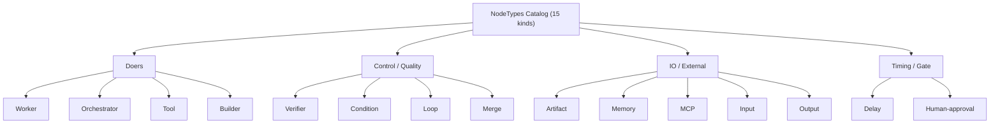
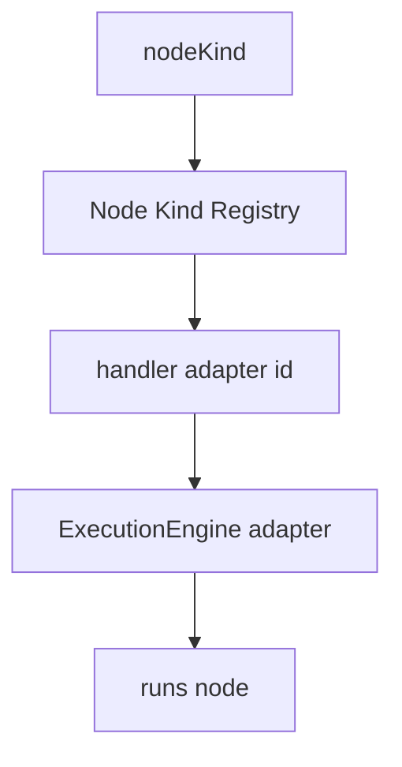

# NodeTypes Diagrams

## The Built-In Kind Taxonomy



## Catalog to Handler



## ASCII: Artifact Boundary

```text
Builder  -> produces Artifact -> artifact-ref (output port)
Verifier -> checks Artifact   -> verdict
Merge    -> applies Artifact  -> trusted project state (under permission)
```

## Related Documents

- [[06-workflow-engine/README]]
- [[NodeTypes-Part01]]
- [[NodeTypes-Part03]]
- [[NodeArchitecture-Part01]]
- [[BuilderNodes-Part01]]
- [[VerifierNodes-Part01]]
