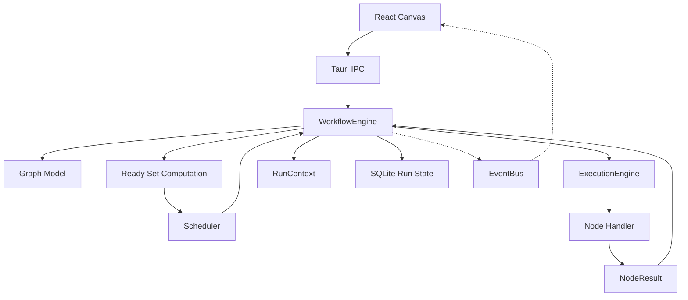

---
title: 06 Workflow Engine
status: draft
version: 1.0
tags:
  - workflow-engine
  - graph
  - architecture
  - Eulinx
  - flow:P01-CORE-RETRY
  - flow:P04-STATE-WORKFLOW
  - flow:P05-SCH-RETRY
  - flow:P06-SPAWN-DEPS
  - flow:P16-WF-MANAGER
  - flow:P16-WF-DAG
  - flow:P16-WF-DEPS
  - flow:P16-WF-BRANCH
  - flow:P16-WF-PARALLEL
  - flow:P16-WF-APPROVAL
  - flow:P16-WF-RETRY
  - flow:P16-WF-RESUME
  - flow:P16-WF-CHECKPOINT
  - flow:P16-WF-TEMPLATES
  - flow:P17-CLI-WORKFLOW
related:
  - "[[Workflow-Part01]]"
  - "[[ExecutionEngine-Part01]]"
  - "[[Scheduler-Part01]]"
  - "[[Execution-Part01]]"
  - "[[02-runtime/README]]"
---

# 06 Workflow Engine

## Purpose

The `06-workflow-engine` folder defines the machine that reads a Workflow graph and turns it into work.

`01-core-concepts/Workflow` defines what a Workflow **is**: a directed graph of Nodes and Edges that describes structure, order, and data movement. That document is the noun. This folder is the verb.

`02-runtime/ExecutionEngine` defines the service that **runs** an approved unit of work: it picks an adapter, supervises a process, captures output, returns a result. That service does not know what a graph is.

This folder is the layer between them.

```text
Workflow (01)          says what the graph is.
WorkflowEngine (06)    decides which node runs next, and why.
ExecutionEngine (02)   runs that one node's work.
Workflow (01) again    records what happened.
```

The distinction is the single most important thing to internalize before reading further. The WorkflowEngine **interprets**. The ExecutionEngine **performs**. The WorkflowEngine never spawns a process, never opens a PTY, never writes a file. It computes a set of ready nodes, hands each one to the ExecutionEngine as an execution request, and applies the result back onto the graph.

If your WorkflowEngine implementation contains a call to `spawn`, you have merged two layers that must stay apart.

## Workflow Engine Folder Structure

This folder is organized as one folder per topic. Each folder describes one engine concern or one node family.

```text
06-workflow-engine/
  README.md

  WorkflowEngine/
    WorkflowEngine-Part01.md ... WorkflowEngine-Part08.md
    WorkflowEngine-Diagrams.md

  NodeArchitecture/
    NodeArchitecture-Part01.md ... NodeArchitecture-Part06.md
    NodeArchitecture-Diagrams.md

  NodeTypes/
    NodeTypes-Part01.md ... NodeTypes-Part06.md
    NodeTypes-Diagrams.md

  EdgeTypes/
    EdgeTypes-Part01.md ... EdgeTypes-Part06.md
    EdgeTypes-Diagrams.md

  DynamicGraphs/
    DynamicGraphs-Part01.md ... DynamicGraphs-Part06.md
    DynamicGraphs-Diagrams.md

  ExecutionFlow/
    ExecutionFlow-Part01.md ... ExecutionFlow-Part08.md
    ExecutionFlow-Diagrams.md

  LoopNodes/
    LoopNodes-Part01.md ... LoopNodes-Part06.md
    LoopNodes-Diagrams.md

  ConditionNodes/
    ConditionNodes-Part01.md ... ConditionNodes-Part04.md
    ConditionNodes-Diagrams.md

  BuilderNodes/
    BuilderNodes-Part01.md ... BuilderNodes-Part06.md
    BuilderNodes-Diagrams.md

  VerifierNodes/
    VerifierNodes-Part01.md ... VerifierNodes-Part06.md
    VerifierNodes-Diagrams.md

  MCPNodes/
    MCPNodes-Part01.md ... MCPNodes-Part06.md
    MCPNodes-Diagrams.md

  WorkflowExamples/
    WorkflowExamples-Part01.md ... WorkflowExamples-Part04.md
    WorkflowExamples-Diagrams.md
```

## Total Workflow Engine Specification Size

```text
12 topic folders
1 root README
70 Markdown specification parts
12 Markdown diagram files
83 Markdown files in total
```

## Topic Responsibilities

## WorkflowEngine

The WorkflowEngine is the interpreter. It owns the run object, the in-memory and SQLite graph representation, the ready-set computation, topological execution, parallel branch dispatch, the run context that carries data between nodes, pause/resume/cancel, determinism and replay, crash recovery of run state, and the numbered engine tick algorithm that drives everything.

This is the central topic of the section. Read it first.

Parts: 8

## NodeArchitecture

NodeArchitecture defines the base Node type that every node kind shares: the node contract of inputs, outputs, config, and ports; typed ports and the port compatibility rules; the node state machine of pending, ready, running, succeeded, failed, skipped, and cancelled; execution isolation; per-node retries and timeouts; error propagation to downstream nodes; and how a plugin registers a custom node kind.

Every node kind in `NodeTypes` is an instance of the contract defined here.

Parts: 6

## NodeTypes

NodeTypes is the catalog. It gives the complete list of built-in node kinds, and for each kind a full config type, its port set, its behavior, and its named failure modes: Worker, Orchestrator, Tool, Builder, Verifier, Condition, Loop, Merge, Artifact, Memory, MCP, Input, Output, Delay, and Human-approval.

Parts: 6

## EdgeTypes

EdgeTypes defines the edge kinds that connect nodes and what each kind means for ordering and data movement: control edges, data edges, artifact edges, dependency edges, and communication edges. It owns edge validation, cycle rules, and the conditions under which an edge is considered satisfied.

Parts: 6

## DynamicGraphs

DynamicGraphs defines how a graph changes while it is running: node insertion by an Orchestrator, subgraph expansion, replanning, structural validation of AI-proposed mutations, and the rule that a mutation must never invalidate an already-completed node's result.

Parts: 6

## ExecutionFlow

ExecutionFlow defines the end-to-end path a run takes through the graph: entry, dispatch batches, fan-out and fan-in, barrier semantics, failure propagation across branches, and the interaction with the Scheduler's concurrency limits.

Parts: 8

## LoopNodes

LoopNodes defines iteration: for-each over a collection, while-condition loops, the refinement loop that drives Builder into Verifier and back, iteration limits, loop-scoped run context, and the mandatory termination guarantees.

Parts: 6

## ConditionNodes

ConditionNodes defines branching: the expression language, evaluation rules, the deterministic branch selection, and how unselected branches are marked skipped rather than pending forever.

Parts: 4

## BuilderNodes

BuilderNodes defines the node family that produces Artifacts through AI Workers, including prompt binding, artifact emission, and the rule that a Builder MUST NOT write to the project.

Parts: 6

## VerifierNodes

VerifierNodes defines the node family that checks Artifacts, including deterministic verification, AI-advisory verdicts, and the rule that a Verifier MUST NOT verify an Artifact produced by itself.

Parts: 6

## MCPNodes

MCPNodes defines nodes backed by Model Context Protocol servers: server binding, tool discovery, schema mapping onto typed ports, and failure handling when a server is unreachable.

Parts: 6

## WorkflowExamples

WorkflowExamples contains complete worked graphs with real values, from a trivial two-node run to a full multi-phase build with parallel branches, refinement loops, and human approval.

Parts: 4

## Global Workflow Engine Principles

The WorkflowEngine MUST be deterministic. Given the same graph, the same inputs, and the same recorded node results, a replay MUST visit the same nodes in the same order.

The WorkflowEngine MUST NOT execute work itself. It MUST delegate every unit of work to the [[ExecutionEngine-Part01]].

The WorkflowEngine MUST NOT decide concurrency limits. It proposes a ready set. The [[Scheduler-Part01]] decides how much of that set may run now.

The WorkflowEngine MUST persist run state after every node state change, so that an app restart resumes rather than restarts.

The WorkflowEngine MUST treat AI-proposed graph mutations as untrusted input and validate them structurally before applying them.

The WorkflowEngine MUST NOT allow a node to mutate trusted project state. Nodes produce Artifacts. Artifacts are verified. The [[MergeManager-Part01]] applies them.

The WorkflowEngine MUST emit an event on the [[EventBus-Part01]] for every node state change and every run state change.

The WorkflowEngine MUST fail closed. An unknown node kind, an unsatisfiable port, or an invalid edge halts the run rather than guessing.

The WorkflowEngine MUST NOT let visual layout affect execution. Node position is presentation. Edges are truth.

## Workflow Engine Architecture Overview



## ASCII Overview

```text
User Goal / Saved Workflow
  |
  v
WorkflowEngine
  |
  +-- Graph Model          (nodes, edges, adjacency, in-degree)
  +-- Ready Set            (which nodes have all deps satisfied)
  +-- RunContext           (data passed along data edges)
  +-- Tick Loop            (the numbered engine algorithm)
  |
  v
Scheduler       <-- decides how many ready nodes may run now
  |
  v
ExecutionEngine <-- actually runs one node
  |
  v
NodeResult -> apply to graph -> persist -> emit -> tick again
```

## AI Notes

Do not implement the WorkflowEngine as a recursive function that walks the graph depth-first calling handlers. That design cannot pause, cannot resume after a crash, cannot run branches in parallel, and cannot be replayed. The engine is a **tick loop over persisted state**, not a recursion over memory.

Do not store the graph only in React Flow state. React Flow state is a view. The authoritative graph lives in SQLite and in the engine's in-memory mirror, and the UI is a subscriber.

Do not merge the WorkflowEngine with the ExecutionEngine because "they both run things". The WorkflowEngine answers "which node is next". The ExecutionEngine answers "how do I safely run this one thing". Merging them produces a service that cannot be tested and cannot be replayed.

Do not let node handlers read or write global state. A node reads its declared input ports and writes its declared output ports. Anything else breaks determinism and makes replay a lie.

## Related Documents

- [[WorkflowEngine-Part01]]
- [[NodeArchitecture-Part01]]
- [[NodeTypes-Part01]]
- [[EdgeTypes-Part01]]
- [[DynamicGraphs-Part01]]
- [[ExecutionFlow-Part01]]
- [[LoopNodes-Part01]]
- [[ConditionNodes-Part01]]
- [[BuilderNodes-Part01]]
- [[VerifierNodes-Part01]]
- [[MCPNodes-Part01]]
- [[WorkflowExamples-Part01]]
- [[Workflow-Part01]]
- [[ExecutionEngine-Part01]]
- [[Scheduler-Part01]]
- [[01-core-concepts/README]]
- [[02-runtime/README]]
- [[04-memory/README]]
- [[05-artifacts/README]]
- [[09-plugin-system/README]]
</content>
</invoke>
