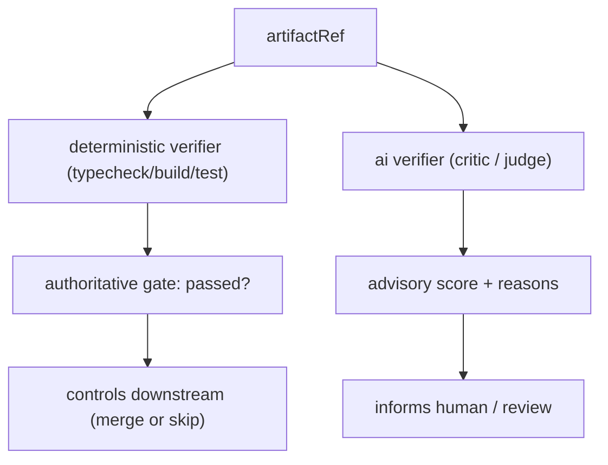
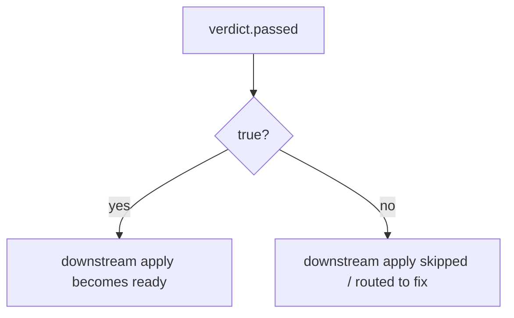

# VerifierNodes Diagrams

## Deterministic vs AI Verifier



## The Authorship Rule

```text
Builder (produces artifact)
   |
   v
Verifier (checks artifact)  -- allowed, distinct instances

Verifier (produces artifact)
   |
   v
Verifier (checks same artifact)  -- FORBIDDEN (self-verification)
```

## Gate Routing



## Related Documents

- [[06-workflow-engine/README]]
- [[VerifierNodes-Part01]]
- [[VerifierNodes-Part03]]
- [[VerifierNodes-Part05]]
- [[BuilderNodes-Part01]]
- [[MergeManager-Part01]]
