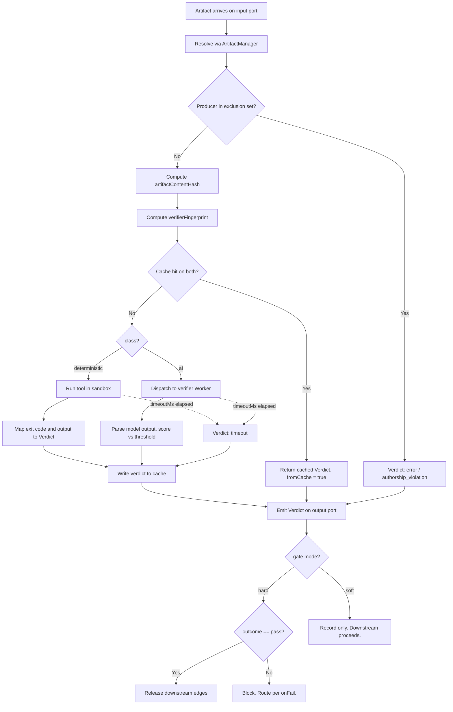

---
title: VerifierNodes Specification - Part 01
status: draft
version: 1.0
tags:
  - workflow-engine
  - verifier-nodes
  - verification
  - architecture
related:
  - "[[NodeArchitecture-Part01]]"
  - "[[NodeTypes-Part01]]"
  - "[[BuilderNodes-Part01]]"
  - "[[Verification-Part01]]"
  - "[[Artifact-Part01]]"
---

# VerifierNodes Specification (Part 01)

## Document Index

```text
VerifierNodes-Part01 - Purpose, philosophy, object model, states, invariants
VerifierNodes-Part02 - The verifier node config and its validation
VerifierNodes-Part03 - Deterministic verifiers: schema, lint, typecheck, build, test
VerifierNodes-Part04 - AI verifiers: critic and judge, scoring, thresholds
VerifierNodes-Part05 - The authorship rule, gates, and the pipeline boundary
VerifierNodes-Part06 - Caching, failure routing, timeouts, checklist, examples
VerifierNodes-Diagrams - VerifierNodes-Diagrams.md
```

# Purpose

A VerifierNode is the workflow-engine node type that turns an Artifact into a Verdict.

That is its entire job. It does not produce artifacts. It does not edit files. It does not merge. It reads an Artifact that some other node produced, runs one verification method against it, and emits a typed `Verdict` on its output port.

This node is the physical embodiment of the single most important rule in Eulinx:

```text
AI output MUST NOT directly mutate trusted state.

Worker -> Artifact -> Verify -> Merge

The VerifierNode is the "Verify".
It is the only thing standing between a model's guess
and the user's real source tree.
```

Remove every VerifierNode from a Eulinx workflow and Eulinx becomes a program that lets language models write directly to a user's repository. The node is not a quality feature. It is the safety boundary.

# Core Philosophy

Three ideas govern this node. They are not negotiable and every later part enforces them.

**Verification is not authorship.** The thing that checks the work MUST NOT be the thing that did the work. A Worker asked "is your patch correct?" answers yes. This is not a prompt-engineering problem and no prompt fixes it. It is enforced structurally, by the engine, at graph-validation time and again at dispatch time. Part 05 gives the exact algorithm.

**Deterministic verification is authoritative. AI verdicts are advisory.** A passing `tsc` exit code is a fact. A critic model saying "this looks good to me" is an opinion with a confidence attached. These MUST NOT be given equal weight. A workflow MUST NOT be able to configure an AI verdict to override a failing deterministic verdict. The engine rejects such a graph. Part 04 defines the precedence rules.

**A verifier is a pure function of artifact content.** Given the same artifact bytes and the same verifier config, the verdict MUST be the same. This is what makes caching by content hash sound (Part 06), what makes Replay work, and what makes a red build mean something. A verifier that reads the wall clock, the network, or mutable global state is a bug.

```text
Deterministic verifier: reads bytes, runs a tool, reports an exit code.
AI verifier:            reads bytes, asks a model, reports an opinion.

Both produce a Verdict.
Only one of them is trusted.
```

# Definition

A VerifierNode is a workflow node with:

- exactly one required artifact input port
- zero or more optional context input ports
- exactly one `Verdict` output port
- exactly one bound verification method (a `VerifierKind`)
- a gate mode (`hard` or `soft`) that determines what a failing verdict does to the graph
- a mandatory timeout
- a mandatory authorship exclusion set, computed by the engine, not by the author

A VerifierNode MUST NOT have more than one bound method. A node that runs `tsc` and also asks a critic is two nodes. This is a hard structural rule and Part 02 rejects the config at validation time. The reason is precedence: if one node produced one blended verdict, there would be no way for the engine to know which half was authoritative.

# Responsibilities

A VerifierNode MUST:

- accept exactly one artifact reference on its `artifact` input port
- resolve that reference through the ArtifactManager, never by reading the filesystem directly
- refuse to run if the artifact's producer is in its authorship exclusion set
- run exactly one verification method
- complete within `timeoutMs` or emit a `timeout` verdict
- emit exactly one `Verdict` on its `verdict` output port, always, including on internal error
- emit `workflow.verifier.started` and `workflow.verifier.completed` on the EventBus
- write the verdict to the verdict cache keyed by artifact content hash plus verifier fingerprint
- be replayable: given the same inputs, produce the same verdict

A VerifierNode SHOULD:

- return a cached verdict when the content hash and verifier fingerprint both match
- report per-check detail in `Verdict.findings` so the refine loop has something to act on
- run inside the same sandbox root as the artifact's producer for deterministic verifiers

A VerifierNode MUST NOT:

- mutate the project working tree
- mutate the artifact under verification
- produce an artifact of its own
- call the MergeManager
- be the same Worker that produced the artifact under verification
- be executed by a Worker whose `rootWorkerId` matches the producer's `rootWorkerId` when `authorshipScope` is `tree` (Part 05)
- have its verdict overridden by a downstream node
- accept an unbounded timeout
- allow an AI verdict to overturn a failing deterministic verdict

# VerifierNode Object Model

```ts
type VerifierNode = {
  nodeId: string;
  workflowId: string;
  kind: "verifier";
  label: string;

  method: VerifierMethod;

  gate: GateMode;

  inputs: {
    artifact: PortRef;
    context?: PortRef[];
  };
  outputs: {
    verdict: PortRef;
  };

  timeoutMs: number;
  cachePolicy: VerdictCachePolicy;
  authorship: AuthorshipRule;
  onFail: FailureRoute;

  createdAt: string;
  createdBy: RuntimeActorRef;
};

type GateMode =
  | { mode: "hard" }
  | { mode: "soft"; recordOnly: true };

type VerifierMethod =
  | { class: "deterministic"; kind: DeterministicVerifierKind; config: DeterministicVerifierConfig }
  | { class: "ai"; kind: AiVerifierKind; config: AiVerifierConfig };

type DeterministicVerifierKind = "schema" | "lint" | "typecheck" | "build" | "test";
type AiVerifierKind = "critic" | "judge";
```

The `class` discriminant is the load-bearing field in this entire specification. Every precedence rule, every gate rule, and every cache rule branches on it. Part 03 and Part 04 give the full config types for each side.

# The Verdict

```ts
type Verdict = {
  verdictId: string;
  nodeId: string;
  workflowId: string;
  runId: string;

  artifactId: string;
  artifactContentHash: string;
  verifierFingerprint: string;

  class: "deterministic" | "ai";
  kind: DeterministicVerifierKind | AiVerifierKind;

  outcome: VerdictOutcome;
  authoritative: boolean;

  score?: number;
  threshold?: number;

  findings: Finding[];

  producedByWorkerId?: string;
  verifiedByWorkerId?: string;

  fromCache: boolean;
  durationMs: number;
  at: string;
};

type VerdictOutcome =
  | "pass"
  | "fail"
  | "timeout"
  | "error"
  | "skipped";

type Finding = {
  findingId: string;
  severity: "error" | "warning" | "info";
  code: string;
  message: string;
  filePath?: string;
  line?: number;
  column?: number;
  excerpt?: string;
};
```

`authoritative` MUST equal `class === "deterministic"`. It is stored denormalized on the verdict rather than recomputed, because Replay must be able to read a historical verdict and know how it was treated at the time without re-deriving it from a config that may since have been edited.

`score` and `threshold` MUST be absent when `class` is `deterministic`. A typecheck does not have a score. It passed or it did not. Part 04 defines them for the AI side.

`outcome` has five variants and every consumer MUST handle all five. The common implementation bug is treating this as a boolean and mapping `timeout` and `error` to `pass` because they are "not fail". They are not pass either. Part 06 gives the exact routing for each.

# States

A VerifierNode instance moves through these states during a run.

```text
pending      inputs not yet satisfied
ready        artifact input resolved, waiting for dispatch
checking     authorship exclusion check running
cache_lookup content hash computed, cache consulted
running      verification method executing
completed    verdict emitted
```

There is no `failed` state. A verifier that cannot run does not fail; it emits a verdict with `outcome: "error"`. This is deliberate. A node that fails silently leaves the downstream gate with nothing to read, and a gate with nothing to read is a gate that is open. Every path out of a VerifierNode emits exactly one Verdict.

# Invariants

```text
Exactly one Verdict is emitted per verifier node per run attempt. Never zero. Never two.
verifiedByWorkerId != producedByWorkerId, always, without exception.
authoritative == (class == "deterministic").
score and threshold are present if and only if class == "ai".
A verifier never writes to the project working tree.
A verifier never calls the MergeManager.
timeoutMs is finite and > 0.
A cached verdict matches on BOTH artifactContentHash AND verifierFingerprint.
A hard gate with a non-pass verdict blocks every downstream edge.
A soft gate never blocks anything and never fails a run.
An AI verdict cannot flip a deterministic fail to a pass.
The same artifact bytes plus the same verifier fingerprint yield the same outcome.
```

The second invariant is the one to tattoo somewhere. Part 05 exists solely to enforce it.

# Mermaid Diagram



# AI Notes

Do not implement the verifier as a function returning `boolean`. It returns a `Verdict` with a five-variant outcome, a findings array, and a provenance record. Every time someone collapses this to a boolean, `timeout` silently becomes `pass` and a gate that the user believes is closed is open. The type system is the enforcement mechanism here; use it.

Do not let the workflow author configure the authorship exclusion set. It is computed by the engine from the artifact's provenance at dispatch time. If the author can write `excludeWorkers: []`, the single most important rule in Eulinx is a suggestion. Part 05 is explicit about this and the config type in Part 02 deliberately has no field for it.

Do not blend a deterministic check and an AI check into one node "for convenience". The precedence rule needs to know which verdict is authoritative, and a blended verdict has no answer. Two nodes. Two verdicts. The engine combines them under rules it owns.

Do not cache on artifact ID. Cache on artifact content hash plus verifier fingerprint. Artifact IDs are per-version and a refine loop produces a new ID for byte-identical content more often than you expect; caching on ID silently disables the cache. Worse, caching on content hash alone means editing a lint rule does not invalidate anything, and stale green verdicts are the worst possible failure mode for a safety boundary.

Do not run a verifier against the project working tree. Verify the artifact. The artifact is not merged yet; that is the entire point. A verifier that runs `tsc` against the real repo is verifying the code that was already there, not the patch, and it will pass every single time.

Do not skip the timeout because "the test suite usually finishes". A hung verifier holds a hard gate closed forever and the run never terminates. Part 06 gives the exact numbers.

# Related Documents

- [[06-workflow-engine/README]]
- [[VerifierNodes-Part02]]
- [[VerifierNodes-Part03]]
- [[VerifierNodes-Part04]]
- [[VerifierNodes-Part05]]
- [[VerifierNodes-Part06]]
- [[VerifierNodes-Diagrams]]
- [[NodeArchitecture-Part01]]
- [[NodeTypes-Part01]]
- [[BuilderNodes-Part01]]
- [[LoopNodes-Part01]]
- [[Verification-Part01]]
- [[Artifact-Part01]]
- [[MergeManager-Part01]]
- [[EventBus-Part01]]
