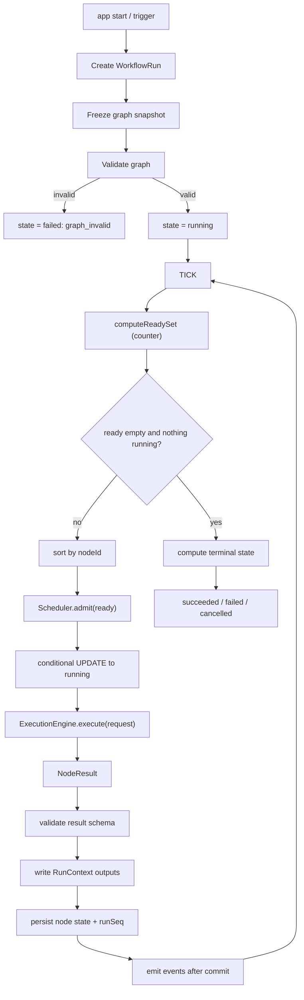
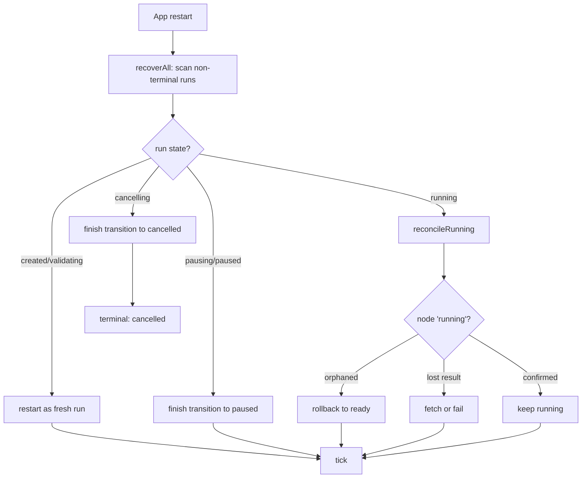

# WorkflowEngine Diagrams

## Engine Tick Loop



## ASCII Overview

```text
User Goal / Saved Workflow
  |
  v
WorkflowEngine
  |
  +-- Graph Model          (nodes, edges, adjacency, in-degree)
  +-- Ready Set            (which nodes have all deps satisfied)
  +-- RunContext           (data passed along data edges)
  +-- Tick Loop            (the numbered engine algorithm)
  |
  v
Scheduler       <-- decides how many ready nodes may run now
  |
  v
ExecutionEngine <-- actually runs one node
  |
  v
NodeResult -> apply to graph -> persist -> emit -> tick again
```

## Recovery Path



## Related Documents

- [[06-workflow-engine/README]]
- [[WorkflowEngine-Part01]]
- [[WorkflowEngine-Part03]]
- [[WorkflowEngine-Part06]]
- [[WorkflowEngine-Part07]]
- [[WorkflowEngine-Part08]]
- [[Scheduler-Part01]]
- [[ExecutionEngine-Part01]]
