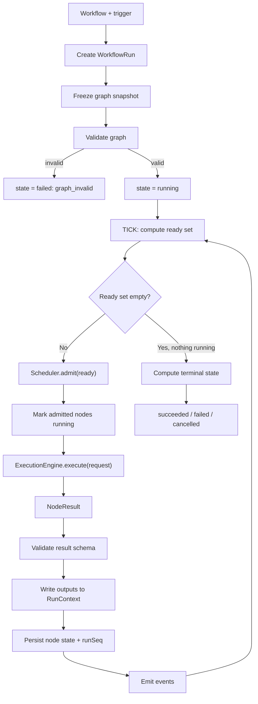

---
title: WorkflowEngine Specification - Part 01
status: draft
version: 1.0
tags:
  - workflow-engine
  - workflow-engine-core
  - architecture
related:
  - "[[06-workflow-engine/README]]"
  - "[[ExecutionEngine-Part01]]"
  - "[[Workflow-Part01]]"
  - "[[Scheduler-Part01]]"
  - "[[NodeArchitecture-Part01]]"
---

# WorkflowEngine Specification (Part 01)

## Document Index

Part 01 - Purpose, Philosophy, Boundaries, and the Run Object Model
Part 02 - Graph Representation In Memory and In SQLite
Part 03 - Readiness, the Ready Set, and Topological Execution
Part 04 - Parallel Branch Execution and the Scheduler Handshake
Part 05 - RunContext and Data Passing Between Nodes
Part 06 - Pause, Resume, Cancel, and Restart Recovery
Part 07 - Determinism and Replay
Part 08 - The Engine Tick Algorithm, Checklist, and Examples
Diagrams - WorkflowEngine-Diagrams.md

# Purpose

The WorkflowEngine is the deterministic interpreter of a Workflow graph.

It takes a `Workflow` (the noun defined in [[Workflow-Part01]]), creates a `WorkflowRun`, and drives that run to a terminal state by repeatedly answering one question: **which nodes are ready right now?**

It answers that question, hands the ready nodes to the [[Scheduler-Part01]] for admission, hands admitted nodes to the [[ExecutionEngine-Part01]] for actual execution, applies the returned results back onto the graph, persists, emits, and asks the question again.

That loop is the entire engine. Everything else in this document is detail about how to make that loop correct, parallel, pausable, crash-safe, and replayable.

# The Boundary With ExecutionEngine

This is the first thing to internalize. Implementers merge these two services constantly, and the merge destroys replay.

```text
WorkflowEngine INTERPRETS the graph.
  It knows: nodes, edges, in-degree, readiness, run context, branch state.
  It does not know: processes, PTYs, provider APIs, file descriptors.

ExecutionEngine PERFORMS one unit of work.
  It knows: adapters, permission decisions, supervision, streaming, timeouts.
  It does not know: what a node is, what an edge is, what comes next.
```

The contract between them is a value, not a callback:

```text
WorkflowEngine  --- ExecutionRequest --->  ExecutionEngine
WorkflowEngine  <--- ExecutionResult  ---  ExecutionEngine
```

The WorkflowEngine MUST NOT pass a closure, a graph reference, or a mutable context object across that boundary. It passes a serializable request. It receives a serializable result. That constraint is what makes replay possible: a replay replaces the ExecutionEngine with a recorded-result lookup table, and the WorkflowEngine cannot tell the difference.

If the ExecutionEngine can reach the graph, it will eventually read it, and then a recorded result is no longer sufficient to reproduce a run.

# Core Philosophy

The engine is a **tick loop over persisted state**, not a recursion over memory.

The naive implementation of a graph runner is a depth-first walk:

```text
function run(node) {
  const result = execute(node);
  for (const next of node.outgoing) run(next);
}
```

This is wrong in Eulinx for five independent reasons, and each one alone is fatal:

1. It cannot pause. There is no point at which the loop can stop and be resumed later, because the resume point is a call stack.
2. It cannot survive a restart. The call stack is not persistable. Eulinx is a desktop app; users close it mid-run.
3. It cannot run branches in parallel without becoming a thread-safety problem.
4. It cannot fan in. A node with two incoming edges gets visited twice.
5. It cannot be replayed, because the order depends on recursion order, which depends on adjacency list order, which is not stable across a reload.

The correct model:

```text
loop {
  ready = computeReadySet(graph, runState)      // pure function
  if (ready is empty and nothing running) break
  admitted = Scheduler.admit(ready)             // may be a subset
  for each node in admitted: dispatch to ExecutionEngine
  await at least one result
  apply results, persist, emit
}
```

Every part of that loop is a pure function of persisted state. Kill the app at any instruction and the next start recomputes the same ready set from SQLite.

# Definition

The WorkflowEngine is a runtime service responsible for:

- creating a `WorkflowRun` from a `Workflow`
- validating the graph before the run starts
- holding the authoritative in-memory graph mirror
- persisting run state and node state to SQLite after every change
- computing the ready set
- enforcing topological execution order
- dispatching ready nodes to the Scheduler and then the ExecutionEngine
- maintaining the `RunContext` and moving data along data edges
- applying `NodeResult` values back onto the graph
- propagating failure and skip states downstream
- handling pause, resume, and cancel
- recovering an interrupted run after an app restart
- supporting deterministic replay
- emitting an event for every state change
- driving the run to exactly one terminal state

# What The WorkflowEngine Is Not

The WorkflowEngine is not the [[ExecutionEngine-Part01]]. It never runs work.

The WorkflowEngine is not the [[Scheduler-Part01]]. It never decides concurrency limits or priority. It proposes; the Scheduler admits.

The WorkflowEngine is not the [[PermissionManager-Part01]]. Permission is evaluated inside the ExecutionEngine, per node execution. The WorkflowEngine MUST NOT pre-approve anything.

The WorkflowEngine is not an Orchestrator. It does not plan, does not choose strategy, and does not call a model. An Orchestrator may **produce** a graph; the engine only interprets it.

The WorkflowEngine is not the UI canvas. Node coordinates are opaque to it.

# Responsibilities

The WorkflowEngine MUST:

- validate a graph fully before creating a run
- reject a graph containing a control cycle that is not inside a declared Loop node
- persist the run record before dispatching any node
- compute readiness only from persisted node states and edge satisfaction
- dispatch a node exactly once per run per iteration index
- treat every `NodeResult` as untrusted until schema-validated
- persist node state transitions in a single SQLite transaction with the run's `runSeq`
- emit `workflow.node.state_changed` after the transaction commits, never before
- propagate `failed` and `skipped` downstream per the rules in Part 03
- reach exactly one terminal run state: `succeeded`, `failed`, or `cancelled`
- resume an interrupted run from persisted state at next app start
- record enough per-node information for Replay

The WorkflowEngine SHOULD:

- batch ready nodes into a single Scheduler admission call
- keep the in-memory graph mirror as the read path and SQLite as the write path
- coalesce EventBus emissions within one tick into a single UI update frame

The WorkflowEngine MUST NOT:

- execute node work in process
- spawn a Worker, open a PTY, or call a provider API
- read or write project files
- mutate the graph structure itself (only [[DynamicGraphs-Part01]] mutations, applied through the validated path, may do that)
- dispatch a node whose upstream dependencies are not all satisfied
- dispatch a node twice for the same iteration index
- emit an event for a state change that did not commit
- allow node execution order to depend on adjacency list insertion order
- continue a run whose graph failed validation

# The Workflow Run Object Model

```ts
type WorkflowRunId = string;
type NodeId = string;
type EdgeId = string;

type WorkflowRun = {
  runId: WorkflowRunId;
  workflowId: string;
  workflowVersion: number;
  workspaceId: string;
  projectId: string;
  sessionId: string;

  state: WorkflowRunState;
  runSeq: number;

  trigger: RunTrigger;
  mode: RunMode;

  graphSnapshotId: string;
  contextId: string;

  startedAt: string;
  endedAt?: string;
  pausedAt?: string;

  nodeCount: number;
  completedNodeCount: number;
  failedNodeCount: number;
  skippedNodeCount: number;

  failure?: RunFailure;
  restartGeneration: number;
  determinismSeed: string;
};

type WorkflowRunState =
  | "created"
  | "validating"
  | "running"
  | "pausing"
  | "paused"
  | "cancelling"
  | "cancelled"
  | "succeeded"
  | "failed";

type RunMode = "normal" | "dry_run" | "replay";

type RunTrigger = {
  kind: "user" | "orchestrator" | "schedule" | "event" | "replay" | "recovery";
  actorId: string;
  reason: string;
  at: string;
};

type RunFailure = {
  kind: RunFailureKind;
  failedNodeIds: NodeId[];
  message: string;
  at: string;
};

type RunFailureKind =
  | "graph_invalid"
  | "node_failed_fatal"
  | "unknown_node_kind"
  | "port_unsatisfied"
  | "context_write_conflict"
  | "iteration_limit_exceeded"
  | "scheduler_unavailable"
  | "execution_engine_unavailable"
  | "persistence_failed"
  | "recovery_impossible";
```

`runSeq` is the optimistic concurrency token for the whole run. Every write to the run or to any of its nodes bumps it inside the same transaction. Every conditional update carries `WHERE runSeq = <observed>`. This is the same discipline `transitionSeq` provides for a Worker in [[WorkerLifecycle-Part01]], and it exists for the same reason: two ticks must never interleave a write.

`determinismSeed` is a fixed random string generated once at run creation. Any node kind that needs randomness derives it from `hash(determinismSeed + nodeId + iterationIndex)`. Nothing in the engine may call a raw random source. See Part 07.

`graphSnapshotId` points at a frozen copy of the graph as it was when the run started. A user editing the workflow mid-run MUST NOT change the running graph. This is the same frozen-snapshot rule that [[WorkerCreation-Part01]] applies to permission profiles, for the same reason.

# Run State Machine

```text
created -> validating -> running -> succeeded
                     \-> failed (graph_invalid)
running -> pausing -> paused -> running
running -> cancelling -> cancelled
running -> failed
paused -> cancelling -> cancelled
```

Rules:

- `created` to `validating` is automatic and immediate.
- `validating` may only exit to `running` or to `failed` with kind `graph_invalid`.
- `pausing` means: dispatch no new nodes, let running nodes finish. When the last running node returns, the state becomes `paused`.
- `cancelling` means: dispatch no new nodes, and send a cancel signal to every running node. When the last running node returns or is confirmed dead, the state becomes `cancelled`.
- `succeeded` requires every node to be in `succeeded` or `skipped`.
- `failed` requires at least one node in `failed` whose failure was not absorbed by a retry or a condition branch.
- Terminal states are `succeeded`, `failed`, and `cancelled`. A terminal run MUST NOT transition again. A re-run creates a new `runId`.

# Invariants

```text
A run's record exists in SQLite before any node is dispatched.
A run has exactly one terminal state, reached exactly once.
Every node state change and the run's runSeq bump commit in one transaction.
Events are emitted only after commit.
A node is dispatched at most once per (runId, nodeId, iterationIndex).
A node is dispatched only when every incoming edge is satisfied.
The ready set is a pure function of (graph snapshot, node states, run context).
Node execution order within a tick is sorted by nodeId, never by insertion order.
The graph snapshot is immutable for the life of the run, except through validated dynamic mutation.
No node may read state it did not declare as an input port.
The engine never calls a random source directly.
completedNodeCount + failedNodeCount + skippedNodeCount <= nodeCount, always.
```

The dispatch-once invariant deserves emphasis. It is not enough to check "is this node already running" in memory. The check MUST be the conditional SQLite update: the transition to `running` is `UPDATE nodes SET state='running' WHERE runId=? AND nodeId=? AND iterationIndex=? AND state='ready'`. If zero rows are affected, another tick won the race and this tick MUST NOT dispatch. Part 08 makes this step explicit.

# Mermaid Diagram



# AI Notes

Do not write the engine as `async function runNode(node) { ... for (child of node.next) await runNode(child) }`. That is the recursion described above and it fails on every one of the five counts. The engine is a loop. State lives in SQLite. The loop reads state, acts, writes state, and returns to the top.

Do not compute readiness by walking backwards from a node asking "are my parents done?" every time. That is O(V*E) per tick and it silently gives wrong answers when a Condition node marks a branch skipped. Maintain a `remainingDeps` counter per node, decremented when an incoming edge becomes satisfied, exactly as Part 03 specifies. A node is ready when `remainingDeps == 0`.

Do not hold the graph only in memory because "the run is short". Runs are not short. A build workflow with AI Workers runs for hours. The user will close the laptop lid.

Do not emit `workflow.node.state_changed` before the transaction commits. If the commit then fails, the UI shows a state that does not exist and the next tick disagrees with the screen. Emit after commit, always. This ordering rule is identical to the one in [[EventBus-Part02]] and it is not negotiable here either.

Do not let the ExecutionEngine see the graph. Pass a serializable `ExecutionRequest`. The moment a node handler can call `graph.getNode(...)`, replay is broken, because a recorded result no longer captures everything the handler observed.

Do not sort ready nodes by whatever order they came out of a `HashMap`. Rust `HashMap` iteration order is not stable, and neither is JavaScript object key order for numeric-looking keys. Sort by `nodeId` before dispatch. Determinism is a sort call away and its absence is unfixable later.

# Related Documents

- [[06-workflow-engine/README]]
- [[WorkflowEngine-Part02]]
- [[WorkflowEngine-Part03]]
- [[WorkflowEngine-Diagrams]]
- [[NodeArchitecture-Part01]]
- [[NodeTypes-Part01]]
- [[ExecutionFlow-Part01]]
- [[DynamicGraphs-Part01]]
- [[Workflow-Part01]]
- [[ExecutionEngine-Part01]]
- [[Scheduler-Part01]]
- [[EventBus-Part01]]
</content>
</invoke>
