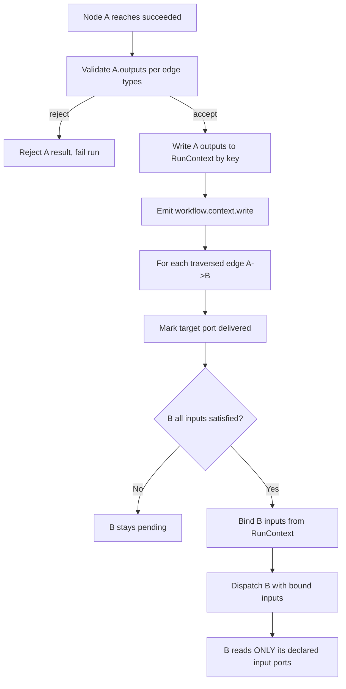

---
title: WorkflowEngine Specification - Part 05
status: draft
version: 1.0
tags:
  - workflow-engine
  - workflow-engine-core
  - run-context
related:
  - "[[06-workflow-engine/README]]"
  - "[[WorkflowEngine-Part01]]"
  - "[[WorkflowEngine-Part02]]"
  - "[[WorkflowEngine-Part03]]"
  - "[[NodeArchitecture-Part01]]"
  - "[[EdgeTypes-Part01]]"
  - "[[DynamicGraphs-Part01]]"
---

# WorkflowEngine Specification (Part 05)

## Document Index

Part 01 - Purpose, Philosophy, Boundaries, and the Run Object Model
Part 02 - Graph Representation In Memory and In SQLite
Part 03 - Readiness, the Ready Set, and Topological Execution
Part 04 - Parallel Branch Execution and the Scheduler Handshake
Part 05 - RunContext and Data Passing Between Nodes
Part 06 - Pause, Resume, Cancel, and Restart Recovery
Part 07 - Determinism and Replay
Part 08 - The Engine Tick Algorithm, Checklist, and Examples
Diagrams - WorkflowEngine-Diagrams.md

# Purpose

Part 05 defines the `RunContext`: the single, versioned, append-only data structure that carries values from one node to another along data and artifact edges during a run.

RunContext is the answer to a question that every graph engine eventually faces: when node A produces a value that node B needs, where does that value live?

In Eulinx the answer is strict and singular:

```text
A node writes ONLY to its own declared output ports.
The engine copies those outputs into the RunContext.
A downstream node reads ONLY from its declared input ports,
which the engine binds from the RunContext.
No node ever sees another node's memory.
```

There is no shared scratch object that nodes can both read and write. There is no global variable bag. There is no "the workflow state" that a node mutates. The RunContext is a write-once keyed store addressed by `(nodeId, outputPortId)`, and a node may address exactly the keys its port spec declares.

# Core Philosophy

A Workflow is deterministic only if a node's behavior depends only on its inputs, its config, and the deterministic seed. The moment a node can read "whatever is in scope", determinism is gone, because "whatever is in scope" is not part of the graph and is not part of the replay record.

The RunContext is therefore:

```text
- keyed, not positional
- write-once per (nodeId, portId, iterationIndex)
- addressed by declared ports, never by free names
- immutable after a node reaches terminal success on that port
- the ONLY channel between nodes
```

This is the same containment rule that governs Artifacts. A node's output port value is, structurally, a tiny Artifact. It is verified by the edge type check in [[EdgeTypes-Part04]] before it is allowed to become another node's input. AI-authored output does not enter another node's input port unless the type lattice accepts it.

# Definition

The RunContext is the per-run value store. It is composed of two layers: a typed output store and a typed input binding resolver.

```ts
type RunContext = {
  runId: string;
  graphVersion: number;

  outputs: Map<OutputKey, OutputValue>;
  bindings: Map<InputKey, ResolvedBinding>;

  writes: RunContextWriteLog[];
  version: number;
};

type OutputKey = {
  nodeId: string;
  portId: string;
  iterationIndex: number;
};

type InputKey = {
  nodeId: string;
  portId: string;
  iterationIndex: number;
};

type OutputValue = {
  value: JsonValue;
  producedAt: string;
  viaEdgeId: string;
  typeCheck: EdgeValidationRecord;
};

type ResolvedBinding = {
  resolvedAt: string;
  sourceOutput: OutputKey;
  transformId?: string;
};
```

`iterationIndex` is part of the key because a node inside a Loop body (see [[LoopNodes-Part01]]) may produce output many times; each iteration's output is a distinct key addressed by the loop's iteration counter. Downstream nodes inside the same body iteration read the key for their own iteration index. Nodes outside the loop read the loop's single emitted `LoopResult`, which is written under the loop node's own key with `iterationIndex: 0`.

# What The RunContext Is Not

The RunContext is not a shared mutable blackboard. A node MUST NOT open a transaction on the RunContext and mutate a key owned by another node.

The RunContext is not the Workflow definition. It holds runtime values, not graph structure. Graph structure lives in the snapshot referenced by `graphSnapshotId` (Part 01).

The RunContext is not the Artifact store. An output port value may be an `artifact_ref`, but the bytes live in the Artifact store; the RunContext holds the reference and its type stamp. See [[MergeManager-Part01]].

The RunContext is not the Worker's conversation memory. A Builder node's prompt history is Worker memory ([[WorkerMemory-Part01]]), not RunContext. RunContext carries the Builder's emitted Artifact reference, not its chat.

# Responsibilities

The WorkflowEngine MUST:

- write a node's outputs to RunContext only after the node reaches `succeeded` and its output values pass the edge run-time validator
- refuse to bind a downstream input port until every incoming edge to that port has `state: "traversed"`
- address every RunContext key by `(nodeId, portId, iterationIndex)`, never by positional index
- treat an output key as write-once; a second write to the same key is `RunContextDoubleWrite` and fails the run
- record every write in `writes` with the producing edge id, for Replay
- bind a `fanIn: "many"` port to an array ordered by `ordering` asc then `edgeId` asc ([[EdgeTypes-Part01]])
- resolve a `transform` ([[EdgeTypes-Part05]]) only through the closed transform kind set, never via arbitrary code
- emit `workflow.context.write` on the EventBus for every successful write
- fail closed: an unverifiable output value is not written; the producing node's result is rejected

The WorkflowEngine SHOULD:

- keep `outputs` as the read path in memory and persist a compact column per write to SQLite
- coalesce `workflow.context.write` events within one tick

The WorkflowEngine MUST NOT:

- let a node read an output key it did not declare as an input port
- let a node write a key whose `nodeId` is not its own
- let an AI-authored `transform` run without a PermissionManager grant ([[PermissionManager-Part01]])
- mutate an already-written key
- let RunContext size grow unbounded across a run without the checkpointing policy in Part 06 trimming cold keys

# The Binding Algorithm

When node B becomes ready (Part 03), the engine binds its input ports before dispatch:

```text
for each input port P of node B:
  collect every edge E into (B, P) that has state "traversed"
  if ActivationPolicy not yet satisfied -> B is not actually ready, recompute
  if P.fanIn == "one":
    exactly one edge must be traversed; take its OutputValue
  if P.fanIn == "many":
    collect all traversed OutputValues, sort by ordering asc then edgeId asc
    bind P to the sorted array
  P.value = resolved value (after any declared transform)
  write ResolvedBinding to RunContext.bindings
```

The binding is computed fresh each time the node is dispatched, never cached from a prior run, because the ready-set computation (Part 03) already guarantees all incoming edges are satisfied. The binding step exists to turn "edges traversed" into "typed values in the input ports the node declared".

# Iteration-Scoped Context

Inside a Loop body the RunContext is logically partitioned by `iterationIndex`. Each iteration binds a fresh `IterationContext` ([[LoopNodes-Part03]]) into the body's entry node, and every body node's keys carry that iteration index. This is what makes loop bodies data-isolated: iteration N's output cannot leak into iteration N+1's input, because the keys differ. The loop node itself, at `iterationIndex: 0`, writes the reduced `LoopResult` once, after the loop terminates.

The same partitioning applies to dynamic subgraph expansion ([[DynamicGraphs-Part01]]): an inserted sub-run gets its own iteration-index namespace so its keys cannot collide with the host graph's keys.

# Invariants

```text
A node reads only keys for (its own nodeId, its declared input ports, its iterationIndex).
A node writes only keys for (its own nodeId, its declared output ports, its iterationIndex).
Every output key is written at most once per run.
An input port is bound only after every incoming edge is "traversed".
A fanIn:"many" array is ordered by ordering asc then edgeId asc.
A value reaches an input port only after passing the edge run-time type check.
A transform runs only through the closed kind set, or via an explicit permission grant.
Every write is logged in RunContext.writes for Replay.
No output key is mutated after its producing node reached succeeded.
Loop body iterations are key-isolated by iterationIndex.
The RunContext never holds unverified AI output as a directly-addressed value.
```

# Mermaid Diagram



# AI Notes

Do not give nodes a reference to a shared mutable `ctx` object and call it a day. The first model that does `ctx.sharedConfig = ...` breaks determinism for every run after it, and Replay cannot see it because the mutation happened outside a port write. Nodes get bound input values, not a context object.

Do not bind a downstream input before all incoming edges are traversed. Partial binding is how a node silently runs on stale data. The ActivationPolicy ([[EdgeTypes-Part01]]) is the gate; the binding step enforces it.

Do not sort `fanIn: "many"` arrays by insertion order. The array a node sees must be reproducible from the graph and the edge ordering, or two replays of the same run disagree. Sort by `ordering` then `edgeId`.

Do not let loop-iteration outputs leak across iterations. If you key only by `(nodeId, portId)` you will find iteration 3 reading iteration 1's value. Key by iteration index. Always.

# Related Documents

- [[06-workflow-engine/README]]
- [[WorkflowEngine-Part01]]
- [[WorkflowEngine-Part02]]
- [[WorkflowEngine-Part03]]
- [[WorkflowEngine-Part04]]
- [[WorkflowEngine-Part06]]
- [[WorkflowEngine-Diagrams]]
- [[EdgeTypes-Part01]]
- [[EdgeTypes-Part04]]
- [[LoopNodes-Part01]]
- [[NodeArchitecture-Part01]]
- [[DynamicGraphs-Part01]]
- [[MergeManager-Part01]]
- [[Replay-Part01]]
