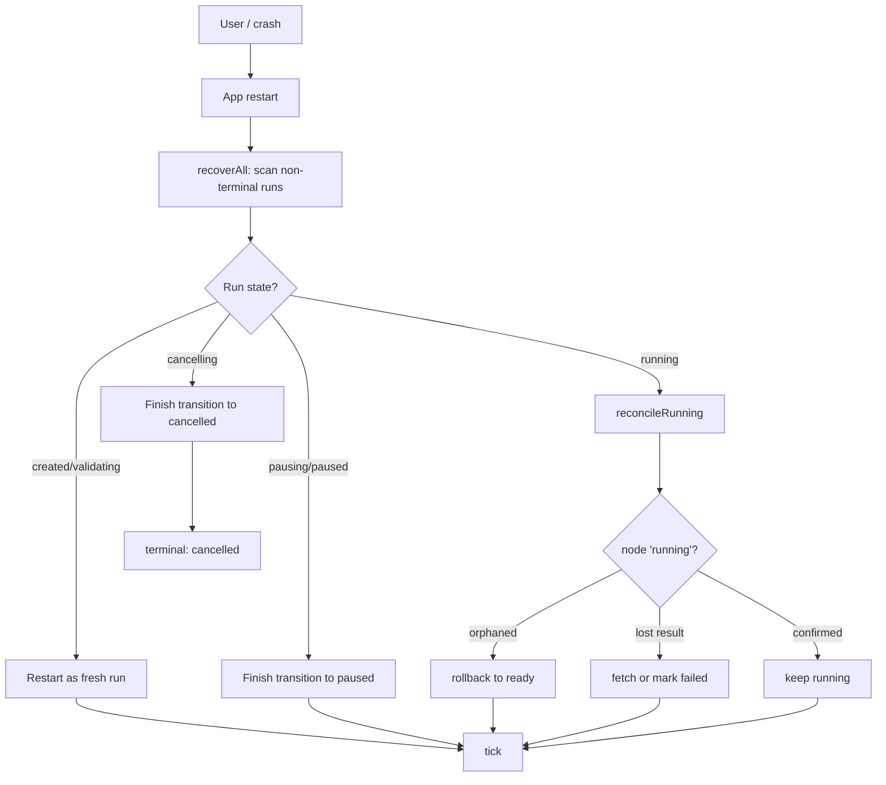

---
title: WorkflowEngine Specification - Part 06
status: draft
version: 1.0
tags:
  - workflow-engine
  - workflow-engine-core
  - pause-resume
  - recovery
related:
  - "[[06-workflow-engine/README]]"
  - "[[WorkflowEngine-Part01]]"
  - "[[WorkflowEngine-Part02]]"
  - "[[WorkflowEngine-Part03]]"
  - "[[Scheduler-Part01]]"
  - "[[ExecutionEngine-Part01]]"
  - "[[EventBus-Part01]]"
---

# WorkflowEngine Specification (Part 06)

## Document Index

Part 01 - Purpose, Philosophy, Boundaries, and the Run Object Model
Part 02 - Graph Representation In Memory and In SQLite
Part 03 - Readiness, the Ready Set, and Topological Execution
Part 04 - Parallel Branch Execution and the Scheduler Handshake
Part 05 - RunContext and Data Passing Between Nodes
Part 06 - Pause, Resume, Cancel, and Restart Recovery
Part 07 - Determinism and Replay
Part 08 - The Engine Tick Algorithm, Checklist, and Examples
Diagrams - WorkflowEngine-Diagrams.md

# Purpose

Part 06 defines how a run is paused, resumed, cancelled, and most importantly recovered after the application process dies with work in flight.

This is the part of the engine that distinguishes a desktop automation tool from a toy. Eulinx runs on the user's laptop. The laptop lid closes. The OS kills the app for memory. An uncaught exception in an unrelated panel takes the renderer down. None of those events is allowed to lose the user's workflow progress or, worse, leave a half-applied mutation in trusted project state.

```text
A run MUST survive:
  - the app closing
  - the machine sleeping
  - a renderer crash
  - an unclean shutdown
and resume to EXACTLY the state it would have reached
had the shutdown not happened.
```

The mechanism is the one already stated in Part 01: state lives in SQLite, and the loop is a pure function of that state. Pause, resume, cancel, and recovery are all specializations of "read persisted state, act, write persisted state".

# Pause

A pause is a request, not a kill. The run transitions `running -> pausing`. The engine then:

```text
1. Stops dispatching new ready nodes.
2. Lets every already-dispatched node finish (or be cancelled per policy).
3. When nodeCount_running == 0, transition pausing -> paused.
4. Persist the run state with runSeq bump in the same transaction.
5. Emit workflow.run.state_changed after commit.
```

A paused run is fully persisted. Its `pausedAt` is stamped. Its RunContext is on disk. Its node states are on disk. Nothing lives only in memory. This is mandatory: if the app is killed while `pausing`, the next start sees `pausing` and finishes the transition to `paused` before doing anything else.

A pause MUST NOT forcibly cancel running nodes unless the user explicitly requested "pause and abort". The default pause is cooperative: in-flight work completes, then the run holds.

# Resume

A resume is `paused -> running`. The engine does not rewind. It recomputes the ready set from current node states (Part 03) and continues ticking. Because node states are persisted, the set of remaining nodes is exactly what it was when paused.

```text
resume():
  assert run.state == "paused"
  transition paused -> running (transaction + emit)
  tick()  // back into the loop from Part 01 / Part 08
```

There is no "resume from checkpoint N" as a distinct operation. The whole engine is checkpointed after every node. Resume is just "start ticking again". This is why Part 01 forbids keeping state only in React Flow: a paused run whose state lived in the canvas would be unrecoverable.

# Cancel

A cancel is `running|cancelled... -> cancelling -> cancelled` or `paused -> cancelling -> cancelled`. The engine:

```text
1. Stops dispatching new nodes.
2. Sends a cancel signal to every running node via the ExecutionEngine ([[ExecutionEngine-Part01]]).
3. Marks every not-yet-terminal node that will never run as "skipped".
4. When nodeCount_running == 0, transition to cancelled.
5. Persist + emit.
```

Cancellation is terminal. A cancelled run NEVER transitions again. To run the workflow again, a new `runId` is created. The cancelled run's records remain for audit and Replay.

A running node that ignores the cancel signal and completes anyway is still recorded, but its output MUST NOT be applied to downstream nodes, because those downstream nodes are being marked `skipped`. The engine sequences cancellation so that in-flight completions are discarded, not propagated.

# Restart Recovery

Recovery is the load path that runs at application start (and after any unclean shutdown). It finds every run whose state is not terminal and reconciles it with reality.

```text
recoverAll():
  for each run in {created, validating, running, pausing, paused, cancelling}:
    if run.state in {created, validating}:
      // never dispatched; safe to restart from scratch
      restart run as a fresh run (new runId) OR resume validation
    if run.state == running:
      // was mid-tick when killed; reconcile node states
      reconcileRunning(run)
    if run.state in {pausing, paused, cancelling}:
      finish the in-flight transition, then hold or cancel
```

`reconcileRunning` is the critical piece. A run killed mid-tick may have:

```text
- nodes the killed process marked "running" that the ExecutionEngine
  never actually started (orphaned running state)
- nodes the ExecutionEngine finished but the process died before
  persisting (lost results)
- a partial transaction that rolled back (so the node is still "ready")
```

The reconciliation rule is fail-closed and simple:

```text
for each node with state "running" in our record:
  ask ExecutionEngine.status(node.executionId)
  if executionId unknown or process dead:
    roll node back to "ready" (it never actually ran to completion)
  if execution completed but we have no result:
    fetch result; if fetch fails -> mark node "failed" (engine unavailable)
```

After reconciliation the run is internally consistent: every "running" node is one the ExecutionEngine agrees is running, and every completed node has a persisted result. The tick loop then continues as if the shutdown never happened. No node is ever counted as succeeded without a persisted result.

The cardinal rule of recovery: **never assume a killed node succeeded.** The cost of assuming success is a downstream node running on a value that does not exist. The cost of assuming failure is one extra re-run of one node. Eulinx assumes failure. Always.

# Checkpointing Policy

To keep SQLite bounded, the engine checkpoints cold RunContext keys (Part 05) and old iteration records to a compact blob, but it NEVER discards:

```text
- the run record
- node terminal states
- the runSeq
- enough to recompute the ready set
```

A cold key can be reloaded on demand when its downstream node becomes ready. Discarding it outright would make recovery impossible.

# Invariants

```text
A paused run has nodeCount_running == 0 before state becomes "paused".
A cancelled run never transitions again.
A cancelled run's in-flight completions are discarded, not propagated.
Recovery never assumes a killed "running" node succeeded.
Recovery rolls an orphaned "running" node back to "ready".
Recovery re-fetches a lost result before marking a node succeeded.
Every transition during pause/resume/cancel commits with a runSeq bump.
Events are emitted only after their transaction commits.
A run's terminal state is reached exactly once.
Restart recovery runs at app start before any new run is admitted.
```

# Mermaid Diagram



# AI Notes

Do not implement pause as "stop the async loop and hope the closure holds". The closure is gone when the process dies. Pause is a persisted state with `nodeCount_running == 0` as the only completion condition, and resume is recomputing the ready set from disk.

Do not assume a node the previous process marked "running" actually ran. The previous process may have written `running` and then been killed before the ExecutionEngine started the work. Roll it back. The one extra run is cheaper than the silent corruption of assuming success.

Do not let a cancelled run's late completion leak downstream. If the node finished after cancel was issued, discard its output. Downstream nodes are being skipped; a stray value would make them wrongly eligible.

Do not treat recovery as an edge case you will add later. On a desktop app it is the normal path. The laptop lid closes every day. Build recovery first, not last.

# Related Documents

- [[06-workflow-engine/README]]
- [[WorkflowEngine-Part01]]
- [[WorkflowEngine-Part02]]
- [[WorkflowEngine-Part03]]
- [[WorkflowEngine-Part04]]
- [[WorkflowEngine-Part05]]
- [[WorkflowEngine-Part07]]
- [[WorkflowEngine-Diagrams]]
- [[Scheduler-Part01]]
- [[ExecutionEngine-Part01]]
- [[EventBus-Part01]]
- [[Replay-Part01]]
