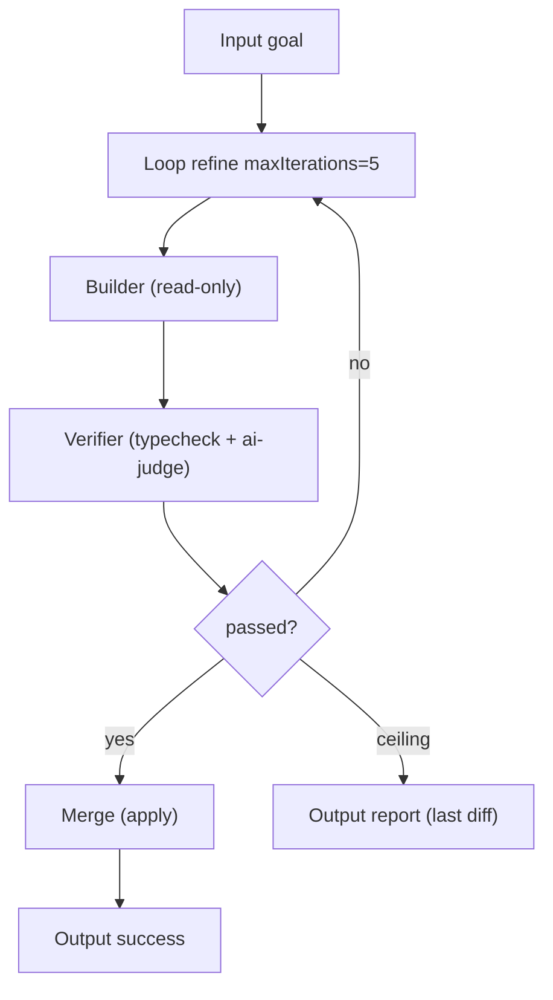
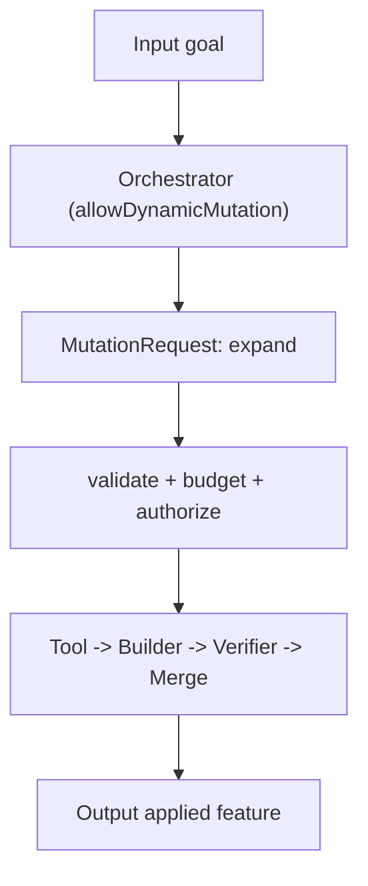
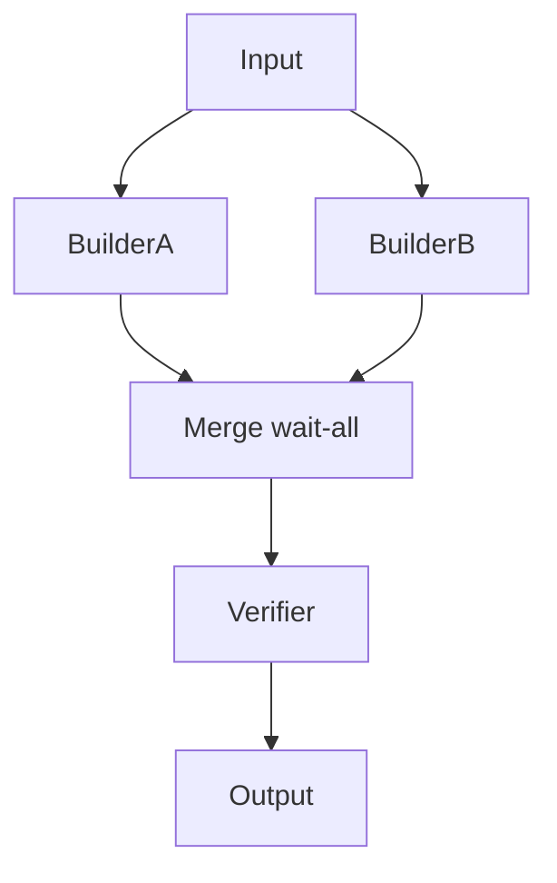

# WorkflowExamples Diagrams

## Example 3 — Refactor Refine Loop

## Example 4 — Dynamic Expansion

## Example 2 — Parallel Fan-Out and Join

## Related Documents

- [[06-workflow-engine/README]]
- [[WorkflowExamples-Part01]]
- [[WorkflowExamples-Part03]]
- [[WorkflowExamples-Part04]]
- [[LoopNodes-Part01]]
- [[DynamicGraphs-Part01]]
- [[BuilderNodes-Part01]]
