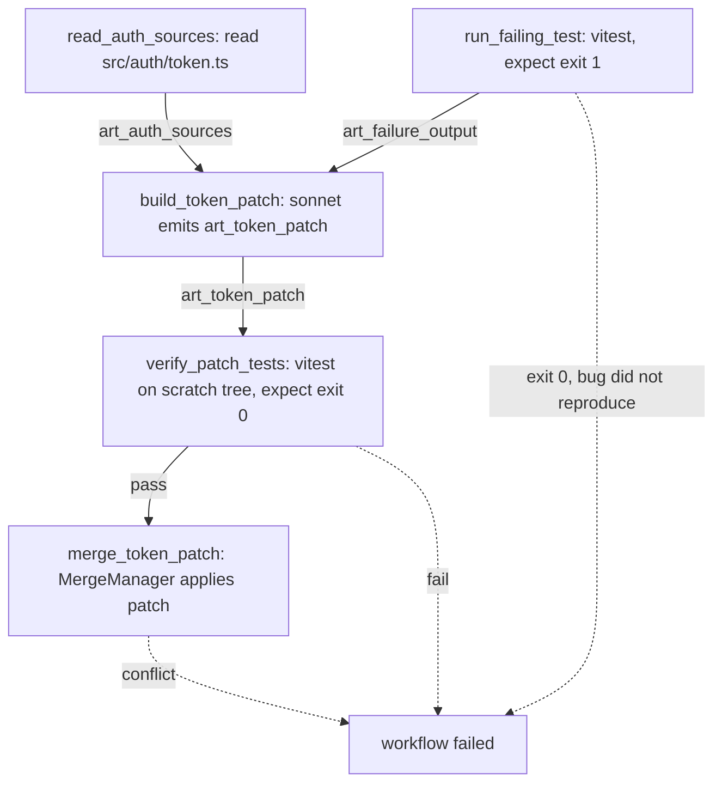

---
title: WorkflowExamples Specification - Part 01
status: draft
version: 1.0
tags:
  - workflow-engine
  - workflow-examples
  - architecture
related:
  - "[[06-workflow-engine/README]]"
  - "[[WorkflowEngine-Part01]]"
  - "[[NodeTypes-Part01]]"
  - "[[EdgeTypes-Part01]]"
  - "[[ExecutionFlow-Part01]]"
---

# WorkflowExamples Specification (Part 01)

## Document Index

```text
WorkflowExamples-Part01 - Entry point, object model, and Example 1: Fix a failing test
WorkflowExamples-Part02 - Example 2: Add a feature across N files (parallel fan-out and join)
WorkflowExamples-Part03 - Example 3: Refactor with a bounded refine loop
WorkflowExamples-Part04 - Example 4: Dynamic expansion (runtime graph extension)
WorkflowExamples-Part05 - Example 5: Human approval gate on a database migration
WorkflowExamples-Part06 - Example 6: MCP-backed research task, plus checklist sections
WorkflowExamples-Diagrams - Four representations per example, six sets total
```

# Purpose

WorkflowExamples is the concrete half of the workflow engine specification.

Every other topic in `06-workflow-engine` defines a shape: what a node is, what an edge is, how the scheduler picks ready nodes. None of them show a whole graph that a person could paste into Eulinx and run. This document does exactly that, six times.

```text
NodeTypes tells you a builder node exists.
WorkflowExamples shows you a builder node with a real prompt,
a real model id, a real timeout, real file paths, and the
exact edge that carries its artifact to a verifier.
```

This document is the acceptance test for the rest of the section. If a rule stated in [[WorkflowEngine-Part01]] cannot be exercised by one of these six graphs, either the rule is unimplementable or the examples are incomplete. Both are bugs.

# Core Philosophy

An example is not an illustration. An example is a specification with the abstraction removed.

Therefore every graph in this document is **literal**. Every node id is a real id. Every prompt is the actual string that would be sent to the model, not a description of a prompt. Every timeout is a number of milliseconds. Every threshold is a number. There is no `...`, no `<your prompt here>`, no "and so on".

```text
If a reader cannot copy the fenced block, paste it into Eulinx,
and watch it run, the example has failed.
```

The second philosophy is that examples must show failure. A graph that only demonstrates the happy path teaches nothing, because the happy path is not where implementers get things wrong. Every example in this document contains at least one tick where something goes wrong and the engine handles it, and every example ends with a named list of its failure cases.

# Definition

WorkflowExamples is a set of six complete, runnable workflow graphs, each accompanied by:

- a framing paragraph stating the user goal and why this graph shape and not another
- a literal graph definition in `ts`
- a mermaid rendering of that graph
- a tick-by-tick walkthrough of one real run, including a failure and its handling
- a named failure-case table for that graph

The six examples are chosen to cover the engine's full capability surface exactly once each:

```text
Example 1  linear pipeline, single builder, single verifier      Part 01
Example 2  parallel fan-out, join node, N-way merge              Part 02
Example 3  bounded loop, refine-until-verified                   Part 03
Example 4  dynamic graph extension at runtime                    Part 04
Example 5  human approval gate, pause and resume                 Part 05
Example 6  MCP tool nodes, external data                         Part 06
```

# Responsibilities

Every example in this document MUST:

- obey Worker -> Artifact -> Verify -> Merge; no node writes to the project directly
- use a verifier node that is a different node from the builder that produced the artifact
- route all mutation through the MergeManager, never through a builder's tool calls
- acquire locks through the LockManager before any node that mutates shared state
- gate every unsafe capability behind the PermissionManager, failing closed
- emit an EventBus event at every node start, node finish, artifact creation, verdict, and merge
- specify a wall-clock timeout in milliseconds on every node
- specify a retry policy on every node that calls a model or an external service

Every example in this document SHOULD:

- prefer the cheapest model that can do the node's job
- name its nodes after what they do, not after their type

Every example in this document MUST NOT:

- contain a placeholder value of any kind
- let a builder node's output become a command argument without validation
- let a node widen its own permissions
- show a merge that was not preceded by a passing verdict

# Workflow Object Model

Every example in this document is an instance of these types. They are restated here in full rather than referenced, because an implementer reading an example must not have to open another file to type the graph.

```ts
type WorkflowGraph = {
  workflowId: string;
  name: string;
  version: number;
  projectId: string;
  workspaceId: string;
  entryNodeIds: string[];
  nodes: WorkflowNode[];
  edges: WorkflowEdge[];
  budget: WorkflowBudget;
  createdAt: string;
};

type WorkflowBudget = {
  maxWallClockMs: number;
  maxCostUsd: number;
  maxTotalNodes: number;
  maxConcurrentWorkers: number;
};

type WorkflowNode = {
  id: string;
  type: NodeType;
  label: string;
  timeoutMs: number;
  retry: RetryPolicy;
  config: NodeConfig;
};

type NodeType =
  | "read"
  | "builder"
  | "verifier"
  | "condition"
  | "loop"
  | "join"
  | "merge"
  | "approval"
  | "mcp"
  | "orchestrator";

type RetryPolicy = {
  maxAttempts: number;
  backoffMs: number;
  retryOn: RetryReason[];
};

type RetryReason =
  | "model_timeout"
  | "model_rate_limited"
  | "model_transport_error"
  | "tool_transient_error"
  | "lock_contended";

type WorkflowEdge = {
  id: string;
  from: string;
  to: string;
  kind: EdgeKind;
  carries: string[];
  guard?: EdgeGuard;
};

type EdgeKind = "data" | "control" | "failure" | "loop_back";

type EdgeGuard = {
  expr: string;
};
```

The `carries` field lists artifact ids that flow along the edge. A node MUST NOT read an artifact that no inbound edge carries to it. This is the entire data-visibility model, and it is why a builder cannot silently read a verifier's private reasoning.

Node configs are discriminated by `type`. The three used in Example 1:

```ts
type ReadNodeConfig = {
  kind: "read";
  paths: string[];
  maxBytes: number;
  emitArtifactId: string;
};

type BuilderNodeConfig = {
  kind: "builder";
  modelId: string;
  systemPrompt: string;
  userPrompt: string;
  inputArtifactIds: string[];
  emitArtifactId: string;
  artifactKind: "patch" | "code" | "markdown" | "json";
  permissions: string[];
  maxTokens: number;
};

type VerifierNodeConfig = {
  kind: "verifier";
  strategy: "deterministic" | "ai" | "hybrid";
  command?: string;
  cwd?: string;
  expectExitCode?: number;
  modelId?: string;
  systemPrompt?: string;
  inputArtifactIds: string[];
  emitArtifactId: string;
  passThreshold: number;
};

type MergeNodeConfig = {
  kind: "merge";
  artifactIds: string[];
  requireVerdictArtifactIds: string[];
  lockPaths: string[];
  strategy: "apply_patch" | "three_way";
  onConflict: "abort" | "escalate_to_user";
};
```

`passThreshold` is only consulted when `strategy` is `"ai"` or `"hybrid"`. For `"deterministic"`, the exit code is authoritative and the threshold is ignored. AI verdicts are advisory; deterministic verification is authoritative. See [[VerifierNodes-Part01]].

# Node States

Every node in every example moves through this lifecycle. The engine's tick loop is defined in [[ExecutionFlow-Part01]]; the states are restated here because the walkthroughs use them by name.

```text
pending    -> node exists, inbound edges not yet satisfied
ready      -> all inbound edges satisfied, awaiting a worker slot
running    -> a Worker or a deterministic action is executing
succeeded  -> produced its emitArtifactId
failed     -> exhausted retries or hit a non-retryable error
skipped    -> an inbound guard evaluated false
cancelled  -> the workflow aborted before this node ran
```

# Invariants

```text
A node is ready only when every inbound control and data edge is satisfied.
A builder node never has its own artifact as an input to its own verifier check.
A verifier node's id is never equal to the id of the builder it verifies.
A merge node runs only if every id in requireVerdictArtifactIds resolved to pass.
A merge node holds every lock in lockPaths for the whole of its execution.
No node mutates the project outside a merge node.
Every node emits workflow.node.started and exactly one terminal node event.
The sum of node costs never exceeds budget.maxCostUsd; the engine aborts first.
An artifact is immutable once emitted. Refinement produces a new artifact id.
```

# Example 1: Fix a Failing Test

## Framing

The user's goal is the smallest real Eulinx task: "the test `src/auth/token.test.ts` is failing, find out why and fix it."

The solution shape is a linear pipeline. There is exactly one bug, in one area of the code, and the fix is small. Fanning out parallel builders would be pure overhead: there is nothing to parallelize, and two builders touching `src/auth/token.ts` would immediately contend on the same LockManager path.

A refine loop is also wrong here, and this is worth stating because it is the most common over-engineering mistake. The verifier for this task is `npm test`, which is deterministic and binary. Either the test passes or it does not. A loop is justified when a verifier returns a *score* that can improve across attempts; a loop around a pass/fail command just re-runs a failing model with the same context and burns budget. Example 3 shows the case where a loop is correct.

So: read the relevant files, let one builder produce a patch, run the test suite against the patched tree in a scratch workspace, and merge only if the suite goes green.

```text
read -> build patch -> verify by running tests -> merge
```

## The Graph

```ts
const fixFailingTest: WorkflowGraph = {
  workflowId: "wf_fix_token_test_001",
  name: "Fix failing token test",
  version: 1,
  projectId: "prj_eulinx_main",
  workspaceId: "ws_local_dev",
  entryNodeIds: ["read_auth_sources"],
  budget: {
    maxWallClockMs: 600000,
    maxCostUsd: 1.50,
    maxTotalNodes: 8,
    maxConcurrentWorkers: 1,
  },
  createdAt: "2026-07-17T09:00:00.000Z",
  nodes: [
    {
      id: "read_auth_sources",
      type: "read",
      label: "Read auth token source and test",
      timeoutMs: 15000,
      retry: { maxAttempts: 2, backoffMs: 500, retryOn: ["tool_transient_error"] },
      config: {
        kind: "read",
        paths: [
          "src/auth/token.ts",
          "src/auth/token.test.ts",
          "src/auth/clock.ts",
          "package.json",
        ],
        maxBytes: 262144,
        emitArtifactId: "art_auth_sources",
      },
    },
    {
      id: "run_failing_test",
      type: "verifier",
      label: "Capture the current failure output",
      timeoutMs: 120000,
      retry: { maxAttempts: 1, backoffMs: 0, retryOn: [] },
      config: {
        kind: "verifier",
        strategy: "deterministic",
        command: "npx vitest run src/auth/token.test.ts --reporter=verbose",
        cwd: "/workspace/ws_local_dev/prj_eulinx_main",
        expectExitCode: 1,
        inputArtifactIds: [],
        emitArtifactId: "art_failure_output",
        passThreshold: 0,
      },
    },
    {
      id: "build_token_patch",
      type: "builder",
      label: "Produce a patch that fixes the failing test",
      timeoutMs: 180000,
      retry: {
        maxAttempts: 3,
        backoffMs: 2000,
        retryOn: ["model_timeout", "model_rate_limited", "model_transport_error"],
      },
      config: {
        kind: "builder",
        modelId: "claude-sonnet-4-5",
        systemPrompt:
          "You are a Eulinx builder worker. You produce unified-diff patches and nothing else. " +
          "You MUST NOT write files. You MUST NOT run commands. Your only output is a patch " +
          "in unified diff format with correct file paths relative to the project root. " +
          "Do not modify test files unless the test itself is provably wrong; if you believe " +
          "the test is wrong, say so in a comment line at the top of your patch instead of " +
          "changing it.",
        userPrompt:
          "The test file src/auth/token.test.ts is failing. Below are the relevant sources " +
          "and the exact failure output from vitest.\n\n" +
          "Determine the root cause and produce a minimal unified diff that makes the test " +
          "pass without weakening it. Change as few lines as possible. Do not reformat " +
          "unrelated code. Do not add dependencies.\n\n" +
          "Output only the unified diff, starting with '--- a/' on the first line.",
        inputArtifactIds: ["art_auth_sources", "art_failure_output"],
        emitArtifactId: "art_token_patch",
        artifactKind: "patch",
        permissions: ["model.invoke", "artifact.emit"],
        maxTokens: 8000,
      },
    },
    {
      id: "verify_patch_tests",
      type: "verifier",
      label: "Run the full suite against the patched scratch tree",
      timeoutMs: 300000,
      retry: { maxAttempts: 2, backoffMs: 1000, retryOn: ["tool_transient_error"] },
      config: {
        kind: "verifier",
        strategy: "deterministic",
        command: "npx vitest run --reporter=json",
        cwd: "/workspace/ws_local_dev/scratch/wf_fix_token_test_001",
        expectExitCode: 0,
        inputArtifactIds: ["art_token_patch"],
        emitArtifactId: "art_test_verdict",
        passThreshold: 0,
      },
    },
    {
      id: "merge_token_patch",
      type: "merge",
      label: "Apply the verified patch to the project",
      timeoutMs: 30000,
      retry: { maxAttempts: 1, backoffMs: 0, retryOn: [] },
      config: {
        kind: "merge",
        artifactIds: ["art_token_patch"],
        requireVerdictArtifactIds: ["art_test_verdict"],
        lockPaths: ["src/auth/token.ts", "src/auth/clock.ts"],
        strategy: "apply_patch",
        onConflict: "escalate_to_user",
      },
    },
  ],
  edges: [
    {
      id: "e1",
      from: "read_auth_sources",
      to: "build_token_patch",
      kind: "data",
      carries: ["art_auth_sources"],
    },
    {
      id: "e2",
      from: "run_failing_test",
      to: "build_token_patch",
      kind: "data",
      carries: ["art_failure_output"],
    },
    {
      id: "e3",
      from: "build_token_patch",
      to: "verify_patch_tests",
      kind: "data",
      carries: ["art_token_patch"],
    },
    {
      id: "e4",
      from: "verify_patch_tests",
      to: "merge_token_patch",
      kind: "data",
      carries: ["art_token_patch", "art_test_verdict"],
      guard: { expr: "art_test_verdict.pass === true" },
    },
  ],
};
```

Note that `run_failing_test` has `expectExitCode: 1`. It is a verifier node used to assert that the bug *reproduces*. If the suite is already green, this node fails and the workflow stops, because there is nothing to fix and a builder given a green suite will invent a change. This is a deliberate use of a verifier as a precondition check.

Note also that `run_failing_test` has no inbound edge. It is not in `entryNodeIds` either, which means the engine treats it as ready at tick 0 alongside the entry node. A node with zero inbound edges is ready immediately; `entryNodeIds` exists only for documentation and UI focus, not for scheduling.

## Mermaid



## Tick-by-Tick Walkthrough

The engine's tick loop is: compute ready set, dispatch ready nodes up to `maxConcurrentWorkers`, await terminal events, update state, repeat. Ticks are logical, not fixed-duration.

```text
TICK 0
  Engine computes the ready set.
  read_auth_sources: 0 inbound edges -> ready
  run_failing_test:  0 inbound edges -> ready
  Everything else:   pending

  maxConcurrentWorkers is 1, but read and verifier nodes are deterministic
  actions, not Workers. They do not consume worker slots. Both dispatch.

  Emits: workflow.started(wf_fix_token_test_001)
         workflow.node.started(read_auth_sources)
         workflow.node.started(run_failing_test)

  State: 2 running, 3 pending.

TICK 1
  read_auth_sources completes in 240ms. It read 4 paths, 18.4 KB total,
  under the 262144 maxBytes cap. WorkspaceManager confirmed every path
  is inside the project boundary.

  Emits: artifact.created(art_auth_sources, kind=code, bytes=18841)
         workflow.node.succeeded(read_auth_sources)

  build_token_patch still pending: e2 not yet satisfied.

  State: 1 running, 1 succeeded, 3 pending.

TICK 2
  run_failing_test completes in 6.1s with exit code 1. Expected 1. Pass.
  stdout captured 2.9 KB, including:
    FAIL src/auth/token.test.ts > isExpired > returns true for a token 1s past exp
    AssertionError: expected false to be true

  Emits: artifact.created(art_failure_output, kind=markdown, bytes=2954)
         workflow.node.succeeded(run_failing_test)

  Ready set recomputed. build_token_patch now has e1 and e2 satisfied -> ready.

  State: 1 ready, 2 succeeded, 2 pending.

TICK 3
  Engine requests a worker slot. maxConcurrentWorkers is 1, 0 in use. Granted.
  WorkerSpawner creates worker_a3f9 bound to claude-sonnet-4-5 with the
  permission set ["model.invoke", "artifact.emit"] and nothing else.

  PermissionManager is consulted before the process starts. The builder has
  no fs.write and no process.exec. If the model emits a tool call for either,
  the call is denied and the denial is fed back to the model as a tool error.

  Emits: workflow.node.started(build_token_patch, attempt=1)
         worker.created(worker_a3f9)

  State: 1 running, 2 succeeded, 2 pending.

TICK 4  <-- SOMETHING GOES WRONG
  At 172s the provider returns HTTP 429 rate_limited. The node's timeoutMs
  is 180000 so the wall clock has not expired; this is a provider error,
  not a timeout.

  retryOn includes "model_rate_limited". attempt 1 of maxAttempts 3.

  Engine action, in order:
    1. Terminate worker_a3f9. A retried attempt gets a NEW worker.
       Workers are not reused across attempts; the failed attempt's
       partial context is discarded.
    2. Discard any partial output. No artifact was emitted, so there is
       nothing to garbage collect. Had a partial artifact existed it would
       be marked abandoned, never merged.
    3. Sleep backoffMs = 2000.
    4. Re-dispatch build_token_patch as attempt 2 with identical inputs.

  Emits: workflow.node.retrying(build_token_patch, attempt=1,
                                reason=model_rate_limited, nextAttempt=2)
         worker.terminated(worker_a3f9, reason=node_retry)

  Note what the engine does NOT do: it does not fall back to a different
  model, it does not reduce maxTokens, it does not truncate the prompt.
  Retry is a replay of the same attempt, not a renegotiation.

  State: 1 ready (retry pending backoff), 2 succeeded, 2 pending.

TICK 5
  Attempt 2 dispatches on worker_b7c1. Completes in 41s.
  The model emitted a unified diff changing 3 lines in src/auth/clock.ts:
  now() returned seconds where token.ts compared against milliseconds.

  ArtifactManager validates the output against artifactKind "patch":
  it must parse as a unified diff, every target path must exist in the
  project, and every target path must be inside the workspace boundary.
  All three checks pass.

  Emits: artifact.created(art_token_patch, kind=patch, files=1, lines=+3-3)
         workflow.node.succeeded(build_token_patch, attempt=2)
         worker.terminated(worker_b7c1, reason=task_completed)

  verify_patch_tests becomes ready via e3.

  State: 1 ready, 3 succeeded, 1 pending.

TICK 6
  verify_patch_tests dispatches. Before running, the engine materializes
  a scratch tree at /workspace/ws_local_dev/scratch/wf_fix_token_test_001
  as a copy-on-write clone of the project at the HEAD the workflow started
  from, then applies art_token_patch to the CLONE.

  This is the cardinal rule in action. The patch has not touched the real
  project. It is applied to a throwaway tree owned by the verifier.

  The verifier node is build_token_patch's verifier and its id differs from
  build_token_patch's id. A worker never verifies its own output. This node
  runs no model at all; it runs vitest.

  Emits: workflow.node.started(verify_patch_tests)

  State: 1 running, 3 succeeded, 1 pending.

TICK 7
  vitest exits 0 in 34s. 212 tests, 212 passed. Expected exit code 0. Pass.

  Emits: artifact.created(art_test_verdict, kind=json, pass=true)
         workflow.node.succeeded(verify_patch_tests)

  Edge e4 has guard art_test_verdict.pass === true. Evaluates true.
  merge_token_patch becomes ready.

  State: 1 ready, 4 succeeded, 0 pending.

TICK 8
  merge_token_patch dispatches.

    1. LockManager.acquire(["src/auth/token.ts", "src/auth/clock.ts"],
       owner=wf_fix_token_test_001, timeoutMs=30000). Both granted; no
       other workflow is running.
    2. Engine re-checks requireVerdictArtifactIds: art_test_verdict.pass
       is true. This check is repeated at merge time, not trusted from the
       edge guard, because the guard evaluated at tick 7 and state may have
       moved. Fail closed.
    3. MergeManager verifies the project HEAD still matches the HEAD the
       patch was generated against. It does. No three-way merge needed.
    4. Patch applied. 3 lines in src/auth/clock.ts.
    5. Locks released.

  Emits: lock.acquired(src/auth/token.ts), lock.acquired(src/auth/clock.ts)
         merge.applied(art_token_patch, files=1)
         lock.released x2
         workflow.node.succeeded(merge_token_patch)
         workflow.succeeded(wf_fix_token_test_001)

  Final state: 5 succeeded, 0 failed.
  Wall clock: 4m 51s of a 10m budget. Cost: $0.34 of $1.50.
```

## Failure Cases

```text
bug_did_not_reproduce
  run_failing_test exits 0 when expectExitCode is 1.
  Engine: fail the node, do not retry, abort the workflow.
  Rationale: the premise is false. A builder given a green suite invents
  a change and the verifier then proves nothing.
  Emits: workflow.node.failed(run_failing_test, reason=unexpected_exit_code)
         workflow.aborted(reason=precondition_failed)

read_path_outside_workspace
  A path in read_auth_sources.paths resolves outside the project root.
  Engine: WorkspaceManager rejects before any read. Node fails, not retryable.
  Emits: permission.denied(fs.read, path), workflow.aborted

read_exceeded_max_bytes
  The 4 paths total more than 262144 bytes.
  Engine: node fails. Do NOT silently truncate; a truncated source file
  makes the builder hallucinate the missing half.
  Emits: workflow.node.failed(read_auth_sources, reason=max_bytes_exceeded)

model_rate_limited
  Provider returns 429. Retryable. Up to 3 attempts, 2000ms backoff.
  New worker per attempt. Shown at tick 4 above.

model_timeout
  No completion within 180000ms. Retryable, same policy as above.
  The in-flight worker is terminated before the retry dispatches.

retries_exhausted
  Attempt 3 of build_token_patch also fails.
  Engine: node -> failed. No outbound edge is satisfied. verify_patch_tests
  and merge_token_patch -> cancelled. Workflow -> failed.
  Emits: workflow.node.failed(build_token_patch, attempts=3)
         workflow.failed(reason=node_failed)

patch_does_not_parse
  Model emitted prose instead of a unified diff.
  Engine: ArtifactManager rejects at artifact creation. This is NOT in
  retryOn, so it is not a transport retry; it is a bad output. The node
  fails. Example 3 shows the correct structure when you want the model
  to get another shot at a bad output: that is a loop, not a retry.
  Emits: artifact.rejected(art_token_patch, reason=malformed_patch)

patch_targets_unknown_file
  The diff references src/auth/tokens.ts which does not exist.
  Engine: ArtifactManager rejects. Node fails. Not retryable.
  Emits: artifact.rejected(reason=target_path_not_found)

patch_targets_outside_workspace
  The diff references ../../etc/hosts.
  Engine: WorkspaceManager path-boundary check rejects. Node fails.
  This is a security event, not a correctness event.
  Emits: permission.denied(fs.write, path), security.boundary_violation

verifier_fail
  vitest exits non-zero on the patched scratch tree.
  Engine: art_test_verdict.pass is false. Guard on e4 evaluates false.
  merge_token_patch -> skipped. Workflow -> failed.
  The patch is NEVER merged. The scratch tree is destroyed.
  Emits: artifact.created(art_test_verdict, pass=false)
         workflow.node.skipped(merge_token_patch, reason=guard_false)
         workflow.failed(reason=verification_failed)

verifier_timeout
  vitest does not finish within 300000ms.
  Engine: kill the process tree, node fails. retryOn does not include a
  timeout reason for this node, so no retry. Workflow fails.
  Rationale: a suite that hangs after a patch is evidence the patch hangs.

lock_contended
  Another workflow holds src/auth/token.ts at tick 8.
  Engine: block up to timeoutMs 30000, then fail the merge node.
  The artifact survives and remains mergeable later; nothing is lost.
  Emits: lock.contended(src/auth/token.ts, holder=wf_other_002)

head_moved_under_patch
  A human committed to src/auth/clock.ts between tick 5 and tick 8.
  Engine: MergeManager detects HEAD mismatch. strategy is apply_patch,
  which cannot rebase, so onConflict fires: escalate_to_user.
  The workflow pauses and surfaces the conflict in the UI.
  Emits: merge.conflict(art_token_patch), workflow.paused(reason=merge_conflict)

budget_exceeded
  Cumulative cost passes maxCostUsd 1.50 or wall clock passes 600000ms.
  Engine: abort immediately. Terminate every running worker. Release every
  lock. Do not merge anything, including artifacts that already passed
  verification.
  Emits: workflow.aborted(reason=budget_exceeded)
```

# AI Notes

Do not treat `run_failing_test` as optional. Implementers delete it because "we already know the test fails". You do not know that the test fails in the workspace, at this HEAD, with these dependencies installed. The node costs six seconds and it is the only thing standing between you and a builder that patches a bug that does not exist.

Do not merge the patch onto the real project and then run the tests. It is faster and it is wrong. Verification happens on a scratch clone. If you verify after merging, your rollback path is a git revert on a tree a human may already have pulled, and the cardinal rule is dead.

Do not reuse the worker across retry attempts. A worker that hit a 429 has partial context, a partially filled response buffer, and possibly a half-emitted artifact. Attempt 2 must start clean. This costs you the prompt tokens again. Pay them.

Do not confuse retry with refine. Retry re-runs an attempt that failed for a reason unrelated to the model's judgment: a timeout, a 429, a socket reset. Refine re-runs a model whose *output was bad* and feeds it the reason. They have different types, different budgets, and different termination conditions. Retry lives on the node. Refine is a loop, and it lives in Example 3. Putting `malformed_patch` in `retryOn` is the single most common way to build an infinite money incinerator.

Do not trust the edge guard at merge time. The guard evaluated at tick 7. The merge runs at tick 8. Re-check. Fail closed.

# Related Documents

- [[06-workflow-engine/README]]
- [[WorkflowExamples-Part02]]
- [[WorkflowExamples-Diagrams]]
- [[WorkflowEngine-Part01]]
- [[NodeTypes-Part01]]
- [[EdgeTypes-Part01]]
- [[ExecutionFlow-Part01]]
- [[BuilderNodes-Part01]]
- [[VerifierNodes-Part01]]
- [[MergeManager-Part01]]
- [[LockManager-Part01]]
- [[PermissionManager-Part01]]
- [[EventBus-Part01]]
