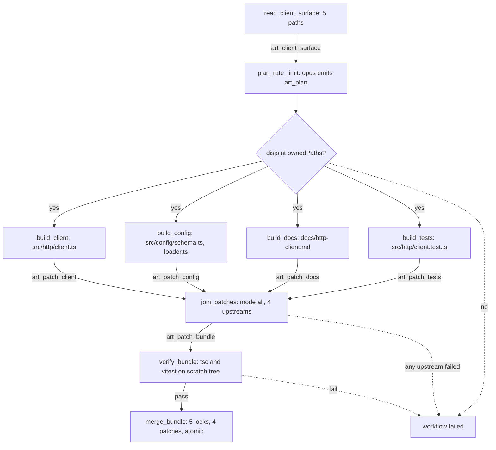

---
title: WorkflowExamples Specification - Part 02
status: draft
version: 1.0
tags:
  - workflow-engine
  - workflow-examples
  - architecture
related:
  - "[[WorkflowExamples-Part01]]"
  - "[[NodeTypes-Part01]]"
  - "[[EdgeTypes-Part01]]"
  - "[[LockManager-Part01]]"
---

# WorkflowExamples Specification (Part 02)

# Example 2: Add a Feature Across N Files

## Framing

The user's goal: "add a `rateLimit` option to the HTTP client, wire it through the config loader, document it, and cover it with tests."

This is four distinct edits in four different files. Unlike Example 1, the work genuinely decomposes: the config loader change does not depend on the docs change, and the client change does not depend on the test change beyond a shared interface. Four sequential builders would take four times as long for no benefit.

So the shape is fan-out. An orchestrator node reads the repo and produces a **plan**: a fixed list of scoped subtasks, each with an explicit file ownership set. Four builder nodes run in parallel, each producing a patch for its own files. A join node waits for all four. One verifier runs the whole suite against a scratch tree with all four patches applied. One merge node applies all four under a single lock acquisition.

Why not fan out and merge each patch independently as it finishes? Because the four changes are only correct together. Merging the client change without the config change leaves the project in a state where `rateLimit` is read from a config that cannot produce it. Partial merges of a decomposed feature are the fastest way to a broken main branch. The join node exists precisely to make the merge atomic.

Why a fixed plan rather than letting the orchestrator extend the graph at runtime? Because here the decomposition is knowable up front from a single read. Example 4 covers the case where it is not.

The critical constraint is **disjoint file ownership**. Two builders MUST NOT be allowed to emit patches touching the same file. If they do, the merge node gets two conflicting diffs against the same base and there is no principled resolution. The orchestrator's plan is validated for disjointness before any builder is dispatched, and the plan is rejected if it is not disjoint.

```text
orchestrate plan -> 4 parallel builders -> join -> verify all -> merge all
```

## The Graph

```ts
type OrchestratorNodeConfig = {
  kind: "orchestrator";
  modelId: string;
  systemPrompt: string;
  userPrompt: string;
  inputArtifactIds: string[];
  emitArtifactId: string;
  planSchema: "subtask_list_v1";
  maxSubtasks: number;
  requireDisjointFileOwnership: boolean;
  maxTokens: number;
};

type JoinNodeConfig = {
  kind: "join";
  waitFor: string[];
  mode: "all" | "quorum";
  quorum?: number;
  onUpstreamFailure: "fail_fast" | "collect_and_fail" | "proceed_with_partial";
  emitArtifactId: string;
};

// The plan artifact this orchestrator emits conforms to subtask_list_v1:
type SubtaskListV1 = {
  schema: "subtask_list_v1";
  subtasks: {
    subtaskId: string;
    objective: string;
    ownedPaths: string[];
    readOnlyPaths: string[];
  }[];
};

const addRateLimitFeature: WorkflowGraph = {
  workflowId: "wf_add_rate_limit_002",
  name: "Add rateLimit option across HTTP client, config, docs, tests",
  version: 1,
  projectId: "prj_eulinx_main",
  workspaceId: "ws_local_dev",
  entryNodeIds: ["read_client_surface"],
  budget: {
    maxWallClockMs: 1200000,
    maxCostUsd: 6.00,
    maxTotalNodes: 12,
    maxConcurrentWorkers: 4,
  },
  createdAt: "2026-07-17T10:00:00.000Z",
  nodes: [
    {
      id: "read_client_surface",
      type: "read",
      label: "Read the HTTP client, config loader, and their tests",
      timeoutMs: 20000,
      retry: { maxAttempts: 2, backoffMs: 500, retryOn: ["tool_transient_error"] },
      config: {
        kind: "read",
        paths: [
          "src/http/client.ts",
          "src/http/client.test.ts",
          "src/config/loader.ts",
          "src/config/schema.ts",
          "docs/http-client.md",
        ],
        maxBytes: 524288,
        emitArtifactId: "art_client_surface",
      },
    },
    {
      id: "plan_rate_limit",
      type: "orchestrator",
      label: "Decompose the feature into disjoint subtasks",
      timeoutMs: 120000,
      retry: {
        maxAttempts: 2,
        backoffMs: 3000,
        retryOn: ["model_timeout", "model_rate_limited", "model_transport_error"],
      },
      config: {
        kind: "orchestrator",
        modelId: "claude-opus-4-1",
        systemPrompt:
          "You are a Eulinx orchestrator. You do not write code. You produce a JSON plan " +
          "conforming to the subtask_list_v1 schema and nothing else. Every subtask must " +
          "declare ownedPaths, the files it alone may modify. ownedPaths across all subtasks " +
          "MUST be pairwise disjoint: no file may appear in two subtasks. readOnlyPaths may " +
          "overlap freely. If the work cannot be decomposed into disjoint file sets, emit a " +
          "single subtask owning all the files.",
        userPrompt:
          "Goal: add a `rateLimit` option to the HTTP client. It takes a requests-per-second " +
          "number, defaults to unlimited when absent, must be settable via the config file " +
          "under `http.rateLimit`, must be documented, and must be covered by tests.\n\n" +
          "The current sources are attached. Decompose this into at most 4 subtasks with " +
          "pairwise-disjoint ownedPaths. Each objective must be a complete, self-contained " +
          "instruction: a builder will receive only its own objective plus the sources, and " +
          "will not see the other subtasks.\n\n" +
          "Output only JSON conforming to subtask_list_v1.",
        inputArtifactIds: ["art_client_surface"],
        emitArtifactId: "art_plan",
        planSchema: "subtask_list_v1",
        maxSubtasks: 4,
        requireDisjointFileOwnership: true,
        maxTokens: 4000,
      },
    },
    {
      id: "build_client",
      type: "builder",
      label: "Implement rateLimit in the HTTP client",
      timeoutMs: 240000,
      retry: {
        maxAttempts: 3,
        backoffMs: 2000,
        retryOn: ["model_timeout", "model_rate_limited", "model_transport_error"],
      },
      config: {
        kind: "builder",
        modelId: "claude-sonnet-4-5",
        systemPrompt:
          "You are a Eulinx builder worker. You emit a unified diff and nothing else. You MUST " +
          "NOT write files or run commands. You MUST NOT emit a diff touching any path " +
          "outside your ownedPaths; a diff that does will be rejected and your work discarded.",
        userPrompt:
          "Your subtask: implement the `rateLimit` option in the HTTP client.\n\n" +
          "You own: src/http/client.ts\n" +
          "You may read but MUST NOT modify: src/config/schema.ts, src/config/loader.ts\n\n" +
          "Add an optional `rateLimit?: number` to the client options, interpreted as maximum " +
          "requests per second. When absent or undefined, impose no limit. When present, delay " +
          "outbound requests so the rate is not exceeded, using a token bucket with a burst " +
          "size equal to the limit. Do not add dependencies; implement the bucket inline. " +
          "Preserve the existing public API exactly; this option is additive.\n\n" +
          "Output only a unified diff starting with '--- a/src/http/client.ts'.",
        inputArtifactIds: ["art_client_surface", "art_plan"],
        emitArtifactId: "art_patch_client",
        artifactKind: "patch",
        permissions: ["model.invoke", "artifact.emit"],
        maxTokens: 12000,
      },
    },
    {
      id: "build_config",
      type: "builder",
      label: "Wire http.rateLimit through the config loader and schema",
      timeoutMs: 240000,
      retry: {
        maxAttempts: 3,
        backoffMs: 2000,
        retryOn: ["model_timeout", "model_rate_limited", "model_transport_error"],
      },
      config: {
        kind: "builder",
        modelId: "claude-sonnet-4-5",
        systemPrompt:
          "You are a Eulinx builder worker. You emit a unified diff and nothing else. You MUST " +
          "NOT write files or run commands. You MUST NOT emit a diff touching any path " +
          "outside your ownedPaths.",
        userPrompt:
          "Your subtask: expose the HTTP client's rateLimit option through configuration.\n\n" +
          "You own: src/config/schema.ts, src/config/loader.ts\n" +
          "You may read but MUST NOT modify: src/http/client.ts\n\n" +
          "Add `http.rateLimit` to the config schema as an optional positive number. Reject " +
          "zero, negative values, and non-integers at validation time with a clear error " +
          "message naming the offending key. Thread the parsed value through the loader so a " +
          "caller constructing the HTTP client receives it. Absent means undefined, not zero.\n\n" +
          "Output only a unified diff.",
        inputArtifactIds: ["art_client_surface", "art_plan"],
        emitArtifactId: "art_patch_config",
        artifactKind: "patch",
        permissions: ["model.invoke", "artifact.emit"],
        maxTokens: 12000,
      },
    },
    {
      id: "build_docs",
      type: "builder",
      label: "Document the rateLimit option",
      timeoutMs: 120000,
      retry: {
        maxAttempts: 3,
        backoffMs: 2000,
        retryOn: ["model_timeout", "model_rate_limited", "model_transport_error"],
      },
      config: {
        kind: "builder",
        modelId: "claude-haiku-4-5",
        systemPrompt:
          "You are a Eulinx builder worker. You emit a unified diff and nothing else. You MUST " +
          "NOT write files or run commands.",
        userPrompt:
          "Your subtask: document the new `rateLimit` HTTP client option.\n\n" +
          "You own: docs/http-client.md\n" +
          "You may read but MUST NOT modify: src/http/client.ts, src/config/schema.ts\n\n" +
          "Add a section documenting `rateLimit`: what it does (maximum requests per second), " +
          "its type (optional positive integer), its default (unlimited when absent), how to " +
          "set it in the config file (under `http.rateLimit`), and one worked example. Match " +
          "the heading level and prose style of the surrounding document exactly.\n\n" +
          "Output only a unified diff starting with '--- a/docs/http-client.md'.",
        inputArtifactIds: ["art_client_surface", "art_plan"],
        emitArtifactId: "art_patch_docs",
        artifactKind: "patch",
        permissions: ["model.invoke", "artifact.emit"],
        maxTokens: 6000,
      },
    },
    {
      id: "build_tests",
      type: "builder",
      label: "Cover rateLimit with tests",
      timeoutMs: 240000,
      retry: {
        maxAttempts: 3,
        backoffMs: 2000,
        retryOn: ["model_timeout", "model_rate_limited", "model_transport_error"],
      },
      config: {
        kind: "builder",
        modelId: "claude-sonnet-4-5",
        systemPrompt:
          "You are a Eulinx builder worker. You emit a unified diff and nothing else. You MUST " +
          "NOT write files or run commands.",
        userPrompt:
          "Your subtask: add tests for the new `rateLimit` HTTP client option.\n\n" +
          "You own: src/http/client.test.ts\n" +
          "You may read but MUST NOT modify: src/http/client.ts, src/config/schema.ts\n\n" +
          "Add vitest cases covering: rateLimit absent imposes no delay; rateLimit of 2 allows " +
          "a burst of 2 immediate requests then delays the third by at least 500ms; rateLimit " +
          "of 0 is rejected by config validation. Use vitest fake timers, not real sleeps; a " +
          "test that actually waits 500ms will be rejected in review. Follow the existing " +
          "describe/it structure in this file.\n\n" +
          "Output only a unified diff starting with '--- a/src/http/client.test.ts'.",
        inputArtifactIds: ["art_client_surface", "art_plan"],
        emitArtifactId: "art_patch_tests",
        artifactKind: "patch",
        permissions: ["model.invoke", "artifact.emit"],
        maxTokens: 12000,
      },
    },
    {
      id: "join_patches",
      type: "join",
      label: "Wait for all four builders",
      timeoutMs: 300000,
      retry: { maxAttempts: 1, backoffMs: 0, retryOn: [] },
      config: {
        kind: "join",
        waitFor: ["build_client", "build_config", "build_docs", "build_tests"],
        mode: "all",
        onUpstreamFailure: "collect_and_fail",
        emitArtifactId: "art_patch_bundle",
      },
    },
    {
      id: "verify_bundle",
      type: "verifier",
      label: "Typecheck and test the fully patched scratch tree",
      timeoutMs: 420000,
      retry: { maxAttempts: 2, backoffMs: 1000, retryOn: ["tool_transient_error"] },
      config: {
        kind: "verifier",
        strategy: "deterministic",
        command: "npx tsc --noEmit && npx vitest run --reporter=json",
        cwd: "/workspace/ws_local_dev/scratch/wf_add_rate_limit_002",
        expectExitCode: 0,
        inputArtifactIds: ["art_patch_bundle"],
        emitArtifactId: "art_bundle_verdict",
        passThreshold: 0,
      },
    },
    {
      id: "merge_bundle",
      type: "merge",
      label: "Apply all four patches atomically",
      timeoutMs: 60000,
      retry: { maxAttempts: 1, backoffMs: 0, retryOn: [] },
      config: {
        kind: "merge",
        artifactIds: [
          "art_patch_client",
          "art_patch_config",
          "art_patch_docs",
          "art_patch_tests",
        ],
        requireVerdictArtifactIds: ["art_bundle_verdict"],
        lockPaths: [
          "src/http/client.ts",
          "src/http/client.test.ts",
          "src/config/loader.ts",
          "src/config/schema.ts",
          "docs/http-client.md",
        ],
        strategy: "apply_patch",
        onConflict: "escalate_to_user",
      },
    },
  ],
  edges: [
    { id: "e1", from: "read_client_surface", to: "plan_rate_limit", kind: "data", carries: ["art_client_surface"] },
    { id: "e2", from: "plan_rate_limit", to: "build_client", kind: "data", carries: ["art_plan", "art_client_surface"] },
    { id: "e3", from: "plan_rate_limit", to: "build_config", kind: "data", carries: ["art_plan", "art_client_surface"] },
    { id: "e4", from: "plan_rate_limit", to: "build_docs", kind: "data", carries: ["art_plan", "art_client_surface"] },
    { id: "e5", from: "plan_rate_limit", to: "build_tests", kind: "data", carries: ["art_plan", "art_client_surface"] },
    { id: "e6", from: "build_client", to: "join_patches", kind: "data", carries: ["art_patch_client"] },
    { id: "e7", from: "build_config", to: "join_patches", kind: "data", carries: ["art_patch_config"] },
    { id: "e8", from: "build_docs", to: "join_patches", kind: "data", carries: ["art_patch_docs"] },
    { id: "e9", from: "build_tests", to: "join_patches", kind: "data", carries: ["art_patch_tests"] },
    { id: "e10", from: "join_patches", to: "verify_bundle", kind: "data", carries: ["art_patch_bundle"] },
    {
      id: "e11",
      from: "verify_bundle",
      to: "merge_bundle",
      kind: "data",
      carries: ["art_patch_bundle", "art_bundle_verdict"],
      guard: { expr: "art_bundle_verdict.pass === true" },
    },
  ],
};
```

Note the model choice per builder. `build_docs` uses haiku because writing a documentation section from an explicit outline is not a reasoning task. `plan_rate_limit` uses opus because decomposition errors are the expensive kind: a bad plan wastes four builders. Match the model to the cost of being wrong, not to the size of the file.

Note that every builder's `userPrompt` restates its `ownedPaths` inline even though `art_plan` already contains them. Builders are not required to parse the plan JSON to find their own row. Restating is cheap; a builder that grabbed the wrong subtask's row is not.

## Mermaid



## Tick-by-Tick Walkthrough

```text
TICK 0
  read_client_surface: 0 inbound -> ready. Dispatch.
  Emits: workflow.started(wf_add_rate_limit_002)
         workflow.node.started(read_client_surface)

TICK 1
  Read completes in 310ms. 5 paths, 41.2 KB, under the 524288 cap.
  Emits: artifact.created(art_client_surface, kind=code, bytes=42188)
         workflow.node.succeeded(read_client_surface)
  plan_rate_limit ready via e1.

TICK 2
  plan_rate_limit dispatches on worker_p001, bound to claude-opus-4-1.
  Emits: workflow.node.started(plan_rate_limit, attempt=1)

TICK 3
  Opus returns in 28s with JSON. The engine validates it in three stages,
  in this order, before ANY builder is dispatched:

    1. Schema validation against subtask_list_v1. Passes.
    2. maxSubtasks check: 4 subtasks, limit is 4. Passes.
    3. Disjointness check, because requireDisjointFileOwnership is true.
       Build a Map<path, subtaskId> over every ownedPaths entry of every
       subtask. If a path is already present with a different subtaskId,
       the plan is REJECTED.

  Result:
    st_client  owns src/http/client.ts
    st_config  owns src/config/schema.ts, src/config/loader.ts
    st_docs    owns docs/http-client.md
    st_tests   owns src/http/client.test.ts

  Pairwise disjoint. Plan accepted.

  Emits: artifact.created(art_plan, kind=json, subtasks=4)
         workflow.node.succeeded(plan_rate_limit)

  Edges e2..e5 all satisfied. Four builders become ready simultaneously.

TICK 4
  maxConcurrentWorkers is 4. Four slots free. All four dispatch.

  Each builder gets its own Worker with its own permission set. None of
  them has fs.write. None has process.exec. They emit patches; they do
  not apply them. This is why four workers touching four files need no
  locks: none of them touches a file.

  Emits: workflow.node.started(build_client, attempt=1)
         workflow.node.started(build_config, attempt=1)
         workflow.node.started(build_docs, attempt=1)
         workflow.node.started(build_tests, attempt=1)
         worker.created x4

  State: 4 running, 2 succeeded, 3 pending.

TICK 5
  build_docs finishes first at 19s. Haiku, small file, expected.
  Emits: artifact.created(art_patch_docs, kind=patch, files=1, lines=+31-0)
         workflow.node.succeeded(build_docs)
         worker.terminated(worker_d004, reason=task_completed)

  join_patches stays pending. mode is "all". One of four is not all.

TICK 6
  build_config finishes at 74s.
  Emits: artifact.created(art_patch_config, kind=patch, files=2, lines=+38-4)
         workflow.node.succeeded(build_config)

TICK 7  <-- SOMETHING GOES WRONG
  build_client finishes at 96s and emits a diff. ArtifactManager validates
  it against artifactKind "patch" and against the builder's ownedPaths.

  The diff touches TWO files:
    --- a/src/http/client.ts        <-- owned. legal.
    --- a/src/config/schema.ts      <-- NOT owned. ILLEGAL.

  The model decided it also needed to add the schema field, which is
  build_config's job. It is not wrong that the field is needed. It is
  wrong that this builder wrote it.

  Engine action, in order:
    1. REJECT the artifact. It is never created. art_patch_client does
       not exist. Nothing partial is retained.
    2. This is an ownership violation, not a transport error, so it is
       NOT in retryOn. The node does not retry.
    3. build_client -> failed.

  Emits: artifact.rejected(art_patch_client,
                           reason=path_outside_owned_set,
                           offendingPath=src/config/schema.ts,
                           ownedPaths=[src/http/client.ts])
         workflow.node.failed(build_client, reason=ownership_violation)
         worker.terminated(worker_c002, reason=node_failed)

  Why not just let it through? Because build_config also patched
  src/config/schema.ts. Two diffs, same file, same base. The merge node
  would have to pick one, and picking is a design decision the runtime
  is not allowed to make. Fail closed.

  Why not retry with a sterner prompt? Because retry replays an attempt
  identically; it does not carry feedback. Feeding the violation back to
  the model is refinement, and refinement is a loop. See Example 3. This
  graph has no loop, so this failure is terminal.

TICK 8
  build_tests finishes at 121s, cleanly, owning only its file.
  Emits: artifact.created(art_patch_tests, kind=patch, files=1, lines=+64-0)
         workflow.node.succeeded(build_tests)

  All four upstreams of join_patches are now terminal:
    build_client  failed
    build_config  succeeded
    build_docs    succeeded
    build_tests   succeeded

TICK 9
  join_patches evaluates. mode is "all"; not all succeeded.
  onUpstreamFailure is "collect_and_fail", so the join waited for every
  upstream to reach a terminal state before failing, rather than firing
  the moment build_client failed at tick 7.

  This is deliberate. "fail_fast" would have killed build_tests mid-flight
  at tick 7 and thrown away 90 seconds of nearly complete work. With
  "collect_and_fail" the three good artifacts survive in the ArtifactManager,
  attached to the failed run. A human can inspect them, and a re-run can be
  seeded with them rather than regenerating them.

  join_patches -> failed.

  Emits: workflow.node.failed(join_patches,
                              reason=upstream_failed,
                              failedUpstreams=["build_client"],
                              succeededUpstreams=["build_config","build_docs","build_tests"])

TICK 10
  verify_bundle and merge_bundle have no satisfied inbound edge and can
  never get one. Both -> cancelled.

  Nothing was merged. The project is byte-identical to how it started.
  The three good patches are retained as orphaned artifacts.

  Emits: workflow.node.cancelled(verify_bundle, reason=upstream_failed)
         workflow.node.cancelled(merge_bundle, reason=upstream_failed)
         workflow.failed(wf_add_rate_limit_002, reason=join_upstream_failed)

  Wall clock: 2m 31s of a 20m budget. Cost: $2.11 of $6.00.

TICK 10' (the counterfactual: what tick 7 looks like when it succeeds)
  Had build_client emitted a legal single-file diff, join_patches would
  fire at tick 8 with all four succeeded, bundling the four patch artifact
  ids into art_patch_bundle. The bundle is a manifest, not a merged diff;
  it does not concatenate the patches.

  verify_bundle then materializes ONE scratch tree and applies all four
  patches to it in a deterministic order: sorted by artifact id, so the
  run is replayable. tsc and vitest run against that tree. If tsc passes
  and 247 tests pass, art_bundle_verdict.pass is true.

  merge_bundle then acquires all 5 locks in sorted path order (sorted to
  prevent deadlock against any other workflow acquiring an overlapping
  set), re-checks the verdict, applies all four patches to the real
  project, and releases the locks. If ANY patch fails to apply, the whole
  merge rolls back. There is no partial feature.
```

## Failure Cases

```text
plan_not_disjoint
  Two subtasks list the same path in ownedPaths.
  Engine: reject art_plan at validation. Do NOT dispatch any builder.
  requireDisjointFileOwnership is true, so this is fatal, not a warning.
  Not retryable: the model already had the disjointness rule in its system
  prompt and violated it.
  Emits: artifact.rejected(art_plan, reason=overlapping_owned_paths,
                           conflictPath=..., subtasks=[...])
         workflow.failed(reason=plan_invalid)

plan_exceeds_max_subtasks
  Orchestrator emits 7 subtasks, maxSubtasks is 4.
  Engine: reject the plan. Do not truncate to the first 4; a truncated
  decomposition is an incomplete feature that will still pass the graph.
  Emits: artifact.rejected(art_plan, reason=max_subtasks_exceeded)

plan_malformed_json
  Orchestrator emits prose or invalid JSON.
  Engine: schema validation fails. Node fails. Not in retryOn.
  Emits: artifact.rejected(art_plan, reason=schema_violation)

plan_references_nonexistent_path
  A subtask owns src/http/clients.ts which does not exist.
  Engine: reject the plan. Every ownedPaths entry MUST resolve to an
  existing file or to a path whose parent directory exists (new files
  are legal; new files in nonexistent directories are not).
  Emits: artifact.rejected(art_plan, reason=owned_path_not_found)

builder_ownership_violation
  A builder emits a diff touching a path outside its ownedPaths.
  Engine: reject the artifact, fail the node, no retry. Shown at tick 7.
  Emits: artifact.rejected(reason=path_outside_owned_set)

builder_partial_failure
  One of four builders fails; the other three succeed.
  Engine: onUpstreamFailure is "collect_and_fail". Let the survivors finish.
  Fail the join. Cancel everything downstream. Merge NOTHING.
  Retain the good artifacts as orphans for inspection and re-seeding.
  Emits: workflow.node.failed(join_patches, failedUpstreams=[...])

worker_slot_starvation
  maxConcurrentWorkers is lowered to 2 while 4 builders are ready.
  Engine: dispatch 2, hold 2 in ready. As each finishes, dispatch the next.
  The join's timeoutMs of 300000 is wall clock from when the join node
  became reachable, and serialization can blow it. Size maxConcurrentWorkers
  to the fan-out width or raise the join timeout.
  Emits: workflow.node.queued(build_docs, reason=no_worker_slot)

join_timeout
  join_patches waits longer than 300000ms for its upstreams.
  Engine: fail the join. Terminate every still-running upstream worker.
  Cancel downstream. Retain any artifacts already emitted.
  Emits: workflow.node.failed(join_patches, reason=timeout)
         worker.terminated(..., reason=join_timeout)

bundle_verify_fail_typecheck
  tsc fails on the combined tree: build_client's option type and
  build_config's schema type disagree. Each patch is individually fine;
  together they do not compile.
  Engine: art_bundle_verdict.pass is false. Guard on e11 false.
  merge_bundle -> skipped. Workflow -> failed.
  This is exactly why verification is on the BUNDLE and not per-patch.
  Per-patch verification would have passed both and broken main.
  Emits: artifact.created(art_bundle_verdict, pass=false, stage=tsc)

bundle_verify_fail_tests
  tsc passes, vitest fails.
  Engine: same as above. Nothing merges.
  Emits: artifact.created(art_bundle_verdict, pass=false, stage=vitest)

patch_apply_conflict_in_scratch
  Two patches both modify the same hunk of a file despite disjoint
  ownership, because a builder ignored its ownedPaths and the ownership
  check somehow passed.
  Engine: patch application to the scratch tree fails. verify_bundle
  fails before running any command. This is a defense-in-depth catch;
  if it ever fires, the ownership check has a bug.
  Emits: workflow.node.failed(verify_bundle, reason=patch_apply_conflict)

lock_acquisition_deadlock
  Another workflow holds src/config/loader.ts and wants src/http/client.ts
  while this one holds client.ts and wants loader.ts.
  Engine: prevented structurally. All lockPaths are acquired in sorted
  order by every merge node in Eulinx. Sorted acquisition order makes a
  cycle impossible. If the timeout still fires, it is contention, not
  deadlock: fail the merge, release everything held, retain the artifacts.
  Emits: lock.contended(path, holder=wf_other)
         workflow.node.failed(merge_bundle, reason=lock_timeout)

partial_merge_applied
  A patch fails to apply midway through merge_bundle after two others
  already applied.
  Engine: roll back every applied patch in reverse order. The merge is
  atomic or it did not happen. Then escalate per onConflict.
  Emits: merge.rolled_back(applied=[art_patch_docs, art_patch_config])
         merge.conflict(art_patch_client)
         workflow.paused(reason=merge_conflict)

budget_exceeded_mid_fanout
  Four parallel opus-class builders blow maxCostUsd 6.00 at tick 5.
  Engine: abort immediately. Terminate all four workers. Merge nothing,
  including artifacts that already passed verification.
  Emits: workflow.aborted(reason=budget_exceeded, spentUsd=6.02)
```

# AI Notes

Do not merge each patch as it becomes available. The throughput instinct is strong and it is wrong. A decomposed feature is correct only as a unit; the join node is the whole reason the fan-out is safe.

Do not skip the disjointness check because "the orchestrator was told to make them disjoint". The orchestrator is an AI. The check is deterministic infrastructure. Deterministic infrastructure does not trust AI output, and that sentence is the entire architecture of Eulinx in eleven words.

Do not use `fail_fast` on the join because it sounds efficient. It kills in-flight builders whose artifacts you will want when a human re-runs the task. `collect_and_fail` costs you the tail latency of one already-running node and saves you the money of regenerating three artifacts.

Do not verify per patch. Four patches that each pass alone and fail together is not an edge case; it is the normal outcome of splitting a typed interface across two builders. The bundle is the unit of verification because the bundle is the unit of merge.

Do not acquire locks in the order they appear in `lockPaths`. Sort them. An unsorted acquisition across two concurrent merge nodes with overlapping path sets is a textbook deadlock, and it will happen the first time two of these workflows run at once.

Do not give the builders `fs.write` "so they can just make the change". Then there is no artifact, no verification, no scratch tree, and no rollback, and four AI processes are editing the user's repository simultaneously with no lock. This is the failure mode the entire product exists to prevent.

# Related Documents

- [[WorkflowExamples-Part01]]
- [[WorkflowExamples-Part03]]
- [[WorkflowExamples-Diagrams]]
- [[WorkflowEngine-Part01]]
- [[NodeTypes-Part01]]
- [[EdgeTypes-Part01]]
- [[BuilderNodes-Part01]]
- [[VerifierNodes-Part01]]
- [[MergeManager-Part01]]
- [[LockManager-Part01]]
- [[EventBus-Part01]]
