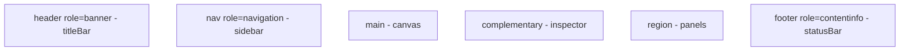
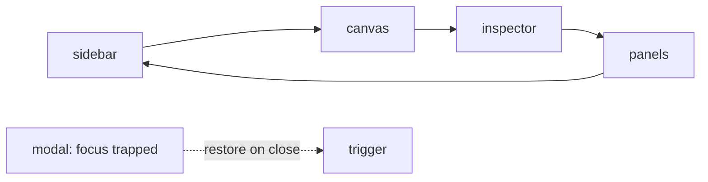
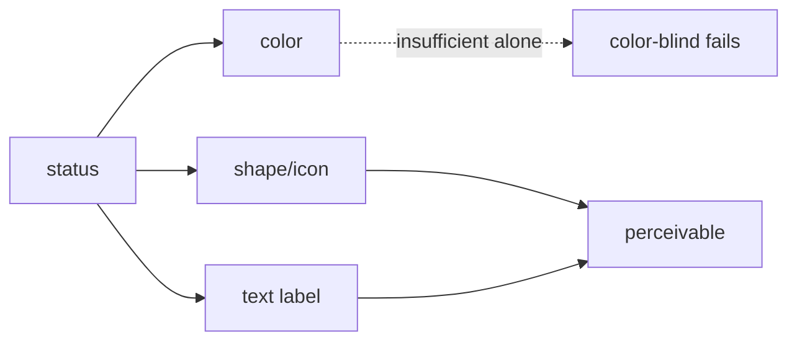
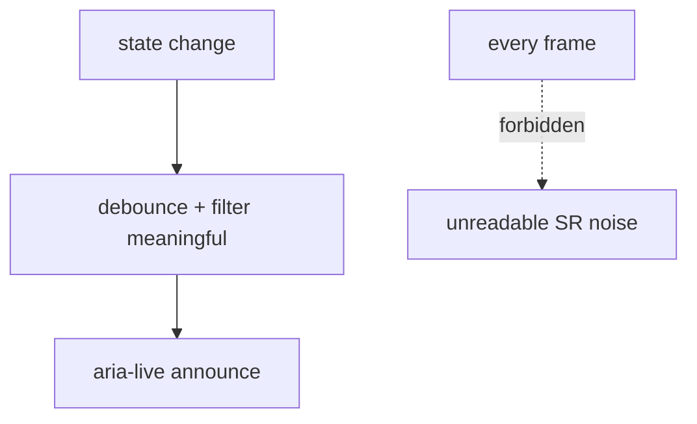

# Accessibility Diagrams

These diagrams show the landmark model, the focus cycle, the no-color-alone rule, and the reduced-motion/live-region flow.

## Landmark Model (one each)



## Focus Cycle



## No Color Alone



## Reduced Motion

```mermaid
flowchart TD
  OS[@media reduce] --> OV[tokens -> 0ms]
  OV --> LOOPS[stop pulse/edge-flow]
  OV --> TRANS[instant transitions]
  STATUS[status by color survives] --> OK[info preserved]
```

## Live Region Discipline



## Related Documents

- [[07-ui-ux/README]]
- [[Accessibility-Part01]]
- [[Accessibility-Part02]]
- [[Accessibility-Part03]]
- [[Accessibility-Part04]]
- [[Accessibility-Part05]]
- [[Accessibility-Part06]]
- [[WorkspaceLayout-Part01]]
- [[WorkspaceLayout-Part06]]
- [[KeyboardShortcuts-Part01]]
- [[NodeGraph-Part07]]
- [[TerminalView-Part06]]
- [[Animations-Part03]]
- [[DesignTokens-Part03]]
