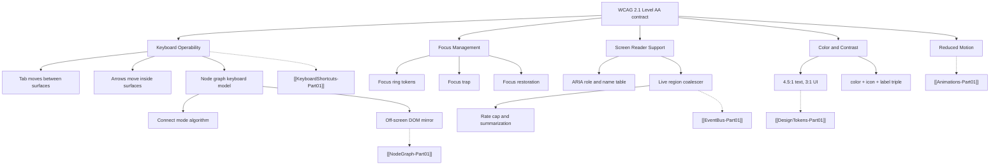

---
title: Accessibility Specification - Part 01
status: draft
version: 1.0
tags:
  - ui-ux
  - accessibility
  - a11y
  - architecture
related:
  - "[[07-ui-ux/README]]"
  - "[[DesignTokens-Part01]]"
  - "[[Themes-Part01]]"
  - "[[KeyboardShortcuts-Part01]]"
  - "[[NodeGraph-Part01]]"
---

# Accessibility Specification (Part 01)

## Document Index

Part 01 - Purpose, the WCAG 2.1 AA contract, scope, object model, and invariants
Part 02 - Keyboard operability for every surface, including the node graph canvas and keyboard connect mode
Part 03 - Focus management: rings, restoration, traps, async arrival, removal edge cases
Part 04 - Screen reader support: the ARIA role and label table, and live region coalescing
Part 05 - Contrast, non-color signalling, reduced motion, testing checklist, worked examples
Diagrams - Accessibility-Diagrams.md

# Purpose

Accessibility defines the hard, testable contract that every Eulinx UI surface MUST satisfy before it ships.

This document is not advice. It is a conformance specification with literal values. Where another UI document defines how a thing looks or animates, this document defines the floor beneath it that MUST NOT be crossed.

```text
DesignTokens decides what color a badge is.
Accessibility decides that the badge MUST also carry an icon and a text label,
and that its contrast MUST be at least 4.5:1, and that a screen reader
MUST announce it as "worker 3, state working".

DesignTokens may change the color.
DesignTokens MUST NOT remove the icon.
```

Eulinx is a desktop app that runs many autonomous AI processes on a real codebase. The single most dangerous accessibility failure in Eulinx is a user who cannot tell that a Worker is `blocked` or `failing`. That is not a cosmetic defect. It is a user losing supervision of processes writing to their machine.

# Core Philosophy

Accessibility in Eulinx rests on three rules, in priority order. When they conflict, the lower number wins.

```text
1. Perceivable state.  A user MUST be able to determine every Worker's state
   without relying on color, without relying on motion, and without a mouse.

2. Operable without a pointer.  Every action that a mouse can perform,
   a keyboard MUST be able to perform. There is no mouse-only feature.
   This includes connecting two nodes in the node graph.

3. Quiet by default.  Assistive technology output MUST be informative, not
   a firehose. Twenty Workers changing state at once produce one summary
   announcement, not twenty announcements.
```

Rule 2 is the expensive one. Eulinx's node graph is a spatial canvas, and a spatial canvas is the classic place where teams give up and ship a mouse-only feature. Part 02 removes that excuse by specifying the keyboard graph model completely, including a full connect-mode algorithm.

Rule 3 is the one implementers skip. An unthrottled `aria-live` region attached to Worker state is worse than no live region: NVDA will read continuously, the user cannot reach any other content, and the practical result is that the user turns the app off. Part 04 specifies the coalescer with literal millisecond windows and a literal rate cap.

# Definition

Accessibility is the Eulinx-owned conformance rule set that defines:

- the normative baseline (WCAG 2.1 Level AA) and the specific success criteria that bind
- what is explicitly out of scope, and the stated reason
- keyboard operability, tab order, and roving tabindex per surface
- the keyboard model for the node graph canvas, including node traversal and edge creation
- the off-screen accessible DOM mirror of the canvas graph
- focus ring appearance, focus restoration, focus traps, and focus edge cases
- ARIA roles, states, properties, and accessible name computation per component
- target screen readers and target WebView engines, with their caveats
- live region politeness, coalescing, rate capping, and summarization
- color contrast minimums and the non-color-signalling rule
- the reduced motion contract
- the manual, automated, and CI test gates

# The Baseline Contract

Eulinx targets **WCAG 2.1 Level AA**. This is a hard contract, not an aspiration.

```text
Normative baseline:  WCAG 2.1, Level AA (all Level A + all Level AA criteria)
Level AAA:           NOT targeted. Individual AAA criteria MAY be met but
                     MUST NOT be relied on by any other document.
Non-goal:            WCAG 2.2. Eulinx SHOULD NOT knowingly violate 2.2 additions,
                     but 2.2 criteria are not gated in CI.
```

A pull request that introduces a Level A or Level AA violation MUST NOT merge. Part 05 defines the CI gate that enforces this.

## Success Criteria That Actually Bite

The full WCAG 2.1 AA list has 50 criteria. Most are trivially satisfied by a desktop app with no video, no audio, and no third-party ads. The following criteria are the ones Eulinx will actually fail if implementers are careless. Each is named individually with the Eulinx-specific hazard.

```text
1.1.1  Non-text Content (A)
       Hazard: every Lucide icon button in the toolbar and node header
       ships with no text. Rule: Part 04 name table is mandatory.

1.3.1  Info and Relationships (A)
       Hazard: the node graph conveys structure visually only.
       Rule: the DOM mirror in Part 02 carries the same structure.

1.3.2  Meaningful Sequence (A)
       Hazard: absolutely positioned canvas nodes have DOM order unrelated
       to visual order. Rule: the DOM mirror is sorted, see Part 02.

1.4.1  Use of Color (A)
       Hazard: worker state badges. THE headline risk in Eulinx.
       Rule: color + icon + text label triple, Part 05.

1.4.3  Contrast Minimum (AA)
       Hazard: dim terminal output, muted timestamps, disabled buttons,
       placeholder text. Rule: 4.5:1 / 3:1, Part 05.

1.4.4  Resize Text (AA)
       Hazard: fixed px layout. Rule: rem units, see [[Typography-Part01]].
       Eulinx MUST remain usable at 200 percent text zoom at 1024x680.

1.4.10 Reflow (AA)
       Hazard: the 3-pane workspace layout. Rule: at the 1024x680 minimum
       window, no two-dimensional scrolling. See [[ResponsiveRules-Part01]].

1.4.11 Non-text Contrast (AA)
       Hazard: node borders, edge strokes, focus rings, input outlines.
       Rule: 3:1 against adjacent color, Part 05.

1.4.12 Text Spacing (AA)
       Hazard: terminal cards with fixed line-height clamps.

1.4.13 Content on Hover or Focus (AA)
       Hazard: node tooltips and status badge tooltips. Rule: dismissible
       with Escape, hoverable, persistent. Part 03.

2.1.1  Keyboard (A)
       Hazard: the node graph canvas. THE hardest criterion in Eulinx.
       Rule: Part 02 in full.

2.1.2  No Keyboard Trap (A)
       Hazard: the xterm.js terminal view swallows Tab.
       Rule: the terminal escape hatch, Part 02.

2.1.4  Character Key Shortcuts (A)
       Hazard: single-key graph shortcuts like "c" for connect.
       Rule: they MUST be inactive whenever a text input or terminal
       has focus. Part 02.

2.4.3  Focus Order (A)
       Hazard: modals and the command palette. Rule: Part 03.

2.4.7  Focus Visible (AA)
       Hazard: `outline: none` resets. Rule: the literal ring spec, Part 03.

2.5.3  Label in Name (A)
       Hazard: a button reading "Terminate" whose aria-label is "Kill worker".
       Rule: the visible text MUST be contained in the accessible name.

3.2.1  On Focus (A)
       Hazard: focusing a node auto-pans the viewport. Panning is allowed.
       Changing selection or opening a panel on focus alone is NOT.

3.3.1  Error Identification (A)
       Hazard: connect-mode rejections. Rule: every failure case in
       Part 02 has a text message and a live region announcement.

4.1.2  Name, Role, Value (A)
       Hazard: div-based custom controls. Rule: the Part 04 table.

4.1.3  Status Messages (AA)
       Hazard: worker state changes and toasts.
       Rule: live regions with the Part 04 coalescer.
```

## Out of Scope, and Why

```text
1.2.x  Time-based Media (captions, audio description)
       Reason: Eulinx ships no audio and no video content. If a future
       feature adds either, this exclusion is void and 1.2.1 through
       1.2.5 become binding.

2.4.5  Multiple Ways (AA)
       Reason: scoped to "a set of Web pages". Eulinx is a single-window
       desktop app, not a set of pages. The criterion does not apply.

3.2.3  Consistent Navigation (AA)
       Reason: same. Single application shell.

3.2.4  Consistent Identification (AA)
       Reason: same scoping. Eulinx SHOULD still be internally consistent;
       [[Icons-Part01]] owns that consistency, not this document.

2.4.1  Bypass Blocks (A)
       Reason: PARTIALLY applies. There is no repeated page header across
       pages, but the app MUST still provide the pane-jump shortcuts in
       Part 02, which satisfy the intent.

Content INSIDE a Worker's terminal output
       Reason: Eulinx does not author it. A Worker's stdout is third-party
       text. Eulinx MUST make the terminal itself accessible (Part 04) and
       MUST expose the output as readable text, but Eulinx CANNOT guarantee
       the contrast or structure of ANSI art a Worker chooses to print.

Content INSIDE a rendered Markdown Artifact preview
       Reason: same. Eulinx guarantees the container, not the payload.
       Eulinx MUST NOT strip alt text a Worker provided, and MUST render
       missing alt as an explicit "image, no description" text node.
```

# Accessibility Object Model

These types are shared across Parts 02 through 05. They live in `src/a11y/types.ts`.

```ts
/** The normative baseline. Frozen. Do not add "AAA". */
export type WcagLevel = "A" | "AA";

/** Every distinct interactive surface in Eulinx. Part 02 gives each one a row. */
export type SurfaceId =
  | "sidebar"
  | "node_graph_canvas"
  | "terminal_view"
  | "terminal_card"
  | "panel_inspector"
  | "panel_artifacts"
  | "panel_logs"
  | "toolbar"
  | "modal"
  | "command_palette"
  | "toast_region"
  | "worker_list";

/** The 13 canonical worker lifecycle states. Do not invent others. */
export type WorkerState =
  | "requested"
  | "queued"
  | "spawning"
  | "initializing"
  | "idle"
  | "working"
  | "waiting"
  | "blocked"
  | "paused"
  | "failing"
  | "terminating"
  | "zombie"
  | "terminated";

/**
 * The non-color-signalling triple. Part 05 fills in all 13 rows.
 * Every worker state MUST resolve to exactly one of these.
 * A renderer MUST render all three fields. It MUST NOT render color alone.
 */
export type StateSignal = {
  state: WorkerState;
  /** CSS custom property name, including the `--Eulinx-` prefix. */
  colorToken: string;
  /** Lucide icon component name, PascalCase, exactly as exported. */
  icon: string;
  /** Human text. Sentence case. Rendered visibly, never `sr-only` only. */
  label: string;
  /** Announcement politeness for a transition INTO this state. Part 04. */
  politeness: Politeness;
  /** If false, a transition into this state is never announced. Part 04. */
  announced: boolean;
};

export type Politeness = "off" | "polite" | "assertive";

/** A single pending announcement before coalescing. Part 04. */
export type A11yAnnouncement = {
  id: string;
  kind: "worker_state" | "toast" | "connect_mode" | "async_load" | "error";
  politeness: Politeness;
  /** Pre-rendered text. The coalescer never builds sentences from parts. */
  text: string;
  /** Present only when kind is "worker_state". Enables collapsing. */
  workerId?: string;
  state?: WorkerState;
  /** Monotonic ms from performance.now() at enqueue time. */
  enqueuedAt: number;
};

/** Result of a contrast check. Used by the Part 05 audit script. */
export type ContrastResult = {
  foreground: string;
  background: string;
  ratio: number;
  required: 3 | 4.5;
  passes: boolean;
  /** The token pair under test, for the failure report. */
  tokenPair: [string, string];
};
```

# Surface Registry

Every interactive surface MUST be declared in one place. A surface that is not in this registry MUST NOT ship.

```ts
export type SurfaceSpec = {
  id: SurfaceId;
  /** ARIA role applied to the surface container. Part 04 is authoritative. */
  role: string;
  /** Tab stop count the surface contributes to the page tab ring. */
  tabStops: number;
  /** True if the surface uses roving tabindex internally. Part 02. */
  roving: boolean;
  /** What Escape does while focus is inside. Part 02 is authoritative. */
  escape: "close" | "exit_to_parent" | "cancel_mode" | "none";
  /** True if the surface traps focus. Only modals and the palette may. */
  trapsFocus: boolean;
};

export const SURFACES: readonly SurfaceSpec[] = [
  { id: "sidebar",           role: "navigation", tabStops: 1, roving: true,  escape: "none",        trapsFocus: false },
  { id: "node_graph_canvas", role: "application", tabStops: 1, roving: true, escape: "cancel_mode", trapsFocus: false },
  { id: "terminal_view",     role: "group",      tabStops: 1, roving: false, escape: "none",        trapsFocus: false },
  { id: "terminal_card",     role: "group",      tabStops: 1, roving: true,  escape: "exit_to_parent", trapsFocus: false },
  { id: "panel_inspector",   role: "region",     tabStops: 1, roving: false, escape: "exit_to_parent", trapsFocus: false },
  { id: "panel_artifacts",   role: "region",     tabStops: 1, roving: true,  escape: "exit_to_parent", trapsFocus: false },
  { id: "panel_logs",        role: "region",     tabStops: 1, roving: false, escape: "exit_to_parent", trapsFocus: false },
  { id: "toolbar",           role: "toolbar",    tabStops: 1, roving: true,  escape: "none",        trapsFocus: false },
  { id: "modal",             role: "dialog",     tabStops: 0, roving: false, escape: "close",       trapsFocus: true  },
  { id: "command_palette",   role: "dialog",     tabStops: 0, roving: true,  escape: "close",       trapsFocus: true  },
  { id: "toast_region",      role: "status",     tabStops: 0, roving: false, escape: "none",        trapsFocus: false },
  { id: "worker_list",       role: "listbox",    tabStops: 1, roving: true,  escape: "none",        trapsFocus: false },
] as const;
```

Note `tabStops: 1` on every non-modal surface. This is deliberate and is the core of Eulinx's tab model: **Tab moves between surfaces, not between controls inside a surface.** Arrow keys move inside a surface. Part 02 specifies this fully.

Note `role: "application"` on the node graph canvas. This is the only place in Eulinx where `role="application"` is permitted, because it is the only surface where arrow keys MUST reach the app rather than the screen reader's virtual cursor. Applying `role="application"` anywhere else is a defect.

# Invariants

```text
Every interactive element is reachable by keyboard alone.
Every interactive element has a non-empty accessible name.
Every focusable element shows a visible focus ring when focused via keyboard.
Tab never enters a surface's interior; arrows do.
Escape never does nothing when a mode, overlay, or trap is active.
Focus is never lost to document.body after a close, a delete, or a re-render.
No worker state is conveyed by color alone. Ever.
No announcement is emitted more than the Part 04 rate cap allows.
Every mouse-reachable action has a keyboard path documented in Part 02.
role="application" appears exactly once in the tree, on the graph canvas.
The DOM mirror always matches the rendered graph within one animation frame.
Text contrast is never below 4.5:1. UI component contrast is never below 3:1.
Reduced motion never removes information, only movement.
```

The DOM-mirror invariant is the one that rots. The mirror is invisible, so a broken mirror is invisible too. Part 05 requires an automated test that diffs mirror node IDs against store node IDs on every graph mutation.

# Mermaid Diagram



# AI Notes

Do not treat this document as a lint pass you run at the end. Every rule here changes component structure. A status badge that was built as a colored dot cannot be retrofitted with an icon and a label without changing its layout, its width, and every place it is used. Build the triple from the first commit.

Do not add `aria-label` to everything. An `aria-label` on an element that already has visible text **overrides** that text for screen reader users, and if the two disagree you have broken success criterion 2.5.3. Read the name computation column in the Part 04 table before adding a single attribute.

Do not use `role="application"` to make arrow keys work. It works, and it also switches the screen reader out of browse mode for that entire subtree, which means headings, landmarks, and normal reading commands stop working inside it. It is permitted on the graph canvas and nowhere else, and the graph canvas pays for it with the DOM mirror.

Do not wire `aria-live="assertive"` to worker state. Assertive interrupts whatever the user is currently reading. With 12 concurrent Workers this makes the app unusable. Part 04 assigns politeness per state and only three states get assertive.

Do not assume the browser is Chrome. Tauri v2 uses WebView2 on Windows, WKWebView on macOS, and WebKitGTK on Linux. Accessibility behavior differs across all three, and WebKitGTK plus Orca is the weakest combination. Part 04 names the caveats. Test on the real WebView, never in a dev-server browser tab only.

Do not put the keyboard connect flow behind a "power user" flag. It is not a convenience feature. It is the only way a keyboard user can build a workflow, and without it Eulinx fails criterion 2.1.1 outright.

# Related Documents

- [[07-ui-ux/README]]
- [[Accessibility-Part02]]
- [[Accessibility-Part03]]
- [[Accessibility-Part04]]
- [[Accessibility-Part05]]
- [[Accessibility-Diagrams]]
- [[DesignTokens-Part01]]
- [[Themes-Part01]]
- [[Typography-Part01]]
- [[Icons-Part01]]
- [[Animations-Part01]]
- [[KeyboardShortcuts-Part01]]
- [[NodeGraph-Part01]]
- [[TerminalView-Part01]]
- [[Panels-Part01]]
- [[EventBus-Part01]]
