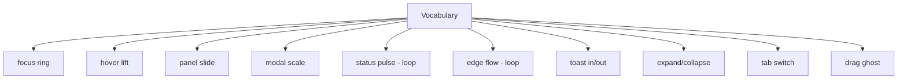
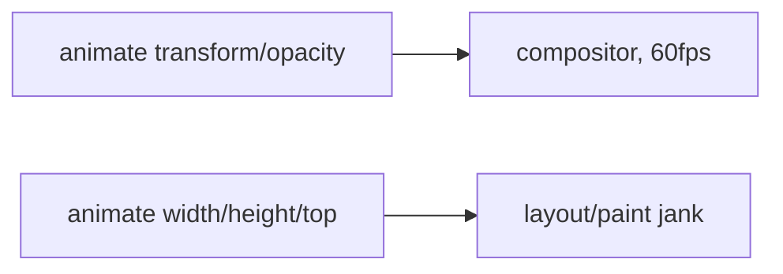
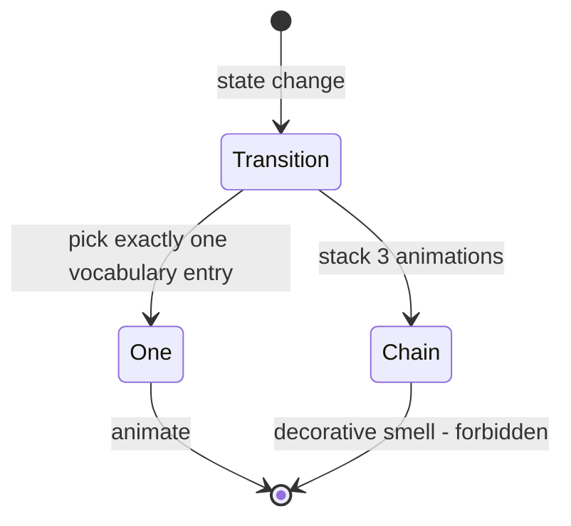
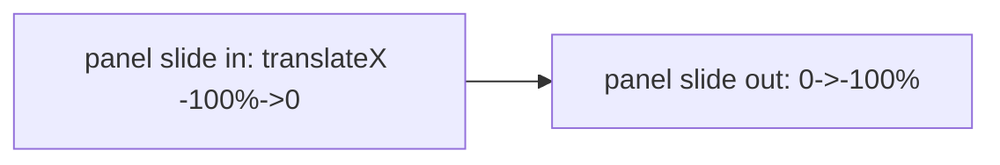

# Animations Diagrams

These diagrams show the motion vocabulary, the reduced-motion override, the compositor-only rule, and the one-animation-per-transition rule.

## Motion Vocabulary (10 entries)



## Reduced Motion Override

```mermaid
flowchart TD
  OS[@media reduce] --> OV[--motion-duration-* = 0ms]
  OV --> INST[all transitions instant]
  OV --> STOP[loops stop; status shown by color]
  LIT[component using literal] -.->|bypasses| BROKEN[anim plays]
```

## Compositor-Only Rule



## One Animation Per Transition



## Enter/Exit Symmetry



## Related Documents

- [[07-ui-ux/README]]
- [[Animations-Part01]]
- [[Animations-Part02]]
- [[Animations-Part03]]
- [[Animations-Part04]]
- [[DesignTokens-Part05]]
- [[Accessibility-Part04]]
- [[Accessibility-Part06]]
- [[NodeGraph-Part07]]
- [[NodeGraph-Part08]]
