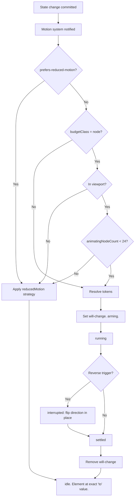

---
title: Animations Specification - Part 01
status: draft
version: 1.0
tags:
  - ui-ux
  - animations
  - motion
  - architecture
related:
  - "[[07-ui-ux/README]]"
  - "[[DesignTokens-Part01]]"
  - "[[Themes-Part01]]"
  - "[[Accessibility-Part01]]"
---

# Animations Specification (Part 01)

## Document Index

Part 01 - Purpose, Core Philosophy, Definition, Responsibilities, Object Model, Animation States, Invariants
Part 02 - Duration Tokens, Easing Tokens, CSS Custom Properties, and the Non-Blocking Interaction Law
Part 03 - The Animation Catalog and Mandatory prefers-reduced-motion Support
Part 04 - Performance Rules, the 100+ Node Canvas Budget, Implementation Checklist, Worked Examples
Diagrams - Animations-Diagrams.md

# Purpose

The Animations specification defines every moving pixel in Eulinx.

Eulinx shows a user up to several hundred AI workers changing state at the same time. A worker goes from `spawning` to `initializing` to `idle` to `working` in under two seconds. Twelve of them do it at once. Edges pulse. Cards expand. Panels slide. Without a governing rule set, that screen is noise, and the user cannot tell which worker just failed.

Motion in Eulinx exists to answer exactly three questions:

```text
1. What changed?        (a status dot recolored, and the change was seen)
2. Where did it go?     (a node appeared here, expanded from that parent)
3. What caused it?      (this edge pulsed, so this node ran next)
```

Any animation that does not answer one of those three questions MUST NOT ship. That is the entire filter.

This document is a frontend specification. It defines literal token values, literal from/to values, literal millisecond durations, literal cubic-bezier curves, and a literal reduced-motion fallback for every single animation by name. An implementer reading this document MUST NOT need to choose a number.

# Core Philosophy

**Motion communicates state change and causality. Motion is never decoration.**

Eulinx is an orchestration tool for long-running, expensive, parallel work. The user is watching a system, not browsing a landing page. Every frame of motion spends the user's attention, and attention is the scarcest resource on the screen. Motion is therefore rationed.

Four laws follow from this, and every rule in Parts 02 through 04 is derived from one of them.

```text
LAW 1 - CAUSALITY
  Motion shows that A caused B. A node appears FROM its parent,
  not from nowhere. An edge pulses BEFORE the target node lights up.
  If motion does not encode cause, use an instant swap instead.

LAW 2 - NON-BLOCKING
  Motion MUST NEVER gate an interaction. State commits first.
  The animation is a report of a change that already happened.
  A user may click a thing that is mid-animation, always.

LAW 3 - BUDGETED
  A frame is 16.67ms. Motion gets 8ms of it. When motion cannot
  fit in 8ms, motion is dropped, not the frame. Correctness of
  the displayed state outranks the beauty of the transition.

LAW 4 - OPTIONAL
  Every animation has a reduced-motion fallback that loses ZERO
  information. If turning off motion hides a fact, the animation
  was carrying that fact illegally and the design is wrong.
```

LAW 2 deserves the most emphasis because it is the one implementers break. The intuitive way to write a panel close is: play the exit animation, then on `animationend`, commit `isOpen = false`. This is wrong in Eulinx. The correct order is: commit `isOpen = false`, then let the exit animation play over a component that the state machine already considers closed. The animation is an epilogue. It is never a prerequisite.

LAW 4 deserves the second most. "Reduced motion means we disable the animation" is a failure. If a node's status change is communicated only by a pulse, and the pulse is disabled, the user with a vestibular disorder now cannot see that a worker failed. The fallback MUST be a specific, named, information-preserving substitute. Part 03 names it for all eight catalog entries individually.

# Definition

The Eulinx motion system is:

- a closed set of **duration tokens** (5 values, no others)
- a closed set of **easing tokens** (7 curves, no others)
- a closed **animation catalog** (8 entries, no others without a spec amendment)
- a set of **performance rules** restricting animatable properties to `transform` and `opacity`
- a **frame budget** and a numbered degradation algorithm for the node canvas
- a mandatory **reduced-motion** layer with a per-animation fallback table

The motion system is NOT:

- a physics engine (Eulinx uses no springs, no inertia, no simulated mass)
- a general-purpose animation library surface (no arbitrary keyframes at call sites)
- a place for judgment (an implementer picks a token, never a number)

Eulinx uses **CSS transitions and CSS keyframe animations as the default**. JavaScript animation via `requestAnimationFrame` is permitted only in the two cases named in Part 04: canvas-space node transforms during a viewport-driven layout change, and the edge-flow pulse offset when more than 8 edges pulse concurrently. No animation library (Framer Motion, GSAP, react-spring) is a dependency of Eulinx. This is deliberate. A closed token set plus CSS is small, GPU-composited, and cannot be extended by an impatient contributor at a call site.

# Responsibilities

The motion system MUST:

- expose all durations and easings as CSS custom properties under the `--Eulinx-` prefix
- expose the same values as a typed frozen TypeScript const object
- animate only `transform` and `opacity`
- commit application state before the corresponding animation begins
- keep `pointer-events` live on any element that is mid-transition and interactive
- reverse (not restart) any interrupted enter/exit transition
- honour `prefers-reduced-motion: reduce` on every catalog entry
- re-evaluate `prefers-reduced-motion` at runtime when the OS setting changes, without an app restart
- drop animations, never frames, when over budget
- cull node animations outside the visible viewport
- remove `will-change` within 1 frame of a transition ending

The motion system SHOULD:

- prefer an instant swap over a short animation when the change is local and unambiguous
- use `delay` only to encode causal order, never to pace a sequence for looks
- reuse a single shared keyframe definition per animation rather than per-component copies

The motion system MUST NOT:

- animate `width`, `height`, `top`, `left`, `right`, `bottom`, `margin`, `padding`, `box-shadow`, `filter`, or `background-color`
- set `pointer-events: none` on an interactive element for the duration of an animation
- gate a state commit on an `animationend` or `transitionend` event
- introduce a duration or easing value that is not a token
- exceed the animating-node cap defined in Part 04 (24 nodes)
- animate an element that is outside the viewport
- leave `will-change` set on an idle element
- convey information that is available only while motion is enabled

# Motion Object Model

```ts
/** The five legal durations. No other duration value may appear in Eulinx. */
type DurationToken =
  | "instant"
  | "fast"
  | "normal"
  | "slow"
  | "deliberate";

/** The seven legal easing curves. No other curve may appear in Eulinx. */
type EasingToken =
  | "linear"
  | "standard"
  | "decelerate"
  | "accelerate"
  | "sharp"
  | "emphasized"
  | "overshoot";

/** The only two properties Eulinx is permitted to animate. */
type AnimatableProperty = "transform" | "opacity";

/** The eight catalog entries. Part 03 specifies each one. */
type AnimationId =
  | "panel.open"
  | "panel.close"
  | "node.statusChange"
  | "node.appear"
  | "edge.flowPulse"
  | "card.expand"
  | "toast.in"
  | "toast.out"
  | "skeleton.shimmer"
  | "spinner.rotate";

/** What happens to an animation when prefers-reduced-motion: reduce is set. */
type ReducedMotionStrategy =
  /** Play at duration 0ms. Start and end states both apply; no tween. */
  | { kind: "instant_swap" }
  /** Do not animate. Render only the end state. Information is carried by a
   *  named static affordance instead. */
  | { kind: "static_state"; carrier: string }
  /** Replace the moving animation with a non-moving one (e.g. opacity only). */
  | { kind: "substitute"; substituteWith: AnimationId | "opacity_fade_120ms" }
  /** Stop the loop. Freeze on a named frame. */
  | { kind: "freeze"; atFrame: string };

/** The complete, immutable spec for one catalog entry. */
type AnimationSpec = {
  id: AnimationId;
  /** Human-readable description of the exact user-observable trigger. */
  trigger: string;
  /** Every property this animation touches. MUST be a subset of AnimatableProperty. */
  properties: AnimatableProperty[];
  /** Literal starting values, keyed by property. */
  from: Record<string, string>;
  /** Literal ending values, keyed by property. */
  to: Record<string, string>;
  duration: DurationToken;
  easing: EasingToken;
  /** Delay in ms. MUST be 0 unless the delay encodes causal ordering. */
  delayMs: number;
  /** True if the animation loops until stopped. */
  loops: boolean;
  /** MUST be false for every entry. Present to make the rule assertable in tests. */
  blocksInteraction: false;
  reducedMotion: ReducedMotionStrategy;
  /** Which budget class this animation draws from. See Part 04. */
  budgetClass: "node" | "edge" | "chrome" | "unbudgeted";
};

/** The runtime motion context, provided once at the app root. */
type MotionContext = {
  /** Live value of the prefers-reduced-motion media query. */
  reducedMotion: boolean;
  /** Current count of nodes animating this frame. See Part 04. */
  animatingNodeCount: number;
  /** True when the canvas has exceeded its budget and is shedding animations. */
  degraded: boolean;
};
```

Note what is absent from `AnimationSpec`. There is no `durationMs: number` field. There is no `easing: string` field. A call site cannot express "180ms" or "ease-in-out". It names a token, and the token resolves to a value the call site does not control. This is the same narrowing-only discipline that [[WorkerCreation-Part01]] applies to permissions, applied to motion.

`blocksInteraction` is typed as the literal `false`, not `boolean`. It is impossible to construct a valid `AnimationSpec` that blocks interaction. The type system enforces LAW 2.

# Animation States

Every catalog entry moves through this lifecycle. There are five states and no others.

```text
idle         Element is at rest. will-change is NOT set. No compositor layer.
arming       will-change has been set. One frame of headroom before start.
running      Transition or keyframe animation is in flight.
interrupted  A reverse trigger arrived mid-run. Direction flipped in place.
settled      Animation finished. will-change removed within 1 frame.
```

```text
  idle
    |  trigger fires (state ALREADY committed)
    v
  arming            <-- exactly 1 frame, sets will-change
    |
    v
  running ----- reverse trigger -----> interrupted
    |                                     |
    |  transitionend / animationend       |  continues from current
    v                                     |  computed value, reversed
  settled <-------------------------------+
    |  remove will-change (same frame or next)
    v
  idle
```

The `interrupted` state is where implementers introduce bugs. When a panel is closing and the user clicks open again at 90ms into a 240ms exit, the panel MUST NOT restart from `translateX(-100%)`. It MUST reverse from its current computed transform. CSS transitions do this natively when you change the target value; keyframe animations do NOT, which is why Part 03 specifies transitions rather than keyframes for every reversible animation.

# Invariants

```text
Application state commits before any animation starts. Always.
No animation is a prerequisite for any state change.
An interactive element mid-animation is still clickable.
Only transform and opacity are ever animated.
Every duration in the codebase is one of exactly 5 token values.
Every easing in the codebase is one of exactly 7 token curves.
Every catalog entry has a named reduced-motion fallback.
No reduced-motion fallback loses information.
will-change is set at most 1 frame before use and removed at most 1 frame after.
No more than 24 nodes animate simultaneously on the canvas.
An animation outside the viewport does not run.
Motion consumes at most 8ms of any 16.67ms frame.
A dropped animation always leaves the element at its correct end state.
```

The last invariant is the safety net for all of Part 04. Every degradation path, every cull, every budget shed MUST land the element on its exact `to` value. Eulinx never leaves a node half-faded because the budget ran out. Shedding an animation means the change becomes instant, never that the change is skipped.

# Mermaid Diagram



Every path in that diagram terminates at the same node: the element sits at its exact `to` value. Reduced motion, viewport cull, and budget shed are not error paths. They are equally correct renderings of the same committed state.

# AI Notes

Do not commit state on `transitionend`. This is the single most common implementation error and it produces a class of bug that is miserable to diagnose. If the element is unmounted, the browser tab is backgrounded, or the animation is skipped by reduced motion, `transitionend` never fires, and your state machine is now permanently stuck in `closing`. Commit first. Animate after. The animation is a report, not a gate.

Do not reach for a spring or an animation library because the panel "feels stiff". Eulinx has five durations and seven curves. If none of them fit, the answer is that you picked the wrong token, not that the token set needs a sixth value. Adding a duration requires amending Part 02 of this document.

Do not animate `width` or `height` to expand a card. It looks correct in isolation and it destroys the canvas at 100 nodes because every frame triggers layout for the entire subtree. Part 03 specifies `transform: scaleY()` with a counter-scaled inner element. Part 04 explains why in detail. This is not a preference.

Do not set `will-change: transform` in a stylesheet on a class that 100 nodes share. You have just asked the compositor for 100 GPU layers, and on an integrated GPU with a 4K display that is enough VRAM to make the whole app stutter permanently, including when nothing is animating. `will-change` is set imperatively, one frame before, and removed after. Part 04 gives the exact discipline.

Do not treat `prefers-reduced-motion` as an accessibility checkbox you satisfy with `animation: none`. Read Part 03's fallback table. Each of the eight entries has a specific substitute that preserves the information the motion was carrying. A worker failing MUST be visible to a user who cannot tolerate motion.

Do not assume the node canvas has 10 nodes because your test fixture has 10 nodes. Eulinx's design target is 100+ concurrent workers, each a node, each changing state, with edges pulsing between them. Every rule in Part 04 exists because the naive implementation drops to 12fps at that scale. Build against the budget from the first commit; retrofitting it means rewriting every component.

# Related Documents

- [[07-ui-ux/README]]
- [[Animations-Part02]]
- [[Animations-Part03]]
- [[Animations-Part04]]
- [[Animations-Diagrams]]
- [[DesignTokens-Part01]]
- [[Themes-Part01]]
- [[NodeGraph-Part01]]
- [[Panels-Part01]]
- [[TerminalCards-Part01]]
- [[Accessibility-Part01]]
- [[DynamicGraphs-Part01]]
