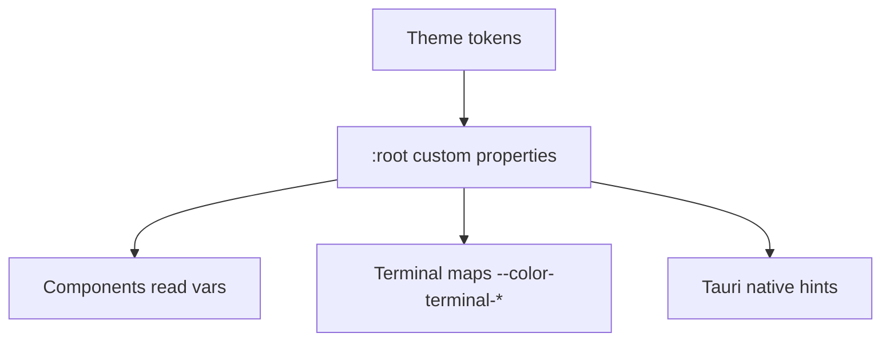
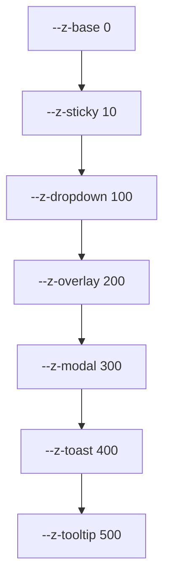

# DesignTokens Diagrams

These diagrams show the token layers, the naming pattern, the theme-to-token flow, and the reduced-motion override.

## Token Layers

```mermaid
graph TD
  P[Primitive: --blue-500] --> S[Semantic: --color-accent]
  S --> C[Component: background var(--color-accent)]
  T[Theme: sets --color-accent] --> S
```

## Naming Pattern

```mermaid
graph LR
  A[--] --> G[group: color|space|font|motion|z]
  G --> R[role: bg|fg|border|accent|status|size]
  R --> V[variant: canvas|surface|running|fast]
```

## Theme Provides Token Values



## Reduced Motion Override

```mermaid
flowchart TD
  MEDIA[@media reduce] --> OVERRIDE[--motion-duration-* = 0ms]
  OVERRIDE --> ALL[all token-driven motion instant]
  COMP[Components using tokens] --> ALL
  COMP_LIT[Components using literals] -.->|bypass| BROKEN[animation plays]
```

## Layering Scale (z-index)



## Related Documents

- [[07-ui-ux/README]]
- [[DesignTokens-Part01]]
- [[DesignTokens-Part02]]
- [[DesignTokens-Part03]]
- [[DesignTokens-Part04]]
- [[DesignTokens-Part05]]
- [[DesignTokens-Part06]]
- [[Themes-Part02]]
- [[Themes-Part04]]
- [[TerminalView-Part04]]
- [[Animations-Part01]]
- [[Accessibility-Part04]]
- [[Accessibility-Part05]]
