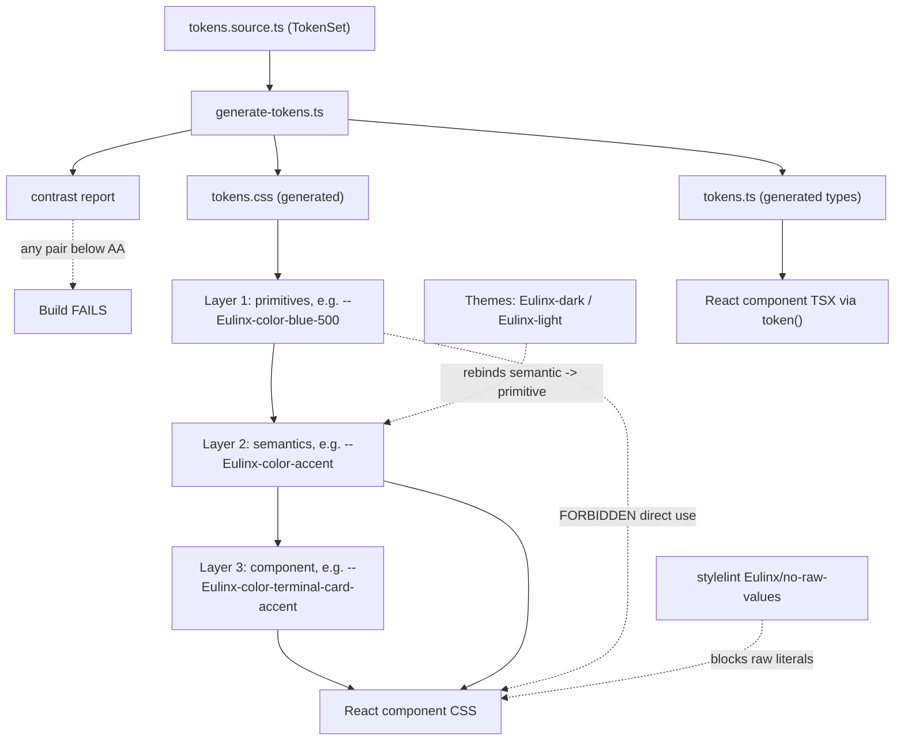

---
title: DesignTokens Specification - Part 01
status: draft
version: 1.0
tags:
  - ui-ux
  - design-tokens
  - architecture
related:
  - "[[07-ui-ux/README]]"
  - "[[Themes-Part01]]"
  - "[[Typography-Part01]]"
  - "[[Accessibility-Part01]]"
---

# DesignTokens Specification (Part 01)

## Document Index

Part 01 - Purpose, Philosophy, Definition, Object Model, Invariants
Part 02 - The Color Ramps: primitive ramps, semantic mapping, contrast proofs, worker-state colors
Part 03 - The Non-Color Scales: spacing, radius, elevation, z-index, border width, opacity
Part 04 - Motion, Naming Convention Grammar, and the Token-to-CSS Build Pipeline
Part 05 - The No-Raw-Values Law, Lint Rule, CI Gate, Checklist, Worked Examples
Diagrams - DesignTokens-Diagrams.md

# Purpose

DesignTokens defines every named constant the Eulinx frontend is permitted to use.

Eulinx's UI is a Tauri v2 window running React and TypeScript. It renders a node graph, a terminal
grid, dockable panels, and a worker tree, all of them dense, all of them live, all of them
redrawing while thirteen worker states change underneath them. A UI like that survives only if
every surface, every gap, every shadow, and every animation is drawn from one finite, closed set
of values.

DesignTokens is that set. It is closed. If a value is not in this document, a component MUST NOT
use it.

```text
DesignTokens owns the SCALES and the NAMES.
  It decides that spacing has exactly 11 steps.
  It decides that the step named space-4 is 16px.
  It decides that a color role named accent exists.

Themes owns the VALUES BOUND TO COLOR ROLES.
  It decides that in the dark theme, accent resolves to #4C9EFF.
  It decides that in the light theme, accent resolves to #0969DA.

DesignTokens defines the sockets. Themes supplies the bulbs.
```

That split is the first thing to internalize. See [[Themes-Part01]]. A theme MUST NOT invent a
color role that DesignTokens has not declared, and DesignTokens MUST NOT hardcode a theme's hex
into a component contract. The role name is the contract. The hex is the implementation.

Non-color tokens have no theme dimension at all. `--Eulinx-space-4` is `16px` in every theme, in
every window size, forever. Only two categories vary by theme: `color` and `elev`. Everything
else is theme-invariant. This is stated as an invariant below and enforced in Part 04.

# Core Philosophy

A design token is a decision that has already been made.

The value of a token system is not that it produces consistent pixels. Consistency is a side
effect. The real value is that it **removes decisions from implementation time**. A model or a
person building `TerminalCard` should never be in a position where they must choose between 6px
and 8px. There is no 7px. There is no "roughly 12". There is `space-2` and there is `space-3`,
and the rule for which one to use is written down in Part 03.

```text
If a reader has to pick a number, this document has failed.
```

The second principle is **one-way flow**. Tokens flow downward through exactly three layers and
never sideways or upward.

```text
LAYER 1  PRIMITIVE   raw literal values. blue-500 = #4C9EFF. space-4 = 16px.
                     no meaning. no opinion. just a swatch on a shelf.

LAYER 2  SEMANTIC    a role that points at a primitive.
                     color-accent -> blue-500. color-danger -> red-500.
                     this is where meaning lives. this is what Themes rebinds.

LAYER 3  COMPONENT   a component-scoped alias that points at a semantic.
                     terminal-card-border -> color-border.
                     optional. exists only when a component needs a named
                     hook a designer can retarget without touching the component.
```

A component consumes Layer 3 if one exists for its need, otherwise Layer 2. A component MUST NOT
consume Layer 1. Ever. `var(--Eulinx-color-blue-500)` in a component file is a bug of the same class
as `#4C9EFF`, because it hardcodes a hue choice that a theme is supposed to own.

The third principle is **the generated file is not a source file**. The TypeScript token
definitions are the truth. `tokens.css` is output. Editing `tokens.css` by hand is editing a
build artifact, and the next build silently reverts it. Part 04 defines the pipeline and Part 05
defines the CI gate that catches it.

The fourth principle is **accessibility is a property of the token, not of the component**. Every
semantic color pair in this system ships with a measured contrast ratio against the surface it is
legal to sit on. Both the dark theme and the light theme meet WCAG AA: 4.5:1 for text, 3:1 for
non-text UI. A component that uses tokens correctly is accessible by construction. It cannot
accidentally put 2.9:1 grey on grey, because that combination does not exist in the set. See
[[Accessibility-Part01]].

# Definition

DesignTokens is the frontend-owned specification that defines:

- the three-layer token model and the resolution rules between layers
- the complete primitive color ramps: neutral, blue, green, amber, red, each 10 steps
- the complete semantic color role list, with dark and light bindings and measured contrast
- the 13 worker-state color roles, one per canonical worker state
- the spacing scale, 11 steps, 4px base
- the radius scale, 6 steps
- the elevation scale, 5 steps, with separate dark and light shadow values
- the z-index layer scale, 8 layers
- the border width scale, 4 steps
- the opacity scale, 7 steps
- the motion duration scale, 5 steps, and the easing curve set, 5 curves
- the `prefers-reduced-motion` override rule
- the token naming grammar `--Eulinx-<category>-<role>[-<variant>][-<state>]`
- the build pipeline from TypeScript source to `tokens.css` and `tokens.ts`
- the `Eulinx/no-raw-values` stylelint rule, its config, its exact exception list, and the CI gate

DesignTokens does NOT define:

- font families, sizes, weights, or line heights. Those are [[Typography-Part01]].
- which theme is active, theme loading, theme validation, or user themes. Those are [[Themes-Part01]].
- which animation plays on which element. That is [[Animations-Part01]]. This document owns the
  duration and easing values that animation uses.
- icon geometry or the icon set. That is [[Icons-Part01]].
- breakpoints and layout behavior. Those are [[ResponsiveRules-Part01]].

# Responsibilities

DesignTokens MUST:

- enumerate every scale completely, with a real literal value on every step
- give every token a single canonical name that matches the naming grammar in Part 04
- give every token a stated "use this for" rule, so selection is lookup and not judgement
- define exactly one primitive ramp per hue, with exactly the steps 50 through 900
- define every semantic color role for both the dark theme and the light theme
- state a measured contrast ratio for every semantic foreground role against its legal surface
- guarantee WCAG AA in both themes: 4.5:1 minimum for text, 3:1 minimum for non-text UI
- define a color role for each of the 13 canonical worker states, and exactly 13
- keep non-color, non-elevation tokens identical across all themes
- generate `tokens.css` and `tokens.ts` from one TypeScript source of truth
- fail the build if a generated file is stale relative to its source
- fail the build if any semantic color pair drops below its AA floor

DesignTokens SHOULD:

- keep the total semantic role count small enough to memorize
- prefer adding a component-layer alias over adding a new semantic role
- expose every token to TypeScript as a literal union type, not `string`
- order ramp steps so that step 500 is the anchor value taken from the shared brief

DesignTokens MUST NOT:

- allow a component to reference a primitive token directly
- allow a component to hardcode a raw value of any kind
- allow a theme to introduce a role that DesignTokens has not declared
- allow a theme to vary a spacing, radius, z-index, border, opacity, duration, or easing token
- allow `tokens.css` to be hand-edited
- allow a token to exist without a "use this for" rule
- allow a semantic color pair that fails AA to ship in any theme
- allow the ramp step count to differ between hues

# DesignTokens Object Model

This is the complete source-of-truth type set. The generator in Part 04 consumes exactly these
types and emits nothing that is not derived from them.

```ts
/** The nine legal token categories. Closed set. Part 04 owns the grammar. */
type TokenCategory =
  | "color"
  | "space"
  | "radius"
  | "border"
  | "elev"
  | "z"
  | "duration"
  | "ease"
  | "opacity"
  | "font";

/** Which of the three layers a token lives on. */
type TokenLayer = "primitive" | "semantic" | "component";

/** Does this token's value change when the theme changes? */
type TokenThemeScope =
  | "invariant"   // one value for all themes. space, radius, z, border, opacity, duration, ease.
  | "themed";     // one value per theme. color and elev only.

/** A primitive token. Layer 1. Holds a literal. Never referenced by a component. */
type PrimitiveToken = {
  layer: "primitive";
  category: TokenCategory;
  /** Full CSS custom property name, e.g. "--Eulinx-color-blue-500". */
  name: string;
  /** The literal value, e.g. "#4C9EFF" or "16px". Never a var() reference. */
  value: string;
  themeScope: TokenThemeScope;
  /** Present iff themeScope is "themed". Keyed by theme id. */
  themeValues?: Record<ThemeId, string>;
  /** Mandatory. The "use this for" rule. Empty string is a build error. */
  usage: string;
  deprecated?: DeprecationNotice;
};

/** A semantic token. Layer 2. Points at a primitive. Themes rebind this pointer. */
type SemanticToken = {
  layer: "semantic";
  category: TokenCategory;
  /** e.g. "--Eulinx-color-accent". */
  name: string;
  /** The primitive token name this role resolves to, per theme. */
  bindings: Record<ThemeId, string>;
  /** For color roles only: the surface role this token is legal on top of. */
  onSurface?: string;
  /** For color roles only: measured contrast per theme. Verified in CI. */
  contrast?: Record<ThemeId, ContrastRecord>;
  usage: string;
  deprecated?: DeprecationNotice;
};

/** A component token. Layer 3. Points at a semantic. Optional per component. */
type ComponentToken = {
  layer: "component";
  category: TokenCategory;
  /** e.g. "--Eulinx-color-terminal-card-border". */
  name: string;
  /** The semantic token name this alias resolves to. MUST be a semantic, never a primitive. */
  binding: string;
  /** The component that owns this alias, e.g. "TerminalCard". */
  owner: string;
  usage: string;
  deprecated?: DeprecationNotice;
};

type Token = PrimitiveToken | SemanticToken | ComponentToken;

type ContrastRecord = {
  /** Measured ratio, e.g. 7.1. Computed by the generator, not typed by hand. */
  ratio: number;
  /** Which floor applies: text needs 4.5, non-text UI needs 3.0. */
  requirement: "text-4.5" | "ui-3.0";
  /** Computed. True iff ratio >= the requirement floor. False fails the build. */
  passes: boolean;
  /** Informational. "AAA" iff ratio >= 7.0 for text. */
  grade: "fail" | "AA" | "AAA";
};

type DeprecationNotice = {
  since: string;          // ISO date the token was deprecated
  replacement: string;    // the token name to use instead
  removeAfter: string;    // ISO date after which the token is deleted
};

type ThemeId = string;    // "Eulinx-dark" and "Eulinx-light" are the two built-ins. See [[Themes-Part01]].

/** The whole system. One instance. Exported from the source module. */
type TokenSet = {
  version: string;                  // semver of the token set itself, e.g. "1.0.0"
  /** The theme ids this set provides bindings for. MUST include "Eulinx-dark" and "Eulinx-light". */
  themes: ThemeId[];
  /** The theme applied when no user preference exists. MUST be "Eulinx-dark". */
  defaultTheme: ThemeId;
  primitives: PrimitiveToken[];
  semantics: SemanticToken[];
  components: ComponentToken[];
  /** Emitted into tokens.css as a comment header. Proves provenance. */
  generatedFrom: string;            // "src/design/tokens.source.ts"
};

/** Emitted by the generator. Gives TypeScript a literal union of every legal token name. */
type EulinxTokenName =
  | EulinxColorTokenName
  | EulinxSpaceTokenName
  | EulinxRadiusTokenName
  | EulinxBorderTokenName
  | EulinxElevTokenName
  | EulinxZTokenName
  | EulinxDurationTokenName
  | EulinxEaseTokenName
  | EulinxOpacityTokenName;

/** The only sanctioned way to read a token from TSX. Typed, so a typo is a compile error. */
declare function token(name: EulinxTokenName): string;
```

`usage` being mandatory on all three token types is not decoration. It is the mechanism that
makes this system decision-free. A token without a usage rule is a token someone will guess about.
The generator MUST reject a `TokenSet` containing any token whose `usage` is the empty string.

`contrast` being computed rather than authored is likewise deliberate. A hand-typed ratio is a
claim. A generated ratio is a measurement. Part 05 wires the measurement into CI.

# Invariants

```text
Every token name matches --Eulinx-<category>-<role>[-<variant>][-<state>].
Every token has a non-empty usage rule.
Every token belongs to exactly one of the nine categories.
Every token belongs to exactly one of the three layers.
A component token binds to a semantic token, never to a primitive, never to a literal.
A semantic token binds to a primitive token, never to another semantic, never to a literal.
A primitive token holds a literal, never a var() reference.
Resolution depth is therefore exactly three and never cyclic.
Only category color and category elev are themed. All seven others are invariant.
Every theme binds every declared semantic role. A missing binding is a build error.
No theme declares a role DesignTokens has not declared.
Every hue ramp has exactly the 10 steps 50,100,200,300,400,500,600,700,800,900.
Step 500 of every hue is the anchor value from the shared brief.
Every semantic color role states a measured contrast ratio against its legal surface.
Every text color role is >= 4.5:1 in every theme.
Every non-text UI color role is >= 3.0:1 in every theme.
There are exactly 13 worker-state color roles, one per canonical worker state.
tokens.css and tokens.ts are generated. Neither is ever hand-edited.
A generated file that is stale relative to tokens.source.ts fails the build.
No component file contains a raw color, length, duration, or z-index literal.
```

The three-layer depth invariant matters more than it looks. Because resolution is exactly
primitive -> semantic -> component, the browser resolves any `var()` chain in at most three hops,
and a cycle is structurally impossible: each layer may only point one layer down. A system that
allows semantic-to-semantic aliasing eventually grows a cycle, and CSS custom property cycles fail
silently to `unset`. Eulinx forbids the shape rather than detecting the failure.

# Mermaid Diagram



# AI Notes

Do not put a hex code in a component file. Not in CSS, not in a style prop, not in a Tailwind
arbitrary value, not in an SVG `fill` attribute, not in a canvas `fillStyle` string. The rule has
no medium-specific exemption. Part 05 enumerates the only four exceptions that exist, and "it was
just for the node graph canvas" is not among them.

Do not reference a primitive token from a component because the semantic role "was not quite the
right blue". If the role is wrong, the role is wrong, and you fix the role or add a component
alias. Reaching past Layer 2 into Layer 1 is how a theme silently stops working: the light theme
rebinds `--Eulinx-color-accent`, your component still points at `--Eulinx-color-blue-500`, and now a
dark-theme blue is sitting on a white surface at 2.4:1.

Do not edit `tokens.css`. It says `GENERATED FILE. DO NOT EDIT.` in its header and it means it.
Edit `tokens.source.ts` and re-run the generator. If you edited the CSS, your change survives
until the next `npm run tokens`, which is roughly until the next person pulls.

Do not invent a scale step. There is no `space-7`. There is no `radius-2xl`. If you find yourself
wanting one, you are almost certainly nudging a layout that should be fixed structurally. The
spacing scale in Part 03 is closed and the gaps in it (there is no 7, no 9, no 11) are deliberate.

Do not assume light theme is dark theme inverted. It is not. The light ramp in Part 02 uses
different hues at different steps precisely because inverting a dark palette produces washed-out
mid-tones that fail AA. Every light value is measured independently.

Do not hardcode `13` worker states or add a fourteenth state color. The state list is canonical
and comes from [[WorkerLifecycle-Part01]]. Adding a state color without a state is dead code;
adding a state without a color makes [[TerminalCards-Part01]] render `unset`.

Do not skip the `usage` field when adding a token because the name "is obvious". The name is
obvious to you today. The generator rejects an empty usage string, so this is enforced, not asked.

# Related Documents

- [[07-ui-ux/README]]
- [[DesignTokens-Part02]]
- [[DesignTokens-Part03]]
- [[DesignTokens-Part04]]
- [[DesignTokens-Part05]]
- [[DesignTokens-Diagrams]]
- [[Themes-Part01]]
- [[Typography-Part01]]
- [[Accessibility-Part01]]
- [[Animations-Part01]]
- [[TerminalCards-Part01]]
- [[Panels-Part01]]
- [[Sidebar-Part01]]
- [[WorkspaceLayout-Part01]]
- [[ResponsiveRules-Part01]]
- [[Icons-Part01]]
- [[CodingStandards-Part01]]
- [[WorkerLifecycle-Part01]]
