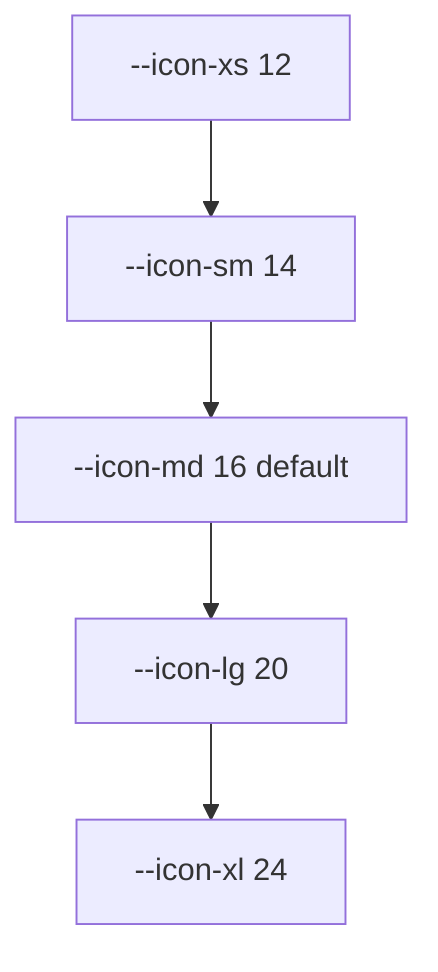
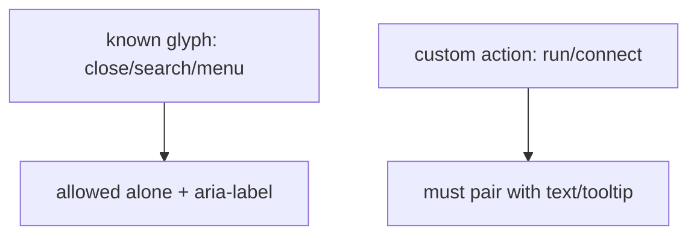
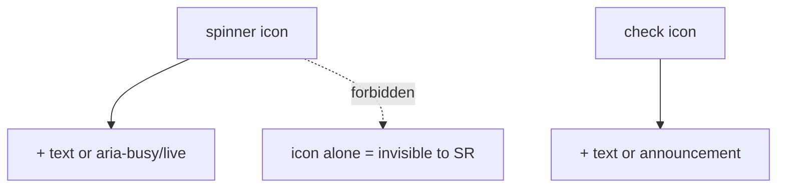

# Icons Diagrams

These diagrams show the icon size scale, decorative vs labeling, RTL flip, and the "icon never alone" rule.

## Icon Size Scale



## Decorative vs Labeling

```mermaid
flowchart LR
  D[Icon + text "Run"] -->|aria-hidden| OK[decorative, text names it]
  L[Icon-only button] -->|aria-label| OK2[labeling, named]
  M[mysery glyph] -.->|forbidden| BAD[no name, no label]
```

## RTL Flip Set

```mermaid
flowchart LR
  FLIP[directional: arrow/chevron/caret] --> RTL[scale(-1) in dir=rtl]
  NO[close/search/settings/check] --> SAME[unchanged]
```

## Icon Never Alone



## State Conveyance



## Related Documents

- [[07-ui-ux/README]]
- [[Icons-Part01]]
- [[Icons-Part02]]
- [[Icons-Part03]]
- [[Icons-Part04]]
- [[DesignTokens-Part03]]
- [[DesignTokens-Part04]]
- [[Accessibility-Part03]]
- [[Accessibility-Part06]]
- [[Typography-Part04]]
