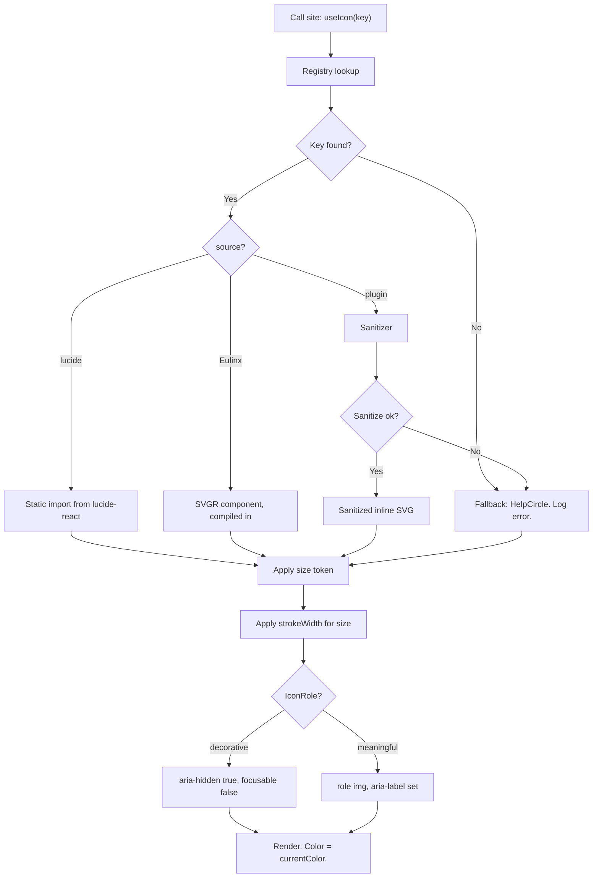

---
title: Icons Specification - Part 01
status: draft
version: 1.0
tags:
  - ui-ux
  - icons
  - architecture
related:
  - "[[07-ui-ux/README]]"
  - "[[DesignTokens-Part01]]"
  - "[[Typography-Part01]]"
  - "[[Accessibility-Part01]]"
  - "[[Themes-Part01]]"
---

# Icons Specification (Part 01)

## Document Index

Part 01 - Purpose, Philosophy, Definition, Library Choice, Object Model
Part 02 - The Component Contract, Build Pipeline, Size Scale, Stroke and Alignment
Part 03 - The Semantic Icon Registry, Custom Eulinx Icons, Plugin Icons and Sanitization
Part 04 - Accessibility, Checklist, Worked Examples, Mistakes, Expansion
Diagrams - Icons-Diagrams.md

# Purpose

Icons defines the complete icon system for the Eulinx desktop UI: which icon library is used, how an icon becomes a React component, what sizes exist, how strokes and alignment work, which icon means which domain concept, how custom icons are authored, how untrusted plugin-supplied SVG is sanitized, and how icons behave for assistive technology.

Eulinx's UI is dense. A single workspace view can show fifty workers, each with a state, a role, a terminal card, a set of artifacts, and a permission badge. At that density text alone is unreadable and icons alone are ambiguous. The icon system exists to make the dense view scannable without making it lie.

```text
An icon in Eulinx is a compressed label.
It is never the label itself.
```

This document is the law for every icon rendered anywhere in Eulinx, including icons supplied by third-party plugins. It is a frontend specification. Everything in it is implementable with zero design decisions remaining.

# Core Philosophy

Five rules govern every decision in this document.

**One icon, one meaning, globally.** A given glyph maps to exactly one domain concept across the entire app. If `Bot` means Worker in the node graph, `Bot` means Worker in the sidebar, in the terminal card header, in the toast, and in the plugin marketplace. Reusing a glyph for a second meaning is forbidden, because the user's mental model is built once and applied everywhere. The registry in [[Icons-Part03]] is the single source of truth for these mappings, and it is exhaustive.

**Icons are never the sole signal.** A worker in `failing` is not "the red triangle". It is the text `failing`, the danger color token, and the triangle. Remove any one of the three and the other two still communicate the state. This is not only an accessibility requirement, though [[Accessibility-Part01]] mandates it; it is a correctness requirement, because roughly 1 in 12 users cannot separate the red triangle from the amber one, and because at 12px a triangle and a circle are four pixels apart.

**Everything ships in the bundle.** Eulinx is a Tauri v2 desktop app that MUST work with no network. There is no CDN, no icon font fetched at runtime, no ``. Every icon is either compiled into the JS bundle at build time or supplied by an installed plugin and sanitized before it touches the DOM.

**Plugin SVG is hostile input.** A plugin's icon is an untrusted string that Eulinx injects into its own DOM. That is textbook XSS. The sanitization pipeline in [[Icons-Part03]] is not defense in depth; it is the only defense, and it fails closed.

**Optical consistency beats geometric consistency.** All icons live on a 24x24 grid with a 2px stroke because visual weight, not bounding box, is what the eye reads. An icon that is technically 16x16 but drawn with a 1px hairline looks broken next to 14px Inter text. Part 02 gives the literal stroke-width per size.

# Definition

The Eulinx icon system is:

- a pinned dependency on **Lucide** (`lucide-react`), the sole external icon source
- a component contract every icon component MUST satisfy
- a build-time SVGR pipeline for custom Eulinx icons
- a size scale of six literal pixel values bound to named CSS tokens
- stroke-width, alignment, and rendering rules per size
- a literal semantic registry mapping every Eulinx domain concept and every worker lifecycle state to a named icon
- authoring rules and a review gate for custom icons
- a numbered sanitization algorithm for plugin-supplied SVG with literal allowlists
- accessibility rules for decorative and meaningful icons

It is NOT: the color system (see [[DesignTokens-Part01]] and [[Themes-Part01]]), the text scale (see [[Typography-Part01]]), or node shapes in the graph canvas (see [[NodeGraph-Part01]]).

# The Library Decision: Lucide

Eulinx uses **Lucide**, imported from the `lucide-react` package, pinned to an exact version in `package.json`. This is decided. Do not evaluate alternatives at implementation time.

```text
Dependency:  lucide-react
Version:     pinned exact, no caret, no tilde
License:     ISC
Source:      bundled into the app, never fetched
```

## Why Lucide

**Tree-shakeable ESM named exports.** `import { Bot } from "lucide-react"` pulls exactly one component. Lucide ships ES modules with `sideEffects: false`, so Vite's Rollup pass drops every unreferenced icon. Eulinx uses roughly 60 icons out of 1400+. The shipped cost is the 60. This property is load-bearing and Part 02 makes it a MUST NOT rule.

**Consistent 24x24 grid with a uniform 2px stroke.** Every Lucide glyph is drawn on the same grid at the same optical weight. Mixed-provenance icon sets do not have this property, and the mismatch is visible at a glance in a dense list. Eulinx's own custom icons in Part 03 are authored to the identical grid so they are indistinguishable from library icons.

**ISC license.** Permissive, no attribution requirement in the shipped binary, no copyleft, compatible with a closed-source desktop distribution. Legal review is not required per icon.

**Offline by construction.** Lucide is a set of React components, not a webfont or a sprite sheet fetched over HTTP. Nothing about it assumes a network. This is a hard fit for Tauri, where the app must launch on a plane.

**Real React components.** Each export is a function component accepting `size`, `color`, `strokeWidth`, `absoluteStrokeWidth`, and every standard SVG prop. No wrapper layer, no `dangerouslySetInnerHTML`, no runtime string parsing. The component contract in Part 02 is a thin narrowing of this native surface.

**Stroke-based, so `currentColor` works.** Lucide sets `stroke="currentColor"` and `fill="none"`. Icons inherit text color for free, which means one component works in both themes with zero theme-aware code. See [[Themes-Part01]].

## Rejected Alternatives

Each of these was considered and rejected for a named reason. Do not revisit.

```text
Font Awesome
  REJECTED: Free tier's icon coverage for developer/agent concepts is thin;
  the icons Eulinx needs most (bot, git-branch variants, terminal states) sit
  behind the Pro license. Mixed free/Pro sets create a licensing audit
  burden per icon. The React package also ships a runtime icon "library"
  registry pattern that defeats tree-shaking unless used carefully.

Material Symbols
  REJECTED: Designed for Material Design's 48dp baseline and filled/rounded/
  sharp variant axes. Its optical weight and corner language are Google's,
  not Eulinx's, and Eulinx's UI is a dense desktop tool, not a mobile surface.
  The variable-font delivery is a webfont, which is separately rejected below.
  The static SVG export loses the variable axes, so the main advantage evaporates.

Heroicons
  REJECTED: Closest runner-up and genuinely good. Rejected on coverage:
  roughly 300 icons at two sizes. Eulinx's semantic registry needs distinct
  glyphs for 13 worker states plus 13 domain nouns without reuse, and
  Heroicons forces glyph reuse across those. Also ships two separate size
  variants (24 outline, 20 solid) with different stroke logic, which
  contradicts the single-grid rule above.

Icon fonts of any kind (Font Awesome webfont, Material Icons font, custom .woff2)
  REJECTED, HARD. See the next section. This is a MUST NOT, not a preference.
```

## Icon Fonts Are Forbidden

Eulinx MUST NOT use an icon font. Not Font Awesome's webfont, not Material Icons, not a custom subset. This applies to plugins too: a plugin MUST NOT ship a font file as an icon source, and the plugin loader rejects one.

The reasons are concrete.

1. **Glyphs are text to the accessibility tree.** An icon font renders a Private Use Area codepoint. A screen reader announces it as an unknown character or nothing at all, and the fix is a pile of `aria-hidden` pseudo-element hacks that must be repeated at every call site. React SVG components carry their own accessibility props, per Part 04.
2. **Font loading is a flash.** Before the font loads the user sees tofu boxes or fallback glyphs. In a desktop app with a 1024x680 minimum window full of status icons, that flash is a rendering bug. Bundled SVG has no load state.
3. **No tree-shaking.** The font is one binary file. Using 60 icons ships all 1400. Subsetting requires a build step that must be re-run whenever any developer adds an icon, and forgetting it produces a silent tofu box in production.
4. **Pseudo-element rendering breaks layout control.** `content: "\f120"` is a text glyph subject to line-height, font metrics, and text rendering. Precise optical alignment (Part 02) is impossible when the browser is doing font layout.
5. **No per-path control.** A two-tone or partially animated icon is impossible in a font. Eulinx's spinner and progress icons need it.
6. **Color is limited to a single `color` value with no `fill`/`stroke` separation.**

```text
MUST NOT: ship, load, or reference any icon font file (.woff, .woff2, .ttf, .eot)
          from Eulinx or from any plugin.
The ONLY bundled fonts in Eulinx are Inter Variable (UI sans) and JetBrains Mono (mono).
Both are text fonts. Neither carries icon glyphs.
```

# Icon Object Model

These are the types the whole system is built on. Every field is defined. Full component props are in [[Icons-Part02]]; the registry types are in [[Icons-Part03]].

```ts
/** The three provenances an icon can have. Determines the render path. */
export type IconSource =
  | "lucide"   // named export from lucide-react, compiled in
  | "Eulinx"      // custom Eulinx SVG, compiled in via SVGR at build time
  | "plugin";  // untrusted SVG string from an installed plugin

/** The six legal rendered sizes. Literal px. No other value is legal. */
export type IconSizeToken = "xs" | "sm" | "md" | "lg" | "xl" | "2xl";

/** Whether the icon carries meaning or is redundant decoration. */
export type IconRole = "decorative" | "meaningful";

/** A resolved, ready-to-render icon. Produced by the resolver in Part 03. */
export type ResolvedIcon = {
  /** Stable key used in the registry, e.g. "worker.state.failing". */
  key: string;
  source: IconSource;
  /** For source "lucide": the exact Lucide export name, e.g. "TriangleAlert". */
  lucideName?: string;
  /** For source "Eulinx": the SVGR component name, e.g. "EulinxArtifactStack". */
  eulinxComponentName?: string;
  /** For source "plugin": the sanitized SVG markup. Never the raw input. */
  sanitizedSvg?: string;
  /** For source "plugin": the plugin that supplied it. Used in audit logs. */
  pluginId?: string;
  /** True when this is the fail-closed fallback, not the requested icon. */
  isFallback: boolean;
};

/** Every registry entry. See Part 03 for the literal registry object. */
export type IconRegistryEntry = {
  key: string;
  lucideName: LucideIconName;
  /** One-line description of the concept. Shown in the internal icon gallery. */
  meaning: string;
  /** The default size token used when this concept is rendered inline. */
  defaultSize: IconSizeToken;
  /** The design token name for the icon's default color. See DesignTokens-Part01. */
  colorToken: string;
  /** Text that MUST accompany this icon when it is meaningful. */
  defaultLabel: string;
};
```

`isFallback` is not a debugging convenience. A `true` there means sanitization rejected a plugin's icon and Eulinx substituted a neutral glyph. Part 03 requires that this be logged with `pluginId` and surfaced in the plugin's detail panel, because a plugin whose icon is silently replaced is a plugin whose author never learns it shipped hostile markup.

# Size Scale (Summary)

The six literal values. Part 02 gives the full mapping, stroke-widths, and the text-role pairing rule.

```text
xs    12px    strokeWidth 1.5    pairs with caption text
sm    14px    strokeWidth 1.5    pairs with body-sm
md    16px    strokeWidth 2      pairs with body (THE DEFAULT)
lg    20px    strokeWidth 2      pairs with body-lg / heading-sm
xl    24px    strokeWidth 2      pairs with heading-md
2xl   32px    strokeWidth 2      empty states, dialog headers only
```

`md` at 16px is the default for every icon that does not explicitly say otherwise. If an implementer is unsure, the answer is `md`.

# Invariants

```text
Exactly one icon library is a dependency: lucide-react.
No icon font exists anywhere in the app or in any plugin.
Every icon renders from bundled code or from sanitized plugin markup. Never from a URL.
Every icon's color comes from currentColor. No icon hardcodes a hex value.
Every icon's rendered size is one of exactly six values: 12, 14, 16, 20, 24, 32.
Every domain concept has exactly one glyph. No glyph has two meanings.
Every one of the 13 worker states has a distinct glyph.
An icon is never the sole signal of state. Text accompanies it. Always.
A decorative icon is aria-hidden="true" and focusable="false".
A meaningful icon is role="img" with a non-empty aria-label.
An icon-only button has an accessible name on the button, not on the icon.
Plugin SVG is sanitized before it enters the DOM. There is no unsanitized path.
Sanitization fails closed to the fallback icon. It never renders partial input.
No icon is imported by a dynamically constructed string.
```

The "no glyph has two meanings" invariant is the one implementers break first. It is enforced by a unit test in Part 04's checklist that asserts the registry's `lucideName` values are pairwise distinct.

# Mermaid Diagram



# AI Notes

Do not add a second icon library "just for one missing glyph". The moment two libraries coexist, stroke weight and grid diverge and every dense list looks wrong. If Lucide lacks a glyph, author a custom Eulinx icon per the rules in [[Icons-Part03]]. That path exists precisely so this shortcut is never needed.

Do not write `const Icon = require(\`lucide-react/\${name}\`)` or any dynamic import built from a string. It defeats tree-shaking completely, it ships all 1400 icons, and Vite cannot statically analyze it. Part 02 makes this a MUST NOT with the exact allowed pattern.

Do not set `fill` or a hex `stroke` on an icon. Icons inherit `currentColor`. The instant an icon hardcodes `#64748b`, it is invisible or wrong in the other theme, and there is no test that catches it.

Do not render plugin SVG with `dangerouslySetInnerHTML` on the raw string. Do not "just strip `<script>`". The attack surface includes `on*` attributes, `javascript:` in `href` and `xlink:href`, `<foreignObject>`, external `<use>`, `<image>` with a remote URL, CSS `url()`, and entity expansion. The full algorithm and the literal allowlists are in [[Icons-Part03]]. Implement it exactly. Partial implementation is worse than none, because it reads as safe.

Do not communicate worker state with an icon alone, even when it "looks obvious in the mockup". A spinner and a pause glyph at 12px are nearly identical shapes, and a red triangle and an amber triangle are the same triangle. Pair every state icon with its state text and its color token. This is mandated in [[Accessibility-Part01]] and restated in [[Icons-Part04]].

Do not invent worker states. There are exactly 13, listed in [[WorkerLifecycle-Part01]] and mapped one-to-one in [[Icons-Part03]]. If your switch statement has a `default` branch that draws a generic dot, you have a bug, not a fallback.

# Related Documents

- [[07-ui-ux/README]]
- [[Icons-Part02]]
- [[Icons-Part03]]
- [[Icons-Part04]]
- [[Icons-Diagrams]]
- [[DesignTokens-Part01]]
- [[Typography-Part01]]
- [[Themes-Part01]]
- [[Accessibility-Part01]]
- [[NodeGraph-Part01]]
- [[WorkerLifecycle-Part01]]
- [[PluginArchitecture-Part01]]
