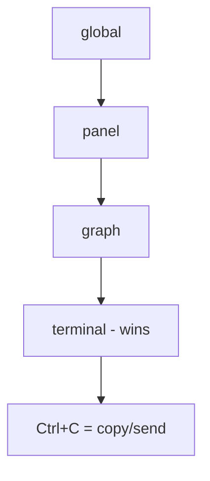
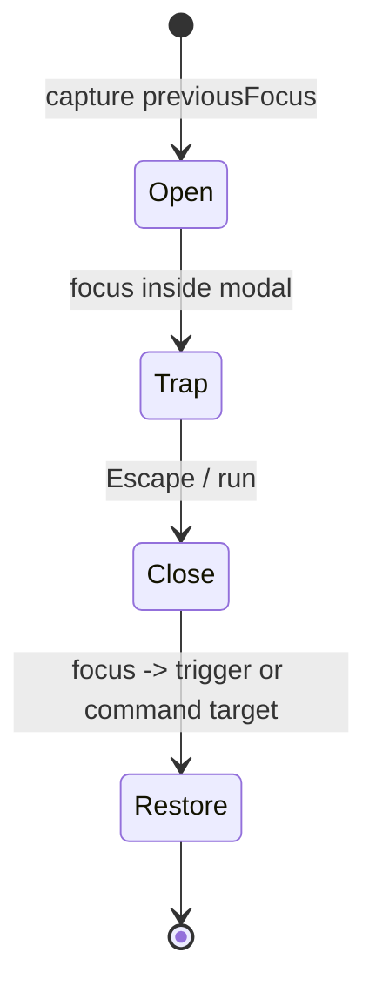
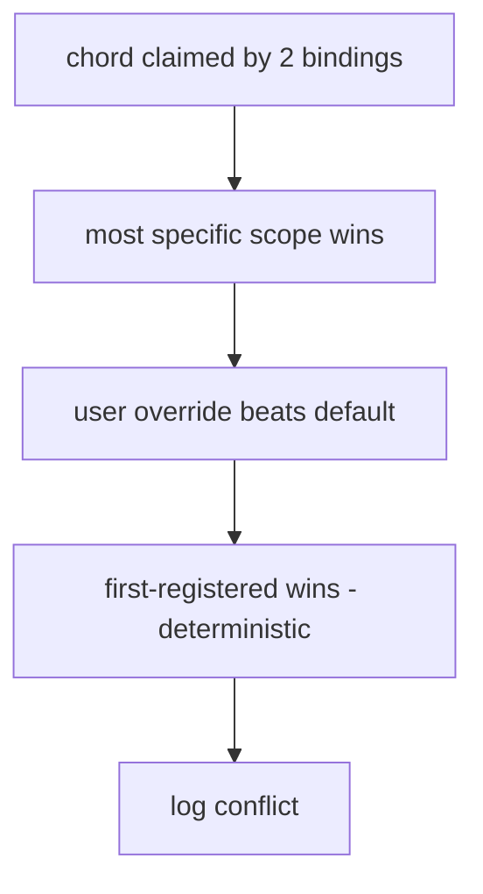
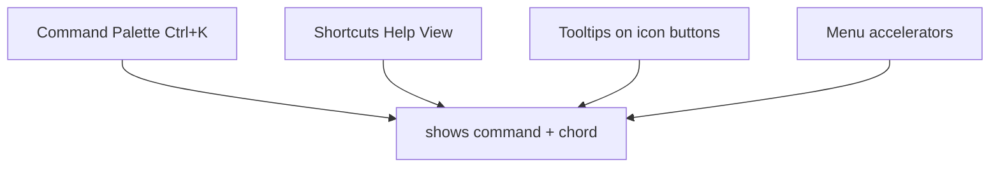

# KeyboardShortcuts Diagrams

These diagrams show the binding registry, scope precedence, the modal/focus-restore flow, and conflict resolution.

## Binding Registry (data, not handlers)

```mermaid
graph LR
  COMP[Component] -->|dispatch(commandId)| REG[Binding Registry]
  REG -->|chord| KEY[Key Event]
  REG -->|command| ACT[Action]
  USER[User overrides] -->|by commandId| REG
```

## Scope Precedence



## Modal Focus / Restore



## Conflict Resolution



## Discovery Surfaces



## Related Documents

- [[07-ui-ux/README]]
- [[KeyboardShortcuts-Part01]]
- [[KeyboardShortcuts-Part02]]
- [[KeyboardShortcuts-Part03]]
- [[KeyboardShortcuts-Part04]]
- [[Accessibility-Part01]]
- [[Accessibility-Part03]]
- [[Sidebar-Part03]]
- [[WorkspaceLayout-Part06]]
- [[TerminalView-Part06]]
- [[Icons-Part03]]
