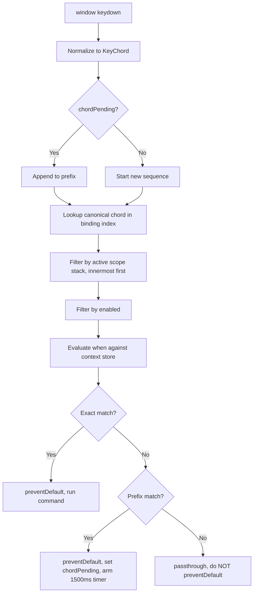

---
title: KeyboardShortcuts Specification - Part 01
status: draft
version: 1.0
tags:
  - ui-ux
  - keyboard-shortcuts
  - keymap
  - architecture
related:
  - "[[07-ui-ux/README]]"
  - "[[WorkspaceLayout-Part01]]"
  - "[[Accessibility-Part01]]"
  - "[[Panels-Part01]]"
---

# KeyboardShortcuts Specification (Part 01)

## Document Index

Part 01 - Purpose, Philosophy, Object Model, Command IDs, and the `when` Language
Part 02 - The Complete Default Keymap Table
Part 03 - Scopes, Precedence, the Terminal Swallow Rule, Conflicts, and Chords
Part 04 - Rebinding, Persistence, Command Palette, Checklist, and Examples
Diagrams - KeyboardShortcuts-Diagrams.md

# Purpose

KeyboardShortcuts defines how every user-invokable action in Eulinx is reachable, named, bound, resolved, rendered, and rebound.

Eulinx is an orchestration cockpit. A user running eleven parallel Workers across a node graph, four terminals, and a merge queue does not have time to hunt menus. The keyboard is the primary input device and the mouse is the fallback, not the reverse.

This document is the single authority for:

- the keymap data model and its TypeScript types
- the command id naming convention
- the `when` clause context expression language, including its grammar
- the complete default keymap, as literal key combinations
- scope stacking and the exact resolution algorithm
- the terminal swallow rule and its literal allowlist
- conflict detection and reporting
- user rebinding, the user keymap file format, validation, and hot reload
- multi-stroke chords and their timeout
- the command palette as the discoverable surface

It is NOT the authority on what a command does. `workflow.run` is specified in [[WorkflowEngine-Part01]]. `merge.approve` is specified in [[MergeFlow-Part01]]. This document binds keys to command ids. It does not implement the commands.

# Core Philosophy

Three rules generate everything else in this document.

**Rule 1. Every command is reachable by keyboard.**

Not every command has a key binding. Binding real estate is finite and giving `theme.setDark` a chord is waste. But every command MUST be reachable without a mouse, and the command palette is how. A command with no binding is still typed into the palette and run. See Part 04.

The corollary is the rule implementers break most often: **a UI affordance that has no command id behind it is a bug.** If a button calls a function directly, that function is unreachable by keyboard, unbindable by the user, and invisible in the palette. Buttons dispatch command ids. Always.

**Rule 2. The keymap is data, not code.**

There is no `if (e.key === "p" && e.ctrlKey)` anywhere in Eulinx. Not once. A binding is a row in a registry. The dispatcher is a single generic function that reads the registry. Adding a shortcut means adding data.

```text
WRONG                              RIGHT
-----                              -----
onKeyDown(e) {                     registerBinding({
  if (e.ctrlKey && e.key === "p")    commandId: "palette.open",
    openPalette();                   chords: ["Ctrl+P"],
}                                    scope: "global",
                                   });
```

The wrong version cannot be rebound, cannot be listed in the palette, cannot be conflict-checked, cannot be rendered in a tooltip, and cannot be scoped. It is invisible to every other system in this document.

**Rule 3. Bindings are declared once and rendered everywhere.**

The chord `Ctrl+Shift+N` appears in the palette, in the New Worker button tooltip, in the Sidebar context menu, in the help overlay, and in the settings keymap editor. All five read the same registry row at render time. None of them contains the string `"Ctrl+Shift+N"`.

When a user rebinds `worker.create` to `Ctrl+Alt+W`, all five surfaces change with no code change. If any surface hardcodes a chord string, it will lie to the user the moment they rebind, and a UI that lies about its own shortcuts is worse than one that shows none.

```text
The keymap is the single source of truth for:
  what happens on a key press,
  what the palette lists,
  what a tooltip says,
  what the help overlay renders,
  what the settings editor edits.
```

# Definition

The **KeymapRegistry** is a frontend singleton, created once at app boot, that holds:

- the **command table**: every `Command` in the app, keyed by `CommandId`
- the **binding table**: every `Binding`, indexed by normalized chord for O(1) dispatch
- the **context store**: the live values of every evaluable atom used by `when` clauses
- the **conflict report**: the result of the most recent conflict detection pass

It exposes registration, unregistration, lookup, resolution, and dispatch. It is a plain TypeScript module. It is NOT a React context, because key events arrive from a window listener outside the React tree, and a re-render must never be required for a key to work.

The registry lives entirely in the frontend. The Rust backend has no knowledge of key bindings. A key press resolves to a command id in the frontend; the command's handler may then invoke a Tauri IPC call. Rust never sees a `KeyboardEvent`.

# Responsibilities

The keymap system MUST:

- represent every binding as data in the registry, never as a conditional in an event handler
- assign every user-invokable action a `CommandId` following the naming convention in this part
- normalize every chord to the canonical form defined in this part before storing or comparing it
- resolve the active scope stack on every key event, innermost first
- evaluate `when` clauses against the live context store at dispatch time, never at registration time
- detect conflicts at registration time and at every user keymap load
- keep the user keymap as an override layer that is merged onto defaults, never as a replacement file
- render every displayed chord from the registry, platform-formatted at render time
- make every command palette-reachable regardless of whether it has a binding
- call `preventDefault()` on any event that resolves to a command, and only on such events
- restore focus to the element that had it before a modal opened, on modal close

The keymap system SHOULD:

- resolve dispatch in under 1 millisecond for a registry of 500 bindings
- show a pending-chord indicator within 50 milliseconds of the first stroke
- report conflicts non-blockingly, keeping the app usable with a broken user keymap

The keymap system MUST NOT:

- allow two enabled bindings with the same chord in the same scope with satisfiable `when` clauses
- allow a reserved binding to be rebound (the reserved list is in Part 04)
- allow a `when` clause to call a function, dereference a property path, or perform arithmetic
- swallow a key that resolves to no command (the browser default MUST proceed)
- dispatch a command whose `when` clause evaluates false
- persist the merged keymap (only the user override layer is persisted)
- fire a command on `keyup` (all dispatch is on `keydown`)

# Object Model

```ts
/** Canonical id. See "Command ID Naming Convention" below. */
type CommandId = string;

/** A single key stroke. One or more make a chord sequence. */
type KeyChord = {
  /** Physical key from KeyboardEvent.code, minus the "Key"/"Digit" prefix.
   *  Layout independent. Literal examples: "P", "K", "1", "Slash",
   *  "BracketLeft", "Enter", "Escape", "ArrowUp", "F1", "Backquote". */
  key: string;
  /** Ctrl on Windows/Linux. On macOS this means the literal Control key. */
  ctrl: boolean;
  /** Cmd on macOS. Never true on Windows/Linux. */
  meta: boolean;
  shift: boolean;
  /** Alt on Windows/Linux, Option on macOS. */
  alt: boolean;
};

/** A binding may require a sequence of strokes. Length 1 is the common case.
 *  Maximum length is 2. See Part 03, chord support. */
type ChordSequence = KeyChord[];

/** The scope stack, innermost wins. Ordered weakest to strongest. */
type Scope =
  | "global"    // always active, lowest precedence
  | "window"    // the app window has focus
  | "panel"     // a dockable panel has focus
  | "editor"    // a text input, textarea, or code editor has focus
  | "terminal"  // a PTY-backed terminal has focus
  | "modal";    // a modal dialog or the command palette is open, highest

type Command = {
  id: CommandId;
  /** Human label shown in the palette, tooltips, and the help overlay.
   *  Title Case. Imperative mood. Literal example: "Create New Worker". */
  title: string;
  /** Palette grouping. Literal values only: "Workers", "Workflow", "Navigation",
   *  "View", "Terminal", "Graph", "Merge", "Search", "Application". */
  category: string;
  /** One sentence, sentence case, no trailing period. Shown in palette detail row. */
  description: string;
  /** Lucide icon name. Literal example: "plus-circle". Optional. */
  icon?: string;
  /** `when` expression governing availability. Undefined means always available. */
  when?: string;
  /** false hides the command from the palette but keeps it dispatchable by binding.
   *  Default true. Used for internal commands like "chord.cancel". */
  palette: boolean;
  /** The implementation. Receives typed args. MUST be idempotent-safe to call twice. */
  run: (args?: unknown) => void | Promise<void>;
};

type BindingSource = "default" | "user" | "plugin";

type Binding = {
  /** Stable id. For defaults: `${commandId}#default`. For user: `${commandId}#user#${index}`. */
  id: string;
  commandId: CommandId;
  chords: ChordSequence;
  scope: Scope;
  when?: string;
  source: BindingSource;
  /** false means this binding is an explicit unbind tombstone. See Part 04. */
  enabled: boolean;
  /** Precedence within the same scope. user (200) beats plugin (100) beats default (0). */
  priority: number;
};

type KeymapRegistry = {
  registerCommand(cmd: Command): void;
  unregisterCommand(id: CommandId): void;
  registerBinding(b: Omit<Binding, "id" | "priority"> & { id?: string }): Binding;
  unregisterBinding(bindingId: string): void;
  getCommand(id: CommandId): Command | undefined;
  listCommands(): Command[];
  /** All enabled bindings for a command, strongest first. Empty array if unbound. */
  bindingsFor(id: CommandId): Binding[];
  /** The chord a UI surface should display, or undefined. Always the strongest binding. */
  displayChordFor(id: CommandId): string | undefined;
  /** Push/pop the active scope stack. Called by focus handlers. */
  pushScope(scope: Scope, ownerId: string): void;
  popScope(ownerId: string): void;
  activeScopes(): Scope[];
  /** Set a single context atom. Triggers no re-render. */
  setContext(key: string, value: string | number | boolean): void;
  getContext(key: string): string | number | boolean | undefined;
  /** The dispatcher. Called by the single window keydown listener. */
  handleKeyDown(e: KeyboardEvent): DispatchResult;
  /** Current conflicts. Recomputed on every registration and keymap load. */
  conflicts(): KeymapConflict[];
};

type DispatchResult =
  | { kind: "dispatched"; commandId: CommandId; bindingId: string }
  | { kind: "chord_pending"; prefix: ChordSequence; expiresAt: number }
  | { kind: "chord_cancelled"; reason: "timeout" | "no_match" | "escape" }
  | { kind: "passthrough" };   // no binding matched. MUST NOT preventDefault.
```

`Command.run` MUST be safe to call twice. A user holding a key produces auto-repeat `keydown` events, and Part 03 defines the repeat rule, but a defensive command is cheaper than a bug report.

`Binding.priority` is derived, never authored. The registry computes it from `source`: `default` = 0, `plugin` = 100, `user` = 200. An author who sets it by hand gets an `InvalidPriority` error.

# Command ID Naming Convention

A `CommandId` MUST match this regex exactly:

```text
^[a-z][a-z0-9]*(\.[a-z][a-zA-Z0-9]*)+$
```

Read as: `<namespace>.<action>` or `<namespace>.<subject>.<action>`. Lowercase namespace. camelCase action segments. Dot separated. Two or three segments. Never four.

Namespaces are a closed set. These are all of them:

```text
app        application level: settings, help, quit
palette    the command palette itself
worker     Worker creation, navigation, control
workflow   workflow run control
graph      node graph navigation and editing
view       panel and pane visibility and focus
terminal   terminal-scoped actions
search     search and find
merge      merge queue approve/reject
chord      internal chord machinery
```

Literal examples, all valid:

```text
palette.open
palette.quickOpen
worker.create
worker.next
worker.previous
workflow.run
workflow.pause
workflow.cancel
graph.zoomIn
graph.navigateUp
view.toggleSidebar
view.focusGraph
terminal.escapeFocus
terminal.findInTerminal
merge.approve
merge.reject
app.openSettings
app.showHelp
chord.cancel
```

Invalid, with the reason:

```text
Worker.Create        namespace and action MUST be lowercase-initial
worker_create        underscore is not the separator
worker.create.new.v2 four segments
worker               single segment, needs an action
git.push             "git" is not in the closed namespace set
```

Registering a command whose id fails the regex or uses an unknown namespace throws `KeymapError { kind: "invalid_command_id" }`. This is checked at registration, not at dispatch, so a bad id is a boot-time crash and not a silent no-op.

A `CommandId` is permanent. Once shipped it MUST NOT be renamed, because user keymaps reference it by string. To rename, register the new id and keep the old id as an alias command whose `run` delegates and whose `palette` is `false`.

# Chord Canonical Form

Every chord string is normalized before storage or comparison. The canonical form is:

```text
[Ctrl+][Meta+][Alt+][Shift+]<Key>
```

Modifier order is fixed: **Ctrl, Meta, Alt, Shift**. Always that order. A binding authored as `"Shift+Ctrl+P"` normalizes to `"Ctrl+Shift+P"`. Two chords are equal if and only if their canonical strings are byte-identical.

A chord sequence joins strokes with a single space: `"Ctrl+K Ctrl+S"`.

The `<Key>` segment comes from `KeyboardEvent.code`, not `KeyboardEvent.key`. This is not a preference. `code` is the physical key and is layout independent, so `Ctrl+P` remains the same physical position on AZERTY, Dvorak, and QWERTY. Using `key` would move every binding on every non-US layout.

The transform from `code` to the `<Key>` segment is exactly:

```text
"KeyP"          -> "P"
"Digit1"        -> "1"
"ArrowUp"       -> "ArrowUp"
"Slash"         -> "Slash"
"BracketLeft"   -> "BracketLeft"
"Equal"         -> "Equal"
"Minus"         -> "Minus"
"Backquote"     -> "Backquote"
"Enter"         -> "Enter"
"Escape"        -> "Escape"
"Tab"           -> "Tab"
"Space"         -> "Space"
"F1".."F12"     -> "F1".."F12"
anything else   -> the code verbatim
```

Display formatting is separate from canonical form and happens only at render time. See Part 04.

# The `when` Clause Language

A `when` clause is a string containing a boolean expression evaluated against the context store at dispatch time. It exists so one chord can mean different things in different situations without the dispatcher containing any app-specific logic.

The language is deliberately tiny. It is not JavaScript. It MUST NOT be evaluated with `eval` or `new Function`. It is parsed into an AST once at registration and the AST is cached on the `Binding`.

## Grammar

```text
expr        := or_expr
or_expr     := and_expr ( "||" and_expr )*
and_expr    := unary ( "&&" unary )*
unary       := "!" unary | primary
primary     := "(" expr ")" | comparison | atom
comparison  := atom op literal
op          := "==" | "!="
atom        := identifier
identifier  := [a-zA-Z][a-zA-Z0-9_.]*
literal     := "'" [^']* "'" | number | "true" | "false"
```

Precedence, lowest to highest: `||`, then `&&`, then `!`, then parentheses. There is no ternary, no arithmetic, no function call, no property access on a value, and no assignment. There is no `<`, `>`, `<=`, or `>=`. If you need one, the atom is wrong; add a boolean atom instead.

A bare `atom` in boolean position coerces: `false`, `0`, `''`, and `undefined` are false. Everything else is true.

## Evaluable Atoms

This is the complete, closed set. An expression referencing an atom not on this list throws `KeymapError { kind: "unknown_context_atom" }` at registration time.

```text
BOOLEAN ATOMS
  workspaceOpen           a workspace is open
  projectOpen             a project is open within the workspace
  paletteOpen             the command palette is open
  modalOpen               any modal is open (palette counts)
  terminalFocused         a PTY terminal has DOM focus
  terminalHasSelection    the focused terminal has a non-empty text selection
  editorFocused           a text input, textarea, or code editor has DOM focus
  graphFocused            the node graph canvas has DOM focus
  sidebarVisible          the sidebar is rendered
  panelVisible            the bottom panel is rendered
  inspectorVisible        the right inspector panel is rendered
  workerSelected          exactly one Worker is selected
  nodeSelected            at least one graph node is selected
  edgeSelected            at least one graph edge is selected
  mergeQueueFocused       the merge queue panel has DOM focus
  mergeItemSelected       a merge queue item is selected
  chordPending            a chord prefix is awaiting its second stroke
  searchOpen              the search surface is open

ENUM ATOMS (compare with == or != against a quoted literal)
  activePane              'graph' | 'terminal' | 'inspector' | 'sidebar' | 'panel' | 'none'
  workerState             one of the 13 lifecycle states, or 'none' if no Worker selected:
                          'requested' 'queued' 'spawning' 'initializing' 'idle' 'working'
                          'waiting' 'blocked' 'paused' 'failing' 'terminating' 'zombie'
                          'terminated'
  workflowState           'idle' | 'running' | 'paused' | 'cancelling'
  platform                'windows' | 'macos' | 'linux'
  graphMode               'select' | 'connect' | 'pan'

NUMBER ATOMS (compare with == or != only; there are no ordering operators)
  workerCount             number of Workers in the active workspace
  selectionCount          number of selected graph nodes
```

## Literal Examples

```text
"workspaceOpen"
"!modalOpen"
"terminalFocused && !terminalHasSelection"
"workflowState == 'running'"
"workflowState == 'running' || workflowState == 'paused'"
"workerSelected && workerState != 'terminated'"
"graphFocused && graphMode == 'select' && !modalOpen"
"mergeQueueFocused && mergeItemSelected"
"activePane == 'terminal' && !editorFocused"
"nodeSelected && selectionCount != 0"
```

Invalid, with the reason:

```text
"worker.state == 'idle'"        unknown atom (the atom is workerState)
"workerCount > 0"               no ordering operators; use workerCount != 0
"isReady()"                     no function calls
"selection.length"              no property access
"foo == 'bar'"                  unknown atom foo
"workerState == idle"           bare word on the right; literals MUST be quoted
```

## Evaluation Rules

Evaluation MUST be pure, synchronous, and free of side effects. It reads the context store and returns a boolean. It MUST NOT touch the DOM, because it runs inside a `keydown` handler and a forced layout there costs frames.

An expression that throws at evaluation time (which the registration-time AST check should make impossible) is treated as **false**, and the failure is logged once per binding id per session. Failing closed is mandatory: an unevaluable clause MUST NOT enable a command.

The context store is a flat `Map<string, string | number | boolean>`. Writing it via `setContext` does not re-render React. Focus handlers, selection handlers, and workflow state subscribers write it. It is a mirror of app state maintained for the dispatcher, not a state container.

# Invariants

```text
Every dispatch goes through exactly one window-level keydown listener.
No component contains a key comparison.
Every displayed chord string is produced by displayChordFor at render time.
Every chord is stored in canonical form.
Every command id matches the id regex and uses a known namespace.
Every when clause parses to an AST at registration time, never at dispatch time.
Every when atom is on the closed atom list.
A when clause that throws evaluates to false.
A key event that resolves to no command is never preventDefault'd.
The user keymap is an override layer. The merged keymap is never persisted.
A reserved binding never resolves to a user override.
Command ids are permanent and never renamed.
```

# Mermaid Diagram



# AI Notes

Do not write `if (e.ctrlKey && e.key === "p")` anywhere. Not "just for now". Not "just for this one". The moment one binding lives in a conditional it is invisible to the palette, the conflict checker, the settings editor, and every tooltip, and the user who rebinds it gets a shortcut that silently does two things. The registry is the only path.

Do not use `KeyboardEvent.key` for matching. Use `KeyboardEvent.code`. `key` is the produced character and it changes with layout, so `Ctrl+P` on a French AZERTY keyboard would need a different physical key. `code` is the physical position. This mistake does not show up in testing on a US layout and then breaks for every international user at once.

Do not evaluate `when` clauses with `eval` or `new Function`. Plugins register bindings ([[PluginArchitecture-Part01]]) and a `when` string is therefore untrusted input. Parse to an AST at registration. The grammar above is small enough to hand-write a recursive descent parser for in about 120 lines.

Do not call `preventDefault()` before you know a command matched. If you preventDefault on every keydown, you break text input, browser find, and IME composition. Only preventDefault on `dispatched` and `chord_pending`. `passthrough` MUST let the event through untouched.

Do not put the registry in React context and do not read it through a hook in the dispatcher. The keydown listener is attached to `window` outside the React tree. If dispatch depends on a re-render, a key press during a heavy render is dropped, and Eulinx renders a live node graph.

Do not skip the `terminalHasSelection` atom because it seems fussy. It is the entire reason `Ctrl+C` can mean both copy and SIGINT without the user thinking about it. Part 03 specifies it exactly.

# Related Documents

- [[07-ui-ux/README]]
- [[KeyboardShortcuts-Part02]]
- [[KeyboardShortcuts-Part03]]
- [[KeyboardShortcuts-Part04]]
- [[KeyboardShortcuts-Diagrams]]
- [[WorkspaceLayout-Part01]]
- [[NodeGraph-Part01]]
- [[TerminalView-Part01]]
- [[Panels-Part01]]
- [[Accessibility-Part01]]
- [[MergeFlow-Part01]]
- [[WorkflowEngine-Part01]]
