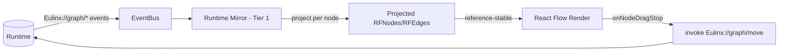
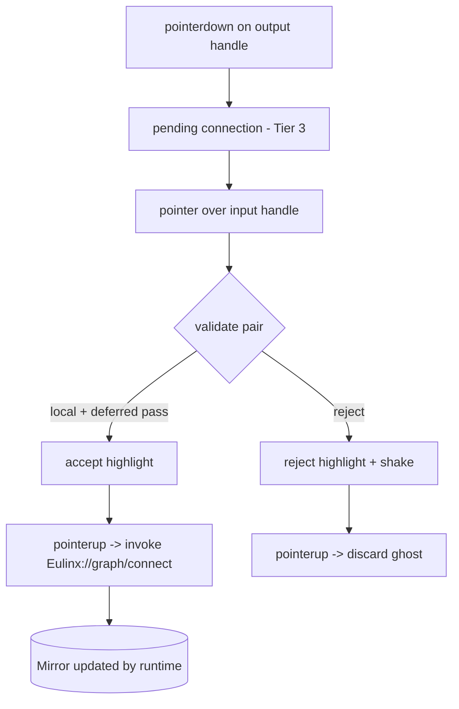
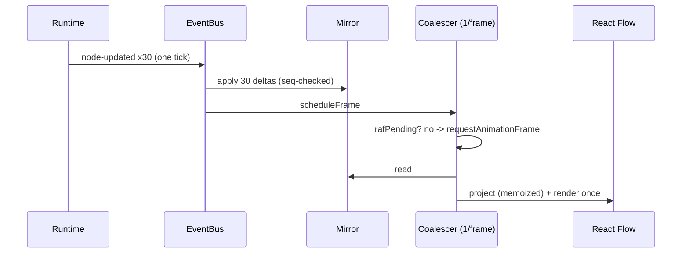
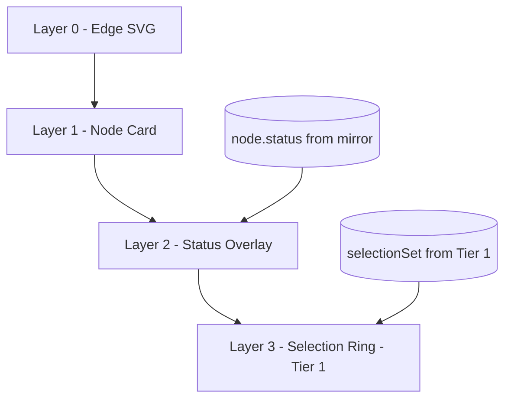
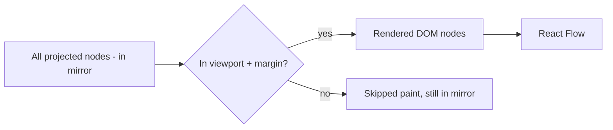
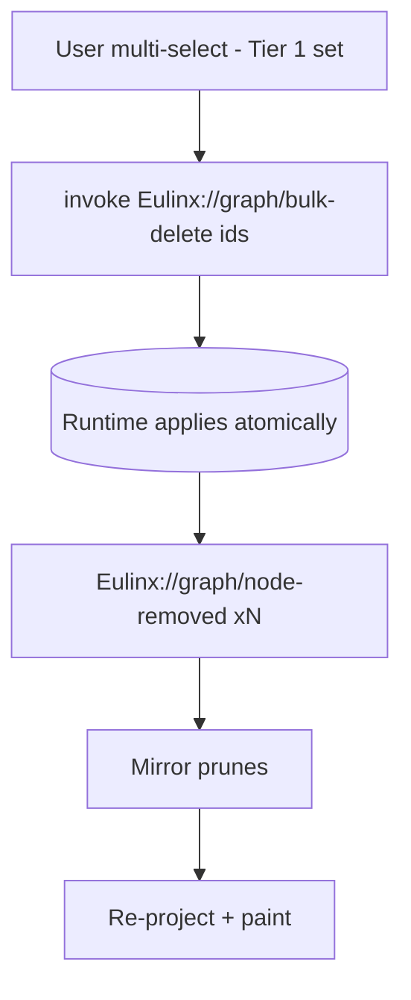

---
title: NodeGraph Diagrams
status: draft
version: 1.0
tags:
  - ui-ux
  - node-graph
  - diagrams
related:
  - "[[07-ui-ux/README]]"
  - "[[NodeGraph-Part01]]"
  - "[[NodeGraph-Part08]]"
---

# NodeGraph Diagrams

These diagrams illustrate the mirror-and-project model, the connection lifecycle, the event diff path, and the performance coalescing strategy from the NodeGraph parts.

## Tier 1 Mirror -> Projection -> React Flow

## Connection Drag Lifecycle

## Event Diff and Paint (per frame)

## Node Status Paint Layers

## Viewport Culling

## Bulk Operation Flow

## Related Documents

- [[07-ui-ux/README]]
- [[NodeGraph-Part01]]
- [[NodeGraph-Part02]]
- [[NodeGraph-Part03]]
- [[NodeGraph-Part04]]
- [[NodeGraph-Part05]]
- [[NodeGraph-Part06]]
- [[NodeGraph-Part07]]
- [[NodeGraph-Part08]]
- [[EventBus-Part01]]
- [[DesignTokens-Part03]]
