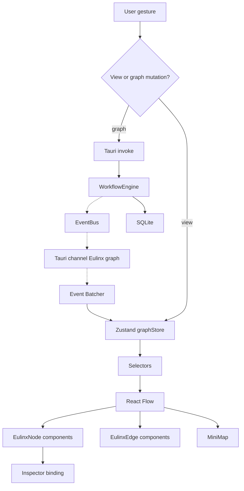

---
title: NodeGraph Specification - Part 01
status: draft
version: 1.0
tags:
  - ui-ux
  - node-graph
  - architecture
related:
  - "[[07-ui-ux/README]]"
  - "[[NodeTypes-Part01]]"
  - "[[EdgeTypes-Part01]]"
  - "[[WorkflowEngine-Part01]]"
  - "[[EventBus-Part01]]"
---

# NodeGraph Specification (Part 01)

## Document Index

Part 01 - Purpose, Philosophy, Object Model, and the Rendering Library Decision
Part 02 - Node Visual Specification for Every Node Kind
Part 03 - Live Status Coloring, Event Mapping, and Edge Rendering
Part 04 - Viewport, Pan, Zoom, Minimap, and Auto-Layout
Part 05 - Selection, Connection, Port Compatibility, and Inspector Binding
Part 06 - Live Graph Mutation and Delta Reconciliation
Part 07 - Performance Rules, Budgets, and Thresholds
Part 08 - Implementation Checklist, Worked Examples, Common Mistakes
Diagrams - NodeGraph-Diagrams.md

# Purpose

The NodeGraph is the canvas on which a Eulinx user watches a Workflow run.

It is the signature surface of the product. Everything else in `07-ui-ux` supports it: [[WorkspaceLayout-Part01]] gives it a rectangle, [[Panels-Part01]] docks the inspector beside it, [[TerminalView-Part01]] shows what a single Worker is saying, and [[DesignTokens-Part01]] gives it colors. The NodeGraph is where the user sees the whole machine at once.

This document specifies the frontend. It is a React + TypeScript specification. It contains component trees, prop types, store slices, Tauri `invoke` command names, and `listen` channel names. It contains no Rust.

```text
WorkflowEngine (06) owns the graph.
NodeGraph      (07) owns the picture of the graph.

The engine never reads the picture.
The picture never writes the graph directly.
```

# Core Philosophy

The NodeGraph is a **subscriber**, not an owner.

The authoritative Workflow graph lives in SQLite and in the WorkflowEngine's in-memory mirror. React Flow state is a projection of it. The canvas MUST NOT be treated as a source of truth for anything the engine reads.

This has one hard consequence that implementers get wrong constantly: when a user drags a node, that is a **view mutation**. When a user connects two nodes, that is a **graph mutation** and it MUST travel to the backend through an `invoke`, be validated there, and come back as an event before it is considered real. Optimistic rendering is permitted; optimistic truth is not.

```text
View mutations  (position, zoom, selection, collapse)
  -> local Zustand store only
  -> persisted as presentation, never affects execution

Graph mutations (add node, connect, delete, edit config)
  -> invoke to backend
  -> backend validates
  -> backend emits event
  -> store applies event
  -> canvas re-renders
```

The section README of [[06-workflow-engine/README]] states the rule this document obeys: **node position is presentation, edges are truth.** A NodeGraph that reorders execution because a user dragged a node upward is broken.

The second philosophy point is that the canvas is **live by default**. Eulinx is not a diagram editor that occasionally polls. Workers change state many times per second. The graph is driven by [[EventBus-Part01]] events arriving over a Tauri channel, and Part 07 defines the batching that keeps that affordable.

# Definition

The NodeGraph is the React component subtree, Zustand store slice, and event subscription set that together:

- render every Node in a Workflow run as a positioned visual node
- render every Edge as a typed connector
- reflect live node and Worker status through color, badge, and motion
- provide pan, zoom, fit, and a minimap
- provide selection, multi-select, and drag-to-connect
- validate port compatibility visually before a connection is committed
- bind the current selection to the node inspector
- animate structural mutations when an Orchestrator expands the graph at runtime
- stay within the frame budget defined in Part 07 at 100+ nodes

The NodeGraph is NOT:

- the graph model (that is [[NodeArchitecture-Part01]])
- the node kind catalog (that is [[NodeTypes-Part01]])
- the edge semantics (that is [[EdgeTypes-Part01]])
- the execution order (that is [[WorkflowEngine-Part01]])

# Responsibilities

The NodeGraph MUST:

- treat the backend graph as authoritative and itself as a projection
- send every graph mutation through a Tauri `invoke` and wait for the resulting event
- subscribe to `Eulinx://graph` and `Eulinx://workflow/node_status_changed` (register this event in [[15-api/Contracts/Contracts-Part02]]) channels on mount and unsubscribe on unmount
- render an unknown node kind as an `unknown` placeholder node, never crash
- render an unknown edge kind as a plain gray control edge, never crash
- apply incoming deltas in `seq` order and detect gaps
- keep node position purely local unless the user explicitly saves layout
- expose every action in the canvas to the keyboard per [[KeyboardShortcuts-Part01]]
- respect `prefers-reduced-motion` per [[Animations-Part01]]
- read every color from [[DesignTokens-Part01]], never hardcode a hex value

The NodeGraph SHOULD:

- auto-layout a graph that has no saved positions
- animate newly inserted nodes rather than popping them in
- preserve viewport across a run restart
- show a stale badge when the event stream has gaps

The NodeGraph MUST NOT:

- infer execution order from vertical position
- mutate the backend graph without validation
- render more than the viewport plus the overscan margin at 100+ nodes
- re-render the whole canvas on a single node status change
- hold Worker output text in the graph store (that belongs to [[TerminalView-Part01]])
- allow a connection that Part 05's compatibility matrix rejects

# The Rendering Library Decision

**Decision: React Flow (`@xyflow/react`), version 12.x.**

This is not negotiable at implementation time. The alternatives were evaluated and rejected. The reasoning is recorded here so no implementer relitigates it.

```text
Requirement set that drove the decision:

R1  Nodes are rich React components (badges, progress, avatars, live text).
R2  100+ nodes at 60fps while status events stream continuously.
R3  Drag-to-connect with typed ports and live compatibility feedback.
R4  Pan, zoom, minimap, fit-to-view out of the box.
R5  Runtime graph mutation with animation (Orchestrator expansion).
R6  Keyboard accessible, screen-reader reachable.
R7  Team is React + TypeScript. No graphics engineers.
```

## Why React Flow

React Flow renders nodes as real DOM elements inside a CSS-transformed viewport, and edges as SVG paths in a single overlay. That hybrid is exactly the shape of Eulinx's problem. Nodes need to be React (R1). Edges need to be cheap vector paths. React Flow gives both without asking the team to invent either.

It ships `<MiniMap>`, `<Controls>`, `<Background>`, `fitView`, `useReactFlow`, connection validation hooks, and selection semantics (R3, R4, R6). Each of those is one to three weeks of work to build correctly and is already done.

It supports `onlyRenderVisibleElements`, node-level `memo`, and external state via `useNodesState` replacement, which is how Part 07 hits the 100-node budget (R2).

Its node data is a plain object we control, so the store slice in this document is the store slice, not a fight against a library's internal model (R5).

## Alternatives Rejected

```text
Raw SVG + hand-rolled transforms
  + total control, zero dependency
  - must implement: hit testing, pan/zoom matrix, selection rect, connection
    dragging, minimap, edge routing, focus management, zoom-relative stroke
  - rich node content inside <foreignObject> has known Safari/WebKit bugs and
    Tauri v2 uses WKWebView on macOS. Disqualifying on its own.
  - estimated 8-12 weeks to reach React Flow parity, then owned forever
  VERDICT: rejected. Rebuilds a solved problem on a broken primitive.

Canvas 2D (single <canvas>, immediate mode)
  + fastest raw draw path, trivially handles 10k nodes
  - node content must be drawn by hand: text layout, wrapping, ellipsis,
    icons, progress arcs, focus rings. Every badge becomes drawing code.
  - zero accessibility. Nothing in a canvas is in the a11y tree. Violates R6
    and [[Accessibility-Part01]].
  - no CSS, so [[DesignTokens-Part01]] and [[Themes-Part01]] cannot apply.
  - text is not selectable, not searchable, not translatable
  VERDICT: rejected. Eulinx needs 100+ nodes, not 10k. We are trading the thing
  we need (rich accessible nodes) for headroom we will never use.

D3 (d3-zoom, d3-drag, d3-force)
  + excellent zoom/drag math, mature
  - D3 owns the DOM; React owns the DOM. Reconciling the two is a permanent
    tax and a well-known source of bugs.
  - d3-force is a physics simulation. Eulinx graphs are DAGs with meaningful
    layered order. Force layout makes a workflow look like a hairball and
    moves nodes every tick, which destroys the stable mental map users build.
  - no node/edge/port model. We would write the graph layer anyway.
  VERDICT: rejected as a renderer. d3-hierarchy MAY be used offline for
  layout math if ELK ever fails us. See Part 04.

Cytoscape.js
  + real graph library, strong layout suite, handles large graphs
  - nodes are styled with a CSS-like stylesheet DSL, NOT React components.
    Rendering a live progress bar and a model badge inside a node means HTML
    overlays positioned by hand on top of Cytoscape, which is the worst of
    both designs. Fails R1 outright.
  - imperative API fights React's declarative model
  - the graph model is Cytoscape's, not ours. Fails R5.
  VERDICT: rejected. It is a graph analysis renderer. Eulinx needs a UI canvas.

Custom WebGL (PixiJS / regl / raw)
  + would trivially hit R2
  - everything said about Canvas 2D, doubled, plus shader maintenance
  - no team member owns it. Fails R7 catastrophically.
  - 100+ nodes does not need a GPU. This is optimizing a problem we do not
    have at the cost of every problem we do have.
  VERDICT: rejected. Wrong tool by two orders of magnitude.
```

## The Cost We Accept

React Flow renders DOM. DOM has a ceiling. That ceiling is roughly 400 to 600 simultaneously mounted nodes on a mid-tier laptop before layout thrash becomes visible.

Eulinx's stated target is 100+ nodes, and Part 07 defines virtualization that keeps mounted node count near the viewport count regardless of graph size. The ceiling is therefore not reached in the product's design envelope. If a future Eulinx renders 5000-node graphs, this decision is revisited in a new ADR under `14-architecture-decisions`, not in this file.

# NodeGraph Object Model

Every type below is complete. There are no elided fields.

```ts
import type { Node as RFNode, Edge as RFEdge, XYPosition } from "@xyflow/react";

export type NodeId = string;
export type EdgeId = string;
export type RunId = string;
export type WorkerId = string;
export type PortId = string;
export type IsoTimestamp = string;

/** The canonical node kinds. Mirrors [[NodeTypes-Part01]] exactly. */
export type EulinxNodeKind =
  | "input"
  | "output"
  | "worker"
  | "orchestrator"
  | "builder"
  | "verifier"
  | "condition"
  | "loop"
  | "merge"
  | "artifact"
  | "memory"
  | "tool"
  | "mcp"
  | "delay"
  | "human_approval"
  | "unknown";

/** Node execution state. Mirrors [[NodeArchitecture-Part01]]. */
export type EulinxNodeState =
  | "pending"
  | "ready"
  | "running"
  | "succeeded"
  | "failed"
  | "skipped"
  | "cancelled";

/** Derived visual state. Superset of EulinxNodeState. Part 03 owns the mapping. */
export type NodeVisualState =
  | "pending"
  | "ready"
  | "running"
  | "waiting"
  | "blocked"
  | "succeeded"
  | "failed"
  | "skipped"
  | "cancelled"
  | "stale";

export type PortDirection = "in" | "out";

/** Mirrors the edge kinds in [[EdgeTypes-Part01]]. */
export type EulinxEdgeKind =
  | "control"
  | "data"
  | "artifact"
  | "dependency"
  | "communication";

/** Data type carried by a port. Drives the Part 05 compatibility matrix. */
export type PortDataType =
  | "control"
  | "text"
  | "json"
  | "artifact_ref"
  | "artifact_set"
  | "boolean"
  | "number"
  | "memory_ref"
  | "any";

export type EulinxPort = {
  portId: PortId;
  nodeId: NodeId;
  direction: PortDirection;
  /** Human label rendered on hover. Max 24 chars enforced at render. */
  label: string;
  dataType: PortDataType;
  /** An in-port with required=true and no satisfied edge renders an error ring. */
  required: boolean;
  /** How many edges may attach. null means unbounded. Out-ports are usually null. */
  maxConnections: number | null;
  /** Index within its side, top to bottom. Drives geometry in Part 02. */
  ordinal: number;
};

/** The payload React Flow carries on every node. This is `RFNode<EulinxNodeData>`. */
export type EulinxNodeData = {
  nodeId: NodeId;
  runId: RunId;
  kind: EulinxNodeKind;
  /** User-facing title. Truncated with ellipsis at render. */
  label: string;
  /** One-line summary shown in the body zone. May be empty string. */
  subtitle: string;
  state: EulinxNodeState;
  visualState: NodeVisualState;
  ports: EulinxPort[];
  /** Present only when this node is currently bound to a live Worker. */
  workerId: WorkerId | null;
  /** 0..1. null means indeterminate; render a pulse instead of a bar. */
  progress: number | null;
  /** Provider/model badge text, e.g. "sonnet". Empty string hides the badge. */
  modelBadge: string;
  /** Attempt number, 1-based. Values > 1 render a retry badge. */
  attempt: number;
  /** Count of artifacts this node has emitted so far. 0 hides the badge. */
  artifactCount: number;
  /** Set when state === "failed". Rendered in the inspector, not the node. */
  errorCode: string | null;
  errorMessage: string | null;
  /** Loop nodes only. null on every other kind. */
  iteration: { current: number; max: number } | null;
  /** True while this node is animating in after a runtime insertion. Part 06. */
  isEntering: boolean;
  /** True when the node was inserted by an Orchestrator, not the author. */
  isDynamic: boolean;
  /** Monotonic per-node version from the backend. Part 06 uses it to reject stale deltas. */
  version: number;
  startedAt: IsoTimestamp | null;
  finishedAt: IsoTimestamp | null;
};

/** The payload React Flow carries on every edge. This is `RFEdge<EulinxEdgeData>`. */
export type EulinxEdgeData = {
  edgeId: EdgeId;
  kind: EulinxEdgeKind;
  sourcePortId: PortId;
  targetPortId: PortId;
  /** True when the edge's condition is met and data has flowed. Part 03. */
  satisfied: boolean;
  /** True while a payload is visibly travelling this edge. Part 03. */
  active: boolean;
  /** Condition edges only. The branch label, e.g. "true". Empty string otherwise. */
  branchLabel: string;
  /** Rendered mid-edge when non-null, e.g. an artifact count. */
  badge: string | null;
};

export type EulinxGraphNode = RFNode<EulinxNodeData>;
export type EulinxGraphEdge = RFEdge<EulinxEdgeData>;

export type Viewport = { x: number; y: number; zoom: number };

/** Presentation-only per-node state. Never sent to the engine as truth. */
export type NodeViewState = {
  position: XYPosition;
  collapsed: boolean;
  /** True when the user has manually placed this node. Auto-layout skips it. */
  pinned: boolean;
};
```

# States

The canvas itself has a lifecycle. It is small and MUST be implemented explicitly rather than inferred from null checks.

```text
idle          no run bound. Empty-state illustration.
loading       invoke graph_get_snapshot in flight.
ready         snapshot applied, channels subscribed, rendering.
live          ready + at least one node in a non-terminal state.
degraded      a delta gap was detected. Stale badge shown. Resync pending.
resyncing     invoke graph_get_snapshot in flight to repair a gap.
error         snapshot invoke rejected. Retry affordance shown.
```

```text
idle -> loading        run bound
loading -> ready       snapshot ok
loading -> error       invoke rejected
ready -> live          first non-terminal node observed
live -> ready          all nodes terminal
ready|live -> degraded seq gap detected
degraded -> resyncing  resync timer fires
resyncing -> ready     snapshot ok
resyncing -> degraded  invoke rejected, backoff
error -> loading       user retry
any -> idle            run unbound / unmount
```

# Invariants

```text
The backend graph is authoritative. The canvas is a projection of it.
Every graph mutation reaches the backend before it is considered real.
Node position never affects execution order.
Deltas are applied in strictly increasing seq order.
A delta with version <= the local node version is discarded.
A gap in seq forces degraded, never silent divergence.
An unknown node kind renders; it never throws.
An unknown edge kind renders; it never throws.
Exactly one node is bound to the inspector at a time, or none.
A connection is drawn only if the Part 05 matrix accepts it.
Mounted node count is bounded by viewport, not by graph size.
No color is a literal. Every color is a token.
Every subscription created on mount is destroyed on unmount.
```

# Tauri IPC Surface

The complete set of commands and channels the NodeGraph touches. Part 03 and Part 05 give payloads.

```ts
/** invoke commands. Every one returns a Result; every one can reject. */
type NodeGraphCommands = {
  graph_get_snapshot: (args: { runId: RunId }) => Promise<GraphSnapshot>;
  graph_add_node: (args: { runId: RunId; kind: EulinxNodeKind; position: XYPosition }) => Promise<NodeId>;
  graph_delete_nodes: (args: { runId: RunId; nodeIds: NodeId[] }) => Promise<void>;
  graph_connect: (args: { runId: RunId; sourcePortId: PortId; targetPortId: PortId }) => Promise<EdgeId>;
  graph_disconnect: (args: { runId: RunId; edgeIds: EdgeId[] }) => Promise<void>;
  graph_update_node_config: (args: { runId: RunId; nodeId: NodeId; config: unknown }) => Promise<void>;
  graph_save_layout: (args: { runId: RunId; positions: Record<NodeId, XYPosition> }) => Promise<void>;
  graph_validate_connection: (args: { runId: RunId; sourcePortId: PortId; targetPortId: PortId }) => Promise<ConnectionVerdict>;
};

/** listen channels. Payload shapes are in Part 03 and Part 06. */
type NodeGraphChannels = {
  "Eulinx://graph": GraphDeltaEnvelope;
  "Eulinx://workflow/node_status_changed (register in Contracts-Part02)": NodeStatusEnvelope;
  "Eulinx://workflow/run_status_changed (register in Contracts-Part02)": RunStatusEnvelope;
};
```

# Mermaid Diagram



# AI Notes

Do not put the graph in React Flow's own `useNodesState` hook and call it done. That hook owns state internally, which means the event stream and the user gesture stream fight over the same array and the last writer wins. The store in Part 03 is the owner. React Flow receives `nodes` and `edges` as props and reports gestures back through callbacks.

Do not apply an incoming delta by rebuilding the whole node array. That is an O(n) allocation per event, at hundreds of events per second, and it invalidates every memo. Part 06 defines targeted, per-node application.

Do not let a node's position round-trip to the backend on every drag frame. `onNodeDragStop` writes local state. `graph_save_layout` is called on an explicit save or a debounce of 2000ms, never per frame.

Do not render Worker output inside a node. A node shows status, not content. Output lives in [[TerminalView-Part01]] and streams at a volume that will destroy this canvas if you let it in. The `worker.output_streamed` event MUST NOT be subscribed to by the NodeGraph at all.

Do not skip the `unknown` node kind. Plugins register node kinds at runtime per [[NodeArchitecture-Part01]], and a version skew between a saved graph and the installed plugin set is normal, not exceptional. A canvas that throws on an unrecognized `kind` string will white-screen a user's whole workspace.

Do not assume the snapshot arrives before the first delta. It does not, reliably. Part 06 defines the buffer that holds early deltas until the snapshot lands.

# Related Documents

- [[07-ui-ux/README]]
- [[NodeGraph-Part02]]
- [[NodeGraph-Diagrams]]
- [[NodeTypes-Part01]]
- [[EdgeTypes-Part01]]
- [[DynamicGraphs-Part01]]
- [[NodeArchitecture-Part01]]
- [[WorkflowEngine-Part01]]
- [[EventBus-Part01]]
- [[Worker-Part01]]
- [[Orchestrator-Part01]]
- [[WorkspaceLayout-Part01]]
- [[TerminalView-Part01]]
- [[Panels-Part01]]
- [[DesignTokens-Part01]]
- [[Animations-Part01]]
- [[KeyboardShortcuts-Part01]]
