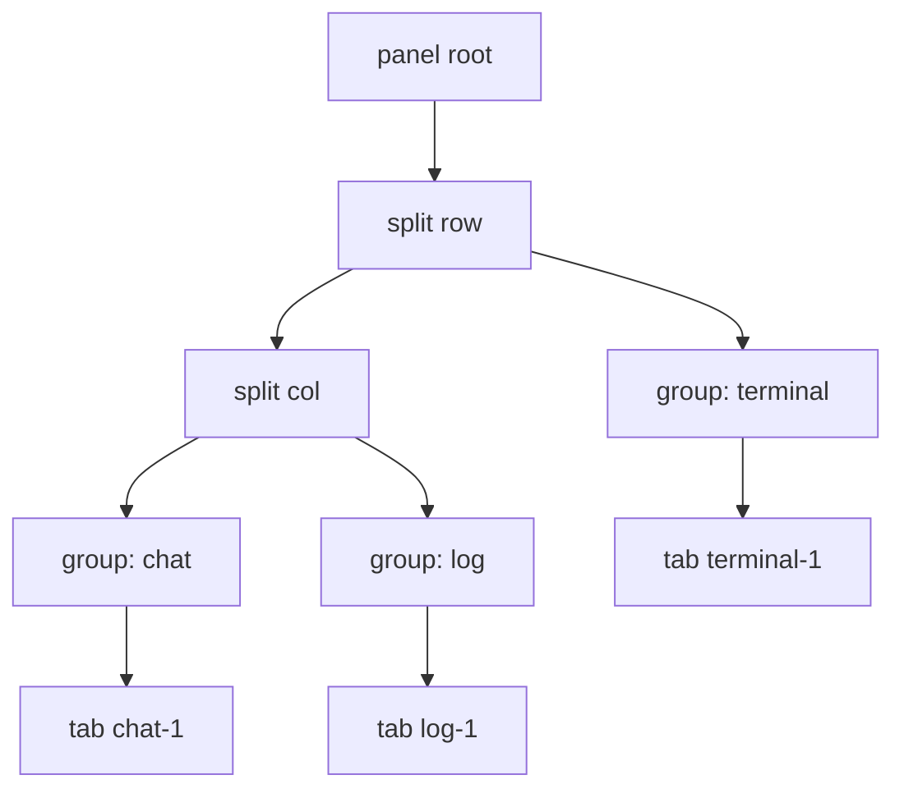
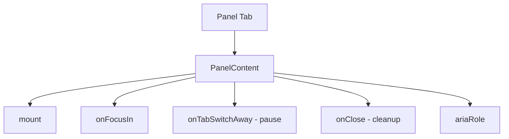
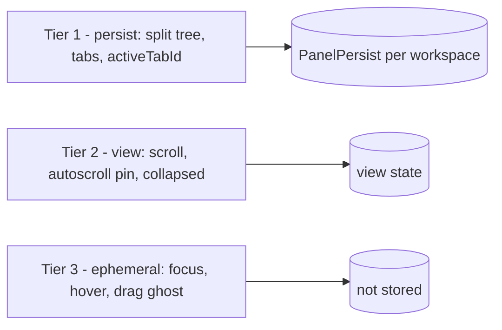
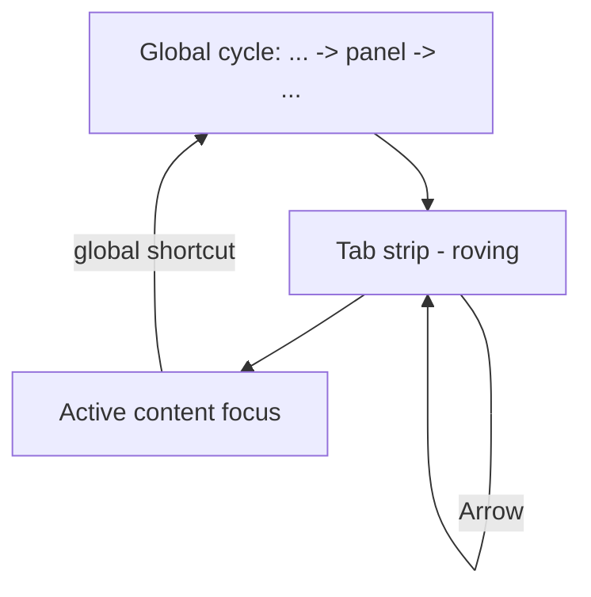
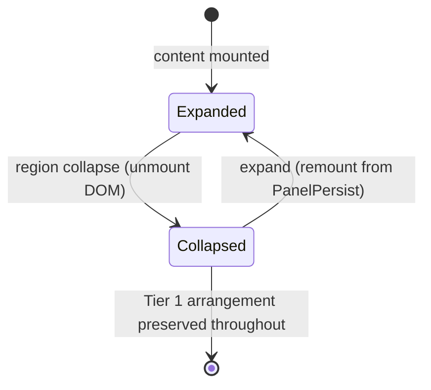

# Panels Diagrams

These diagrams show the split-tree model, the content contract, the persistence tiers, and the focus path inside a panel.

## Split Tree Model

## Content Contract

## State Tiers

## Focus Path Inside a Panel

## Collapse Preserves Tier 1

## Related Documents

- [[07-ui-ux/README]]
- [[Panels-Part01]]
- [[Panels-Part02]]
- [[Panels-Part03]]
- [[Panels-Part04]]
- [[Panels-Part05]]
- [[Panels-Part06]]
- [[WorkspaceLayout-Part03]]
- [[WorkspaceLayout-Part04]]
- [[TerminalView-Part01]]
- [[Accessibility-Part01]]
- [[KeyboardShortcuts-Part01]]
