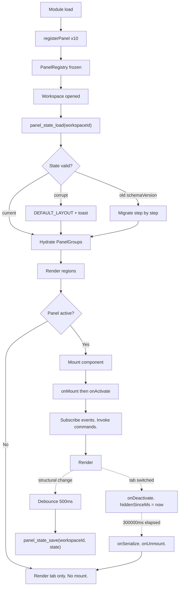

---
title: Panels Specification - Part 01
status: draft
version: 1.0
tags:
  - ui-ux
  - panels
  - architecture
related:
  - "[[07-ui-ux/README]]"
  - "[[WorkspaceLayout-Part01]]"
  - "[[DesignTokens-Part01]]"
  - "[[EventBus-Part01]]"
---

# Panels Specification (Part 01)

## Document Index

Part 01 - Purpose, Philosophy, Definition, Object Model, States, Invariants
Part 02 - The Panel Registry and the Ten Panel Kinds
Part 03 - Docking Regions, Tab Groups, and the Panel Contract
Part 04 - State Persistence, Versioning, Migration, and Lazy Mounting
Part 05 - Artifact Review, Permission Prompts, Checklist, Examples
Diagrams - Panels-Diagrams.md

# Purpose

Panels is the frontend specification for every dockable surface inside the Eulinx Tauri window that is not the node graph and not the terminal card grid.

A Panel is a React component with a stable identity, a declared docking region, a declared data source, and a persisted layout position. The user drags panels between regions, stacks them into tabs, resizes them, closes them, and reopens them. Across an app restart the arrangement comes back exactly as it was left.

```text
WorkspaceLayout owns the outer frame: which regions exist and how big they are.
Panels owns what goes INSIDE a region: registration, mounting, tabs, data, lifecycle.

WorkspaceLayout draws the box. Panels fills it.
```

This document is a frontend contract. It specifies React component trees, TypeScript types with every field, the exact Tauri v2 `invoke` command names, and the exact `Eulinx://` event names. It specifies no Rust. The Rust side is owned by [[EventBus-Part01]], [[ArtifactManager-Part01]], and [[PermissionManager-Part01]].

# Core Philosophy

A Panel is a **view**, never an **actor**.

A Panel reads runtime state and renders it. A Panel collects a user decision and reports it. A Panel MUST NOT compute the consequence of that decision, and MUST NOT apply it.

This matters most in the artifact review panel, specified in Part 05. That panel is where a human approves a Worker's output. It would be natural to write the approve button so that it merges the patch. That is forbidden. The panel calls `artifact_approve` and stops. The MergeManager decides whether the merge happens, and performs it. See [[MergeFlow-Part01]].

```text
AI output MUST NOT directly mutate trusted state.
A Panel MUST NOT mutate trusted state either.

A Panel records an intent. A runtime service acts on it.
```

The second philosophy is that **panels are cheap to declare and expensive to mount**. Every panel kind is a static descriptor in a registry, known at build time. Registering a panel costs one object. Mounting one may open a subscription, pull a diff, and allocate a virtualized list. Therefore registration is eager and total; mounting is lazy and reversible. Part 04 specifies the exact rules.

The third philosophy is that **layout is user property**. If the user arranged six panels a certain way, the app has no right to rearrange them. Eulinx MUST NOT auto-open a panel, auto-focus a panel, or reflow a region except on an explicit user action or an explicit `Eulinx://panel.focus_requested` event that the user's own action triggered.

# Definition

The Panel System is the frontend subsystem that owns:

- the `PanelRegistry`, a build-time map of `PanelKind` to `PanelDescriptor`
- the ten concrete panel kinds: Inspector, Artifacts, Diff/Review, Memory, Logs, Events, Metrics, Permissions, Problems, Search
- the four docking regions: `left`, `right`, `bottom`, `center`
- tab groups within a region and the active tab per group
- drag and drop between regions and between tab groups
- resize, min size, max size, and split math in design tokens
- the `PanelContract` interface every panel component implements
- panel lifecycle hooks: `onMount`, `onActivate`, `onDeactivate`, `onUnmount`, `onSerialize`, `onDeserialize`
- persistence of layout via `panel_state_load` and `panel_state_save`
- schema versioning, migration of an old layout, and corrupt-state fallback
- lazy mounting and idle unmounting

The Panel System does NOT own:

- the outer window chrome or the region splitters themselves ([[WorkspaceLayout-Part01]])
- the worker card grid ([[TerminalCards-Part01]])
- the project/worker tree ([[Sidebar-Part01]])
- color, spacing, or motion values ([[DesignTokens-Part01]], [[Themes-Part01]])
- keybinding definitions ([[KeyboardShortcuts-Part01]])
- focus order and ARIA rules ([[Accessibility-Part01]])

# Responsibilities

The Panel System MUST:

- register all ten panel kinds at module load, before the first render
- reject a duplicate `PanelKind` registration with a thrown error at load time
- assign every open panel an instance id that is unique for the lifetime of the workspace
- enforce `singleton: true` by focusing the existing instance instead of opening a second
- persist layout on every structural change, debounced at exactly 500ms
- restore layout on workspace open via `panel_state_load(workspaceId)`
- fall back to `DEFAULT_LAYOUT` when the loaded state is corrupt, and tell the user
- migrate a layout whose `schemaVersion` is older than current, one step at a time
- drop any panel instance whose `kind` is not in the registry during restore
- mount a panel's component only on first activation when `PANEL_LAZY_MOUNT` is true
- unmount a hidden panel after `PANEL_UNMOUNT_AFTER_MS` and keep its serialized state
- drop any event whose `seq` is less than or equal to the last processed `seq` for that entity
- render an explicit empty state and an explicit error state for every panel kind

The Panel System SHOULD:

- keep the active panel of each region mounted even past the idle timer
- prefetch the Diff/Review panel's data when an artifact row is hovered for 200ms
- collapse a region to zero width when its last panel is closed

The Panel System MUST NOT:

- apply a merge, a permission grant, or any state mutation from inside a panel
- auto-open a panel that the user did not open
- steal focus except on `Eulinx://panel.focus_requested`
- hardcode a color, a size, or a duration; every value comes from a `var(--Eulinx-*)`
- persist panel data content, only panel layout and panel view state
- allow two instances of a singleton kind to exist simultaneously
- unmount a panel that is currently the active tab of a visible region

# Panel Object Model

```ts
type PanelKind =
  | "inspector"
  | "artifacts"
  | "diff"
  | "memory"
  | "logs"
  | "events"
  | "metrics"
  | "permissions"
  | "problems"
  | "search";

type PanelRegion = "left" | "right" | "bottom" | "center";

type PanelInstanceId = string;

type PanelDescriptor = {
  kind: PanelKind;
  title: string;
  icon: string;
  defaultRegion: PanelRegion;
  singleton: boolean;
  minWidthToken: string;
  minHeightToken: string;
  maxWidthToken: string | null;
  component: React.ComponentType<PanelProps>;
  dataSource: PanelDataSource;
  closable: boolean;
  reorderable: boolean;
  defaultOpen: boolean;
};

type PanelDataSource = {
  commands: string[];
  events: string[];
  pollIntervalMs: number | null;
};

type PanelInstance = {
  instanceId: PanelInstanceId;
  kind: PanelKind;
  region: PanelRegion;
  groupId: string;
  tabIndex: number;
  title: string;
  mounted: boolean;
  active: boolean;
  hiddenSinceMs: number | null;
  viewState: unknown;
  errorState: PanelErrorState | null;
  args: PanelArgs;
};

type PanelArgs = {
  workerId?: string;
  artifactId?: string;
  requestId?: string;
  query?: string;
};

type PanelErrorState = {
  kind: PanelErrorKind;
  message: string;
  retryable: boolean;
  at: string;
};

type PanelErrorKind =
  | "ipc_failed"
  | "ipc_timeout"
  | "decode_failed"
  | "entity_not_found"
  | "permission_denied"
  | "render_crashed";

type PanelGroup = {
  groupId: string;
  region: PanelRegion;
  instanceIds: PanelInstanceId[];
  activeInstanceId: PanelInstanceId | null;
  sizeFraction: number;
};
```

`viewState` is `unknown` on purpose. Each panel kind narrows it in Part 02. The layout engine MUST NOT read it. It only serializes it.

`args` is how a panel is scoped. An Inspector panel with `args.workerId = "w_7742"` inspects that worker forever. It does not follow selection. If the user wants a different worker inspected, they open a different Inspector or the Inspector's own follow-selection toggle rewrites `args`.

# States

A panel instance moves through six states. This is a strict machine and the layout engine is the only thing that may drive it.

```text
registered     the kind exists in the registry, no instance
opened         an instance exists, component not mounted
mounted        component mounted, currently hidden
active         component mounted, visible, is the active tab of its group
idle_hidden    mounted, hidden, hiddenSinceMs is counting
unmounted      instance exists, component gone, viewState preserved
closed         instance destroyed, viewState discarded
```

```text
registered --open--> opened
opened     --first activate--> mounted --> active
active     --another tab activated--> idle_hidden
idle_hidden --activate--> active
idle_hidden --PANEL_UNMOUNT_AFTER_MS elapsed--> unmounted
unmounted  --activate--> mounted --> active
any        --close--> closed
```

The transition `active -> unmounted` MUST NOT exist. A visible panel is never unmounted. The idle timer only runs in `idle_hidden`.

The transition `unmounted -> active` MUST restore `viewState` through `onDeserialize` before the first paint. A panel that flashes empty on reactivation has violated this.

# Invariants

```text
Every PanelInstance.kind resolves to a PanelDescriptor in the registry.
Every PanelInstance belongs to exactly one PanelGroup.
Every PanelGroup belongs to exactly one PanelRegion.
A group's activeInstanceId is null or a member of its own instanceIds.
A group with zero instances is deleted in the same commit that emptied it.
At most one instance of a kind with singleton true exists per workspace.
A panel is mounted before it is active. Always.
An active panel is never unmounted.
hiddenSinceMs is null when active and non-null when idle_hidden.
The sum of sizeFraction across groups in a region equals exactly 1.0.
Layout persists only structure and viewState, never fetched data.
No panel writes to trusted state. Ever.
Every event listener drops seq <= lastSeq for its entity.
```

The `sizeFraction` invariant deserves emphasis. Fractions are stored, not pixels. A window resize MUST NOT rewrite the layout. Pixels are computed at render from fraction times region size, then clamped to min and max. Part 03 gives the exact arithmetic.

# Mermaid Diagram



# AI Notes

Do not put business logic in a panel. The single most common failure is an approve button whose handler applies a patch. The handler calls `artifact_approve(artifactId, decision)` and renders a pending spinner until `Eulinx://artifact.verified` arrives. Nothing else. If your approve handler touches a file, you have broken Eulinx's cardinal rule and Part 05 exists solely to stop you.

Do not store pixels in the layout. Store `sizeFraction`. A user who resizes the window and gets a scrambled layout is looking at pixel storage.

Do not mount all panels on load "because it is simpler". Ten mounted panels means ten event subscriptions and ten data fetches for a user who is looking at one of them. `PANEL_LAZY_MOUNT` is `true` and it is not optional.

Do not throw away `viewState` on unmount. Unmount destroys the component; it does not destroy the instance. A user who scrolled the Logs panel to line 4000, switched tabs for six minutes, and came back to line 0 is looking at a dropped `onSerialize`.

Do not process events in arrival order. Process them in `seq` order and drop anything stale. Tauri's event channel does not guarantee ordering, and a stale `Eulinx://worker.state_changed` will render a terminated worker as `working`.

Do not let a panel crash the window. Every panel component is wrapped in an error boundary that writes `PanelErrorState` with `kind: "render_crashed"` and renders the error state. One broken panel MUST NOT blank the app.

Do not invent a panel kind. The ten in Part 02 are the complete set. A new kind is a spec change, not an implementation decision.

# Related Documents

- [[07-ui-ux/README]]
- [[Panels-Part02]]
- [[Panels-Part03]]
- [[Panels-Part04]]
- [[Panels-Part05]]
- [[Panels-Diagrams]]
- [[WorkspaceLayout-Part01]]
- [[TerminalCards-Part01]]
- [[Sidebar-Part01]]
- [[DesignTokens-Part01]]
- [[Themes-Part01]]
- [[EventBus-Part01]]
- [[MergeFlow-Part01]]
- [[PermissionManager-Part01]]
- [[ArtifactManager-Part01]]
- [[Accessibility-Part01]]
- [[KeyboardShortcuts-Part01]]
