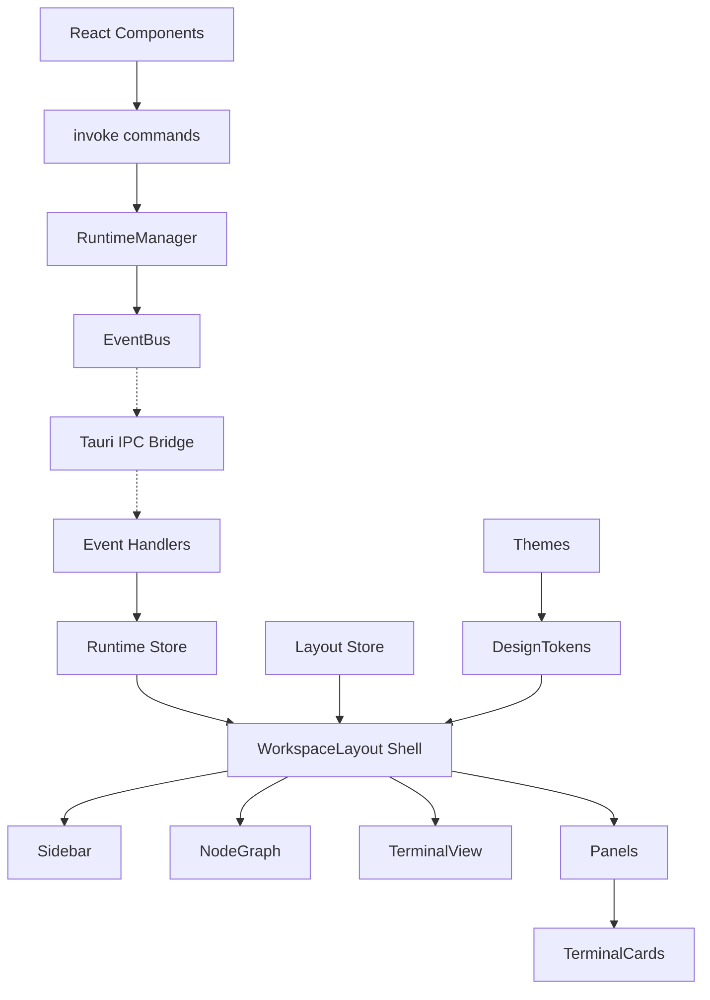

---
title: 07 UI UX
status: draft
version: 1.0
tags:
  - ui-ux
  - frontend
  - architecture
  - Eulinx
  - flow:P18-UI-DASH
  - flow:P18-UI-WFDESIGN
  - flow:P18-UI-METRICS
  - flow:P18-UI-SETTINGS
related:
  - "[[WorkspaceLayout-Part01]]"
  - "[[NodeGraph-Part01]]"
  - "[[TerminalView-Part01]]"
  - "[[EventBus-Part01]]"
  - "[[Workspace-Part01]]"
---

# 07 UI UX

## Purpose

The `07-ui-ux` folder defines Eulinx's frontend.

If `01-core-concepts` defines the nouns and `02-runtime` defines the services that move them, this folder defines the single surface through which a human ever sees or touches any of it.

Eulinx's frontend is a React + TypeScript application rendered inside a Tauri v2 window. It talks to the Rust backend over exactly two channels: `invoke` for commands, and `listen` for EventBus events. It has no other way to learn anything.

```text
The Runtime owns truth.
The EventBus broadcasts truth.
The UI renders truth.
The UI never invents truth.
```

This is the governing sentence of the entire section. The frontend is a **projection**, not a source. Every visual state in Eulinx corresponds to a backend fact that arrived over the EventBus or was returned by an `invoke`. A React component MUST NOT infer a Worker's state from a timer, a heuristic, or an optimistic guess that the backend has not confirmed.

The one exception is deliberate and narrow: **view-local state**. Pane widths, zoom level, which tab is active, scroll position, and text selection are the UI's own property. The backend does not know them and does not care. Part of the job of every topic here is to draw that line precisely, because implementers blur it constantly.

## UI UX Folder Structure

This folder is organized as surface specifications. Each folder describes one UI surface or one cross-cutting frontend concern.

```text
07-ui-ux/
  README.md

  WorkspaceLayout/
    WorkspaceLayout-Part01.md ... WorkspaceLayout-Part06.md
    WorkspaceLayout-Diagrams.md

  NodeGraph/
    NodeGraph-Part01.md ... NodeGraph-Part08.md
    NodeGraph-Diagrams.md

  TerminalView/
    TerminalView-Part01.md ... TerminalView-Part06.md
    TerminalView-Diagrams.md

  TerminalCards/
    TerminalCards-Part01.md ... TerminalCards-Part06.md
    TerminalCards-Diagrams.md

  Panels/
    Panels-Part01.md ... Panels-Part06.md
    Panels-Diagrams.md

  Sidebar/
    Sidebar-Part01.md ... Sidebar-Part04.md
    Sidebar-Diagrams.md

  Themes/
    Themes-Part01.md ... Themes-Part04.md
    Themes-Diagrams.md

  DesignTokens/
    DesignTokens-Part01.md ... DesignTokens-Part06.md
    DesignTokens-Diagrams.md

  Typography/
    Typography-Part01.md ... Typography-Part04.md
    Typography-Diagrams.md

  Icons/
    Icons-Part01.md ... Icons-Part04.md
    Icons-Diagrams.md

  Animations/
    Animations-Part01.md ... Animations-Part04.md
    Animations-Diagrams.md

  Accessibility/
    Accessibility-Part01.md ... Accessibility-Part06.md
    Accessibility-Diagrams.md

  KeyboardShortcuts/
    KeyboardShortcuts-Part01.md ... KeyboardShortcuts-Part04.md
    KeyboardShortcuts-Diagrams.md

  ResponsiveRules/
    ResponsiveRules-Part01.md ... ResponsiveRules-Part04.md
    ResponsiveRules-Diagrams.md
```

## Total UI UX Specification Size

The initial frontend plan contains:

```text
14 UI surface folders
1 root README
68 Markdown specification parts
14 Markdown diagram files
83 Markdown files in total
```

This may grow later if implementation reveals that a surface needs deeper treatment.

## UI Surface Responsibilities

## WorkspaceLayout

WorkspaceLayout owns the top-level window shell: the region model, the resizable and collapsible pane system, layout persistence per workspace, multi-tab and multi-workspace handling, the focus model, and the Tauri window configuration.

It is the frame every other surface is mounted inside. No other topic may position itself in the window; they occupy a region that WorkspaceLayout hands them.

Parts: 6

## NodeGraph

NodeGraph owns Eulinx's signature surface: the live canvas showing Workers and Workflow nodes, their edges, and their status in real time.

It covers the rendering approach, the visual spec of every node kind, live status coloring driven by EventBus events, edge rendering, pan and zoom and minimap, auto-layout, selection, drag-to-connect, inspector binding, runtime graph mutation, and the performance rules that keep 100+ nodes at 60fps.

Parts: 8

## TerminalView

TerminalView owns the embedded terminal: binding a PTY from ProcessLifecycle to a frontend terminal instance, the output event stream with backpressure and throttling, scrollback limits, ANSI handling, input routing, read-only Worker terminals versus interactive user terminals, search, copy and paste, resize propagation, and cleanup on Worker termination.

Parts: 6

## TerminalCards

TerminalCards owns the compact multi-terminal grid: the card shell around a TerminalView, the tiled and stacked arrangements, per-card status headers, and the rules for promoting a card to a full TerminalView.

Parts: 6

## Panels

Panels owns the dockable panel system inside a region: panel registration, tabbed panel groups, panel headers and toolbars, empty and error states, and the panel content contract.

Parts: 6

## Sidebar

Sidebar owns the left navigation surface: workspace and project switching, the tree of Workers and Sessions, filtering and search, and the collapsed icon rail.

Parts: 4

## Themes

Themes owns the theme system: the light and dark themes, theme switching, OS theme following, per-theme token overrides, and the terminal palette mapping.

Parts: 4

## DesignTokens

DesignTokens owns the single source of visual truth: color, spacing, radius, elevation, motion, and z-index scales, exposed as CSS custom properties and typed TypeScript constants.

Every other UI topic MUST consume tokens. No hardcoded hex value is permitted anywhere else in the section.

Parts: 6

## Typography

Typography owns the type system: the font stacks, the UI type scale, the monospace stack shared with TerminalView, line heights, and truncation rules.

Parts: 4

## Icons

Icons owns the icon system: the icon set choice, sizing rules, the icon-to-concept mapping, and the status glyph vocabulary shared with NodeGraph.

Parts: 4

## Animations

Animations owns motion: durations, easing curves, the enter and exit vocabulary, the graph mutation animations, and the reduced-motion contract.

Parts: 4

## Accessibility

Accessibility owns the a11y contract: focus visibility, keyboard reachability of every control, ARIA roles per surface, contrast requirements, screen reader announcements for asynchronous Worker events, and the reduced-motion and high-contrast paths.

Parts: 6

## KeyboardShortcuts

KeyboardShortcuts owns the key map: the global and per-surface bindings, the chord model, conflict resolution against terminal input capture, and the shortcut discovery overlay.

Parts: 4

## ResponsiveRules

ResponsiveRules owns behavior across window sizes: the breakpoints, the region collapse order under width pressure, minimum viable window size, and the multi-monitor and DPI-change rules.

Parts: 4

## Global Frontend Principles

The UI MUST render only state that came from the backend over `invoke` or `listen`.

The UI MUST treat every EventBus event as the authority over its local mirror of runtime state.

The UI MUST NOT mutate Project files, Artifacts, Workers, or any trusted state directly. It calls a Tauri command; the Runtime decides.

The UI MUST NOT enforce permissions. It MAY hide or disable a control it knows will be denied, but the PermissionManager is the only authority and the backend MUST re-check. A disabled button is a courtesy, never a control.

The UI MUST assume every asynchronous operation can fail, arrive late, arrive twice, or arrive out of order. Every event handler MUST be idempotent.

The UI MUST remain responsive while a Worker floods a terminal with output. Backpressure is a frontend responsibility, specified in [[TerminalView-Part03]].

The UI MUST consume DesignTokens. It MUST NOT hardcode a color, a spacing value, a duration, or a z-index.

The UI MUST keep view-local state out of the backend, and backend state out of component-local `useState`.

The UI MUST survive the backend disappearing. A dead Runtime renders as a degraded, honest UI, not a frozen one or a lying one.

The UI SHOULD render an unknown state as unknown. Guessing is worse than a spinner.

The UI MUST NOT block the main thread for more than 16ms in any interaction handler.

## State Ownership Model

Every piece of state in the Eulinx frontend belongs to exactly one of three tiers. Placing state in the wrong tier is the most common frontend bug in this project, so the tiers are named here and restated in every topic.

```text
TIER 1 - RUNTIME MIRROR         owner: backend
  Workers, Sessions, Executions, Artifacts, Workflow graphs,
  Permissions, Locks, process states.

  Lives in: Zustand runtime store slices.
  Written by: EventBus event handlers and invoke results ONLY.
  Never written by: a component, a click handler, an optimistic update.
  On conflict: the backend wins. Always. Without exception.

TIER 2 - VIEW STATE             owner: frontend, persisted
  Pane sizes, collapsed regions, active tab, zoom, pan offset,
  node positions when manually placed, theme choice, panel arrangement.

  Lives in: Zustand layout store slices.
  Written by: user interaction.
  Persisted to: SQLite via invoke, per workspace, debounced.
  The backend stores these bytes but never interprets them.

TIER 3 - EPHEMERAL STATE        owner: component
  Hover, drag-in-progress, text selection, an open menu,
  an unsubmitted input value, a transient tooltip.

  Lives in: useState / useRef inside the component.
  Persisted to: nothing. It dies with the component.
```

If you find yourself persisting Tier 3 state, you have made a mistake. If you find yourself writing Tier 1 state from a click handler, you have made a much worse one.

## The Two Channels

The frontend has exactly two ways to reach the Runtime, and the direction of each is fixed.

```ts
// Channel 1: commands. Frontend -> Runtime. Request/response.
import { invoke } from "@tauri-apps/api/core";

const result = await invoke<WorkerSummary[]>("list_workers", {
  workspaceId: "ws_01H8X",
});

// Channel 2: events. Runtime -> Frontend. Fire and forget, one way.
import { listen } from "@tauri-apps/api/event";

const unlisten = await listen<WorkerStateChanged>(
  "Eulinx://worker/state_changed",
  (event) => {
    runtimeStore.getState().applyWorkerStateChanged(event.payload);
  },
);
```

There is no third channel. The frontend MUST NOT open a socket, MUST NOT read a file from disk, MUST NOT poll for state that an event already reports, and MUST NOT talk to a Provider API directly.

Every `listen` registration MUST be paired with its `unlisten` in the same effect cleanup. A leaked listener in Eulinx does not just waste memory; it double-applies events after a workspace switch and corrupts the runtime mirror. This is specified per surface and is not optional.

## UI Architecture Overview



## ASCII Overview

```text
Rust Runtime
  |
  +-- EventBus ......... one way, Runtime -> UI
  |     |
  |     v
  |   Tauri event channel  "Eulinx://..."
  |     |
  |     v
  |   Event handlers (idempotent)
  |     |
  |     v
  |   RUNTIME STORE  <-- backend truth, never written by a component
  |
  +-- Tauri commands ... one way, UI -> Runtime
        ^
        |
      invoke("...")
        ^
        |
React Component Tree
  |
  WorkspaceLayout  (the shell, owns every region)
    |
    +-- TitleBar
    +-- Sidebar
    +-- CenterCanvas
    |     +-- NodeGraph
    |     +-- TerminalView
    |     +-- TerminalCards
    +-- RightInspector
    +-- BottomPanel  --> Panels
    +-- StatusBar
  |
  LAYOUT STORE  <-- view truth, persisted per workspace

Cross-cutting (consumed by every surface, owned by none):
  DesignTokens -> Themes -> Typography -> Icons -> Animations
  Accessibility / KeyboardShortcuts / ResponsiveRules
```

## Reading Order

A model implementing this section MUST read in this order. The dependencies are real; reading out of order produces a UI that cannot be assembled.

```text
1. DesignTokens     nothing renders correctly without tokens
2. Themes           tokens resolve through a theme
3. Typography       the type scale is a token consumer
4. WorkspaceLayout  the shell every surface mounts into
5. Panels           the container inside a region
6. Sidebar          the first real surface
7. NodeGraph        the signature surface, the largest
8. TerminalView     the second largest, and the only one with backpressure
9. TerminalCards    depends entirely on TerminalView
10. Icons / Animations
11. KeyboardShortcuts   needs every surface to exist to bind against
12. Accessibility       audits everything above
13. ResponsiveRules     tunes everything above
```

## AI Notes

Do not build the UI as a set of pages that each fetch their own data. Eulinx is not a website. It is one long-lived window observing a running system. Data arrives unbidden, at any time, for objects the current view may not even be showing. Design for the event stream first and the component tree second.

Do not use optimistic updates for Worker state. A button that renders a Worker as `terminating` before the Runtime confirmed it is a lie, and the user will believe it. Render the request as pending; render the state only when the event arrives.

Do not put runtime state in `useState`. It will desynchronize the moment two surfaces show the same Worker, which is the normal case in Eulinx, not the exotic one.

Do not reach for a data-fetching library with a cache and a stale-while-revalidate policy. Eulinx's backend pushes. A cache invalidation layer on top of a push stream is two sources of truth fighting.

Do not skip the `unlisten` cleanup. Read that sentence again. It is the single most common defect class in this codebase.

Do not hardcode a color. Not once. Not "temporarily". The DesignTokens spec exists precisely because "temporarily" never is.

Do not assume the window is a fixed size, on one monitor, at 1x DPI, with a mouse attached. See [[ResponsiveRules-Part01]] and [[Accessibility-Part01]].

## Related Documents

- [[WorkspaceLayout-Part01]]
- [[NodeGraph-Part01]]
- [[TerminalView-Part01]]
- [[TerminalCards-Part01]]
- [[Panels-Part01]]
- [[Sidebar-Part01]]
- [[Themes-Part01]]
- [[DesignTokens-Part01]]
- [[Typography-Part01]]
- [[Icons-Part01]]
- [[Animations-Part01]]
- [[Accessibility-Part01]]
- [[KeyboardShortcuts-Part01]]
- [[ResponsiveRules-Part01]]
- [[02-runtime/README]]
- [[06-workflow-engine/README]]
- [[15-api/README]]
- [[EventBus-Part01]]
- [[ProcessLifecycle-Part01]]
- [[Workspace-Part01]]
- [[Worker-Part01]]
- [[Workflow-Part01]]
