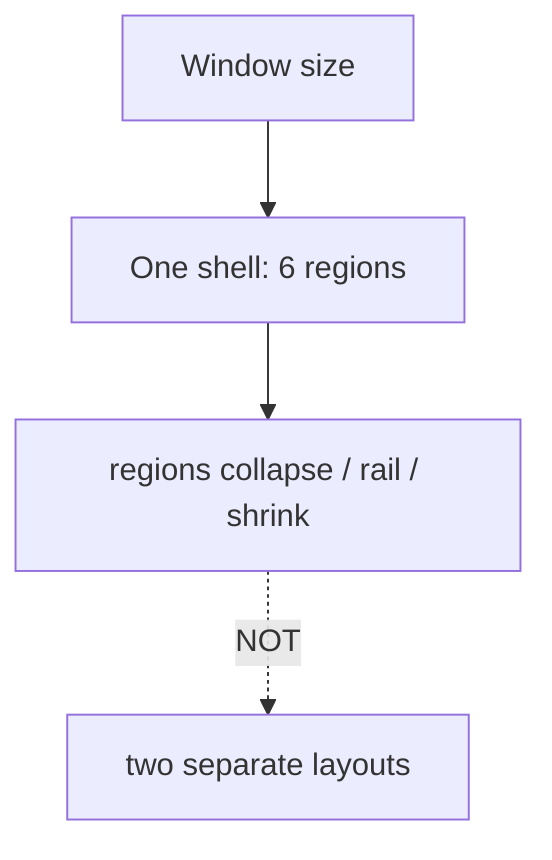
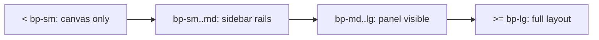
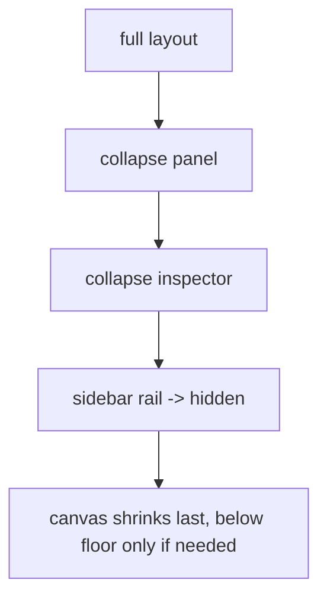
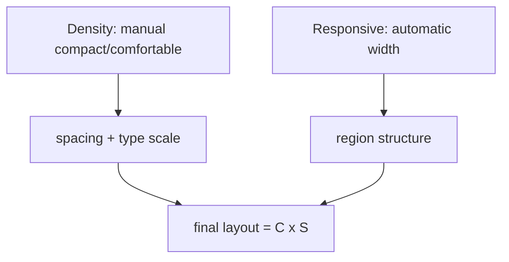
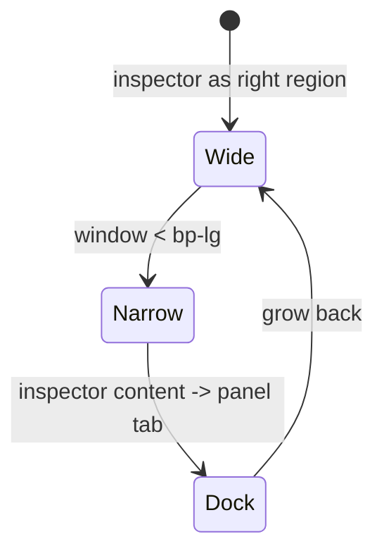
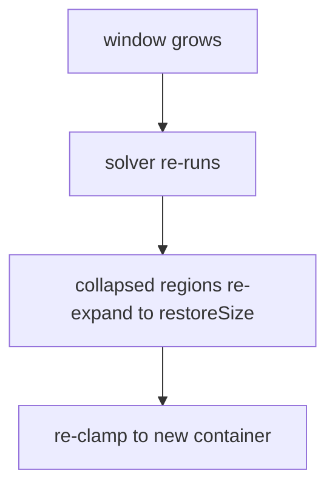

# ResponsiveRules Diagrams

These diagrams show the one-shell model, the breakpoint steps, the collapse order, and the density-vs-responsive composition.

## One Shell, Adaptive Regions

## Breakpoint Steps

## Collapse Order (scarce space)

## Density vs Responsive (orthogonal)

## Inspector Docking

## Restore on Grow

## Related Documents

- [[07-ui-ux/README]]
- [[ResponsiveRules-Part01]]
- [[ResponsiveRules-Part02]]
- [[ResponsiveRules-Part03]]
- [[ResponsiveRules-Part04]]
- [[WorkspaceLayout-Part03]]
- [[WorkspaceLayout-Part06]]
- [[Sidebar-Part03]]
- [[TerminalCards-Part03]]
- [[TerminalView-Part04]]
- [[Panels-Part03]]
- [[Panels-Part04]]
- [[DesignTokens-Part02]]
- [[Accessibility-Part04]]
