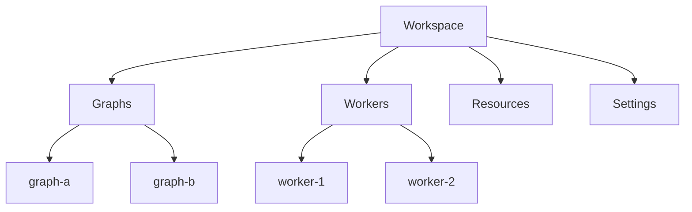
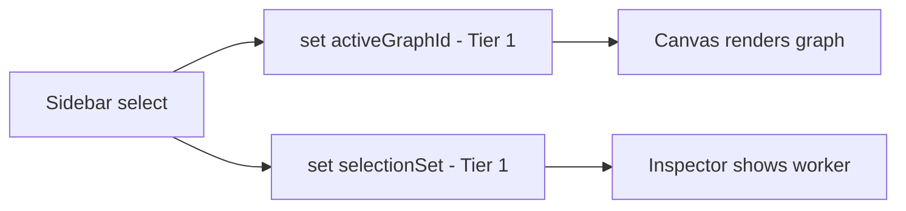
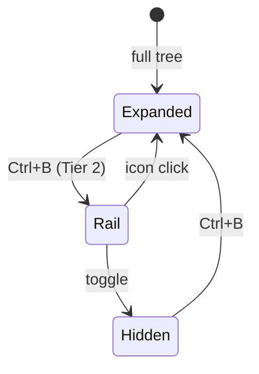
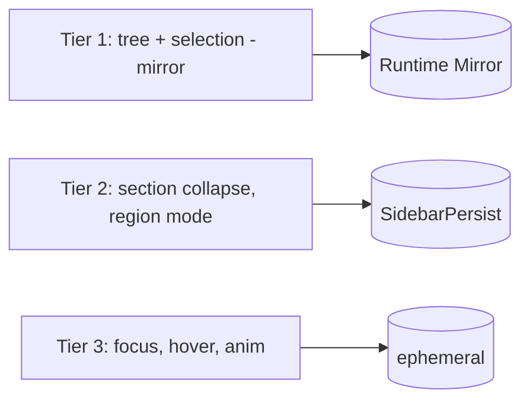
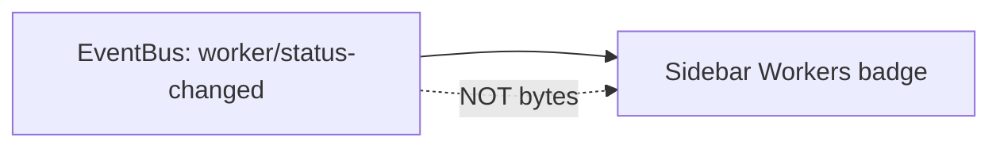

# Sidebar Diagrams

These diagrams show the navigation tree model, the selection-to-canvas flow, the collapse/rail states, and the state tiers for the sidebar.

## Navigation Tree (projected from Tier 1)

## Selection Drives Shared Tier 1

## Collapse / Rail States

## State Tiers

## Badge Flow (metadata only)

## Related Documents

- [[07-ui-ux/README]]
- [[Sidebar-Part01]]
- [[Sidebar-Part02]]
- [[Sidebar-Part03]]
- [[Sidebar-Part04]]
- [[WorkspaceLayout-Part03]]
- [[WorkspaceLayout-Part04]]
- [[Panels-Part05]]
- [[NodeGraph-Part01]]
- [[NodeGraph-Part03]]
- [[KeyboardShortcuts-Part01]]
- [[KeyboardShortcuts-Part02]]
