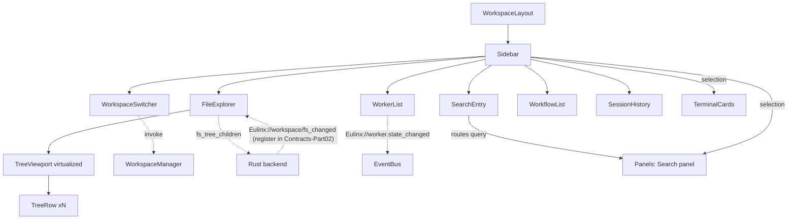

---
title: Sidebar Specification - Part 01
status: draft
version: 1.0
tags:
  - ui-ux
  - sidebar
  - architecture
related:
  - "[[07-ui-ux/README]]"
  - "[[WorkspaceLayout-Part01]]"
  - "[[Panels-Part01]]"
  - "[[DesignTokens-Part01]]"
---

# Sidebar Specification (Part 01)

## Document Index

Part 01 - Purpose, Philosophy, Definition, Object Model, Layout, Invariants
Part 02 - Workspace Switcher and the Virtualized File Explorer Tree
Part 03 - Worker List, Workflow List, Session History, Search Entry
Part 04 - Context Menus, Implementation Checklist, Worked Examples, Mistakes
Diagrams - Sidebar-Diagrams.md

# Purpose

The Sidebar is the left rail of the Eulinx window. It is the only always-mounted navigation surface in the app.

It answers four questions, permanently, without the user asking:

```text
Where am I?          workspace + project switcher
What is in here?     file explorer tree
What is happening?   worker list, grouped by state
What did I do?       workflow list, session history
```

The Sidebar is a **navigator**, not an inspector. It selects things. It never edits them. Every deep view of a selected thing lives in a Panel ([[Panels-Part01]]) or a Terminal Card ([[TerminalCards-Part01]]).

This distinction is the whole design. A Sidebar that renders a diff, streams worker output, or hosts a form has stopped being a Sidebar and has become a second Panel host, and it will fight [[WorkspaceLayout-Part01]] for space forever.

# Core Philosophy

The Sidebar is cheap and the Sidebar is honest.

**Cheap** means it MUST NOT be the reason the app is slow. A 100,000-file repository MUST render its tree in under 16ms per frame. The Sidebar achieves this by never holding a recursive tree in React state, never rendering an off-screen row, and never loading a directory's children before the directory is expanded.

**Honest** means the Sidebar reflects backend truth, never a local guess. A worker moves to `working` because `Eulinx://worker.state_changed` said so, not because the UI optimistically assumed a `worker_retry` succeeded. The Sidebar has no optimistic updates. None. Every state it draws came from an event or a command result.

```text
The Sidebar renders what the backend said.
It never renders what it hopes the backend will say.
```

Optimism in a navigator is worse than latency. A user who sees a worker flicker into `working` and back into `queued` stops trusting the whole surface.

# Definition

The Sidebar is a fixed-position, resizable, collapsible left region of the workspace shell that composes six sections in a fixed vertical order:

```text
1. WorkspaceSwitcher    workspace + project selection        fixed height
2. SearchEntry          debounced query, routes to Panel     fixed height
3. FileExplorer         virtualized project tree             flexible, primary
4. WorkerList           live, grouped by worker state        flexible
5. WorkflowList         workflows in the active workspace    collapsible section
6. SessionHistory       past sessions, newest first          collapsible section
```

The order is fixed. The user MUST NOT be able to reorder sections. Section 3 through 6 are individually collapsible; sections 1 and 2 are always visible whenever the Sidebar itself is expanded.

# Responsibilities

The Sidebar MUST:

- render at exactly one instance per window, mounted by [[WorkspaceLayout-Part01]]
- persist its width, collapse state, and per-section expansion across app restarts
- clamp its width to `SIDEBAR_MIN_WIDTH_PX` .. `SIDEBAR_MAX_WIDTH_PX` on every resize and on every load
- virtualize the file tree whenever the flattened row count exceeds `TREE_VIRTUALIZE_THRESHOLD` (100)
- load directory children lazily via `fs_tree_children(projectId, path)` on first expand only
- drop any event whose `seq` is `<=` the last `seq` processed for that entity
- keep every worker row in sync with `Eulinx://worker.state_changed`
- expose every row as a keyboard-navigable tree item per [[Accessibility-Part01]]
- read every visual value from a `var(--Eulinx-*)` token per [[DesignTokens-Part01]]
- unmount nothing when collapsed; collapse is a CSS width change, not a conditional render

The Sidebar SHOULD:

- keep the selected row scrolled into view after a workspace switch if the path still exists
- preserve per-project expansion sets so switching back restores the tree shape
- show a skeleton row for a directory whose children are in flight

The Sidebar MUST NOT:

- kill, pause, or terminate any worker as a side effect of a workspace switch
- hold the full recursive `FileNode` tree in React state as the render source
- render a row that is outside the viewport plus `TREE_OVERSCAN_ROWS` (8)
- apply an optimistic state change to any worker, workflow, or session row
- call `fs_tree_children` for a directory that is already loaded or already loading
- hardcode a raw color, pixel, or duration value in any component file
- exceed `SIDEBAR_MAX_WIDTH_PX` even when the window is wide enough to allow it

# Sidebar Object Model

This is the complete state. Every field. No implementer needs to invent one.

```ts
type SidebarState = {
  // ---- shell geometry ----
  widthPx: number;                       // clamped 220..480, default 280
  collapsed: boolean;                    // true => rail renders at 48px, icons only
  resizing: boolean;                     // true while the drag handle is captured
  resizeStartX: number | null;           // pointer clientX at drag start, null when idle
  resizeStartWidthPx: number | null;     // widthPx at drag start, null when idle

  // ---- section expansion ----
  sections: Record<SidebarSectionId, SidebarSectionState>;

  // ---- workspace / project scope ----
  activeWorkspaceId: string | null;
  activeProjectId: string | null;
  switcherOpen: boolean;
  switcherFilter: string;                // raw text in the switcher filter input
  switching: boolean;                    // true from switch start until tree first paint

  // ---- file explorer ----
  tree: FileTreeState;

  // ---- worker list ----
  workers: WorkerListState;

  // ---- workflow list ----
  workflows: WorkflowListState;

  // ---- session history ----
  sessions: SessionListState;

  // ---- search ----
  search: SearchEntryState;

  // ---- selection + focus ----
  selection: SidebarSelection | null;    // exactly one selected row, app-wide
  focusedRowId: string | null;           // roving tabindex target, may differ from selection
  contextMenu: ContextMenuState | null;  // null when closed

  // ---- event ordering ----
  lastSeqByEntity: Record<string, number>; // key: `${kind}:${id}`, value: last seq applied
};

type SidebarSectionId =
  | "explorer"
  | "workers"
  | "workflows"
  | "sessions";

type SidebarSectionState = {
  expanded: boolean;
  heightFr: number;                      // flex-grow share when expanded, default 1
  scrollTopPx: number;                   // restored on re-expand
};

type FileTreeState = {
  projectId: string | null;
  nodesByPath: Record<string, FileNode>;      // flat store, keyed by absolute path
  childPathsByPath: Record<string, string[]>; // parent path -> ordered child paths
  expandedPaths: Set<string>;
  loadingPaths: Set<string>;                  // in-flight fs_tree_children calls
  errorByPath: Record<string, FileTreeError>;
  rootPath: string | null;
  rows: TreeRow[];                            // flattened, render source of truth
  rowCount: number;                           // rows.length, cached
  scrollTopPx: number;
  viewportHeightPx: number;
  virtualized: boolean;                       // rowCount > TREE_VIRTUALIZE_THRESHOLD
  filter: string;                             // explorer-local name filter, "" = off
};

type FileNode = {
  path: string;                          // absolute, OS-native separators
  name: string;                          // basename only
  kind: "file" | "directory" | "symlink";
  sizeBytes: number | null;              // null for directories
  modifiedAt: string;                    // ISO 8601
  childCount: number | null;             // null until children are loaded
  gitStatus: GitRowStatus | null;
  isIgnored: boolean;                    // matched .gitignore
};

type GitRowStatus =
  | "untracked" | "modified" | "added" | "deleted" | "renamed" | "conflicted";

type TreeRow = {
  rowId: string;                         // === path, stable React key
  path: string;
  depth: number;                         // 0 = root children
  kind: FileNode["kind"];
  expanded: boolean;                     // false for files, always
  hasChildren: boolean;
  loading: boolean;
};

type FileTreeError = {
  kind: "permission_denied" | "not_found" | "io_error" | "too_many_entries";
  message: string;
  at: string;                            // ISO 8601
  retryable: boolean;
};

type WorkerListState = {
  workersById: Record<string, SidebarWorkerRow>;
  groupOrder: WorkerGroupId[];           // fixed, see Part 03
  collapsedGroups: Set<WorkerGroupId>;
  totalCount: number;
};

type SidebarWorkerRow = {
  workerId: string;
  label: string;                         // role + short objective, truncated to 48 chars
  state: WorkerState;
  health: "healthy" | "degraded" | "unresponsive" | "unknown";
  projectId: string;
  sessionId: string;
  parentWorkerId: string | null;
  depth: number;
  startedAt: string | null;
  lastSeq: number;
};

type WorkerState =
  | "requested" | "queued" | "spawning" | "initializing" | "idle" | "working"
  | "waiting" | "blocked" | "paused" | "failing" | "terminating" | "terminated"
  | "zombie";

type WorkerGroupId = "active" | "attention" | "pending" | "finished";

type WorkflowListState = {
  workflowsById: Record<string, SidebarWorkflowRow>;
  order: string[];                       // workflowIds, newest first
};

type SidebarWorkflowRow = {
  workflowId: string;
  name: string;
  status: "draft" | "running" | "paused" | "completed" | "failed";
  nodeCount: number;
  completedNodeCount: number;
  updatedAt: string;
};

type SessionListState = {
  sessionsById: Record<string, SidebarSessionRow>;
  order: string[];                       // sessionIds, newest first
  loadedCount: number;
  hasMore: boolean;
};

type SidebarSessionRow = {
  sessionId: string;
  title: string;
  startedAt: string;
  endedAt: string | null;
  workerCount: number;
  artifactCount: number;
};

type SearchEntryState = {
  query: string;                         // raw input value, updates every keystroke
  debouncedQuery: string;                // updates SEARCH_DEBOUNCE_MS after last keystroke
  scope: "workspace" | "project";
  active: boolean;                       // true when debouncedQuery.length >= 2
};

type SidebarSelection = {
  kind: SidebarItemKind;
  id: string;                            // path for fs items, entity id otherwise
};

type SidebarItemKind =
  | "workspace" | "project" | "folder" | "file"
  | "worker" | "workflow" | "session";

type ContextMenuState = {
  itemKind: SidebarItemKind;
  itemId: string;
  anchorX: number;                       // viewport px
  anchorY: number;                       // viewport px
  openedAt: string;                      // ISO 8601
};
```

# Layout Constants

These are Sidebar-owned tokens. They live in [[DesignTokens-Part01]] and are consumed as `var(--Eulinx-*)`.

```text
SIDEBAR_MIN_WIDTH_PX          220
SIDEBAR_DEFAULT_WIDTH_PX      280
SIDEBAR_MAX_WIDTH_PX          480
SIDEBAR_COLLAPSED_WIDTH_PX    48
SIDEBAR_RESIZE_HANDLE_PX      4
SIDEBAR_SNAP_THRESHOLD_PX     32    (drag below MIN - 32 => collapse)
TREE_ROW_HEIGHT_PX            24
TREE_OVERSCAN_ROWS            8
TREE_VIRTUALIZE_THRESHOLD     100
TREE_INDENT_PER_DEPTH_PX      12
SEARCH_DEBOUNCE_MS            180
```

Collapse and resize rules, stated as law:

1. Resize is pointer-capture based. On `pointerdown` on the handle, set `resizing = true`, record `resizeStartX` and `resizeStartWidthPx`, and call `setPointerCapture`.
2. On `pointermove`, compute `next = resizeStartWidthPx + (clientX - resizeStartX)`.
3. If `next < SIDEBAR_MIN_WIDTH_PX - SIDEBAR_SNAP_THRESHOLD_PX`, set `collapsed = true` and stop applying width.
4. Otherwise set `widthPx = clamp(next, SIDEBAR_MIN_WIDTH_PX, SIDEBAR_MAX_WIDTH_PX)` and `collapsed = false`.
5. On `pointerup`, release capture, set `resizing = false`, null both start fields, and persist via `panel_state_save(workspaceId, state)`.
6. While `resizing === true`, transitions MUST be disabled (`duration-instant`). A 200ms transition on a drag produces visible lag.
7. Collapse MUST NOT unmount children. It sets `widthPx` rendering to `SIDEBAR_COLLAPSED_WIDTH_PX` and hides labels. Unmounting loses scroll position and expansion sets.

# ASCII Wireframe

```text
+---- 280px ------------------------+ |
| [W] acme-workspace          v     | |  WorkspaceSwitcher   40px
|     Eulinx-frontend            v     | |
+-----------------------------------+ |
| [s] Search files, workers...      | |  SearchEntry         32px
+-----------------------------------+ |
| v EXPLORER                    ... | |  section header      24px
|   v src                           | |
|     v components                  | |
|       - Sidebar.tsx        M      | |  TREE_ROW_HEIGHT_PX 24
|       - Panel.tsx                 | |
|     > hooks                       | |  collapsed dir
|     - main.tsx             A      | |
|   > node_modules                  | |  never auto-expanded
|   - package.json                  | |
+-----------------------------------+ |
| v WORKERS  (7)                ... | |
|   v Active (3)                    | |
|     * refactor-auth    working    | |  pulse dot, accent
|     * write-tests      working    | |
|     * scan-deps        waiting    | |
|   v Needs attention (2)           | |
|     ! merge-conflict   blocked    | |  amber
|     ! flaky-suite      failing    | |  red
|   > Pending (1)                   | |
|   > Finished (1)                  | |
+-----------------------------------+ |
| > WORKFLOWS (2)               ... | |  collapsed section
+-----------------------------------+ |
| > SESSIONS (14)               ... | |
+-----------------------------------+ |
                                    ^
                            4px resize handle
```

Collapsed rail:

```text
+--+
|W |   workspace initial
+--+
|s |   search icon, opens Panel directly
+--+
|E |   explorer, click expands sidebar
+--+
|7 |   worker count badge
+--+
|F |   workflows
+--+
|H |   history
+--+
 48px
```

# Component Tree

```text
<Sidebar>                              owns SidebarState, one per window
  <SidebarResizeHandle/>               pointer capture, width mutation
  <WorkspaceSwitcher>                  Part 02
    <WorkspaceSwitcherTrigger/>
    <WorkspaceSwitcherPopover>         z-dropdown (300)
      <WorkspaceSwitcherFilter/>
      <WorkspaceOption/>  xN
      <ProjectOption/>    xN
  <SearchEntry/>                       Part 03
  <SidebarSection id="explorer">
    <SidebarSectionHeader/>
    <FileExplorer>                     Part 02
      <TreeViewport>                   scroll container, fixed height
        <TreeSpacerTop/>               height = firstIndex * 24
        <TreeRow/> xN                  only visible + overscan
        <TreeSpacerBottom/>            height = (rowCount - lastIndex) * 24
  <SidebarSection id="workers">
    <SidebarSectionHeader/>
    <WorkerList>                       Part 03
      <WorkerGroup id="active">
        <WorkerRow/> xN
      <WorkerGroup id="attention">
      <WorkerGroup id="pending">
      <WorkerGroup id="finished">
  <SidebarSection id="workflows">
    <WorkflowList><WorkflowRow/> xN
  <SidebarSection id="sessions">
    <SessionList><SessionRow/> xN
  <SidebarContextMenu/>                z-dropdown (300), portal to body
```

Exactly one `<Sidebar>` mounts per window. It is rendered by [[WorkspaceLayout-Part01]] and MUST NOT be rendered anywhere else.

# States

The Sidebar as a whole has four render states. They are mutually exclusive.

```text
loading      activeWorkspaceId set, tree.rootPath null    -> skeleton rows
ready        tree.rootPath set, rows.length >= 0          -> normal render
switching    switching === true                           -> ready + dimmed overlay, no input
empty        activeWorkspaceId === null                   -> "Open a workspace" CTA only
```

In `switching`, sections 3-6 render at `opacity-50` and pointer events are disabled. The worker list is exempt: it MUST stay live and interactive during a switch, because workers keep running. See Part 02.

# Invariants

```text
Exactly one Sidebar instance exists per window.
selection is null or names exactly one item. There is no multi-select.
focusedRowId, when non-null, names a row that exists in the current render.
widthPx is always within [SIDEBAR_MIN_WIDTH_PX, SIDEBAR_MAX_WIDTH_PX].
collapsed === true implies the rendered width is SIDEBAR_COLLAPSED_WIDTH_PX.
tree.rows is derived from nodesByPath + childPathsByPath + expandedPaths. It is never edited directly.
tree.rowCount === tree.rows.length, always.
tree.virtualized === (tree.rowCount > TREE_VIRTUALIZE_THRESHOLD).
A path in loadingPaths is never also in errorByPath.
A path in expandedPaths always has an entry in childPathsByPath OR is in loadingPaths.
Every rendered TreeRow index is within [firstVisible - 8, lastVisible + 8].
No worker row exists whose state is outside the 13 canonical states.
lastSeqByEntity[key] is monotonically non-decreasing. Ever.
A workspace switch changes activeWorkspaceId and nothing about any worker process.
No component in the tree contains a raw hex, px, or ms literal.
```

The seq invariant is the one implementers break. Restated: for every event on `Eulinx://worker.state_changed`, `Eulinx://workspace/fs_changed` (register this event in [[15-api/Contracts/Contracts-Part02]]), or any other `Eulinx://` channel, compute `key = ${kind}:${id}`. If `event.seq <= lastSeqByEntity[key]`, **drop the event entirely**. Do not partially apply it. Do not log-and-apply. Drop it. Out-of-order delivery is possible and this rule is non-negotiable. See [[EventBus-Part01]].

# Mermaid Diagram



# AI Notes

Do not put the recursive `FileNode` tree in React state and map over it. It works at 200 files and dies at 20,000. The render source is `tree.rows`, a **flat array**. The recursive shape lives in `nodesByPath` + `childPathsByPath` and is flattened once per change. Part 02 gives the exact flattening algorithm.

Do not render every row and rely on CSS `overflow` to hide them. `overflow: hidden` still constructs 100,000 DOM nodes. Virtualization means those nodes are never created. Two spacer divs plus roughly 30 real rows. That is the entire technique.

Do not call `fs_tree_children` on mount for the whole tree. The root's direct children only. Everything else waits for an expand. A recursive prefetch on a monorepo will hang the backend for minutes and there is no cancel path.

Do not kill workers on a workspace switch. This is the single most tempting wrong move in this document, because "cleanup" feels correct. It is not. Workers are backend processes with their own lifecycle ([[WorkerLifecycle-Part01]]). The Sidebar changes which ones it *displays*. It has no authority to end them. Part 02 states this at length.

Do not add optimistic state. When the user clicks Pause, fire `worker_pause(workerId)` and change nothing. The row moves when `Eulinx://worker.state_changed` arrives. If that feels slow, the fix is a pending spinner on the row, not a lie about the state.

Do not skip the seq check because "events arrive in order in dev". They do, on one machine, with one worker. They do not under load.

Do not unmount the Sidebar on collapse. The user collapses to see more editor, then expands back and expects their scroll position and their expanded folders. Collapse is a width value.

# Related Documents

- [[07-ui-ux/README]]
- [[Sidebar-Part02]]
- [[Sidebar-Part03]]
- [[Sidebar-Part04]]
- [[Sidebar-Diagrams]]
- [[WorkspaceLayout-Part01]]
- [[Panels-Part01]]
- [[TerminalCards-Part01]]
- [[DesignTokens-Part01]]
- [[Themes-Part01]]
- [[WorkspaceManager-Part01]]
- [[Workspace-Part01]]
- [[Project-Part01]]
- [[Session-Part01]]
- [[WorkflowEngine-Part01]]
- [[WorkerLifecycle-Part01]]
- [[EventBus-Part01]]
- [[Accessibility-Part01]]
- [[KeyboardShortcuts-Part01]]
