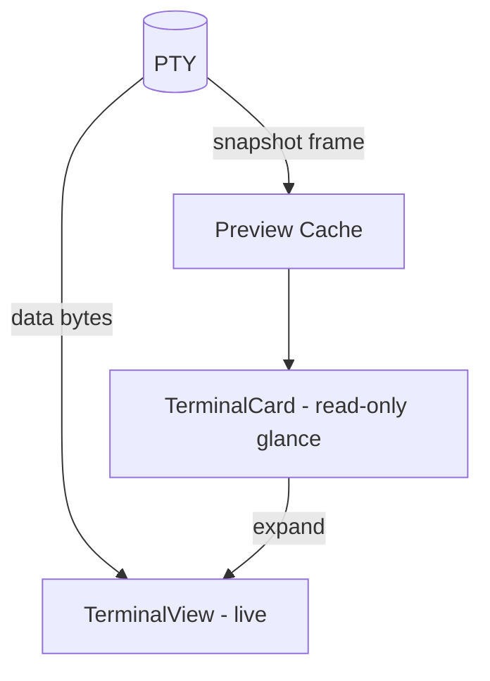
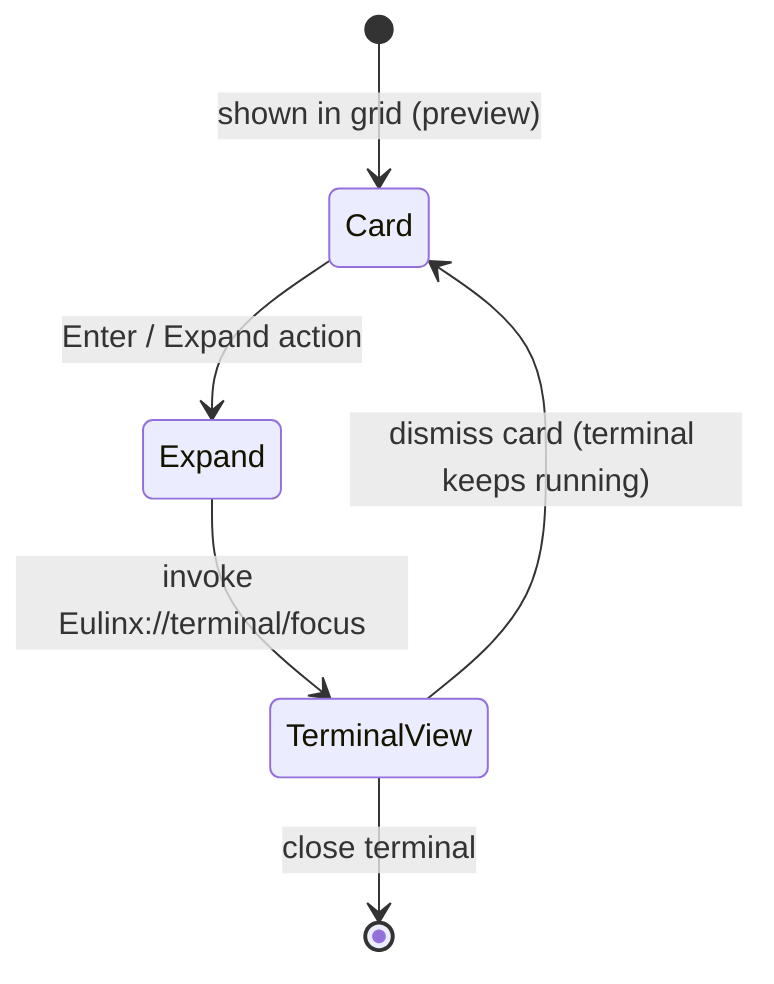
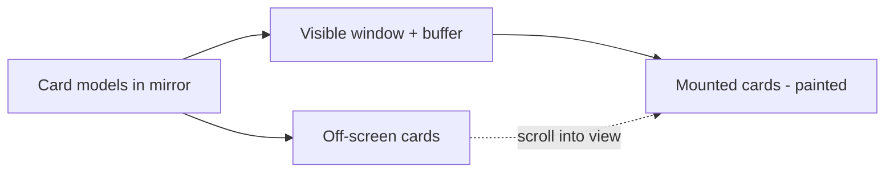
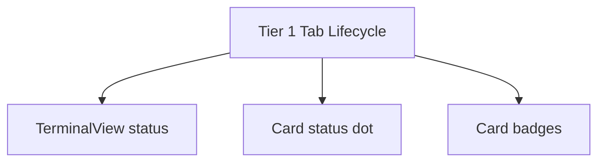

---
title: TerminalCards Diagrams
status: draft
version: 1.0
tags:
  - ui-ux
  - terminal-cards
  - diagrams
related:
  - "[[07-ui-ux/README]]"
  - "[[TerminalCards-Part01]]"
  - "[[TerminalCards-Part06]]"
---

# TerminalCards Diagrams

These diagrams show the card-as-preview model, the metadata-only event subscription, the expand handoff, and the virtualization boundary.

## Card Is a Preview, Not a PTY



## Metadata-Only Subscription

```mermaid
flowchart LR
  BUS[EventBus] -->|Eulinx://terminal/data (bytes)| TV[TerminalView]
  BUS -->|Eulinx://terminal/exit| CARD[Card - badge]
  BUS -->|Eulinx://terminal/alert| CARD
  BUS -->|Eulinx://terminal/title| CARD
  CARD -.->|NOT subscribed to bytes| BUS
```

## Expand Handoff



## Virtualization Boundary



## Status Projection (single source)



## Related Documents

- [[07-ui-ux/README]]
- [[TerminalCards-Part01]]
- [[TerminalCards-Part02]]
- [[TerminalCards-Part03]]
- [[TerminalCards-Part04]]
- [[TerminalCards-Part05]]
- [[TerminalCards-Part06]]
- [[TerminalView-Part01]]
- [[TerminalView-Part02]]
- [[TerminalView-Part03]]
- [[NodeGraph-Part08]]
- [[EventBus-Part01]]
