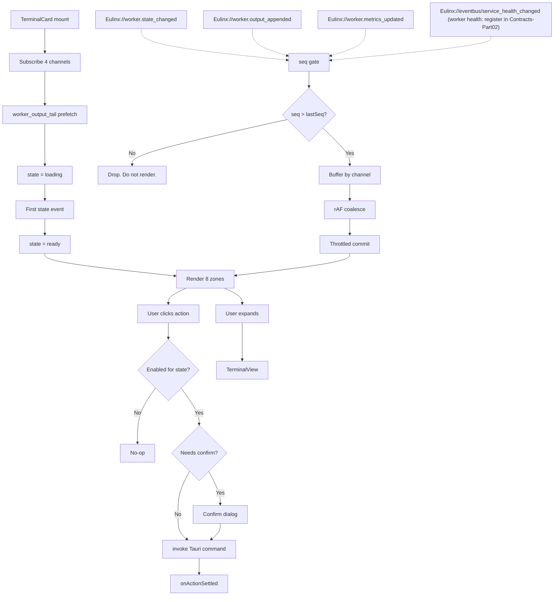

---
title: TerminalCards Specification - Part 01
status: draft
version: 1.0
tags:
  - ui-ux
  - terminal-cards
  - architecture
related:
  - "[[07-ui-ux/README]]"
  - "[[WorkerLifecycle-Part01]]"
  - "[[TerminalView-Part01]]"
  - "[[DesignTokens-Part01]]"
  - "[[EventBus-Part01]]"
---

# TerminalCards Specification (Part 01)

## Document Index

Part 01 - Purpose, Philosophy, Definition, Object Model, States, Invariants
Part 02 - Card Anatomy: zones, wireframes, component tree, truncation rules
Part 03 - State Pill for all 13 states, live update path, throttling, freeze rule
Part 04 - Expand/collapse, grid vs list arrangement, virtualization, focus and keyboard
Part 05 - Actions, enabled/disabled matrix, confirm rules, checklist, examples
Diagrams - TerminalCards-Diagrams.md

# Purpose

A TerminalCard is the visual body of exactly one live Worker.

Eulinx runs many Workers at once. The user cannot read many terminals at once. The TerminalCard is the compression: it takes a Worker that is producing hundreds of output lines per second, burning tokens, holding locks, and possibly dying, and renders it as a fixed-size rectangle that a human can scan in under one second.

```text
A terminal shows everything about one Worker.
A TerminalCard shows the six things that matter about one Worker,
  in the same place, on every card, always.

The user scans twenty cards.
The user opens one.
```

This is Eulinx's signature UI element. If the card is wrong, the product is wrong, because the card is the only surface on which a user perceives a fleet of AI workers as a fleet rather than as noise.

The card is a **read-mostly projection**. It does not own Worker state. It renders state that arrives from the Rust backend over the EventBus, and it dispatches user intent back over Tauri IPC. It MUST NOT compute, infer, or guess a Worker's state. See [[EventBus-Part01]] and [[WorkerLifecycle-Part01]].

# Core Philosophy

Four rules govern every decision in this document.

**Fixed geometry.** A card's height MUST NOT change as its content changes. Output arrives at unpredictable rates; if the card grew with its output, a grid of twenty cards would reflow continuously and become unreadable. The output tail is a fixed viewport of `CARD_OUTPUT_TAIL_LINES` (6) lines. Short output is bottom-aligned with blank filler above. Long output scrolls within the viewport. The card does not move.

**State is legible before text is read.** A user MUST be able to identify a Worker's state from color and shape alone, at a glance, without reading the label. The state pill carries color role, icon, animation, and border treatment. The text label is confirmation, not the primary channel. This is also why the pill is never the only signal: color alone fails colorblind users, so every pill carries an icon and a distinct label. See [[Accessibility-Part01]].

**Truth over smoothness.** When the backend and the card disagree, the backend wins and the card corrects itself immediately, even if that means a visible jump. The card MUST NOT animate through a state it was never in. A Worker that goes `working -> failing` in 12ms renders `working` then `failing`, with no interpolation.

**Bounded cost.** A card is cheap or it is a bug. Twenty cards each re-rendering on every output line at 200 lines/sec is 4000 React renders per second and a dead UI. Every live channel on the card is throttled, coalesced, and capped. Part 03 defines every constant.

# Definition

A TerminalCard is a React component that:

- binds to exactly one `workerId` for its entire mounted life
- renders eight zones: identity, role, model badge, state pill, output tail, meter, timer, actions
- subscribes to four EventBus channels scoped to that `workerId`
- throttles every live channel to a documented cadence
- drops any event whose `seq` is less than or equal to the last `seq` it processed for that Worker
- dispatches exactly five actions over Tauri IPC: pause, cancel, terminate, inspect, retry
- expands into a full [[TerminalView-Part01]] on demand
- occupies a fixed footprint in a grid or list managed by [[WorkspaceLayout-Part01]]

A TerminalCard is NOT a terminal emulator. It does not parse ANSI cursor movement, does not maintain a screen buffer, does not support input. It renders the last N lines of a text stream. The terminal emulator lives in [[TerminalView-Part01]].

# Responsibilities

TerminalCards MUST:

- bind to one `workerId` at mount and never rebind; a different `workerId` is a different card with a different React `key`
- render all 13 states from [[WorkerLifecycle-Part01]] with a distinct pill per state
- drop any event with `seq <= lastSeq` for that Worker, per channel
- coalesce output appends into a single rAF-scheduled flush every `CARD_OUTPUT_FLUSH_MS` (100ms)
- flush metrics no more often than `CARD_METER_FLUSH_MS` (500ms)
- tick the elapsed timer at `CARD_TIMER_TICK_MS` (1000ms) from a single shared clock, never a per-card interval
- freeze the output tail to its last rendered frame when more than `CARD_MAX_LIVE_TAIL_CARDS` (24) cards are mounted and live
- take every color, space, radius, duration, and easing value from a `var(--Eulinx-*)` token
- disable an action button whose state does not permit it, and give it an accessible reason
- require confirmation for `terminate` with `force: true` and for `cancel` on a Worker in `working`
- keep a fixed height regardless of content
- unsubscribe every listener on unmount

TerminalCards SHOULD:

- prefetch the output tail via `worker_output_tail(workerId, 6)` on mount rather than waiting for the first append event
- render a skeleton for at most 200ms while that prefetch is in flight
- respect `prefers-reduced-motion` by replacing every pill animation with a static treatment, per [[Animations-Part01]]

TerminalCards MUST NOT:

- infer a state transition from output content, exit codes, or metric values
- hardcode a raw color, pixel, or duration value; the stylelint rule `Eulinx/no-raw-values` fails the build
- mutate Worker state locally and then send the IPC call; the card renders what comes back
- hold more than `CARD_OUTPUT_TAIL_LINES` lines of output in state
- run a `setInterval` per card
- grow, shrink, or reflow in response to output
- render an action button that a user must click to discover is forbidden

# TerminalCard Object Model

```ts
import type { UnlistenFn } from "@tauri-apps/api/event";

/** The 13 canonical states. Never add. Never rename. See [[WorkerLifecycle-Part01]]. */
export type WorkerState =
  | "requested"
  | "queued"
  | "spawning"
  | "initializing"
  | "idle"
  | "working"
  | "waiting"
  | "blocked"
  | "paused"
  | "failing"
  | "terminating"
  | "terminated"
  | "zombie";

export type WorkerHealth = "healthy" | "degraded" | "unresponsive" | "unknown";

export type CardDensity = "comfortable" | "compact";

export type CardArrangement = "grid" | "list";

export type CardActionKind =
  | "pause"
  | "cancel"
  | "terminate"
  | "inspect"
  | "retry";

export type TerminalCardProps = {
  /** Immutable for the card's mounted life. Also the React key. */
  workerId: string;
  /** Isolation scope. Used to filter events and to route IPC. */
  workspaceId: string;
  /** Project the Worker acts within. Rendered in the tooltip only. */
  projectId: string;
  /** Human-facing name. May be empty; falls back to workerId prefix. */
  workerName: string;
  /** Role id resolved at creation. See [[WorkerCreation-Part01]]. */
  roleId: string;
  /** Display label for the role. Provided by the parent, never derived. */
  roleLabel: string;
  /** Provider id, e.g. "anthropic". Drives the badge icon. */
  providerId: string;
  /** Model id, e.g. "claude-opus-4-8". Drives the badge text. */
  modelId: string;
  /** Depth in the worker tree. 0 = root. Renders as an indent in list mode. */
  depth: number;
  /** Parent worker id, absent for a root Worker. */
  parentWorkerId?: string;
  /** Arrangement the card is rendered into. Changes width, not height. */
  arrangement: CardArrangement;
  /** Density preset. Changes padding and font size only. */
  density: CardDensity;
  /** True when this card is the single focused card in the collection. */
  isFocused: boolean;
  /** True when this card is part of a multi-select. */
  isSelected: boolean;
  /** True when the card's tail must freeze. Owned by the parent collection. */
  isTailFrozen: boolean;
  /** Called when the user expands the card into a TerminalView. */
  onExpand: (workerId: string) => void;
  /** Called on click or Space. Parent owns selection state. */
  onSelect: (workerId: string, modifiers: SelectionModifiers) => void;
  /** Called after an action's IPC call resolves or rejects. */
  onActionSettled: (result: CardActionResult) => void;
};

export type SelectionModifiers = {
  ctrl: boolean;
  shift: boolean;
  alt: boolean;
};

export type CardActionResult = {
  workerId: string;
  action: CardActionKind;
  ok: boolean;
  /** Present only when ok is false. */
  errorKind?: CardActionErrorKind;
  message?: string;
  at: string;
};

export type CardActionErrorKind =
  | "ipc_unavailable"
  | "worker_not_found"
  | "illegal_transition"
  | "state_changed_concurrently"
  | "permission_denied"
  | "timeout";

export type TerminalCardState = {
  /** Last state received from Eulinx://worker.state_changed. Never inferred. */
  state: WorkerState;
  /** Last health received from Eulinx://eventbus/service_health_changed (worker-specific health events should be registered in [[15-api/Contracts/Contracts-Part02]]). */
  health: WorkerHealth;
  /** Highest seq processed on the state channel for this worker. */
  lastStateSeq: number;
  /** Highest seq processed on the output channel for this worker. */
  lastOutputSeq: number;
  /** Highest seq processed on the metrics channel for this worker. */
  lastMetricsSeq: number;
  /** Highest seq processed on the health channel for this worker. */
  lastHealthSeq: number;
  /** Exactly CARD_OUTPUT_TAIL_LINES entries or fewer. Oldest first. */
  outputTail: OutputLine[];
  /** Lines accumulated since the last flush. Drained by the rAF flush. */
  pendingOutput: OutputLine[];
  /** Timestamp of the last committed output flush, ms since epoch. */
  lastOutputFlushAt: number;
  /** Latest metrics snapshot. See [[WorkerMetrics-Part01]]. */
  metrics: CardMetrics;
  /** Timestamp of the last committed metrics flush, ms since epoch. */
  lastMetricsFlushAt: number;
  /** ISO timestamp the Worker entered its current state. Drives the timer. */
  stateEnteredAt: string;
  /** Whole seconds since stateEnteredAt. Written by the shared clock. */
  elapsedSeconds: number;
  /** True from mount until the first state event or prefetch resolves. */
  isLoading: boolean;
  /** Action currently in flight. Exactly zero or one at a time. */
  pendingAction: CardActionKind | null;
  /** Confirm dialog currently open, or null. See Part 05. */
  confirmFor: CardActionKind | null;
  /** Set when the card's own subscription or prefetch failed. */
  error: CardError | null;
};

export type OutputLine = {
  /** Monotonic per-worker line number from the backend. Not a seq. */
  lineNo: number;
  /** ANSI already stripped by the backend. Plain text only. */
  text: string;
  stream: "stdout" | "stderr";
  at: string;
};

export type CardMetrics = {
  tokensIn: number;
  tokensOut: number;
  /** Null when the provider has not reported cost yet. Renders as "--". */
  costUsd: number | null;
  toolCalls: number;
  /** Budget ceiling from creation. Null means unbounded. */
  maxTokens: number | null;
  maxCostUsd: number | null;
};

export type CardError = {
  kind: "subscribe_failed" | "prefetch_failed" | "render_failed";
  message: string;
  at: string;
};

/** Returned by the card's subscription hook. Every field must be released. */
export type CardSubscriptions = {
  stateChanged: UnlistenFn;
  outputAppended: UnlistenFn;
  metricsUpdated: UnlistenFn;
  healthChanged: UnlistenFn;
};
```

# States

A card has three orthogonal state axes. Confusing them is the most common implementation error.

```text
AXIS 1 - Worker state    13 values, owned by the backend, rendered in the pill
AXIS 2 - Card load state  loading | ready | errored, owned by the card
AXIS 3 - Action state     idle | confirming | dispatching, owned by the card
```

Axis 1 MUST NOT be written by the card. Axis 2 and 3 MUST NOT be written by the backend.

```text
CARD LOAD STATE

  mount
    |
    v
  loading  --- first state event or prefetch resolves ---> ready
    |                                                        |
    |  prefetch rejects AND no state event within 3000ms     |  listen() throws
    v                                                        v
  errored <--------------------------------------------------+

  errored offers exactly one affordance: a Retry Subscribe button.
  It re-runs the mount effect. It does not call worker_retry.
```

```text
ACTION STATE

  idle
   |  user clicks an enabled action
   v
  needs confirm?  --no--> dispatching --> settles --> idle
   |  yes
   v
  confirming --- user cancels ---> idle
   |  user confirms
   v
  dispatching --> settles --> idle
```

While `pendingAction !== null` every action button on the card MUST be disabled. Exactly one action may be in flight per card. A second click MUST be a no-op, not a queued call.

# Invariants

```text
A card binds to exactly one workerId for its whole mounted life.
A card's height is constant across every state and every output rate.
A card never writes Worker state. It only renders what the backend sent.
outputTail.length <= CARD_OUTPUT_TAIL_LINES at all times.
An event with seq <= the channel's lastSeq is dropped, always, per channel.
Exactly one action is in flight per card, or zero.
Every listener registered at mount is released at unmount.
There is exactly one timer interval in the whole application, not one per card.
No component file contains a raw color, pixel, or duration literal.
Every pill carries color AND icon AND text. Never color alone.
A disabled action button states why it is disabled.
When tails are frozen, the pill, meter, and timer keep updating.
```

The freeze invariant deserves emphasis. Freezing is a **tail-only** degradation. A user with 60 cards on screen still needs to see a Worker turn red. Only the output text stops moving. See Part 03.

# Mermaid Diagram



# AI Notes

Do not derive the state pill from output text. There is a strong temptation to see `Error:` in stderr and render the pill red. Do not. The Worker is in `working` until the backend says `failing`. A card that guesses is a card that lies, and a lying card is worse than no card. The only source of state is `Eulinx://worker.state_changed`.

Do not put a `setInterval` in the card for the elapsed timer. Twenty cards is twenty timers, all firing at slightly different moments, causing twenty independent renders per second. There is ONE interval in the application, at `CARD_TIMER_TICK_MS`, and it publishes a tick that every card reads. Part 03 specifies it.

Do not append output directly to state in the event handler. At 200 lines/sec that is 200 `setState` calls per second per card. Push into a mutable ref, schedule one rAF, flush once per `CARD_OUTPUT_FLUSH_MS`. The ref is not state. Do not put it in state.

Do not skip the seq gate because "events arrive in order". They do not. The EventBus delivers across a Tauri IPC boundary with no ordering guarantee between channels or after a reconnect. Without the gate, a late `working` event overwrites a current `terminated` and the card shows a live Worker that is dead. Every listener, every channel, every card.

Do not let the card grow. The first instinct on receiving a long output line is to wrap it. Wrapping changes the card's height, which reflows the grid, which moves every other card under the user's cursor. Long lines truncate. Part 02 gives the exact rule per field.

Do not render an action button and then reject the click. If `pause` is illegal in `terminated`, the button is disabled with `aria-disabled` and a tooltip that says so, before the user clicks. Part 05 has the full matrix for all 13 states.

Do not use `workerId` as the only visible identity. Users name their Workers. `workerName` is primary; `workerId` is a tooltip and a copy target.

# Related Documents

- [[07-ui-ux/README]]
- [[TerminalCards-Part02]]
- [[TerminalCards-Part03]]
- [[TerminalCards-Part04]]
- [[TerminalCards-Part05]]
- [[TerminalCards-Diagrams]]
- [[WorkerLifecycle-Part01]]
- [[TerminalView-Part01]]
- [[WorkspaceLayout-Part01]]
- [[DesignTokens-Part01]]
- [[Themes-Part01]]
- [[Panels-Part01]]
- [[EventBus-Part01]]
- [[Accessibility-Part01]]
- [[Animations-Part01]]
- [[WorkerMetrics-Part01]]
