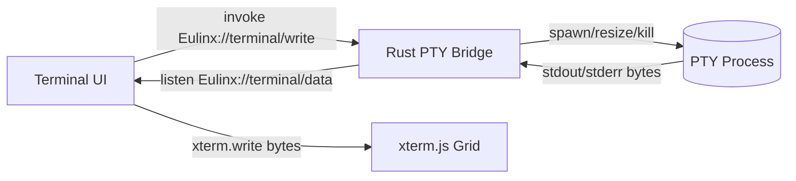
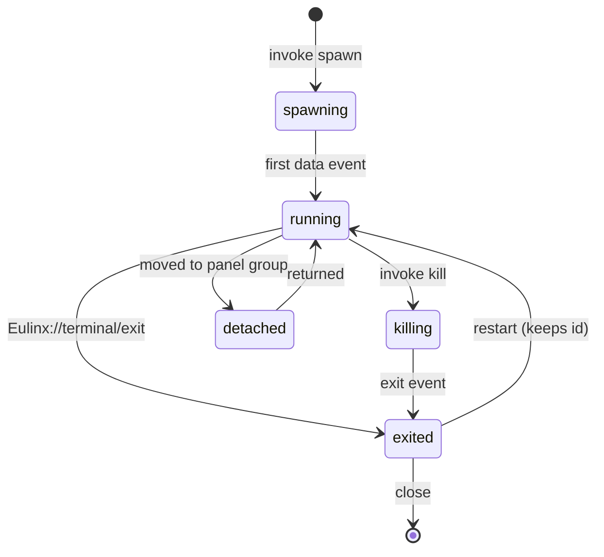
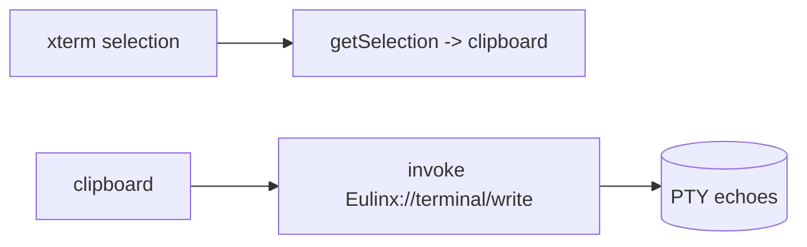
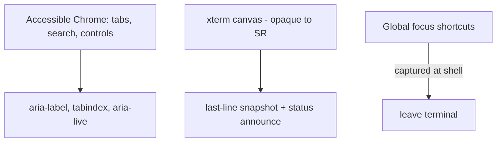

---
title: TerminalView Diagrams
status: draft
version: 1.0
tags:
  - ui-ux
  - terminal-view
  - diagrams
related:
  - "[[07-ui-ux/README]]"
  - "[[TerminalView-Part01]]"
  - "[[TerminalView-Part06]]"
---

# TerminalView Diagrams

These diagrams show the PTY byte path over the two channels, the tab lifecycle, the grid/resize flow, and the accessibility boundary for the terminal surface.

## Two-Channel PTY Path



## Tab Lifecycle



## Grid Resize Flow

```mermaid
flowchart TD
  RO[ResizeObserver] --> M[measure container]
  M --> C[cols = floor(w / cellW), rows = floor(h / cellH)]
  C --> X[xterm.resize cols,rows - immediate]
  C --> D[debounce 150ms]
  D --> I[invoke Eulinx://terminal/resize]
  I --> P[PTY winsize updated]
  P --> O[next output confirms geometry]
```

## Copy / Paste Direction



## Accessibility Boundary



## Related Documents

- [[07-ui-ux/README]]
- [[TerminalView-Part01]]
- [[TerminalView-Part02]]
- [[TerminalView-Part03]]
- [[TerminalView-Part04]]
- [[TerminalView-Part05]]
- [[TerminalView-Part06]]
- [[TerminalCards-Part01]]
- [[Panels-Part01]]
- [[EventBus-Part01]]
- [[Accessibility-Part01]]
