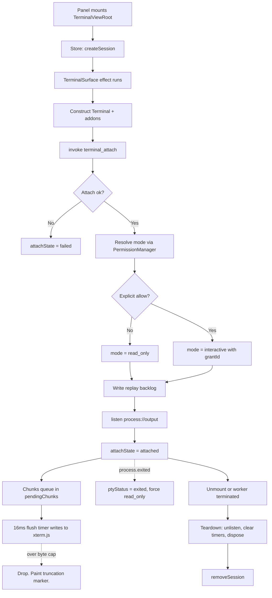

---
title: TerminalView Specification - Part 01
status: draft
version: 1.0
tags:
  - ui-ux
  - terminal-view
  - architecture
related:
  - "[[07-ui-ux/README]]"
  - "[[ProcessLifecycle-Part03]]"
  - "[[TerminalCards-Part01]]"
  - "[[Worker-Part01]]"
---

# TerminalView Specification (Part 01)

## Document Index

Part 01 - Purpose, Philosophy, Definition, Renderer Decision, Object Model, States, Invariants
Part 02 - PTY Binding: Handle Model, Tauri Commands, Attach / Detach / Reattach, Restart Recovery
Part 03 - The Output Stream: Event Channel, Backpressure, Throttling, Scrollback, ANSI Handling
Part 04 - Input Routing, Terminal Modes, and the Permission Gate
Part 05 - Search, Copy and Paste, Resize Propagation, and Focus
Part 06 - Teardown, Implementation Checklist, Worked Examples, Common Mistakes, Future Expansion
Diagrams - TerminalView-Diagrams.md

# Purpose

TerminalView is the embedded terminal surface in Eulinx's UI. It is the single React component tree that renders the byte stream of a PTY owned by [[ProcessLifecycle-Part01]] and, when and only when policy permits, routes user keystrokes back into that PTY.

TerminalView is a **view**. It is not a terminal. This distinction is the first thing to internalize, because every rule below depends on it.

```text
ProcessLifecycle owns the PTY.
  It holds the file descriptor / ConPTY handle.
  It reads bytes. It writes bytes. It resizes. It kills.
  It is Rust. It is authoritative. It survives the view.

TerminalView owns the pixels.
  It holds an xterm.js instance and a scrollback buffer.
  It renders bytes it is given. It proposes writes it is not
  guaranteed to get. It is TypeScript. It is disposable.

ProcessLifecycle is the terminal. TerminalView is the window onto it.
```

A TerminalView can be unmounted, remounted, moved between panels, and destroyed at any moment without the underlying process noticing. The converse is not true: when the PTY dies, the view MUST be told, and it MUST stop pretending to be live.

# Core Philosophy

Three ideas govern this document.

**The view is downstream of truth, never upstream.** The PTY's byte stream is the fact. The xterm.js buffer is a rendering of the fact, and a lossy one, because it is capped and throttled. Nothing in Eulinx may read state back out of the xterm.js buffer and treat it as data. If code needs process output as data, it reads the persisted stream records from [[ProcessLifecycle-Part03]], not the DOM.

This is the UI-layer restatement of Eulinx's cardinal rule. **AI output MUST NOT directly mutate trusted state.** Worker output arrives in TerminalView as pixels for a human to read. It does not arrive as instructions. A terminal that parses its own scrollback for a filename and then acts on that filename has laundered AI output into a command.

**Input is a privilege, not a property of a text box.** A terminal widget that accepts keystrokes is the default in every terminal library on earth. In Eulinx it is the exception. Most TerminalViews are attached to a Worker, and a Worker's PTY is a supervised channel; a human typing into it out of band can corrupt an in-flight agent turn, inject a shell command that never passed the [[PermissionManager-Part01]], or answer an approval prompt the audit log then attributes to the Worker. Input is gated, the gate fails closed, and the gate is checked on every keystroke rather than once at mount.

**Chatty output must degrade visibly, not silently.** A `cargo build` in a workspace with 900 crates emits megabytes in seconds. The view will drop data; that is a physical inevitability, not a bug. The rule is that dropping is **loud**. Every drop paints a truncation marker into the buffer. A terminal that quietly loses 4 MB of a compiler error and shows a clean tail is worse than one that shows nothing, because the user believes it.

# Definition

TerminalView is the UI topic that defines:

- the React component tree of the terminal surface
- the renderer choice and the addon set
- the `TerminalSession` client-side object model
- the Zustand store slice that holds terminal sessions
- the Tauri `invoke` commands the view calls
- the Tauri `listen` channels the view subscribes to
- attach, detach, reattach, and post-restart recovery
- output batching, byte caps, coalescing, drop policy, truncation markers
- scrollback limits and trim behavior
- ANSI, 256-color, truecolor, and OSC handling, including what MUST be stripped
- the terminal mode type and the input permission gate
- search, copy, paste, bracketed paste, and the multi-line paste guard
- resize debouncing and PTY resize propagation
- focus behavior
- teardown order and leak cases

TerminalView does NOT define:

- PTY creation, signals, or process termination. See [[ProcessLifecycle-Part01]] and [[ProcessLifecycle-Part02]].
- the panel chrome, tab strip, or docking that hosts the view. See [[Panels-Part01]] and [[WorkspaceLayout-Part01]].
- the compact per-worker terminal preview tile on the graph canvas. See [[TerminalCards-Part01]].
- colors, fonts, or spacing values. See [[DesignTokens-Part01]] and [[Themes-Part01]].
- global keybinding registration. See [[KeyboardShortcuts-Part01]].

# Responsibilities

TerminalView MUST:

- render exactly one xterm.js instance per live `TerminalSession`
- obtain its byte stream only from the `process://output` Tauri event channel
- request a replay of missed scrollback on attach, before subscribing to live output
- batch incoming chunks on a fixed 16 ms window and never write per-chunk
- enforce a hard per-frame byte cap and paint an explicit truncation marker when it trips
- enforce a hard scrollback line cap and trim from the top
- strip the OSC sequence classes named in Part 03 before writing to xterm.js
- treat `mode` as the authority on whether keystrokes may leave the view
- re-check the permission gate on every keystroke, not once at mount
- fail closed: an unknown, stale, or unresolved mode denies input
- debounce resize at 100 ms and propagate the final size to the PTY
- dispose the xterm.js instance, every addon, every Tauri unlisten function, and every timer on unmount
- emit `ui.view_opened` on mount and `ui.user_action` for user-initiated input, per [[EventBus-Part02]]

TerminalView SHOULD:

- prefer the WebGL renderer and fall back to canvas on context loss
- preserve scroll position across a detach / reattach cycle
- show a distinct, non-dismissable banner when the backing PTY is gone
- keep the search index lazy and build it only when the search box opens

TerminalView MUST NOT:

- write to the PTY when `mode` is `read_only`
- write to the PTY when the permission gate has not returned an explicit allow
- parse its own scrollback buffer and act on the result
- treat xterm.js buffer contents as a data source for any other feature
- retain a `TerminalSession` after the session's worker reaches a terminal state
- render an unbounded buffer
- forward OSC 52 (clipboard write), OSC 7 (cwd report), OSC 8 (hyperlink), or OSC 9 / 777 (notification) to the terminal emulator
- create, resize, or kill a PTY itself; it may only ask [[ProcessLifecycle-Part01]] to do so
- assume the PTY exists after an app restart

# The Renderer Decision

TerminalView MUST use **xterm.js**. This section exists so no implementer relitigates it.

The requirement set is not negotiable, and it is what eliminates every alternative:

```text
R1  Full VT100 / VT220 / xterm sequence support.
    AI CLIs draw spinners, redraw lines with \r, use cursor
    addressing for progress bars, and run full alternate-screen
    TUIs for approval prompts.

R2  Alternate screen buffer (DECSET 1049).
    A CLI that opens a pager or a full-screen prompt must not
    destroy the scrollback behind it.

R3  256-color and truecolor.
    cargo, tsc, eslint, and git all emit SGR color. Losing it
    loses the error/warning distinction.

R4  Bracketed paste (DECSET 2004).
    Required for the paste guard in Part 05.

R5  Resize semantics that map to a PTY resize call.
    Reflow on width change, with the cols/rows the PTY is told.

R6  Sustained throughput of megabytes without blocking the main thread.

R7  Selection, copy, and search over the scrollback.
```

## Alternatives Considered

**A plain scrolling `<div>` of lines.** This is the tempting one, and it is the one a low-capability implementer will reach for. It fails R1 immediately. The moment a CLI emits `\r` to redraw a progress bar in place, a div-of-lines renders 4000 progress bar lines instead of one animating line. `\x1b[2K` (erase line), `\x1b[1A` (cursor up), and `\x1b[?1049h` (alt screen) have no meaning to it. It fails R2 entirely. To fix any of this you must implement a VT parser and a screen buffer, at which point you have written a worse xterm.js. Rejected.

**react-console and equivalent React terminal widgets.** These target REPL-style prompt/response interaction, not a PTY. They typically implement a small SGR subset, have no alternate screen, no cursor addressing, and no reflow. They also re-render through React on every line, which puts terminal output on the reconciler's critical path and dies at R6. Rejected.

**A custom canvas renderer written for Eulinx.** This is a VT parser, a screen buffer, a damage tracker, a Unicode width table, a selection model, and a reflow engine. It is 12 to 18 months of work that xterm.js has already done and that VS Code, Hyper, and Azure Data Studio field-test daily. Building it also means owning every escape-sequence CVE class ourselves. Rejected on cost and on security surface.

**Monaco.** Monaco is a code editor. It has no VT parser, no cursor addressing, no alternate screen, and its buffer model assumes a document that the user edits, not a stream a process writes. Using it means fighting its editing affordances off on every keystroke. It also carries a large bundle for features TerminalView never uses. Rejected on category error.

## Why xterm.js Wins

```text
R1  full xterm-compatible VT parser              satisfied
R2  alternate screen buffer                      satisfied
R3  256-color + truecolor via SGR 38/48;2        satisfied
R4  bracketed paste via DECSET 2004              satisfied
R5  cols/rows model that maps 1:1 to a PTY resize satisfied
R6  WebGL renderer, off-reconciler; writes are
    buffered internally and flushed on rAF        satisfied
R7  built-in selection; search via addon          satisfied
```

The decisive trade-off is not features, it is **ownership**. xterm.js is the terminal component in VS Code. Eulinx's Worker terminals run the same AI CLIs that users run inside VS Code's integrated terminal. Choosing xterm.js means every escape sequence those CLIs emit has already been exercised against this exact parser by millions of sessions. No other option in the list can make that claim.

The costs are real and are accepted: roughly 250 KB of JS, a DOM/WebGL surface React does not control, and a manual disposal contract that Part 06 exists to enforce.

## Required Addons

Each addon MUST be installed. Each is here for a stated reason; do not add others without a spec change.

```text
@xterm/addon-fit
  Computes cols/rows from the container's pixel box. Without it we
  would hardcode a grid size and the terminal would not match the
  panel. Part 05 drives PTY resize from its output.

@xterm/addon-search
  Scrollback search with regex, case, and whole-word options, plus
  match decorations. Required by Part 05. Hand-rolling search means
  reimplementing wide-char and wrapped-line awareness.

@xterm/addon-webgl
  GPU-accelerated renderer. Required for R6: the DOM renderer drops
  frames past roughly 1 MB/s of output, which is a normal build.
  MUST register an onContextLoss handler that disposes the addon and
  falls back to the canvas renderer. See Part 06.

@xterm/addon-canvas
  The fallback renderer, loaded lazily only on WebGL context loss or
  when WebGL is unavailable. MUST NOT be active at the same time as
  the WebGL addon.

@xterm/addon-unicode11
  Unicode 11 wide-character width tables. Without it, CJK text, box
  drawing, and the emoji that AI CLIs print in status lines compute
  the wrong cell width, and every subsequent column on the line is
  misaligned. Activate with terminal.unicode.activeVersion = "11".

@xterm/addon-serialize
  Serializes the live buffer back to a string with escape sequences
  intact. Used for two things only: the detach snapshot in Part 02,
  and "copy all scrollback" in Part 05. MUST NOT be used as a data
  source for any non-UI feature.
```

`@xterm/addon-web-links` is explicitly NOT used. Link detection over AI-generated output is an untrusted-input click surface, and OSC 8 hyperlinks are stripped per Part 03.

# Component Tree

```text
<TerminalViewRoot sessionId>          owns store subscription, no DOM
  |
  +-- <TerminalHeader>                title, mode badge, PTY status dot
  |     +-- <TerminalModeBadge>       read_only | interactive | detached
  |     +-- <TerminalSearchToggle>
  |
  +-- <TerminalSurface>               the ONLY component that touches xterm.js
  |     +-- <div ref={hostRef} />     xterm.js mounts here; React never
  |                                   renders children into this node
  |
  +-- <TerminalSearchBar>             conditional, Part 05
  +-- <TerminalPasteGuardDialog>      conditional, Part 05
  +-- <TerminalDeadBanner>            conditional, shown when ptyStatus = gone
  +-- <TerminalTruncationToast>       conditional, Part 03 drop policy
```

`TerminalSurface` MUST be wrapped in `React.memo` and MUST NOT accept any prop that changes per output chunk. Output never flows through props. It flows from the event listener directly into `terminal.write()`. If output is a prop, React reconciles on every frame of a build and the app stalls.

# TerminalView Object Model

```ts
type TerminalSessionId = string;
type WorkerId = string;
type ProcessId = string;
type PtyHandleId = string;

type TerminalSession = {
  sessionId: TerminalSessionId;
  workspaceId: string;
  workerId?: WorkerId;
  processId?: ProcessId;
  ptyHandleId?: PtyHandleId;
  title: string;
  mode: TerminalMode;
  ptyStatus: PtyStatus;
  attachState: TerminalAttachState;
  grid: TerminalGrid;
  scrollback: ScrollbackState;
  stream: StreamState;
  gate: InputGateState;
  search: TerminalSearchState;
  focus: TerminalFocusState;
  createdAt: string;
  attachedAt?: string;
  detachedAt?: string;
  lastOutputAt?: string;
};

type TerminalMode =
  | { kind: "read_only"; reason: ReadOnlyReason }
  | { kind: "interactive"; grantId: string; grantedAt: string; expiresAt?: string }
  | { kind: "detached" };

type ReadOnlyReason =
  | "worker_owned"
  | "permission_denied"
  | "permission_unresolved"
  | "process_exited"
  | "quarantined"
  | "replay_playback";

type PtyStatus =
  | "unknown"
  | "live"
  | "exited"
  | "gone";

type TerminalAttachState =
  | "idle"
  | "attaching"
  | "replaying"
  | "attached"
  | "detaching"
  | "detached"
  | "failed";

type TerminalGrid = {
  cols: number;
  rows: number;
  pixelWidth: number;
  pixelHeight: number;
  lastPropagatedCols: number;
  lastPropagatedRows: number;
};

type ScrollbackState = {
  limitLines: number;
  currentLines: number;
  trimmedLines: number;
  atBottom: boolean;
  savedViewportY?: number;
};

type StreamState = {
  lastSequence: number;
  bytesReceived: number;
  bytesDropped: number;
  droppedRanges: DroppedRange[];
  frameBudgetBytes: number;
  batchWindowMs: number;
  pendingBytes: number;
  paused: boolean;
};

type DroppedRange = {
  fromSequence: number;
  toSequence: number;
  bytes: number;
  at: string;
};

type InputGateState = {
  decision: "allow" | "deny" | "unresolved";
  grantId?: string;
  checkedAt?: string;
  denyReason?: ReadOnlyReason;
};

type TerminalSearchState = {
  open: boolean;
  query: string;
  caseSensitive: boolean;
  wholeWord: boolean;
  regex: boolean;
  matchCount: number;
  activeMatchIndex: number;
};

type TerminalFocusState = {
  focused: boolean;
  focusRequestedAt?: string;
  restoreOnReattach: boolean;
};
```

The runtime-only handles never enter the store. They live in a module-scoped `Map` keyed by `sessionId`, because they are not serializable, not comparable, and must never trigger a React render.

```ts
type TerminalRuntimeHandle = {
  sessionId: TerminalSessionId;
  terminal: import("@xterm/xterm").Terminal;
  fitAddon: import("@xterm/addon-fit").FitAddon;
  searchAddon: import("@xterm/addon-search").SearchAddon;
  rendererAddon: RendererAddon;
  serializeAddon: import("@xterm/addon-serialize").SerializeAddon;
  unlisteners: UnlistenFn[];
  flushTimer?: number;
  resizeTimer?: number;
  pendingChunks: Uint8Array[];
  disposed: boolean;
};

type RendererAddon =
  | { kind: "webgl"; addon: import("@xterm/addon-webgl").WebglAddon }
  | { kind: "canvas"; addon: import("@xterm/addon-canvas").CanvasAddon };

type UnlistenFn = () => void;
```

# State Management

TerminalView MUST use a **Zustand store slice**, `terminalSlice`, and MUST NOT use React Context for session state.

The justification is concrete, not stylistic. A Context provider re-renders every consumer whenever any part of its value changes. Eulinx routinely runs 8 or more terminals at once, and `lastOutputAt` alone updates several times a second per session. Under Context, one chatty Worker re-renders every other terminal's header, the tab strip, and the graph nodes in [[NodeGraph-Part01]]. Zustand's selector subscriptions mean a component that selects `session.mode` re-renders only when `mode` changes, and never when bytes flow.

Redux Toolkit would also solve the selector problem but requires the whole store to be serializable and action-driven; terminal state changes many times per second and would flood the action log and devtools for zero benefit. Jotai's atom-per-session model works but makes "list all sessions for this workspace" awkward, which the tab strip needs. Zustand is chosen.

```ts
type TerminalSlice = {
  sessions: Record<TerminalSessionId, TerminalSession>;
  activeSessionId?: TerminalSessionId;
  sessionIdsByWorker: Record<WorkerId, TerminalSessionId>;

  createSession: (init: TerminalSessionInit) => TerminalSessionId;
  setAttachState: (id: TerminalSessionId, s: TerminalAttachState) => void;
  setPtyStatus: (id: TerminalSessionId, s: PtyStatus) => void;
  setMode: (id: TerminalSessionId, m: TerminalMode) => void;
  setGate: (id: TerminalSessionId, g: InputGateState) => void;
  setGrid: (id: TerminalSessionId, g: Partial<TerminalGrid>) => void;
  noteBytes: (id: TerminalSessionId, bytes: number, seq: number) => void;
  noteDrop: (id: TerminalSessionId, range: DroppedRange) => void;
  noteTrim: (id: TerminalSessionId, lines: number) => void;
  setSearch: (id: TerminalSessionId, s: Partial<TerminalSearchState>) => void;
  setFocus: (id: TerminalSessionId, f: Partial<TerminalFocusState>) => void;
  removeSession: (id: TerminalSessionId) => void;
};

type TerminalSessionInit = {
  workspaceId: string;
  workerId?: WorkerId;
  processId?: ProcessId;
  title: string;
  intendedMode: "read_only" | "interactive";
};
```

`noteBytes` is the one hot-path writer. It MUST be called at most once per flush frame, never once per chunk, and the components that render byte counters MUST select through a coarse selector so a counter update does not re-render the surface.

# States

`attachState` is the view's own lifecycle. It is independent of the Worker's lifecycle in [[WorkerLifecycle-Part01]] and of the process state in [[ProcessLifecycle-Part01]].

```text
idle          session exists in the store; no xterm.js instance yet
attaching     invoke terminal_attach in flight
replaying     backlog replay is being written into the buffer
attached      live output subscribed; steady state
detaching     unlisten in progress; snapshot being taken
detached      no listeners; buffer retained; may reattach
failed        attach failed; a reason is displayed; may retry
```

Legal transitions, and only these:

```text
idle       -> attaching     mount, or reattach requested
attaching  -> replaying     attach ok, backlog offered
attaching  -> attached      attach ok, no backlog
attaching  -> failed        attach error, any variant
replaying  -> attached      replay complete
replaying  -> failed        replay error
attached   -> detaching     unmount, panel hidden, or explicit detach
detaching  -> detached      unlisten complete
detached   -> attaching     reattach
failed     -> attaching     user retry
any        -> detached      forced teardown on worker termination
```

# Invariants

```text
Exactly one xterm.js instance exists per sessionId at any time.
A TerminalRuntimeHandle exists if and only if attachState is not idle or detached.
Bytes are written to xterm.js only from the flush timer, never from the listener.
The flush timer exists if and only if pendingChunks is non-empty.
bytesDropped > 0 implies at least one truncation marker is in the buffer.
scrollback.currentLines <= scrollback.limitLines at all times.
mode.kind = read_only implies zero bytes have ever been sent to the PTY for this session.
An interactive mode always carries a grantId issued by the PermissionManager.
The gate is consulted on every keystroke; a cached allow older than the grant is not an allow.
ptyStatus = gone implies mode.kind is read_only or detached.
Every unlisten function created during attach is called during detach.
A session whose worker reached a terminal state is removed within one teardown pass.
No feature outside TerminalView reads the xterm.js buffer.
```

The gate invariant is the load-bearing one. Restating it plainly: **a read-only worker terminal MUST NOT accept user keystrokes into the PTY.** Not "should discourage". Not "hides the cursor". The keystroke handler returns before the `invoke` line is reached, and there is no code path in TerminalView that writes to a PTY without an explicit allow decision from [[PermissionManager-Part01]].

# Mermaid Diagram



# AI Notes

Do not put terminal output in React state. Not in `useState`, not in the Zustand store, not in a prop. A single `cargo build` emits tens of thousands of chunks; each one becoming a render is an instantly frozen app. Bytes go from the Tauri listener into an array, and from the array into `terminal.write()` on a timer. React never sees them.

Do not create the xterm.js instance during render. Create it in a `useEffect` with an empty dependency array, against a ref'd host div. Creating it in render body under StrictMode double-invocation produces two instances, two attach calls, and two live listeners writing into a terminal that only one of them will dispose.

Do not skip the disposal contract. xterm.js is not garbage collected away. It holds a WebGL context, a ResizeObserver, DOM event listeners on the document, and internal rAF loops. An undisposed instance leaks the entire buffer plus a GPU context, and browsers cap live WebGL contexts at around 16. Open and close 16 terminals without disposing and the seventeenth renders black. Part 06 is not optional reading.

Do not gate input by hiding the cursor or setting an `aria-readonly` attribute. Those are appearance. The gate is a branch in `onData` that returns before any `invoke`. An implementer who styles a read-only terminal and leaves `onData` wired has shipped a fully interactive shell that looks disabled.

Do not treat the absence of a permission answer as permission. `unresolved` denies. A pending IPC call denies. A gate check that threw denies. Fail closed, every time, per [[PermissionManager-Part01]].

Do not assume the PTY is still there after an app restart. It is not. Nothing alive survives a restart; only the record does, per [[WorkerLifecycle-Part01]]. A view that restores from a persisted session and starts writing keystrokes at a dead handle is writing at a reused handle id. Part 02 defines the generation check that prevents it.

Do not let the terminal's scrollback become a data source. If any code in Eulinx calls `serializeAddon.serialize()` for any purpose other than the detach snapshot or an explicit user copy action, that code is reading AI output and turning it into program state. Use the persisted stream records in [[ProcessLifecycle-Part03]] instead.

# Related Documents

- [[07-ui-ux/README]]
- [[TerminalView-Part02]]
- [[TerminalView-Part03]]
- [[TerminalView-Part04]]
- [[TerminalView-Part05]]
- [[TerminalView-Part06]]
- [[TerminalView-Diagrams]]
- [[ProcessLifecycle-Part01]]
- [[ProcessLifecycle-Part03]]
- [[EventBus-Part01]]
- [[EventBus-Part02]]
- [[PermissionManager-Part01]]
- [[Worker-Part01]]
- [[WorkerLifecycle-Part01]]
- [[TerminalCards-Part01]]
- [[Panels-Part01]]
- [[WorkspaceLayout-Part01]]
- [[DesignTokens-Part01]]
- [[Themes-Part01]]
- [[Accessibility-Part01]]
