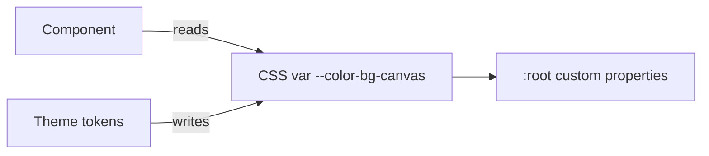
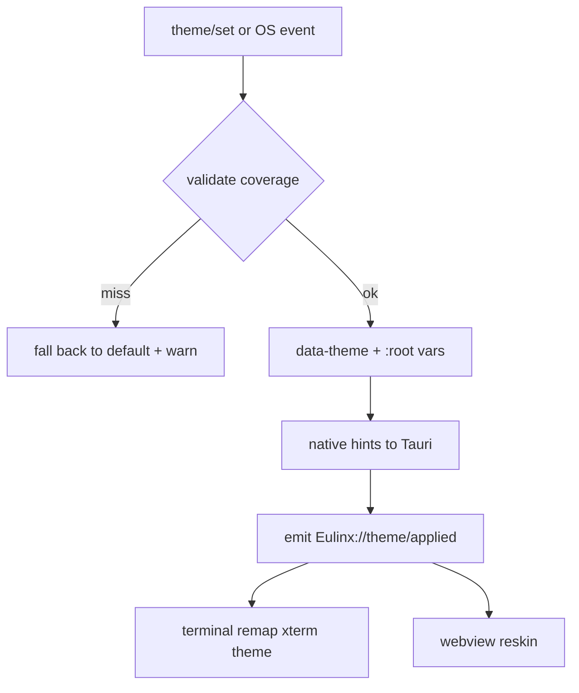
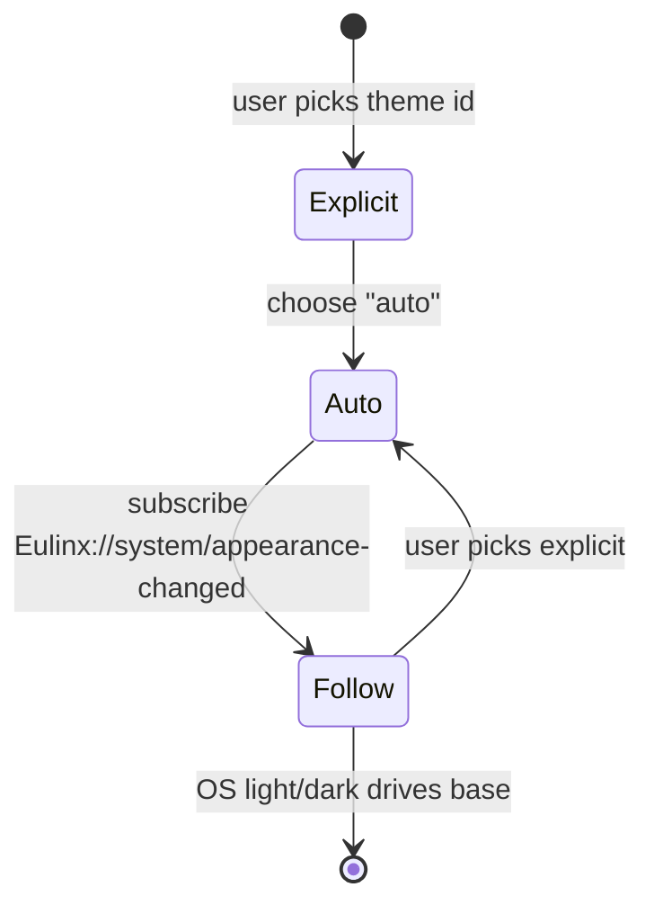
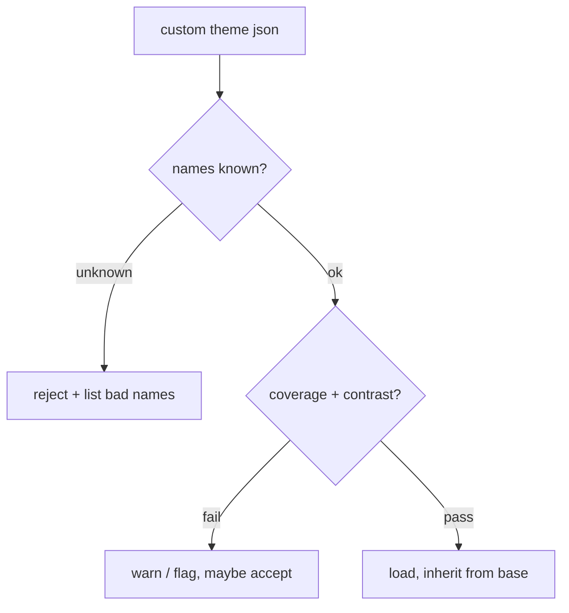
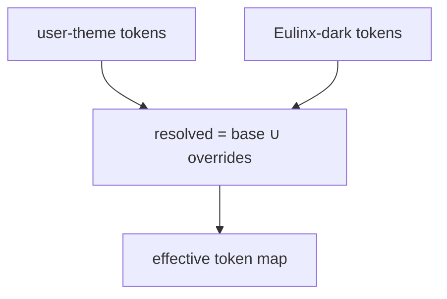

---
title: Themes Diagrams
status: draft
version: 1.0
tags:
  - ui-ux
  - themes
  - diagrams
related:
  - "[[07-ui-ux/README]]"
  - "[[Themes-Part01]]"
  - "[[Themes-Part04]]"
---

# Themes Diagrams

These diagrams show the theme-as-token-map model, the apply flow, the auto/OS link, and custom-theme validation.

## Theme Is a Token Map

## Apply Flow

## Auto Mode Follows OS

## Custom Theme Validation

## Inheritance

## Related Documents

- [[07-ui-ux/README]]
- [[Themes-Part01]]
- [[Themes-Part02]]
- [[Themes-Part03]]
- [[Themes-Part04]]
- [[DesignTokens-Part01]]
- [[DesignTokens-Part03]]
- [[TerminalView-Part04]]
- [[Accessibility-Part05]]
- [[Animations-Part01]]
- [[EventBus-Part01]]
