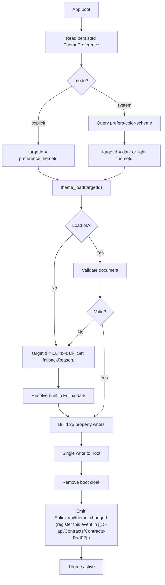

---
title: Themes Specification - Part 01
status: draft
version: 1.0
tags:
  - ui-ux
  - themes
  - architecture
related:
  - "[[07-ui-ux/README]]"
  - "[[DesignTokens-Part01]]"
  - "[[Accessibility-Part01]]"
  - "[[Themes-Diagrams]]"
---

# Themes Specification (Part 01)

## Document Index

Part 01 - Purpose, Philosophy, Definition, Responsibilities, and the Theme Object Model
Part 02 - The Semantic Color Roles and the Three Built-In Themes in Full Literal Form
Part 03 - Runtime Switching, FOUC Prevention, Follow Mode, Custom and Plugin Themes
Part 04 - Untrusted Theme Validation, Checklist, Worked Examples, Mistakes, Expansion
Diagrams - Themes-Diagrams.md

# Purpose

Themes defines how every pixel of colour in the Eulinx window gets its value.

Eulinx renders a Tauri v2 window containing a React + TypeScript application. That window shows worker cards, terminal output, node graphs, panels, and a sidebar. Every one of those surfaces has colour. None of them decide their own colour.

A theme is the single object that binds a **semantic colour role** (`text-primary`, `state-blocked`, `danger`) to a **concrete literal colour value** (`#E6EDF3`, `#D29922`, `#F85149`). The application applies exactly one theme at a time by writing CSS custom properties onto `:root`.

```text
DesignTokens owns the SCALES.
  space-4 is 16px. radius-md is 6px. duration-normal is 200ms.
  Those never change when the theme changes.

Themes owns the VALUES bound to colour roles.
  --Eulinx-color-surface is #0D1117 under Eulinx-dark and #FFFFFF under Eulinx-light.
  Those are the ONLY things a theme may change.

A theme cannot invent a role. A theme cannot change a scale.
```

See [[DesignTokens-Part01]] for the scale definitions this document depends on and never restates as its own.

# Core Philosophy

**A theme is data. A theme is never code.**

This is the entire security posture of the theming system, and it is the rule most likely to be violated by an implementer who wants a "flexible" theme format.

A theme arriving from a plugin ([[PluginArchitecture-Part01]]) or from a user's `themes/` directory is **untrusted input**. It is a JSON document authored by someone who is not the Eulinx team. It gets parsed, validated, and either accepted as a flat map of role to colour, or rejected whole.

```text
A theme MUST NOT ship JavaScript.
A theme MUST NOT ship a stylesheet.
A theme MUST NOT ship a selector.
A theme MUST NOT ship a font file, an image, or a URL.
A theme ships colours and a name. Nothing else.
```

If a theme could ship CSS, a marketplace plugin could write `body { }` rules that reposition the permission-approval dialog off-screen while leaving its click target under a fake button. Colour cannot do that. Colour is inert. Keeping the format inert is what makes the marketplace safe to open.

The second philosophical commitment: **there is exactly one delivery mechanism.**

The app applies a theme by setting `--Eulinx-*` custom properties on the `:root` element. Not by swapping a stylesheet link. Not by adding a `.theme-dark` class that CSS files branch on. Not by passing colours through React context into inline styles. One write, one place.

The third: **fail closed**. An invalid theme never partially applies. If validation rejects any part of a theme, zero properties from that theme reach `:root` and the app falls back to `Eulinx-dark`. A half-applied theme is a UI where the danger colour is still the previous theme's green. That is a safety bug, not a cosmetic one. See Part 04.

The fourth: **contrast is a validation concern, not a taste concern**. Every text-on-surface pair in an accepted theme MUST reach WCAG AA 4.5:1. A theme that fails is rejected at load, not shipped and apologised for. See [[Accessibility-Part01]].

# Definition

Themes is the frontend subsystem that owns:

- the `Theme` document schema and its version
- the closed set of semantic colour roles (Part 02)
- the three built-in themes `Eulinx-dark`, `Eulinx-light`, `Eulinx-high-contrast` (Part 02)
- resolution of which theme applies at boot
- the `:root` custom-property write that applies a theme (Part 03)
- runtime switching with no window reload (Part 03)
- FOUC prevention across the Tauri window's first paint (Part 03)
- `prefers-color-scheme` follow mode (Part 03)
- the `Eulinx://ui/theme_changed (register this event in [[15-api/Contracts/Contracts-Part02]])` broadcast contract (Part 03)
- discovery, load order, namespacing, and precedence of user and plugin themes (Part 03)
- validation of untrusted themes and the fail-closed fallback (Part 04)

Themes does NOT own:

- the spacing, radius, elevation, z-index, duration, or easing scales. That is [[DesignTokens-Part01]].
- font families or the type scale. That is [[Typography-Part01]].
- what a component does with a colour. That is [[TerminalCards-Part01]], [[Panels-Part01]], [[Sidebar-Part01]], [[WorkspaceLayout-Part01]].
- the motion curves the cross-fade uses. It consumes them from [[Animations-Part01]].
- the audit of contrast policy across the product. That is [[Accessibility-Part01]]. Themes enforces the numeric rule; Accessibility sets it.

# Responsibilities

Themes MUST:

- expose exactly one active theme at any instant
- apply a theme by writing `--Eulinx-*` custom properties on `document.documentElement` and nowhere else
- define a value for every required role before a theme is considered applicable
- treat any theme not built into the binary as untrusted input
- validate an untrusted theme in full before any property is written
- reject a theme whole, never in part
- fall back to `Eulinx-dark` on any validation failure, any load failure, and any missing theme id
- verify the text-on-surface contrast pairs at validation time and enforce WCAG AA 4.5:1
- switch themes at runtime without reloading the window
- paint the correct theme on the first frame with no flash of unstyled or wrong-themed content
- emit `Eulinx://ui/theme_changed (register this event in [[15-api/Contracts/Contracts-Part02]])` on every successful apply
- honour `prefers-reduced-motion: reduce` by skipping the cross-fade entirely
- namespace every non-built-in theme id and reject collisions
- persist the user's theme selection across app restarts

Themes SHOULD:

- resolve and cache parsed built-in themes at module load, since they cannot fail
- follow `prefers-color-scheme` when the user has selected follow mode
- surface a human-readable list of every rejected theme and its reason in settings
- warn rather than reject when a non-text role is below 3:1, per the rule stated in Part 04

Themes MUST NOT:

- execute any code contained in a theme document
- accept `url()`, `expression()`, `var()`, `calc()`, `@import`, or any function call in a colour value
- accept an unknown role key
- accept a theme missing a required role
- write custom properties onto any element other than `:root`
- branch component CSS on a theme class name or a theme id
- allow a plugin theme to override a built-in theme id
- allow a theme to set a spacing, radius, duration, easing, z-index, or font property
- allow a theme to define a new role
- partially apply a theme under any circumstance
- reload the window to change theme
- read a theme file larger than `THEME_MAX_BYTES`

# Theme Object Model

This is the complete `Theme` type. Every field is listed. There are no optional escape hatches.

```ts
/** Schema version of the theme document format. Only "1" is accepted today. */
type ThemeSchemaVersion = "1";

/** Where a theme came from. Drives trust and precedence. See Part 03. */
type ThemeOrigin = "builtin" | "user" | "plugin";

/** Which OS colour scheme this theme is the correct answer for. */
type ThemeAppearance = "dark" | "light";

/**
 * A 6-digit uppercase hex colour with a leading '#'.
 * The ONLY accepted colour syntax in Eulinx themes.
 * No 3-digit shorthand. No 8-digit alpha. No rgb(). No hsl(). No named colours.
 * Alpha is expressed by scale tokens (--Eulinx-opacity-*), never by the theme.
 */
type HexColor = string; // matches /^#[0-9A-F]{6}$/

/** The 12 base semantic roles. Closed set. A theme MUST define all 12. */
type BaseColorRole =
  | "surface"
  | "elevated"
  | "elevated-2"
  | "border"
  | "border-strong"
  | "text-primary"
  | "text-muted"
  | "accent"
  | "success"
  | "warning"
  | "danger"
  | "info";

/**
 * The 13 worker-state roles, one per canonical worker state.
 * The state list is owned by [[WorkerLifecycle-Part01]] and is never extended here.
 * A theme MUST define all 13.
 */
type StateColorRole =
  | "state-requested"
  | "state-queued"
  | "state-spawning"
  | "state-initializing"
  | "state-idle"
  | "state-working"
  | "state-waiting"
  | "state-blocked"
  | "state-paused"
  | "state-failing"
  | "state-terminating"
  | "state-terminated"
  | "state-zombie";

/** The complete closed role set. 12 + 13 = 25 required roles. */
type ColorRole = BaseColorRole | StateColorRole;

/** The colour map. Total, not partial. Every role present, every value a HexColor. */
type ThemeColors = Record<ColorRole, HexColor>;

/**
 * The elevation shadow set. A theme selects which of the two DesignTokens
 * elevation ramps applies. It MUST NOT supply its own shadow strings.
 */
type ThemeElevationRamp = "dark" | "light";

/** Human-facing metadata. Never affects rendering. */
type ThemeMeta = {
  /** Display name shown in the theme picker. 1..64 chars, no control chars. */
  name: string;
  /** Author name shown in settings. 0..64 chars. Empty string when unknown. */
  author: string;
  /** One-line description. 0..200 chars. */
  description: string;
  /** Semver of the theme document itself, e.g. "1.0.0". Not the schema version. */
  version: string;
};

/** A fully parsed, fully validated, applicable theme. */
type Theme = {
  /** Document format version. MUST equal "1". */
  schemaVersion: ThemeSchemaVersion;
  /**
   * Globally unique theme id.
   * builtin: "Eulinx-dark" | "Eulinx-light" | "Eulinx-high-contrast"
   * user:    "user:<slug>"
   * plugin:  "plugin:<pluginId>:<slug>"
   * slug matches /^[a-z0-9][a-z0-9-]{0,47}$/
   */
  id: string;
  /** Provenance. Assigned by the loader, NEVER read from the document. */
  origin: ThemeOrigin;
  /** The plugin that supplied this theme. Present iff origin === "plugin". */
  pluginId?: string;
  /** Absolute path the document was read from. Absent for origin === "builtin". */
  sourcePath?: string;
  /** Which OS scheme this theme answers. Drives follow mode. */
  appearance: ThemeAppearance;
  /** Which DesignTokens elevation ramp to bind. */
  elevationRamp: ThemeElevationRamp;
  /** All 25 roles, all present. */
  colors: ThemeColors;
  /** Display metadata. */
  meta: ThemeMeta;
};

/** The cheap row returned by theme_list. Never carries the colour map. */
type ThemeDescriptor = {
  id: string;
  origin: ThemeOrigin;
  pluginId?: string;
  appearance: ThemeAppearance;
  name: string;
  author: string;
  description: string;
  version: string;
  /** false when the theme exists on disk but failed validation. Part 04. */
  valid: boolean;
  /** Present iff valid === false. Short human string for the settings list. */
  invalidReason?: string;
};

/** What the user chose. Persisted. "system" is follow mode. See Part 03. */
type ThemePreference =
  | { mode: "explicit"; themeId: string }
  | { mode: "system"; darkThemeId: string; lightThemeId: string };

/** The live state the React ThemeProvider exposes. */
type ThemeRuntimeState = {
  /** The theme currently written to :root. Never null after boot. */
  active: Theme;
  /** The persisted user preference. */
  preference: ThemePreference;
  /** Every descriptor known this session, valid or not. */
  available: ThemeDescriptor[];
  /** true while a cross-fade is in flight. See Part 03. */
  transitioning: boolean;
  /**
   * Set when the requested theme could not be applied and Eulinx-dark was
   * substituted. Cleared on the next successful explicit apply.
   */
  fallbackReason?: string;
};
```

Note what is absent from `Theme`. There is no `css` field, no `styles` field, no `script` field, no `assets` field, no `extends` field, no `overrides` field. A caller cannot smuggle behaviour in. The document is a name and twenty-five colours.

`origin` and `pluginId` are assigned by the loader from **where the file was found**, never parsed from the document. A user theme that writes `"origin": "builtin"` into its JSON has that key ignored and stripped. Part 04 makes this a numbered step because it is the single most likely implementation slip.

# Tauri IPC Surface

The Rust backend owns discovery and file reads. The frontend owns application and validation policy. Three commands and one event, exactly as named in the shared IPC contract.

```ts
import { invoke } from "@tauri-apps/api/core";
import { listen } from "@tauri-apps/api/event";

/**
 * Enumerate every theme the backend can see: the 3 built-ins, every file in
 * the user themes directory, every theme declared by an enabled plugin.
 * Returns descriptors only. Never throws for an invalid theme; that theme
 * comes back with valid: false and an invalidReason.
 */
await invoke<ThemeDescriptor[]>("theme_list");

/**
 * Read and return one full theme by id. The backend performs the SAME
 * validation the frontend does, and returns only validated documents.
 * Rejects (throws) with a string error when the id is unknown, the file is
 * gone, the file exceeds THEME_MAX_BYTES, or validation failed.
 */
await invoke<Theme>("theme_load", { themeId: "Eulinx-light" });

/**
 * Validate an arbitrary untrusted value against the theme schema WITHOUT
 * applying or persisting anything. Used by the theme editor and by plugin
 * registration. Never throws for invalid input; returns a result union.
 */
await invoke<ThemeValidationResult>("theme_validate", { raw: someUnknownValue });

/**
 * Broadcast on every successful apply, from any window, including the one
 * that initiated the change. Payload carries seq per the EventBus contract.
 */
await listen<ThemeChangedPayload>("Eulinx://ui/theme_changed (register this event in [[15-api/Contracts/Contracts-Part02]])", (e) => { /* ... */ });

type ThemeChangedPayload = {
  /** Monotonic per-entity sequence. See the seq rule below. */
  seq: number;
  themeId: string;
  origin: ThemeOrigin;
  appearance: ThemeAppearance;
  /** The id that was replaced. Absent on the boot apply. */
  previousThemeId?: string;
  /** true when this apply was a fail-closed fallback, not a user choice. */
  wasFallback: boolean;
  /** ISO-8601 UTC. */
  at: string;
};
```

`ThemeValidationResult` is defined in full in Part 04, where the validation algorithm that produces it lives.

**The seq rule, restated inline because this document may be read alone:** every listener MUST drop an event whose `seq` is less than or equal to the last `seq` it processed for that entity. Out-of-order delivery is possible. The theme entity uses a single global counter. A `Eulinx://ui/theme_changed (register this event in [[15-api/Contracts/Contracts-Part02]])` with `seq: 4` arriving after `seq: 7` is discarded without applying anything. See [[EventBus-Part01]].

# States

A theme document moves through a fixed pipeline. The state is a property of the load attempt, not of the file.

```text
discovered    the backend found a file or a plugin manifest entry
read          bytes are in memory, size check passed
parsed        JSON.parse succeeded, value is an object
validated     all 25 roles present, all values legal, contrast passed
resolved      origin and id assigned by the loader, document frozen
active        written to :root, Eulinx://ui/theme_changed (register this event in [[15-api/Contracts/Contracts-Part02]]) emitted
rejected      terminal; a ThemeValidationError was produced
```

Only one theme is `active` at a time. A theme leaving `active` returns to `resolved` and stays cached for the session.

`rejected` is terminal for that load attempt. A rejected theme appears in `theme_list` with `valid: false` so the user can see why, and is never applicable until the file changes and a re-scan runs.

# Invariants

```text
Exactly one theme is active at any instant.
The active theme is never null after boot completes.
Every applicable theme defines all 25 roles.
Every colour value in an applicable theme matches /^#[0-9A-F]{6}$/.
Custom properties are written to :root and to no other element.
A theme never sets a non-colour custom property.
A rejected theme contributes zero custom properties.
A failed apply leaves the previously active theme fully intact on :root.
The fallback target is always Eulinx-dark and Eulinx-dark can never fail.
origin is derived from location, never from document content.
A built-in theme id can never be claimed by a user or plugin theme.
Every successful apply emits exactly one Eulinx://ui/theme_changed (register this event in [[15-api/Contracts/Contracts-Part02]]).
No apply reloads the window.
text-primary on surface is >= 4.5:1 in every applicable theme.
text-muted on surface is >= 4.5:1 in every applicable theme.
```

The last two are load-bearing and enforced numerically in Part 04. A theme cannot be "mostly accessible".

# Mermaid Diagram



# AI Notes

Do not add a `css` or `styles` field to the theme format because it would be "more powerful". That single field converts an inert data file into an execution surface reachable from the plugin marketplace. Every request for it has a real answer that is a new semantic role, and a new role is a change to this specification, not to a user's JSON.

Do not apply a theme by toggling a class on `<body>` and branching component CSS on `[data-theme="dark"]`. If you do that, a user theme cannot exist at all, because there is no class name for it. The custom-property write is the mechanism precisely because it is open to values the app has never seen while staying closed to selectors it has never seen.

Do not write custom properties per component or through React inline styles. Twenty-five properties written once to `:root` is one style recalculation. The same values pushed through context to four hundred mounted components is four hundred re-renders and a visible stutter on every switch. Part 03 gives the exact write.

Do not apply the roles you managed to validate and skip the ones you did not. A theme where `danger` fell back to the previous theme's value is a UI that shows a failed worker in green. Reject whole. Fall back to `Eulinx-dark`. Part 04 step 12.

Do not read `origin` from the JSON. The document is written by the untrusted party. Trust the directory you found it in and nothing else.

Do not let a theme id come from the document either. The loader composes it from origin plus slug. A plugin document claiming `"id": "Eulinx-dark"` must not be able to shadow the fallback theme, because the fallback theme is the last line of defence when everything else has been rejected.

Do not skip the contrast check because the colours "look fine". `#8B949E` on `#161B22` looks fine and is 5.4:1. `#8B949E` on `#30363D` looks fine and is 2.9:1. Eyes do not measure. The validator does.

# Related Documents

- [[07-ui-ux/README]]
- [[Themes-Part02]]
- [[Themes-Part03]]
- [[Themes-Part04]]
- [[Themes-Diagrams]]
- [[DesignTokens-Part01]]
- [[Accessibility-Part01]]
- [[Typography-Part01]]
- [[Animations-Part01]]
- [[TerminalCards-Part01]]
- [[Panels-Part01]]
- [[Sidebar-Part01]]
- [[WorkspaceLayout-Part01]]
- [[PluginArchitecture-Part01]]
- [[PluginSDK-Part01]]
- [[EventBus-Part01]]
- [[WorkerLifecycle-Part01]]
