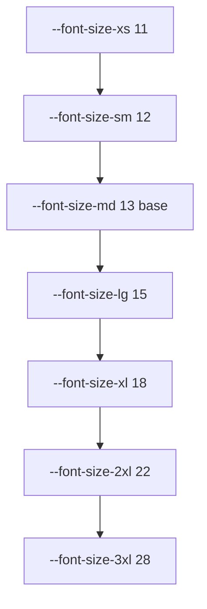
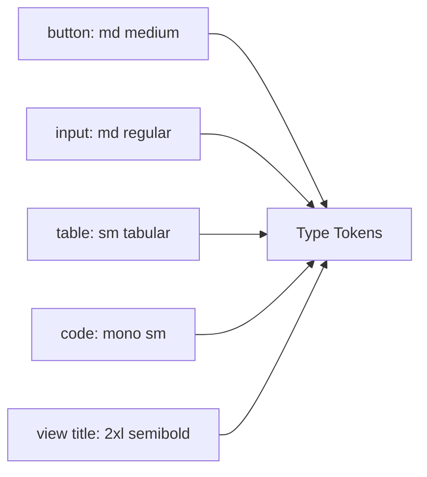
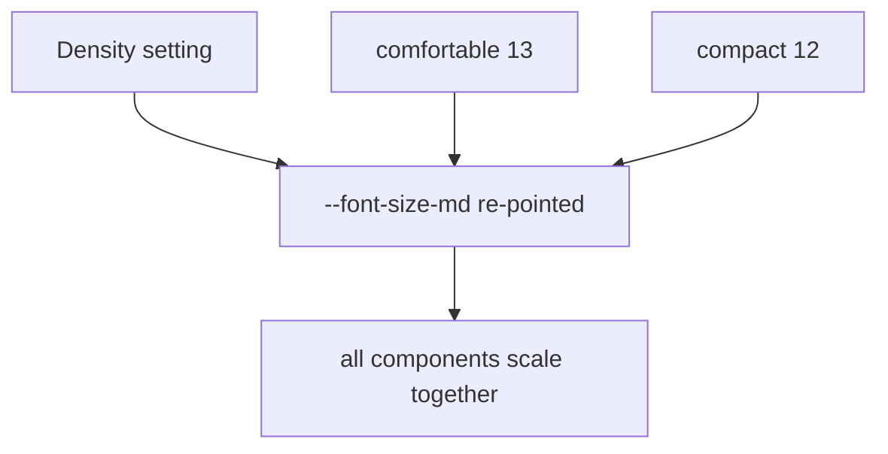
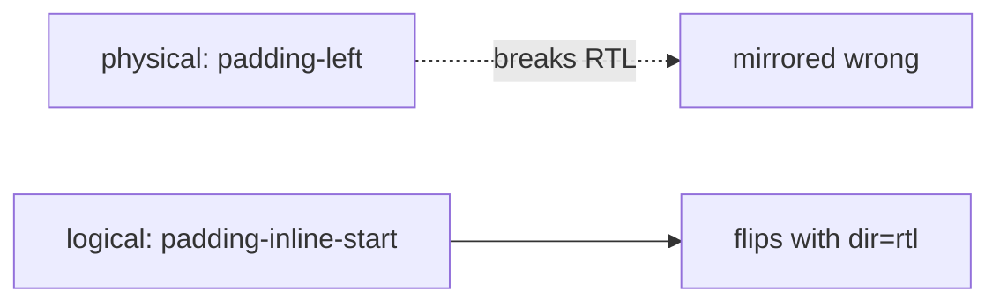
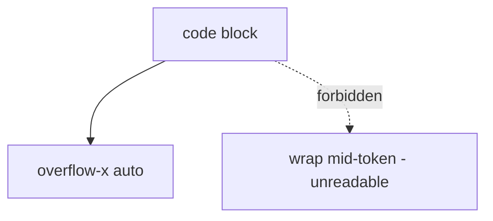

# Typography Diagrams

These diagrams show the type scale, the component-type mapping, the density re-point, and the RTL/logical-property rule.

## Type Scale

## Component Type Mapping

## Density Re-Points Root

## RTL via Logical Properties

## Code Block Scroll (not wrap)

## Related Documents

- [[07-ui-ux/README]]
- [[Typography-Part01]]
- [[Typography-Part02]]
- [[Typography-Part03]]
- [[Typography-Part04]]
- [[DesignTokens-Part04]]
- [[TerminalView-Part04]]
- [[Accessibility-Part05]]
- [[Accessibility-Part06]]
- [[ResponsiveRules-Part03]]
