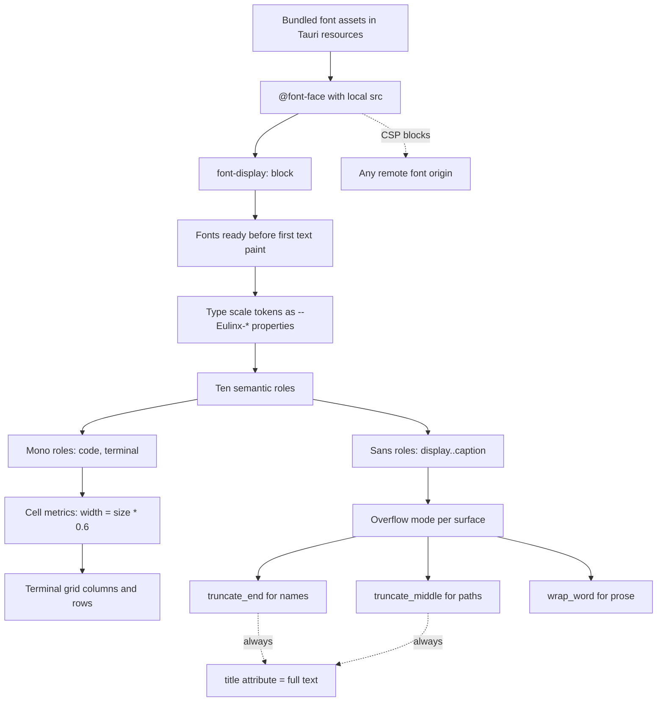

---
title: Typography Specification - Part 01
status: draft
version: 1.0
tags:
  - ui-ux
  - typography
  - architecture
related:
  - "[[07-ui-ux/README]]"
  - "[[DesignTokens-Part01]]"
  - "[[Themes-Part01]]"
  - "[[TerminalView-Part01]]"
  - "[[Accessibility-Part01]]"
---

# Typography Specification (Part 01)

## Document Index

Part 01 - Purpose, Philosophy, Definition, Object Model, Invariants
Part 02 - Font Stacks, Bundling, and the Loading Strategy in Tauri
Part 03 - The Type Scale, Semantic Roles, and Monospace Cell Metrics
Part 04 - Truncation and Overflow, Checklist, Worked Examples, Mistakes
Diagrams - Typography-Diagrams.md

# Purpose

Typography defines every character Eulinx draws on screen: which font file it comes from, how large it is, how far apart the lines sit, how much the letters are tracked, and what happens when the text is longer than the box it lives in.

This is not a style suggestion. It is a contract. Eulinx renders two fundamentally different kinds of text, and they have opposite requirements.

```text
UI text is read by a human. It may reflow. It may wrap.
  It may be truncated. Its job is legibility.

Terminal text is a grid. It MUST NOT reflow. It MUST NOT be
  truncated by CSS. Every glyph occupies exactly one cell of a
  fixed advance width, because a Worker's tool output drew a
  box with box-drawing characters and expects column 40 to be
  column 40.

The moment terminal text uses a proportional font, or a font
with ligatures, or a font whose metrics differ per platform,
the box breaks and the Worker's output is unreadable.
```

Typography owns the resolution of both. Every other UI document consumes what this one defines.

# Core Philosophy

Eulinx bundles its fonts. It does not use system fonts for anything that matters, and it never touches a CDN.

This is the central decision in this document, and it is made here once so that no implementer relitigates it.

```text
Cross-platform consistency
  A design reviewed on Windows must render identically on macOS
  and Linux. Segoe UI, SF Pro, and Cantarell have different
  x-heights, different cap heights, different default tracking,
  and different advance widths. A layout tuned on one is broken
  on the others.

Deterministic metrics
  Eulinx computes layout from font metrics. Terminal cell width is
  derived from the monospace advance width. If the advance width
  is whatever the OS happened to install, cell width is not a
  constant and the terminal grid is not a grid.

Layout stability
  A bundled font has one set of metrics, known at build time.
  Nothing shifts when a user uninstalls a font or changes an OS
  font-smoothing setting.

Screenshot and Replay reproducibility
  Eulinx preserves enough history for Replay. A Replay that renders
  differently than the original run is not a Replay. Bundled
  fonts are the only way a session recorded on one machine can be
  re-rendered faithfully on another.
```

The counter-argument is size. `InterVariable.woff2` is roughly 340 KB and the two JetBrains Mono faces are roughly 90 KB each. That is under 550 KB in a desktop binary that already ships a WebView bridge and a Rust runtime. The cost is not material. The determinism is.

Fonts are therefore bundled assets inside the Tauri app, loaded by `@font-face` from a local `asset:` URL, and the Content-Security-Policy forbids remote font origins entirely. See [[Typography-Part02]].

# Definition

Typography is the UI-layer subsystem that defines:

- the two font families Eulinx ships (Inter Variable for UI, JetBrains Mono for code and terminal)
- the full literal fallback chain for each, per platform
- the bundling and `@font-face` loading strategy inside the Tauri WebView
- the type scale: every size in px and rem, every line height, every letter spacing, every weight
- the ten semantic text roles and their exact resolved values
- where each role MUST and MUST NOT be used
- monospace cell metrics and the rules that keep the terminal grid aligned
- truncation, wrapping, and overflow rules for worker names and filesystem paths
- the CSS custom properties (all prefixed `--Eulinx-`) that carry all of the above

Typography does NOT define color. Text color is a theme concern. See [[Themes-Part01]] and [[DesignTokens-Part01]].

# Responsibilities

Typography MUST:

- ship `InterVariable.woff2`, `JetBrainsMono-Regular.woff2`, and `JetBrainsMono-Bold.woff2` inside the app bundle
- declare every font via `@font-face` with a local `src: url(...)` only
- expose every typographic value as a `--Eulinx-`-prefixed CSS custom property
- define exactly ten semantic roles and forbid ad-hoc sizes outside them
- use unitless line heights everywhere
- assume `16px = 1rem` and never override the root font size
- disable ligatures and contextual alternates inside the terminal
- enable tabular figures for all numeric UI display
- apply middle-ellipsis truncation to filesystem paths, never end-ellipsis
- attach a `title` attribute carrying the full text to every truncated element
- render at a minimum window size of 1024x680 without horizontal body overflow

Typography SHOULD:

- preload both font files so the first paint has them
- prefer `font-variation-settings` over synthetic bolding for Inter
- keep the scale ratio consistent so future sizes are derivable

Typography MUST NOT:

- reference any remote font origin, including Google Fonts, jsDelivr, or any CDN
- rely on a system font for UI text or terminal text
- use `font-display: swap` on either bundled family
- synthesize bold or italic for the monospace family
- apply `text-overflow: ellipsis` to any element inside the terminal viewport
- use a `px` line height
- introduce a size that is not in the scale in Part 03

# Typography Object Model

Every token below has a literal value in Part 03. This block is the type, not the data.

```ts
/** The two families Eulinx ships. No third family exists. */
type EulinxFontFamily = "sans" | "mono";

/** The ten semantic roles. This union is closed. */
type EulinxTextRole =
  | "display"
  | "heading1"
  | "heading2"
  | "heading3"
  | "heading4"
  | "body"
  | "label"
  | "caption"
  | "code"
  | "terminal";

/** Inter Variable supports 100..900 continuously. Eulinx uses only these five. */
type EulinxFontWeight = 400 | 500 | 600 | 700 | 800;

/**
 * A fully resolved text style. Every field is required.
 * There is no partial style and no inheritance at this layer.
 */
type EulinxTextStyle = {
  /** Which bundled family renders this role. */
  family: EulinxFontFamily;
  /** Size in CSS pixels at the 16px root. Authoritative. */
  sizePx: number;
  /** sizePx / 16, precomputed. MUST equal sizePx / 16 exactly. */
  sizeRem: number;
  /** Unitless multiplier. Computed line box = sizePx * lineHeight. */
  lineHeight: number;
  /** Tracking in em. Negative tightens. May be 0. */
  letterSpacingEm: number;
  /** Numeric weight. MUST be a member of EulinxFontWeight. */
  weight: EulinxFontWeight;
  /** Casing transform applied by the role, not by the caller. */
  textTransform: "none" | "uppercase";
  /** OpenType features this role forces on. */
  features: EulinxFontFeatures;
};

/**
 * OpenType feature flags. These map 1:1 to font-feature-settings.
 * `liga` and `calt` MUST both be false for role "terminal".
 */
type EulinxFontFeatures = {
  /** "liga" - standard ligatures (fi, fl). */
  liga: boolean;
  /** "calt" - contextual alternates. JetBrains Mono uses this for -> and =>. */
  calt: boolean;
  /** "tnum" - tabular figures. Fixed-width digits. */
  tnum: boolean;
  /** "ss01".."ss08" - Inter stylistic sets. Eulinx uses none. Always []. */
  stylisticSets: string[];
};

/** The complete role table. Exactly ten entries. Frozen at build time. */
type EulinxTypeScale = Readonly<Record<EulinxTextRole, EulinxTextStyle>>;

/**
 * Monospace cell metrics. Derived from JetBrains Mono at a given size.
 * The terminal grid is computed from these and nothing else.
 */
type EulinxCellMetrics = {
  /** Font size the cell is measured at, in px. */
  fontSizePx: number;
  /**
   * Horizontal advance of one ASCII glyph, in px.
   * JetBrains Mono advance ratio is exactly 0.6 of the em.
   * cellWidthPx = fontSizePx * 0.6
   */
  cellWidthPx: number;
  /** Full line box height in px. cellHeightPx = fontSizePx * lineHeight. */
  cellHeightPx: number;
  /** Unitless line height used for the terminal grid. */
  lineHeight: number;
  /** Distance from the top of the line box to the baseline, in px. */
  baselineOffsetPx: number;
};

/** Result of the middle-ellipsis path truncation algorithm in Part 04. */
type TruncatedPath = {
  /** The string to render. */
  display: string;
  /** The full original string. MUST be set as the title attribute. */
  full: string;
  /** True when display !== full. */
  wasTruncated: boolean;
};

/** How a given surface handles text that exceeds its box. */
type EulinxOverflowMode =
  /** One line, end ellipsis. For worker names, task titles. */
  | "truncate_end"
  /** One line, ellipsis in the middle. For filesystem paths ONLY. */
  | "truncate_middle"
  /** Wrap at word boundaries. For body prose. */
  | "wrap_word"
  /** Wrap, breaking inside words if needed. For unbroken tokens. */
  | "wrap_anywhere"
  /** No wrap, no ellipsis, horizontal scroll. Terminal ONLY. */
  | "scroll_x";
```

# Invariants

```text
sizeRem === sizePx / 16 for every role, with no rounding drift.
Root font size is 16px and is never overridden by any stylesheet.
Every line height is unitless. No role carries a px line height.
Exactly two @font-face families are declared. No third.
Every @font-face src is a local bundled asset. Zero remote origins.
font-display is block for both families. Never swap.
Role "terminal" has liga: false and calt: false. Always.
Role "terminal" and role "code" both use family "mono".
Roles display..caption all use family "sans".
cellWidthPx === fontSizePx * 0.6 for JetBrains Mono. Exactly.
No element inside the terminal viewport has text-overflow: ellipsis.
Every truncated element carries a title attribute with the full text.
Filesystem paths truncate in the middle. Never at the end.
The UI renders at 1024x680 with no horizontal overflow on document.body.
```

The `cellWidthPx === fontSizePx * 0.6` invariant is load-bearing. JetBrains Mono's advance width is 600 units of a 1000-unit em. That ratio is a property of the font file Eulinx ships, which is why the font is bundled. A substituted fallback breaks this equality and the terminal grid silently misaligns.

# Mermaid Diagram



# AI Notes

Do not add a font. Eulinx ships Inter Variable and JetBrains Mono. If you find yourself reaching for a third family because a heading "needs personality", stop. Every role in Part 03 resolves to one of these two. There is no third.

Do not use `font-display: swap`. It is the reflexive answer for web pages and it is wrong here. Part 02 explains why, but the short version: Eulinx loads from local disk in a desktop WebView, so the block period is single-digit milliseconds, and a FOUT that reflows the terminal grid mid-paint is worse than a 5 ms blank.

Do not let `text-overflow: ellipsis` anywhere near the terminal. Terminal text scrolls horizontally. It never truncates. A tool that printed a 200-column table needs all 200 columns to exist, even if the user must scroll.

Do not truncate a filesystem path at the end. `C:\Users\dev\project\src\components\...` tells the user nothing. The filename is the informative part and it is at the end. Paths truncate in the middle. The algorithm is in Part 04 and it is numbered; transcribe it.

Do not assume a monospace font makes every character one cell wide. It does not. CJK ideographs are two cells. Emoji are two cells and often fall back to a color font with its own metrics. Part 03 names these hazards and the exact rule for each.

Do not set line heights in px. A px line height does not scale with the size, and Accessibility permits a user text-size preference. Unitless only.

# Related Documents

- [[07-ui-ux/README]]
- [[Typography-Part02]]
- [[Typography-Part03]]
- [[Typography-Part04]]
- [[Typography-Diagrams]]
- [[DesignTokens-Part01]]
- [[Themes-Part01]]
- [[TerminalView-Part01]]
- [[TerminalCards-Part01]]
- [[Accessibility-Part01]]
- [[ResponsiveRules-Part01]]
