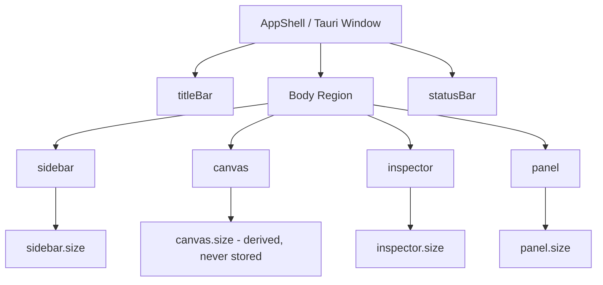
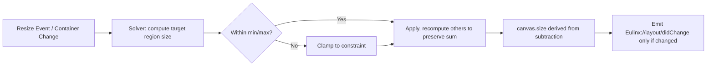
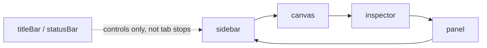
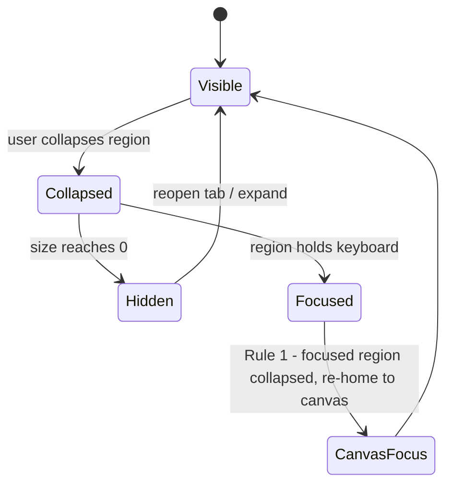
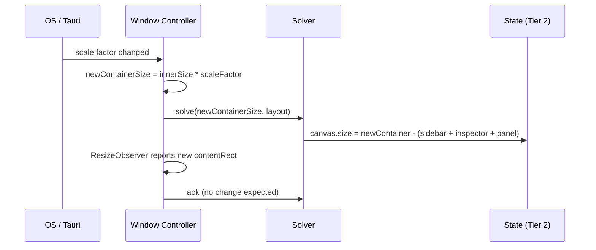

---
title: WorkspaceLayout Diagrams
status: draft
version: 1.0
tags:
  - ui-ux
  - workspace-layout
  - diagrams
related:
  - "[[07-ui-ux/README]]"
  - "[[WorkspaceLayout-Part01]]"
  - "[[WorkspaceLayout-Part06]]"
---

# WorkspaceLayout Diagrams

These diagrams illustrate the region model, the resize solver, the focus cycle, and the window-too-small degrade path described in the WorkspaceLayout parts. All runtime interaction flows through the two channels defined in [[07-ui-ux/README]] and [[EventBus-Part01]].

## Region Layout Skeleton



## Resize Solver Invariant (Sum Preservation)



## Focus Cycle (Tab Ring)



## Region Visibility and Focus Re-Home



## Window-Too-Small Degrade Axis

```mermaid
flowchart TD
  WR[Eulinx://window/resized below MIN_WINDOW_SIZE] --> D1[sidebar -> rail]
  D1 --> D2[inspector -> hidden]
  D2 --> D3[panel -> hidden]
  D3 --> D4[canvas below floor as last resort]
  D4 --> O[window-too-small overlay if still below minimum]
  D1 -. restore on next resize .-> R[re-run solver, restore from restoreSize]
  D2 -. .-> R
  D3 -. .-> R
```

## DPI / Monitor Change Resize Sequence



## Related Documents

- [[07-ui-ux/README]]
- [[WorkspaceLayout-Part01]]
- [[WorkspaceLayout-Part02]]
- [[WorkspaceLayout-Part03]]
- [[WorkspaceLayout-Part04]]
- [[WorkspaceLayout-Part05]]
- [[WorkspaceLayout-Part06]]
- [[ResponsiveRules-Part01]]
- [[EventBus-Part01]]
