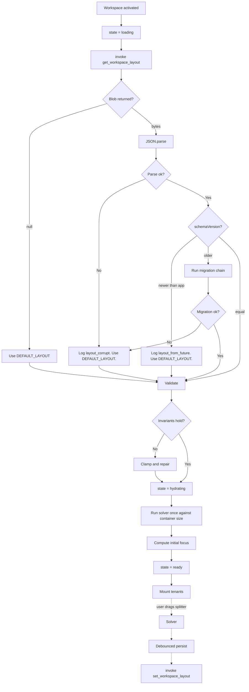

---
title: WorkspaceLayout Specification - Part 01
status: draft
version: 1.0
tags:
  - ui-ux
  - workspace-layout
  - architecture
related:
  - "[[07-ui-ux/README]]"
  - "[[WorkspaceLayout-Part02]]"
  - "[[WorkspaceLayout-Diagrams]]"
  - "[[Panels-Part01]]"
  - "[[Workspace-Part01]]"
---

# WorkspaceLayout Specification (Part 01)

## Document Index

Part 01 - Purpose, Philosophy, the Region Model, and the Object Model
Part 02 - The Window Shell, Tauri Window Configuration, and Mount Order
Part 03 - Resizable and Collapsible Panes, Constraints, and the Resize Algorithm
Part 04 - Layout Persistence, Migration, and the Workspace Binding
Part 05 - Multi-Tab and Multi-Workspace Handling
Part 06 - The Focus Model, Checklist, and Worked Examples
Diagrams - WorkspaceLayout-Diagrams.md

# Purpose

WorkspaceLayout owns the Eulinx window.

Not the contents of the window. The window itself: how it is divided, how the divisions move, how big they may become, which of them may vanish, where the divisions are remembered, and which one of them currently has the keyboard.

Every other surface in `07-ui-ux` is a tenant. [[NodeGraph-Part01]] does not decide it is 900px wide. [[TerminalView-Part01]] does not decide it lives at the bottom. [[Sidebar-Part01]] does not decide it is collapsed. WorkspaceLayout decides all of it and hands each tenant a box.

```text
WorkspaceLayout is the landlord.
Every other surface is a tenant.

A tenant knows its own width and height because it was told.
A tenant that measures the window and positions itself
has broken the only rule this document has.
```

The reason for this severity is not aesthetic. Eulinx's window contains a graph canvas that must virtualize against a known viewport, and a terminal that must issue a PTY resize against a known cell grid. Both are wrong if two components disagree about who owns geometry. There is exactly one owner.

# Core Philosophy

A layout is **view state**, and view state is the frontend's own property.

The Runtime does not know how wide the sidebar is. It does not want to know. It stores the layout blob for a Workspace as opaque bytes because persistence is a service it offers, not an interest it has. This is stated in [[07-ui-ux/README]] as Tier 2 state and it is restated here because implementers try to put pane widths on the Workspace record in SQLite as typed columns, and then a layout change becomes a schema migration.

```text
The layout is bytes the backend holds and never reads.
```

The second philosophical commitment: **layout is per Workspace, not per app**.

A user working on a Rust backend Workspace wants a tall terminal and a narrow graph. The same user on an architecture Workspace wants a full-bleed graph and no terminal at all. Making layout global forces one of those to be wrong. Layout is therefore keyed by `workspaceId`, loaded on workspace activation, and saved on change. See Part 04.

The third: **the layout never traps the user**. Every constraint in Part 03 exists to guarantee that no sequence of drags, collapses, window resizes, monitor changes, or DPI changes can produce a window in which a region is present but unusable, or absent with no way to bring it back. A pane at 3px wide is a bug. A pane the user cannot restore is a worse bug. The reset path in Part 04 is the last line of defense and MUST always work.

# Definition

WorkspaceLayout is the frontend-owned system that defines:

- the top-level window shell component and its mount order
- the region model: the fixed set of named regions and their arrangement
- the Tauri v2 window configuration and the custom title bar contract
- the resizable and collapsible pane system
- the minimum, maximum, and default size of every region in px
- the resize algorithm and its constraint solver
- the collapse and restore rules
- layout persistence per Workspace, including debounce, migration, and reset
- multi-tab handling inside the center region
- multi-workspace handling and layout swap on activation
- the focus model and the focus ring
- every error and edge case in the above

WorkspaceLayout is NOT:

- the panel system inside a region. That is [[Panels-Part01]].
- the contents of any region. Those are the tenant topics.
- the breakpoint and collapse-under-pressure policy. That is [[ResponsiveRules-Part01]], which calls into the API defined here.
- the keyboard shortcut table. That is [[KeyboardShortcuts-Part01]], which binds to the actions defined here.

# Responsibilities

WorkspaceLayout MUST:

- render exactly one `AppShell` per window
- define every region as a named, typed entry in a single `LayoutState` object
- give every tenant its box via explicit props or a layout context, never via measurement
- enforce every min and max constraint on every mutation, including programmatic ones
- clamp, never reject, a resize that would violate a constraint
- keep the sum of region sizes exactly equal to the available window size at all times
- persist layout per `workspaceId`, debounced, via `invoke`
- load a Workspace's layout before mounting that Workspace's tenants
- fall back to the default layout when a stored layout is missing, corrupt, or from a future schema version
- migrate a stored layout from an older schema version rather than discard it, where a migration exists
- maintain exactly one focused region at all times while the window is focused
- restore focus to a valid region when the focused region is collapsed or unmounted
- emit no EventBus events; layout is not runtime state

WorkspaceLayout SHOULD:

- animate collapse and restore using the durations in [[Animations-Part01]]
- remember a collapsed region's pre-collapse size so restore returns to it
- provide a `resetLayout()` action reachable from the UI without a stored layout being readable

WorkspaceLayout MUST NOT:

- allow a tenant component to call `window.innerWidth`, `getBoundingClientRect` on the shell, or a `ResizeObserver` on anything above itself
- allow a tenant to write `LayoutState`
- store layout on the Worker, Session, Execution, or any runtime record
- persist layout on every mouse-move during a drag
- allow the sum of pane sizes to drift from the container size, ever, even by one pixel
- allow a region to exist at a size below its minimum
- allow a region to be simultaneously `visible: false` and focused
- block the main thread during a resize drag
- treat a `null` stored layout as an error condition

# The Region Model

The Eulinx window is divided into **six regions**. This set is closed. A seventh region is a specification change, not an implementation decision.

```text
titleBar     fixed height, always present, never collapsible
sidebar      left, resizable, collapsible to an icon rail
canvas       center, fills all remaining space, never collapsible, no fixed size
inspector    right, resizable, collapsible to nothing
panel        bottom, resizable, collapsible to nothing
statusBar    fixed height, always present, never collapsible
```

The arrangement is fixed and is not user-configurable in v1. `sidebar`, `inspector`, and `panel` may move to a docking model later; see Part 06 Future Expansion. Today their positions are compiled in.

Note the asymmetry: `canvas` has no size of its own. It is the **flex region**. Its size is a derived value, computed as whatever the other regions did not take. This is the mechanism that guarantees the sum-equals-container invariant, and it is why `canvas` cannot be collapsed and cannot be dragged directly. You resize the canvas by resizing something else.

```text
canvasWidth  = containerWidth  - sidebarWidth  - inspectorWidth
canvasHeight = containerHeight - titleBarHeight - panelHeight - statusBarHeight
```

Both values are computed, never stored. A stored `canvasWidth` is a second source of truth for a derived value and will drift. Part 03 defines the exact solver.

# Full Window Wireframe

```text
+==============================================================================+
| titleBar                                                        h = 36px     |
|  [Eulinx]  Workspace: Eulinx-core v  |  Session: refactor-auth        _  []  X     |
|         ^ drag region              ^ drag region                ^ controls   |
+==============================================================================+
|          |                                                    |              |
| sidebar  |  canvas                                            | inspector    |
| w=240px  |  w = FLEX  (container - sidebar - inspector)       | w=320px      |
| min 180  |  min 480px hard floor                              | min 260      |
| max 480  |                                                    | max 560      |
|          |  +----------------------------------------------+  |              |
| [rail]   |  | tab strip   h = 32px                         |  | Selected:    |
|  o Work  |  | [Graph] [term:w_7a x] [term:w_9c x]      [+] |  |  Worker w_7a |
|  o Sess  |  +----------------------------------------------+  |              |
|  o Arti  |  |                                              |  | State: work  |
|  o Memo  |  |  active tab content                          |  | Model: ...   |
|          |  |                                              |  | Budget: ...  |
| Workers  |  |    NodeGraph  /  TerminalView  /  Cards      |  |              |
|  w_7a *  |  |                                              |  | [Artifacts]  |
|  w_9c    |  |                                              |  | [Logs]       |
|  w_2f    |  |                                              |  |              |
|          |  |                                              |  |              |
|<-------->|  |                                              |  |<------------>|
| splitter |  |                                              |  |  splitter    |
| w = 4px  |  +----------------------------------------------+  |  w = 4px     |
+----------+----------------------------------------------------+--------------+
|                        splitter  h = 4px                                     |
+==============================================================================+
| panel                                                          h = 220px     |
|  [Problems] [Output] [Artifacts] [Merge Queue]                 min 120       |
|  ---------------------------------------------------------     max 640       |
|  12:04:11  w_7a  artifact.created  patch/auth.rs                             |
|  12:04:19  w_9c  verify.passed     3 tests                                   |
+==============================================================================+
| statusBar   3 workers alive | 1 queued | merge queue: 2 | ws: Eulinx-core  h=24 |
+==============================================================================+
```

Every number in that wireframe is normative. They are restated as a typed constant table in Part 03 and MUST NOT be invented independently.

# The Layout Object Model

This is the complete type. There are no other layout fields anywhere in the application.

```ts
/** Schema version of the persisted layout blob. Bump on any breaking change. */
export const LAYOUT_SCHEMA_VERSION = 1;

export type RegionId =
  | "titleBar"
  | "sidebar"
  | "canvas"
  | "inspector"
  | "panel"
  | "statusBar";

/** Regions the user can resize. canvas is flex; titleBar/statusBar are fixed. */
export type SizableRegionId = "sidebar" | "inspector" | "panel";

/** The axis a region is sized along. */
export type SizeAxis = "width" | "height";

export type CollapseMode =
  /** Region disappears entirely. Restore via command or shortcut only. */
  | "hidden"
  /** Region shrinks to a fixed rail width and stays interactive. */
  | "rail"
  /** Region cannot collapse. */
  | "none";

export type RegionState = {
  id: RegionId;
  /** false means collapsed to nothing. A rail-collapsed sidebar is visible:true, collapsed:true. */
  visible: boolean;
  /** True when the region is at railSize (mode "rail") or hidden (mode "hidden"). */
  collapsed: boolean;
  /**
   * Current size in CSS px along the region's axis.
   * For canvas this field is IGNORED and always recomputed. Never read it.
   * For titleBar and statusBar this field is a constant and never written.
   */
  size: number;
  /**
   * The size to restore to when uncollapsing. Written at the moment of collapse.
   * Always within [minSize, maxSize]. Never equals railSize.
   */
  restoreSize: number;
};

export type RegionConstraints = {
  id: RegionId;
  axis: SizeAxis;
  minSize: number;
  maxSize: number;
  defaultSize: number;
  collapseMode: CollapseMode;
  /** Only meaningful when collapseMode is "rail". Exact px. */
  railSize: number;
  /**
   * Drag below this many px past minSize snaps the region to collapsed.
   * 0 disables drag-to-collapse for the region.
   */
  collapseThreshold: number;
  /** Whether a splitter is rendered for this region at all. */
  resizable: boolean;
};

export type CanvasTab = {
  tabId: string;
  kind: "graph" | "terminal" | "terminal_cards" | "artifact_diff" | "settings";
  title: string;
  /** workerId for kind "terminal", workflowId for "graph", artifactId for "artifact_diff". */
  subjectId: string | null;
  /** True for the one graph tab that can never be closed. Exactly one tab has this. */
  pinned: boolean;
  /** Opaque per-tab view state owned by the tenant, persisted with the layout. */
  viewState: unknown;
};

export type CanvasTabsState = {
  tabs: CanvasTab[];
  /** Must always be a tabId present in tabs. Never null while tabs is non-empty. */
  activeTabId: string;
  /** Most-recently-active first. Used to pick the next tab on close. Contains every tabId. */
  mruOrder: string[];
};

export type FocusState = {
  /** The region that owns the keyboard. Never a region with visible:false. */
  focusedRegion: RegionId;
  /** The region focus returns to on Escape from a modal or an overlay. */
  previousRegion: RegionId | null;
  /**
   * True when focus moved by keyboard, false when by pointer.
   * Drives whether the focus ring is painted. See [[Accessibility-Part01]].
   */
  focusVisible: boolean;
};

export type LayoutState = {
  schemaVersion: number;
  /** The workspace this layout belongs to. A layout is never shared across workspaces. */
  workspaceId: string;
  regions: Record<RegionId, RegionState>;
  canvasTabs: CanvasTabsState;
  focus: FocusState;
  /** Last observed inner size of the window. Used to detect a monitor/DPI change on load. */
  lastWindowSize: { width: number; height: number };
  /** ISO 8601. Written on every persist. Used for conflict resolution across windows. */
  updatedAt: string;
};

/** What actually goes over the wire to SQLite. See Part 04. */
export type PersistedLayout = {
  schemaVersion: number;
  workspaceId: string;
  regions: Record<RegionId, RegionState>;
  canvasTabs: CanvasTabsState;
  lastWindowSize: { width: number; height: number };
  updatedAt: string;
};
```

Note what is absent from `PersistedLayout`: `focus`. Focus is Tier 3 ephemeral state. Restoring a focus ring from disk on app start would move the keyboard somewhere the user did not ask for. Focus is recomputed on load per the rules in Part 06.

Note also that `canvas` appears in `regions` even though its size is derived. It is there so that `visible` and the record's exhaustiveness hold. Its `size` field is maintained by the solver as a convenience for tenants reading their box, and MUST NOT be written by anything else.

# The Constraint Table

These values are normative and final. They are the single source; Part 03 imports this table, it does not restate different numbers.

```ts
export const REGION_CONSTRAINTS: Record<RegionId, RegionConstraints> = {
  titleBar: {
    id: "titleBar", axis: "height",
    minSize: 36, maxSize: 36, defaultSize: 36,
    collapseMode: "none", railSize: 0, collapseThreshold: 0, resizable: false,
  },
  sidebar: {
    id: "sidebar", axis: "width",
    minSize: 180, maxSize: 480, defaultSize: 240,
    collapseMode: "rail", railSize: 48, collapseThreshold: 60, resizable: true,
  },
  canvas: {
    id: "canvas", axis: "width",
    minSize: 480, maxSize: Number.POSITIVE_INFINITY, defaultSize: 0,
    collapseMode: "none", railSize: 0, collapseThreshold: 0, resizable: false,
  },
  inspector: {
    id: "inspector", axis: "width",
    minSize: 260, maxSize: 560, defaultSize: 320,
    collapseMode: "hidden", railSize: 0, collapseThreshold: 80, resizable: true,
  },
  panel: {
    id: "panel", axis: "height",
    minSize: 120, maxSize: 640, defaultSize: 220,
    collapseMode: "hidden", railSize: 0, collapseThreshold: 50, resizable: true,
  },
  statusBar: {
    id: "statusBar", axis: "height",
    minSize: 24, maxSize: 24, defaultSize: 24,
    collapseMode: "none", railSize: 0, collapseThreshold: 0, resizable: false,
  },
};

/** The window cannot be smaller than this. Enforced by Tauri config, see Part 02. */
export const MIN_WINDOW_SIZE = { width: 940, height: 560 };
```

`MIN_WINDOW_SIZE.width` is not arbitrary. It is derived:

```text
sidebar rail    48
canvas min     480
inspector min  260
splitters      3 x 4 = 12
chrome slack   140
--------------------
               940
```

The derivation matters because it proves the window can always satisfy every minimum. If `MIN_WINDOW_SIZE.width` were 800, a user could drag the window to a size where `sidebar.min + canvas.min + inspector.min` exceeds the container, and the solver would have no legal answer. Part 03 defines the degradation ladder for when that happens anyway, because a monitor disconnect can shrink a window below its minimum on some platforms regardless of what the config says.

# Layout States

The layout as a whole moves through a small lifecycle on every workspace activation.

```text
uninitialized     no workspace active, shell renders an empty frame
loading           invoke("get_workspace_layout") in flight
hydrating         blob parsed, migrated, validated, solver running once
ready             normal operation, user interaction accepted
saving            debounced persist in flight (non-blocking, overlaps ready)
resetting         user or validator triggered a reset to defaults
swapping          a different workspace was activated, old layout flushing
```

The critical rule: **tenants MUST NOT mount before `ready`**. A NodeGraph that mounts during `loading` measures a zero-size box, initializes its viewport against it, and then never recovers when the real size arrives. Part 02 defines the mount gate.

`saving` overlaps `ready` deliberately. Persisting MUST NOT block interaction. If a save is in flight and the layout changes again, the new save is queued behind it; it does not cancel it and does not run concurrently. See Part 04 for the exact single-flight rule.

# Invariants

These hold at every instant the layout is in `ready`. They are enforced by an assertion in development builds and by the solver in all builds.

```text
Exactly one AppShell exists per Tauri window.
regions contains exactly the six RegionIds. No more. No fewer.
sidebar.size + canvas.size + inspector.size + splitterWidths == containerWidth
titleBar.size + canvas.size + panel.size + statusBar.size + splitterHeights == containerHeight
For every sizable region: minSize <= size <= maxSize, OR collapsed == true.
A collapsed region with mode "hidden" has size == 0.
A collapsed region with mode "rail" has size == railSize.
restoreSize is always within [minSize, maxSize]. It never equals 0 and never equals railSize.
canvas.size is never below canvas.minSize unless the container itself cannot allow it.
canvas.visible is always true. canvas.collapsed is always false.
titleBar.visible and statusBar.visible are always true.
focus.focusedRegion always refers to a region with visible == true.
canvasTabs.activeTabId is always present in canvasTabs.tabs.
canvasTabs.mruOrder contains exactly the tabIds in canvasTabs.tabs, no duplicates.
Exactly one tab has pinned == true.
schemaVersion == LAYOUT_SCHEMA_VERSION after hydration completes.
workspaceId equals the currently active workspace.
No tenant component reads geometry from anything above itself.
```

The sum invariants are the ones that break. They break because a component rounds a fractional px, or because a splitter width is forgotten in one of the two equations, or because a collapse sets `size = 0` without giving the freed pixels to `canvas`. Part 03's solver exists to make these unbreakable by construction: it never sets sizes individually, it recomputes the whole axis in one pass.

# Mermaid Diagram



# AI Notes

Do not let a tenant measure the window. This is the failure this document exists to prevent, and it happens because measuring is easy and threading a prop is boring. A `ResizeObserver` inside NodeGraph watching `document.body` will appear to work, will disagree with the solver by the width of a splitter, and will produce a virtualization viewport that is subtly wrong forever. Tenants receive their box. That is the whole contract.

Do not store `canvas.size` as authoritative. It is derived. If you persist it and restore it, then the user opens the app on a different monitor, you now have a canvas width that does not match a container width, the sum invariant fails on the first frame, and your solver spends the session fighting a stale number. Derive it. Every time.

Do not persist on `mousemove`. A splitter drag fires 60 to 240 times per second. Each one triggering an `invoke` that writes SQLite will make the drag stutter and will hammer the disk. Part 04 specifies a 400ms trailing debounce plus a flush on drag end. Implement both. The flush matters: without it, a drag that ends and is immediately followed by an app quit loses the change.

Do not treat a missing stored layout as an error. A brand new Workspace has no layout. That is the normal first-run path, not an exception. `null` means `DEFAULT_LAYOUT`. Do not show the user a toast about it.

Do not restore focus from disk. Focus is not layout. A window that opens with the keyboard already inside a terminal, because that is where it was three days ago, will eat the user's first keystrokes.

Do not implement collapse by setting `visible: false` and hoping CSS reflows correctly. Collapse is a solver operation: it zeroes one region and reallocates the freed pixels to `canvas` in the same pass. If you let the browser's flex algorithm do it, the sum invariant becomes whatever the browser felt like, and you have no way to assert it.

Do not build a general docking system. Six regions. Fixed positions. The temptation to build VS Code's layout engine is strong and it is a trap; it costs weeks and Eulinx's regions have never needed to move. Part 06 records it as future expansion. It is not v1.

Do not forget that `canvas` has a hard 480px floor while `sidebar` and `inspector` have maximums. Under width pressure the solver takes from the collapsible regions first, in a defined order, and only violates the canvas floor as an absolute last resort. That order is in Part 03 and it is not negotiable, because a canvas below 480px cannot render a single NodeGraph node plus its inspector affordances.

# Related Documents

- [[07-ui-ux/README]]
- [[WorkspaceLayout-Part02]]
- [[WorkspaceLayout-Part03]]
- [[WorkspaceLayout-Part04]]
- [[WorkspaceLayout-Part05]]
- [[WorkspaceLayout-Part06]]
- [[WorkspaceLayout-Diagrams]]
- [[Panels-Part01]]
- [[NodeGraph-Part01]]
- [[TerminalView-Part01]]
- [[Sidebar-Part01]]
- [[ResponsiveRules-Part01]]
- [[KeyboardShortcuts-Part01]]
- [[Accessibility-Part01]]
- [[DesignTokens-Part01]]
- [[Workspace-Part01]]
- [[WorkspaceManager-Part01]]
