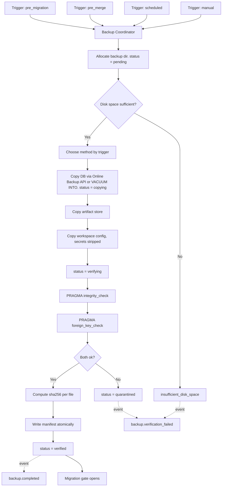
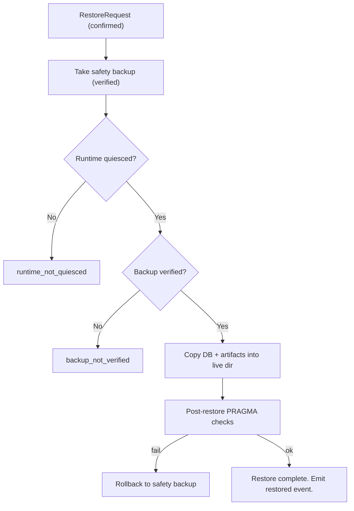

# BackupRestore Diagrams





# ASCII Overview

```text
Backup (disaster artifact):
  trigger -> allocate -> copy (Online Backup API / VACUUM INTO, never fs copy)
         -> verify (integrity_check + foreign_key_check) -> manifest (atomic)
         -> status = verified  (ONLY this is restorable)

Restore (destructive, explicit):
  confirmed request -> safety backup -> quiesce -> copy -> post-verify
         -> on any failure, rollback to safety backup
```
