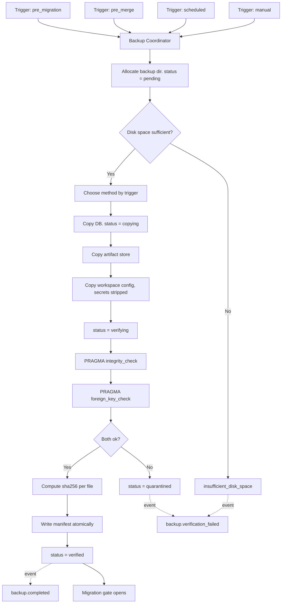

---
title: BackupRestore Specification - Part 01
status: draft
version: 1.0
tags:
  - database
  - backup-restore
  - architecture
related:
  - "[[08-database/README]]"
  - "[[SQLiteSchema-Part01]]"
  - "[[Snapshots-Part01]]"
---

# BackupRestore Specification (Part 01)

## Document Index

Part 01 - Purpose, Philosophy, Definition, Responsibilities, Object Model, States, Invariants
Diagrams - BackupRestore-Diagrams.md

# Purpose

BackupRestore defines how Eulinx produces a byte-correct, independently verified copy of a Workspace's durable state, and how it puts that copy back when the live state is broken.

This document exists because of one hard rule that the rest of `08-database` depends on:

```text
A migration MUST NOT run without a verified backup.
```

That rule is only meaningful if "backup" and "verified" have exact definitions. This document supplies them. Migrations call into this subsystem and refuse to proceed if they return anything other than a verified manifest.

BackupRestore is not Snapshots. It is not undo. It is not history. It is the answer to the question "the database is broken or about to be changed structurally, and we need the previous state back on disk". See the dedicated distinction section in Part 02 and the comparison table there.

# Core Philosophy

A backup that has not been verified is not a backup. It is a file.

Eulinx never counts an unverified copy as protection. Every backup is opened as a database, integrity-checked, foreign-key-checked, and only then recorded in a manifest with a status of `verified`. A copy that fails any check is deleted or quarantined; it is never left on disk in a state where a future restore might select it.

```text
Produce the copy.
Open the copy.
Check the copy.
Only a checked copy is a backup.
```

The second principle is that a backup is a **disaster artifact**, not a convenience artifact. It is written to survive the failure of the thing it copies. It therefore MUST NOT live inside the live database directory, MUST NOT depend on the live database to be readable, and MUST NOT contain anything that would be dangerous if the file were copied to another machine.

The third principle is that restore is **destructive and explicit**. Restoring overwrites live state. It requires a confirmed intent, it takes a safety backup of the thing it is about to destroy, and every one of its failure branches is named and recoverable.

# Definition

BackupRestore is the Rust-side subsystem in the Tauri v2 backend that owns:

- the four backup triggers (pre-migration, pre-merge, scheduled, manual) and their exact firing conditions
- the WAL-safe copy method, chosen per trigger between the SQLite Online Backup API and `VACUUM INTO`
- the definition of what a backup includes and what it MUST exclude
- the `BackupManifest` type, its on-disk JSON layout, and the backup directory layout
- integrity verification via `PRAGMA integrity_check` and `PRAGMA foreign_key_check`
- the retention and rotation policy, with concrete counts
- the restore algorithm and every numbered failure branch
- corruption detection and the `.recover` / dump-and-reload salvage path

BackupRestore does NOT own the schema. The base DDL lives in [[SQLiteSchema-Part01]]. Do not restate it here; link to it.

BackupRestore does NOT own point-in-time workspace state for Replay or undo. That is [[Snapshots-Part01]].

# Responsibilities

BackupRestore MUST:

- refuse to report success for any copy that has not passed both `PRAGMA integrity_check` and `PRAGMA foreign_key_check`
- use the SQLite Online Backup API or `VACUUM INTO` for every database copy, never a filesystem copy
- write the manifest only after the copy is verified, and write it atomically (temp file plus rename)
- exclude secrets, credentials, API keys, tokens, caches, temp directories, and `node_modules` from every backup
- take a pre-restore safety backup before overwriting any live file
- block a migration until a backup with `status = "verified"` exists for that exact schema version
- emit an EventBus event at start, at verify, at success, and at every failure branch
- retain at least the counts defined in Part 04 and never rotate away a backup a retained migration references
- record the schema version, the app version, and the trigger in every manifest
- fail closed: any unknown condition means "no verified backup", which means the migration does not run

BackupRestore SHOULD:

- run scheduled backups when the Runtime is idle rather than mid-execution
- skip a scheduled backup when nothing has changed since the last one
- compress artifact-store contents but never the `.db` copy itself before verification

BackupRestore MUST NOT:

- copy `Eulinx.db`, `Eulinx.db-wal`, or `Eulinx.db-shm` with a filesystem copy while WAL is active
- write a backup inside the live database directory
- include any value from the secrets store, the OS keychain, or an `.env` file
- overwrite live state without a confirmed `RestoreRequest` and a completed safety backup
- delete a failed copy's evidence before its failure has been recorded in an event
- treat a `PRAGMA integrity_check` result other than the single row `ok` as a pass
- consider a backup valid across a different major schema version without an explicit migration path

# BackupRestore Object Model

```ts
type BackupId = string;      // "bkp_" + ULID
type RestoreId = string;     // "rst_" + ULID
type IsoTimestamp = string;  // RFC3339 UTC, e.g. "2026-07-17T09:14:02Z"
type Sha256Hex = string;     // 64 lowercase hex chars

type BackupTrigger =
  | { kind: "pre_migration"; fromSchemaVersion: number; toSchemaVersion: number; migrationId: string }
  | { kind: "pre_merge"; mergeId: string; artifactIds: string[]; projectId: string }
  | { kind: "scheduled"; scheduleId: string; intervalHours: number }
  | { kind: "manual"; requestedBy: string; reason: string };

type BackupMethod = "online_backup_api" | "vacuum_into";

type BackupStatus =
  | "pending"      // directory allocated, nothing copied
  | "copying"      // copy in flight
  | "verifying"    // copy complete, checks running
  | "verified"     // both checks passed; ONLY this status may be restored from
  | "failed"       // a step failed; contents are not trustworthy
  | "quarantined"; // verification failed; kept for diagnosis, never restorable

type BackupManifest = {
  manifestVersion: 1;
  backupId: BackupId;
  workspaceId: string;
  createdAt: IsoTimestamp;
  completedAt: IsoTimestamp | null;
  trigger: BackupTrigger;
  method: BackupMethod;
  status: BackupStatus;
  appVersion: string;
  schemaVersion: number;
  sqliteVersion: string;
  database: BackupFileEntry;
  artifacts: BackupFileEntry[];
  workspaceConfig: BackupFileEntry | null;
  totalBytes: number;
  durationMs: number;
  verification: VerificationResult | null;
  excluded: string[];
  retentionClass: "pre_migration" | "pre_merge" | "scheduled" | "manual";
  pinned: boolean;
};

type BackupFileEntry = {
  relativePath: string;   // relative to the backup directory root
  bytes: number;
  sha256: Sha256Hex;
  compression: "none" | "zstd";
};

type VerificationResult = {
  checkedAt: IsoTimestamp;
  integrityCheck: "ok" | { failed: string[] };
  foreignKeyCheck: "ok" | { violations: ForeignKeyViolation[] };
  pageCount: number;
  freelistCount: number;
  userVersion: number;
  passed: boolean;
};

type ForeignKeyViolation = {
  table: string;
  rowid: number;
  parent: string;
  fkid: number;
};

type BackupError =
  | { kind: "workspace_not_found"; workspaceId: string }
  | { kind: "source_db_unreadable"; path: string; detail: string }
  | { kind: "backup_dir_uncreatable"; path: string; detail: string }
  | { kind: "insufficient_disk_space"; requiredBytes: number; availableBytes: number }
  | { kind: "copy_failed"; method: BackupMethod; detail: string }
  | { kind: "copy_busy_timeout"; elapsedMs: number }
  | { kind: "verification_failed"; result: VerificationResult }
  | { kind: "manifest_write_failed"; path: string; detail: string }
  | { kind: "artifact_store_unreadable"; path: string; detail: string }
  | { kind: "secret_leak_detected"; path: string }
  | { kind: "cancelled"; atStep: number };

type RestoreError =
  | { kind: "backup_not_found"; backupId: BackupId }
  | { kind: "manifest_unparseable"; path: string; detail: string }
  | { kind: "manifest_version_unsupported"; found: number; supported: number }
  | { kind: "backup_not_verified"; status: BackupStatus }
  | { kind: "checksum_mismatch"; relativePath: string; expected: Sha256Hex; actual: Sha256Hex }
  | { kind: "schema_version_incompatible"; backupVersion: number; appVersion: number }
  | { kind: "runtime_not_quiesced"; activeWorkers: number }
  | { kind: "safety_backup_failed"; cause: BackupError }
  | { kind: "target_locked"; detail: string }
  | { kind: "restore_copy_failed"; detail: string }
  | { kind: "post_restore_verification_failed"; result: VerificationResult }
  | { kind: "rollback_failed"; detail: string; manualRecoveryPath: string }
  | { kind: "artifact_restore_failed"; relativePath: string; detail: string };

type RestoreResult =
  | { ok: true; restoreId: RestoreId; backupId: BackupId; safetyBackupId: BackupId;
      restoredSchemaVersion: number; verification: VerificationResult; durationMs: number }
  | { ok: false; restoreId: RestoreId; error: RestoreError; rolledBack: boolean;
      safetyBackupId: BackupId | null };
```

The Rust mirror of `BackupManifest` and the full `serde` attribute set are in Part 03. The two definitions MUST stay field-for-field identical; the JSON on disk is the contract between them.

# States

A backup moves through a strict, forward-only status machine. There is no path back into `verified` from `failed`.

```text
pending -> copying -> verifying -> verified
              |           |
              |           +--> quarantined   (a check returned non-ok)
              +--> failed                    (copy could not complete)
```

Rules:

```text
Only "verified" may be restored from.
Only "verified" satisfies the pre-migration gate.
"quarantined" is kept on disk for diagnosis and is exempt from rotation for 7 days.
"failed" is deleted at the end of the next rotation pass.
"pending" older than 1 hour is treated as "failed" (the process died mid-copy).
```

# Invariants

```text
No migration runs without a manifest whose status is "verified" and whose
  schemaVersion equals the pre-migration schema version.
No backup file is written inside the live database directory.
No backup contains a secret, a credential, an API key, or a token.
No database copy is produced by a filesystem copy while WAL is active.
Every verified backup has both integrityCheck = "ok" and foreignKeyCheck = "ok".
Every manifest is written atomically: temp file, fsync, rename.
Every restore is preceded by a completed, verified safety backup.
A restore that fails after touching live state either rolls back to the safety
  backup or reports rollback_failed with a manual recovery path. It never
  reports success.
totalBytes equals the sum of every entry's bytes.
The sha256 of every entry is computed after the file is final, never during.
A backup is immutable once verified. Only "pinned" may change.
```

The immutability rule matters. Retention flips nothing except `pinned`. If a future feature wants to annotate a backup, it writes a sidecar, not the manifest.

# Mermaid Diagram



# AI Notes

Do not copy the `.db` file with `std::fs::copy`. This is the single most common and most destructive mistake in this document. With WAL active, the committed data lives partly in `Eulinx.db-wal`, and a three-file non-atomic copy produces a torn database. Part 03 states exactly why. Use `rusqlite::backup::Backup` or `VACUUM INTO`.

Do not treat "the copy exists and is non-zero bytes" as success. A torn WAL copy is large and looks fine. Only `PRAGMA integrity_check` returning the single row `ok` proves anything.

Do not skip `PRAGMA foreign_key_check`. `integrity_check` validates page structure, not referential integrity. A database can be structurally perfect and still have orphan rows that will explode on the first join after restore.

Do not let a backup include the secrets store because "it would make restore more complete". It would also make every backup a credential dump that syncs to the user's cloud drive. Part 03 lists the exclusions and they are mandatory, not stylistic.

Do not restore without a safety backup. The user asked to fix a broken database, not to permanently destroy the evidence of how it broke.

Do not implement a backup and a snapshot with the same code path. They have different lifetimes, different contents, different consumers, and different failure semantics. Part 02 has the table.

Do not let the pre-migration gate be advisory. If `create_backup` returns anything but a verified manifest, `run_migration` returns an error and touches nothing.

# Related Documents

- [[08-database/README]]
- [[BackupRestore-Diagrams]]
- [[SQLiteSchema-Part01]]
- [[Versioning-Part01]]
- [[HistoryTables-Part01]]
- [[Snapshots-Part01]]
- [[EventBus-Part01]]
- [[MergeManager-Part01]]
