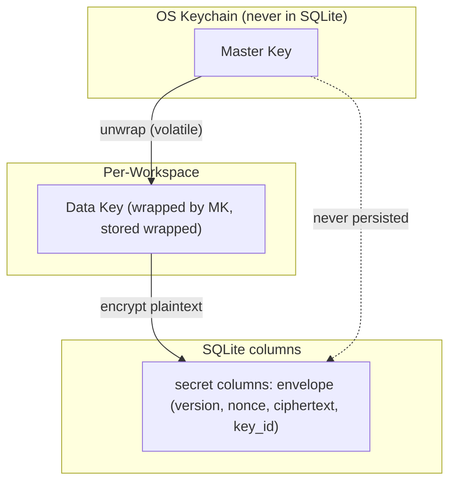
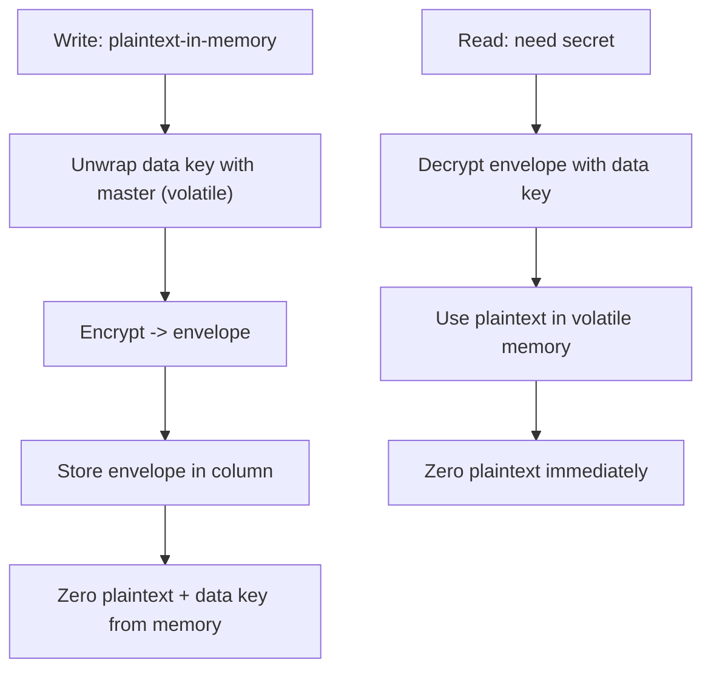

# Encryption Diagrams





# ASCII Overview

```text
Master Key (OS keychain)
   | wraps
   v
Workspace Data Key (wrapped, stored only wrapped)
   | encrypts
   v
Secret columns = envelope(version, nonce, ciphertext, key_id)

Plaintext: exists only in volatile memory, zeroed after use.
Backups: no master key, no plaintext secret. Exports: strip credentials.
```
