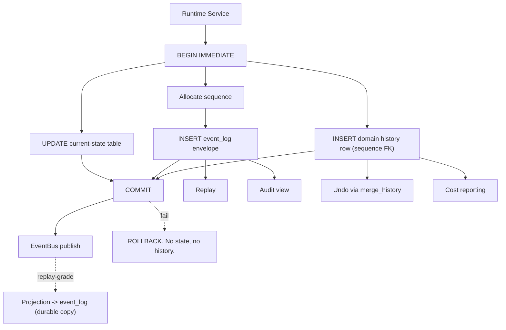
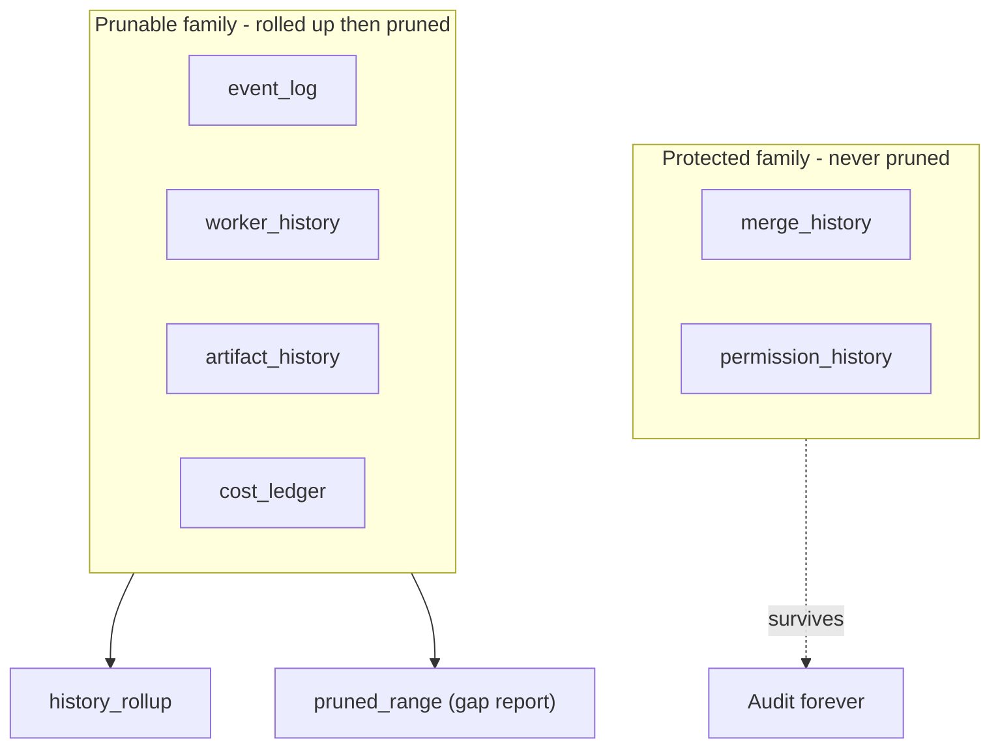

# HistoryTables Diagrams





# ASCII Overview

```text
Current state (mutable)        History (append-only)
---------------------          ---------------------
workers / runs / artifacts     event_log (spine, by sequence)
                                + domain projections:
                                    worker_history
                                    artifact_history
                                    merge_history     (protected)
                                    permission_history (protected)
                                    cost_ledger
                                |
                                v
                          Retention:
                            prunable -> rollup -> prune
                            protected -> retained forever
```
