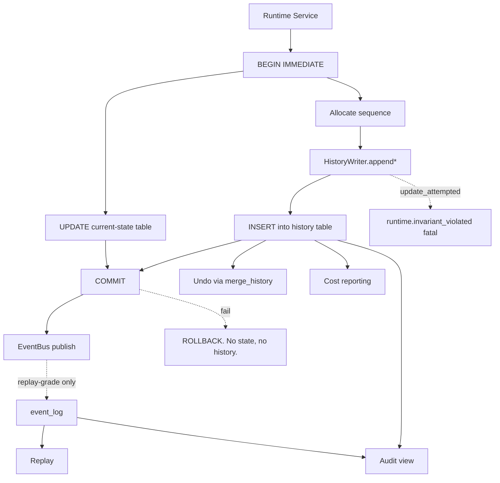

---
title: HistoryTables Specification - Part 01
status: draft
version: 1.0
tags:
  - database
  - history-tables
  - replay
  - architecture
related:
  - "[[08-database/README]]"
  - "[[SQLiteSchema-Part01]]"
  - "[[EventBus-Part02]]"
  - "[[EventBus-Part05]]"
  - "[[Replay-Part01]]"
---

# HistoryTables Specification (Part 01)

## Document Index

Part 01 - Purpose, Philosophy, the Append-Only Law, and Object Model
Part 02 - The Event Log DDL and the Persisted Event Envelope
Part 03 - The Domain History Tables DDL: worker, artifact, merge, permission, cost
Part 04 - Sequence Numbers, Ordering Guarantees, and Write Paths
Part 05 - Replay Sufficiency: what must be recorded to reconstruct history
Part 06 - Retention, Pruning, Partitioning, Rollup, Checklist, Examples
Diagrams - HistoryTables-Diagrams.md

# Purpose

HistoryTables defines the tables in which Eulinx records what happened.

The base schema in [[SQLiteSchema-Part01]] holds **current state**: which Workers exist, which Artifacts are pending, what the Workspace config is. Those tables answer "what is true now". They are mutable. Rows in them are updated and deleted in the ordinary course of business.

HistoryTables holds **what occurred**. It answers "what happened, in what order, and who caused it". These tables are append-only. Nothing in them is ever updated. Nothing in them is ever deleted except by the retention policy in Part 06, under rules that protect the audit families absolutely.

```text
SQLiteSchema tables  -> the present tense. Mutable. Overwritten.
HistoryTables        -> the past tense. Immutable. Accumulated.
```

The two are not redundant views of the same data. Current state is a **projection** of history. If the two ever disagree, history is right and current state is the bug.

# Core Philosophy

Eulinx runs AI processes that write code on a user's machine. The single question the system must always be able to answer is: **what did it do, and why did it think that was allowed?**

Current-state tables cannot answer that. A `workers` row that says `state = 'terminated'` tells you nothing about the eleven tool calls, the three permission escalations, and the merge that preceded it. The moment you UPDATE that row, the previous value is gone and the answer is unrecoverable.

So Eulinx records the transitions, not only the destinations.

```text
Do not store the fact that a Worker is terminated.
Store the fact that at sequence 41207 it moved from working to failing,
because of FailureInfo { code: "tool_timeout", ... },
and that this was caused by the event at sequence 41199.

The first is a value. The second is a history.
Only the second can be replayed, audited, undone, or explained.
```

There are five reasons Eulinx keeps history, and each one constrains the schema differently. Part 05 returns to these; they are stated here because they are the justification for everything that follows.

**Replay.** [[Replay-Part01]] reconstructs runtime state by reading events in sequence order and re-deriving state from them. This requires that history be *complete* over the replayed range and *ordered* totally. A gap is not a cosmetic loss; it is a hole through which determinism escapes. This reason drives the monotonic `sequence` column and the no-gaps guarantee in Part 04.

**Audit.** A user must be able to ask "who approved writing to `src/auth/session.rs`, and when, and what did the AI say to justify it?" and get an answer months later. This requires that permission decisions and merge applications be retained *forever*, past any retention horizon. This reason drives the protected-family rule in Part 06.

**Undo.** [[MergeFlow-Part01]] applies verified Artifacts to the Project. A user who dislikes the result must be able to reverse it. This requires that a merge record contain enough to invert the change: the before-hash, the after-hash, and the reverse patch. This reason drives the `merge_history` columns in Part 03.

**Debugging.** When a Worker produces garbage, the developer needs the exact prompt, the exact model, the exact context package, and the exact tool results that produced it. This requires that worker history record the *resolved* inputs, not references to profiles that may since have been edited. This reason drives the snapshot-not-reference rule in Part 05.

**Cost accounting.** Eulinx spends the user's money on tokens. Every dollar must be attributable to a Worker, an Execution, a Task, and a Session. This requires an immutable ledger with integer money and no possibility of restatement. This reason drives `cost_ledger` in Part 03.

# Definition

HistoryTables is the set of append-only SQLite tables that record Eulinx's past, plus the rules governing how they are written, ordered, read, and pruned.

It owns exactly these tables:

```text
event_log            every replay-grade event, the canonical spine
worker_history       Worker lifecycle transitions
artifact_history     Artifact lifecycle transitions and verification verdicts
merge_history        applications of Artifacts to the Project, with inverses
permission_history   every permission decision, granted and denied
cost_ledger          every unit of spend
history_rollup       compacted summaries of pruned ranges
```

It does not own any table in [[SQLiteSchema-Part01]]. It does not own `schema_migrations`, which belongs to Migrations.

# Responsibilities

HistoryTables MUST:

- record every replay-grade event from the [[EventBus-Part02]] catalog into `event_log`
- assign every history row a monotonic `sequence` drawn from a single global allocator
- keep the persisted event envelope structurally identical to `EulinxEvent` in [[EventBus-Part01]]
- write history rows inside the same transaction as the state change they describe
- store resolved snapshots of inputs, never references to mutable profiles
- store money as integer micro-USD, never as a float
- retain every `merge.*` and `permission.*` record permanently
- record enough per Part 05 to reconstruct a full Replay of any retained range
- report sequence gaps honestly rather than interpolating across them

HistoryTables SHOULD:

- batch event log inserts per the write-mode rules in [[EventBus-Part05]]
- roll pruned ranges up into `history_rollup` rather than deleting them silently
- keep indexes narrow, since these tables are write-heavy and scan-read

HistoryTables MUST NOT:

- issue an `UPDATE` against any history table, for any reason
- issue a `DELETE` against any history table except from the pruner in Part 06
- allow a `sequence` value to be reused, reassigned, or reordered
- write non-replay-grade events to `event_log`
- store an API key, token, credential, or raw secret in any history column
- allow history to be written by a Worker directly
- allow a history write to be skipped because "the event is not interesting"

# The Append-Only Law

This is the rule the rest of the document depends on. It is stated once, in full, and it has no exceptions.

```text
A row in a history table, once committed, MUST NOT be modified.

There is no UPDATE statement against event_log, worker_history,
artifact_history, merge_history, permission_history, or cost_ledger
anywhere in the Eulinx codebase.

There is no DELETE except in the pruner defined in Part 06, and the
pruner MUST NOT touch merge_history or permission_history.
```

Implementers reach for UPDATE in four situations. All four are wrong, and the correct alternative is given.

**"The record was written with the wrong value, I want to fix it."** No. Correction is a new row. Write a compensating record with `corrects_sequence` pointing at the bad one. The bad row stays. History that can be edited is not history; it is a mutable cache with a misleading name.

**"I want to mark the row as processed."** No. Processing state is current state, not history. Put the cursor in a separate mutable table owned by [[SQLiteSchema-Part01]], keyed by consumer, holding the last-consumed sequence. Never add a `processed` flag to an append-only table.

**"The row has a `completed_at` that is null until it finishes."** No. That is one row pretending to be two events. Write a `started` row and a `completed` row, each with its own sequence. Duration is `completed.at - started.at`, computed at read time.

**"UPDATE is faster than INSERT plus a join."** It is. It is also how you lose the only copy of the fact you were supposed to be keeping. Eulinx trades read complexity for auditability, deliberately and everywhere.

Enforcement MUST be structural, not conventional. Part 04 specifies the SQLite triggers that make an `UPDATE` against a history table raise `SQLITE_CONSTRAINT` at the database level, so a future implementer who has not read this document is stopped by the engine rather than by discipline.

# Object Model

The Rust-side write API. Every history write in Eulinx goes through this one type. There is no second path.

```ts
type HistoryWriter = {
  appendEvent(env: PersistedEventEnvelope): Result<Sequence, HistoryError>;
  appendWorkerTransition(rec: WorkerHistoryRecord): Result<Sequence, HistoryError>;
  appendArtifactTransition(rec: ArtifactHistoryRecord): Result<Sequence, HistoryError>;
  appendMerge(rec: MergeHistoryRecord): Result<Sequence, HistoryError>;
  appendPermissionDecision(rec: PermissionHistoryRecord): Result<Sequence, HistoryError>;
  appendCost(rec: CostLedgerRecord): Result<Sequence, HistoryError>;
};

type Sequence = number;

type HistoryError =
  | { kind: "sequence_allocator_unavailable"; detail: string }
  | { kind: "write_failed"; sqliteCode: number; detail: string }
  | { kind: "envelope_invalid"; field: string; detail: string }
  | { kind: "unknown_event_type"; type: string }
  | { kind: "not_replay_grade"; type: string }
  | { kind: "duplicate_event_id"; eventId: string }
  | { kind: "foreign_key_missing"; table: string; column: string; value: string }
  | { kind: "secret_detected"; table: string; column: string }
  | { kind: "update_attempted"; table: string }
  | { kind: "db_readonly"; detail: string }
  | { kind: "disk_full"; bytesNeeded: number };
```

Every variant is handled explicitly. Part 04 gives the handling for each; the summary is that `update_attempted` and `secret_detected` are invariant violations that transition the Runtime to `failed`, `write_failed` and `disk_full` transition it to `degraded` and roll back the caller, and the rest are rejected to the caller as bugs at the call site.

The read API is separate and has no write methods, for the same structural reason [[EventBus-Part05]] gives `ReplayBus` no publish method.

```ts
type HistoryReader = {
  readEventRange(q: EventRangeQuery): Result<PersistedEventEnvelope[], HistoryError>;
  findSequenceGaps(from: Sequence, to: Sequence): GapReport;
  readWorkerHistory(workerId: string): WorkerHistoryRecord[];
  readMergeHistory(projectId: string, from?: Sequence): MergeHistoryRecord[];
  readCostForSession(sessionId: string): CostSummary;
};

type EventRangeQuery = {
  workspaceId: string;
  fromSequence?: Sequence;
  toSequence?: Sequence;
  executionId?: string;
  correlationId?: string;
  types?: string[];
  limit?: number;
};

type GapReport = {
  complete: boolean;
  gaps: { fromSequence: Sequence; toSequence: Sequence; likelyCause: "pruned" | "unknown" }[];
};

type CostSummary = {
  sessionId: string;
  totalMicroUsd: number;
  inputTokens: number;
  outputTokens: number;
  entryCount: number;
  firstSequence: Sequence;
  lastSequence: Sequence;
};
```

`GapReport.complete` is the honesty mechanism. [[Replay-Part01]] calls `findSequenceGaps` before replaying and marks the replay `partial` if any gap is reported. It MUST NOT interpolate. A replay that says "sequences 8000-9000 were pruned, this reconstruction starts at 9001" is useful. One that invents the missing thousand is dangerous.

# Invariants

```text
Every history row has a sequence, and sequences are globally unique.
Sequences are monotonically increasing in commit order.
A sequence, once committed, is never reused or reassigned.
event_log contains exactly the replay-grade events from EventBus-Part02.
No history row is ever updated.
No merge_history row is ever deleted.
No permission_history row is ever deleted.
A history row is committed in the same transaction as the state change it describes.
Current state is derivable from history; history is not derivable from current state.
Money is stored as integer micro-USD. No float appears in cost_ledger.
No history column contains a credential.
A gap in event_log sequence means data was pruned or lost, never that nothing happened.
```

The transaction invariant is the subtle one. If a Worker transitions to `failing` and the state UPDATE commits but the `worker_history` INSERT does not, the system now believes something for which it has no evidence. Both statements MUST be in one transaction, and Part 04 specifies exactly where the boundary sits.

# Mermaid Diagram



# AI Notes

Do not add an `UPDATE` to a history table because a field "needs correcting later". If you find yourself wanting a nullable `completed_at`, you have modelled one event as one row when it is two events. Split it. The nullable column is the smell.

Do not put a `processed` or `synced` boolean on `event_log`. That column will be UPDATEd, which breaks the append-only law, and it will be UPDATEd on the hottest table in the database. Consumer cursors live in their own mutable table.

Do not write `worker.output_streamed` into `event_log`. It is not replay-grade. [[EventBus-Part05]] is explicit: writing 2000 output chunks per second into SQLite makes the log both enormous and useless. If you cannot tell whether an event is replay-grade, it is in the catalog in [[EventBus-Part02]]; look it up rather than guessing.

Do not store a foreign key to a mutable profile row and consider the history complete. If a user edits a permission profile a week later, every history row pointing at it now describes a decision that was never made. Store the resolved snapshot as JSON in the history row. Disk is cheap. A false audit trail is not.

Do not use `REAL` for cost. Floating point summation is not associative, so the total cost of a Session depends on the order you summed the rows, and two screens in the UI will show different dollar amounts. Integer micro-USD, always.

Do not let a Worker write to a history table. Workers produce Artifacts. Runtime services record history. A Worker that can write its own audit trail can write a flattering one.

Do not skip the sequence gap check before a Replay because "we never prune". You will prune. Part 06 exists because a long-lived Workspace grows without bound.

# Related Documents

- [[08-database/README]]
- [[HistoryTables-Part02]]
- [[HistoryTables-Diagrams]]
- [[SQLiteSchema-Part01]]
- [[BackupRestore-Part01]]
- [[EventBus-Part01]]
- [[EventBus-Part02]]
- [[EventBus-Part05]]
- [[Replay-Part01]]
- [[Snapshots-Part01]]
- [[History-Part01]]
