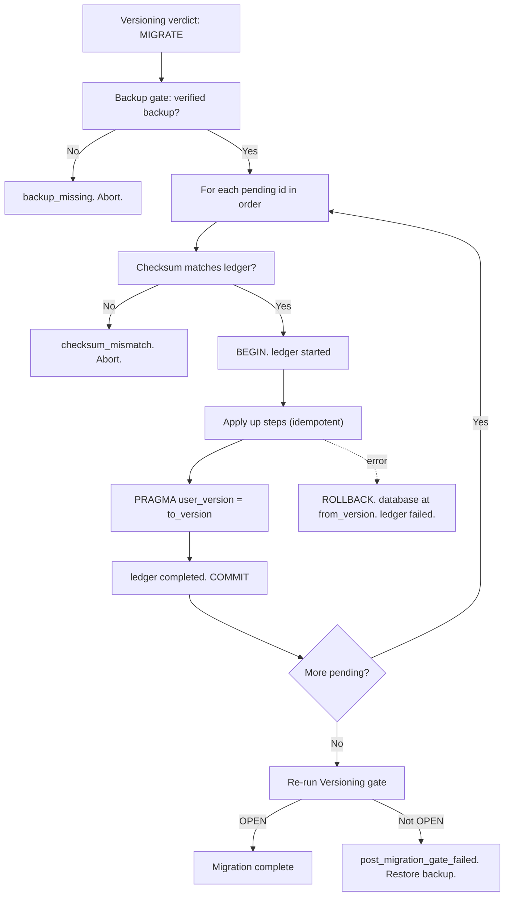
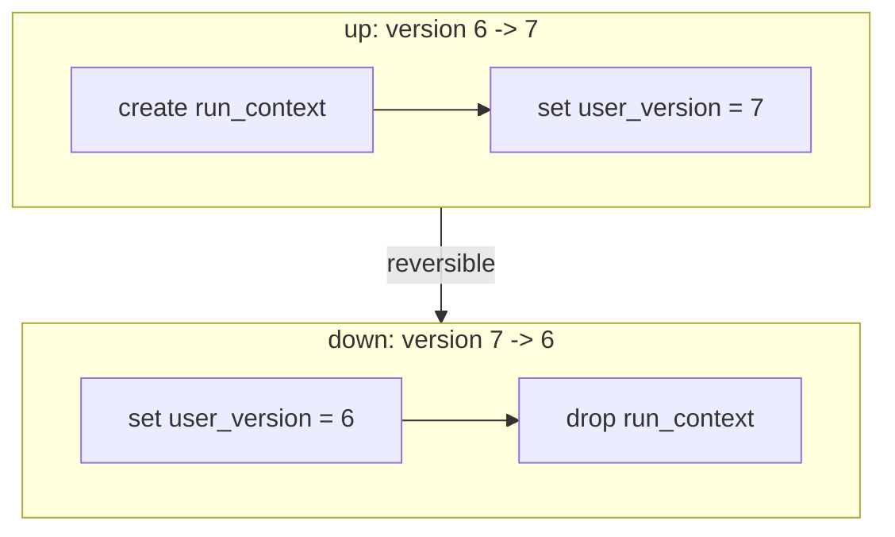

# Migrations Diagrams





# ASCII Overview

```text
Versioning names pending ids (in order)
        |
        v
Backup gate  (verified backup for pre-version, or abort)
        |
        v
For each id:
   checksum check --> ledger started --> up steps --> user_version -->
   ledger completed --> commit
        |
        v
Re-run Versioning gate  -->  OPEN  (or restore backup)
```
