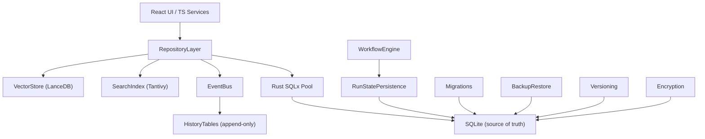

---
title: 08 Database
status: draft
version: 1.0
tags:
  - database
  - sqlite
  - lancedb
  - tantivy
  - architecture
  - Eulinx
  - flow:P02-RUNTIME-STATE
  - flow:P03-EVENT-HISTORY
  - flow:P04-STATE-PERSIST
  - flow:P04-STATE-SNAPSHOT
  - flow:P07-SESSION-PERSIST
  - flow:P07-SESSION-SNAP
  - flow:P07-SESSION-HISTORY
  - flow:P09-MEM-SEARCH
  - flow:P10-ART-HISTORY
  - flow:P20-REL-BACKUP
related:
  - "[[SQLiteSchema-Part01]]"
  - "[[Migrations-Part01]]"
  - "[[RepositoryLayer-Part01]]"
  - "[[RunStatePersistence-Part01]]"
  - "[[HistoryTables-Part01]]"
  - "[[Versioning-Part01]]"
  - "[[BackupRestore-Part01]]"
  - "[[SearchIndex-Part01]]"
  - "[[VectorStore-Part01]]"
  - "[[Encryption-Part01]]"
  - "[[WorkflowEngine-Part01]]"
  - "[[MemoryManager-Part01]]"
  - "[[EventBus-Part01]]"
  - "[[PluginArchitecture-Part01]]"
  - "[[04-memory/README]]"
---

# 08 Database

## Purpose

The `08-database` folder defines Eulinx's persistent layer: the disk that outlives a process, a session, and a crash.

Everything Eulinx does eventually lands here. A Worker is born as a row in SQLite. An Artifact is born as a row plus a binary blob on disk. A chat message is born as a row. A permission decision is born as an immutable history row. A vector embedding is born in LanceDB. A searchable passage is born in a Tantivy index. When the app closes, this is the only part of Eulinx that remains.

Eulinx's persistence strategy is **layered and single-sourced**. SQLite, accessed through Rust SQLx, is the single source of truth for all relational and transactional state: projects, workspaces, workers, sessions, tasks, executions, workflows, nodes, edges, artifacts, prompts, chats, memory, settings, logs, and the plugin tables. LanceDB holds vectors that cannot be queried relationally. Tantivy holds inverted indexes that cannot be built cheaply inside SQLite. None of these three stores is allowed to contradict the other; the SQLite row is always the authority, and the other two are derived projections that MUST be rebuildable from it.

This folder does not own business logic. It owns the shape of data, the rules for changing that shape, and the guarantees that the shape survives. The [[WorkflowEngine-Part01]] decides what to persist; this folder decides how it is persisted correctly.

## Database Folder Structure

```text
08-database/
  README.md

  SQLiteSchema/
    SQLiteSchema-Part01.md ... SQLiteSchema-Part06.md
    SQLiteSchema-Diagrams.md

  Migrations/
    Migrations-Part01.md ... Migrations-Part04.md
    Migrations-Diagrams.md

  RepositoryLayer/
    RepositoryLayer-Part01.md ... RepositoryLayer-Part05.md
    RepositoryLayer-Diagrams.md

  RunStatePersistence/
    RunStatePersistence-Part01.md ... RunStatePersistence-Part04.md
    RunStatePersistence-Diagrams.md

  HistoryTables/
    HistoryTables-Part01.md (existing)
    HistoryTables-Part02.md ... HistoryTables-Part06.md
    HistoryTables-Diagrams.md

  Versioning/
    Versioning-Part01.md (existing)
    Versioning-Diagrams.md

  BackupRestore/
    BackupRestore-Part01.md (existing)
    BackupRestore-Diagrams.md

  SearchIndex/
    SearchIndex-Part01.md ... SearchIndex-Part03.md
    SearchIndex-Diagrams.md

  VectorStore/
    VectorStore-Part01.md ... VectorStore-Part03.md
    VectorStore-Diagrams.md

  Encryption/
    Encryption-Part01.md ... Encryption-Part03.md
    Encryption-Diagrams.md
```

## Total Database Specification Size

```text
10 topic folders
1 root README
36 Markdown specification parts
10 Markdown diagram files
47 Markdown files in total
```

## Topic Responsibilities

## SQLiteSchema

SQLiteSchema is the catalog. It owns the full SQLite table set, the field catalog for every table, the indexes, the foreign-key relationships, the CHECK constraints, and the triggers that enforce invariants the query layer cannot. It is the authoritative description of the relational shape at one schema version. Every other topic references it.

Parts: 6

## Migrations

Migrations owns the transition between schema versions: the versioned migration ledger, the reversible up/down steps, idempotency, and the rule that a migration never runs without a verified backup from [[BackupRestore-Part01]]. It is the only subsystem permitted to change the shape that SQLiteSchema describes.

Parts: 4

## RepositoryLayer

RepositoryLayer owns the typed data-access API surface. It exposes intent-level methods such as `create_worker` or `list_runs`, never raw SQL, and it is the only path the TypeScript services and the Rust runtime use to read or write SQLite. It enforces validation, transaction boundaries, and the relationship to the EventBus projection.

Parts: 5

## RunStatePersistence

RunStatePersistence owns the durable run state of the [[WorkflowEngine-Part01]]. It defines the run, the step, the run context, and the crash-recovery contract that lets a Workflow resume after an app restart. It is the bridge between an in-memory engine tick and a committed SQLite row.

Parts: 4

## HistoryTables

HistoryTables owns the append-only audit and replay tables: the event log spine and the per-domain history families. It records what happened, in order, immutably. It is the substrate for [[Replay-Part01]] and for audit. Part 01 already exists; this folder adds Parts 02 through 06 and the Diagrams file.

Parts: 6

## Versioning

Versioning owns the Workspace-open gate: the three version numbers, the compatibility matrix, and the OPEN / MIGRATE / REFUSE verdict. It decides whether this build of Eulinx is allowed to touch a Workspace at all. Part 01 already exists; this folder adds the Diagrams file.

Parts: 1

## BackupRestore

BackupRestore owns the byte-correct, verifiable copy of a Workspace and the destructive explicit restore. It is the disaster artifact, not undo, not snapshots. Part 01 already exists; this folder adds the Diagrams file.

Parts: 1

## SearchIndex

SearchIndex owns the Tantivy inverted index: what is indexed, how passages are built, how queries return SQLite row identifiers, and how the index stays consistent with SQLite. It provides fast full-text search over chats, workflows, artifacts, and memory.

Parts: 3

## VectorStore

VectorStore owns the LanceDB embeddings: the table layout, the embedding storage contract, the relationship to [[VectorMemory-Part01]], and the semantic-search query path. It provides similarity retrieval that SQLite cannot express.

Parts: 3

## Encryption

Encryption owns at-rest protection of secrets and credentials: the envelope scheme, the key hierarchy, the OS keychain integration, and the field-level rules for which columns are encrypted. It guarantees no secret is ever stored in plaintext in SQLite.

Parts: 3

## Global Database Principles

SQLite is the single source of truth. LanceDB and Tantivy are derived projections that MUST be rebuildable from SQLite and MUST NOT contradict it.

Every Workflow run-state change MUST be persisted to SQLite before the engine tick returns, so an app restart resumes rather than restarts.

Every migration MUST be idempotent and reversible, and MUST NOT run without a verified backup.

Secrets and credentials MUST be encrypted at rest. The plaintext of a key, token, or password MUST NOT exist in any SQLite table, backup, or log.

The UI and TypeScript services MUST NOT issue raw SQL. All SQLite access flows through the [[RepositoryLayer-Part01]].

A row in a history table MUST NOT be updated or deleted except under the narrow retention rules of [[HistoryTables-Part01]].

The EventBus→DB projection MUST write history in the same transaction as the state change it describes.

An unopenable or newer-written Workspace MUST be refused, never guessed at. See [[Versioning-Part01]].

## Database Architecture Overview



## ASCII Overview

```text
Tauri IPC (invoke)
   |
   v
RepositoryLayer  (typed, no raw SQL)
   |
   +-- Rust SQLx pool  -->  SQLite : the source of truth
   +-- EventBus         -->  HistoryTables : append-only audit/replay spine
   +-- Tantivy          -->  SearchIndex : inverted full-text index
   +-- LanceDB          -->  VectorStore : embeddings for semantic search

Cross-cutting:
  Migrations      changes the SQLite shape (needs BackupRestore)
  Versioning      gates whether SQLite may be opened at all
  RunStatePersist ties the WorkflowEngine tick to a committed row
  Encryption      wraps secret columns before they reach SQLite
```

## AI Notes

Do not let the UI or any TypeScript service issue raw SQL. The Rust SQLx pool and the RepositoryLayer are the only writers. A second write path is how you get an inconsistent schema and an unreplayable history.

Do not make LanceDB or Tantivy authoritative. They are indexes. If SQLite says a chat was deleted and the vector store still returns it, SQLite wins and the index is rebuilt. The reverse is a corruption bug.

Do not persist a run-state change after the engine moves on. The WorkflowEngine MUST write before it ticks, not eventually. "Eventually consistent" run state is a crash that forgets half a workflow.

Do not store a secret in plaintext because "it is inside an encrypted container". The container is a backup convenience; the field-level rule is independent and unconditional.

Do not treat a migration as done because the `PRAGMA user_version` pragma was set. The migration ledger must agree, or the Versioning gate refuses. See [[Versioning-Part01]] and [[Migrations-Part01]].

## Related Documents

- [[SQLiteSchema-Part01]]
- [[Migrations-Part01]]
- [[RepositoryLayer-Part01]]
- [[RunStatePersistence-Part01]]
- [[HistoryTables-Part01]]
- [[Versioning-Part01]]
- [[BackupRestore-Part01]]
- [[SearchIndex-Part01]]
- [[VectorStore-Part01]]
- [[Encryption-Part01]]
- [[WorkflowEngine-Part01]]
- [[MemoryManager-Part01]]
- [[EventBus-Part01]]
- [[PluginArchitecture-Part01]]
- [[04-memory/README]]
- [[06-workflow-engine/README]]
- [[WorkspaceManager-Part01]]
- [[Replay-Part01]]
- [[Snapshots-Part01]]
