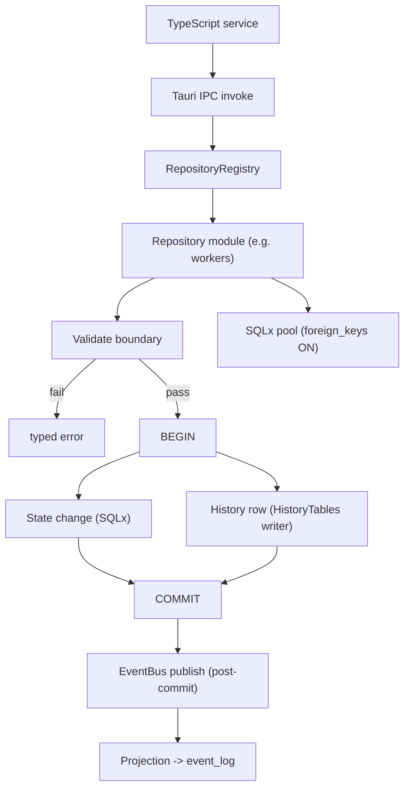
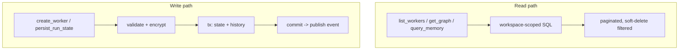

# RepositoryLayer Diagrams





# ASCII Overview

```text
Tauri IPC
   |
   v
RepositoryRegistry  (built after Versioning gate)
   |
   +-- workers / workflows / artifacts / memory / settings / logs / plugins
   |
   v
Validation -> Transaction(state + history) -> Commit -> EventBus -> event_log
   |
   v
SQLx pool  (foreign_keys = ON, WAL, reserved hot connections)
```
