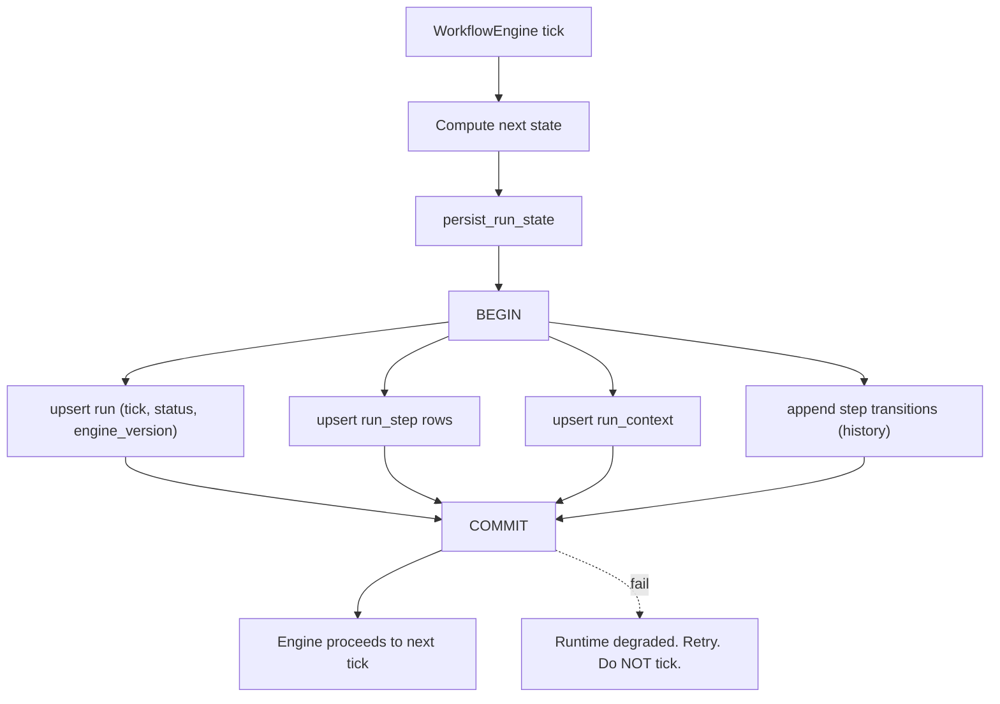
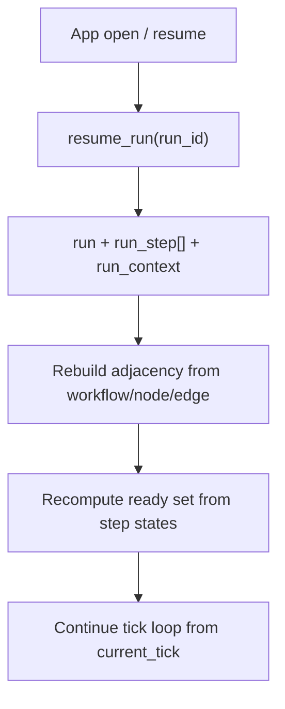

# RunStatePersistence Diagrams





# ASCII Overview

```text
Engine tick
   |
   v
persist_run_state  (one transaction)
   |-- run (tick, status, engine_version)
   |-- run_step[] (status, attempt, refs)
   |-- run_context (port values, artifact_refs)
   |-- history transitions
   |
   v
COMMIT  ->  then tick onward

On reopen:
resume_run -> rebuild from rows -> continue (no re-run)
```
